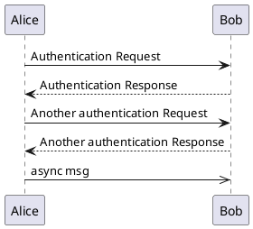
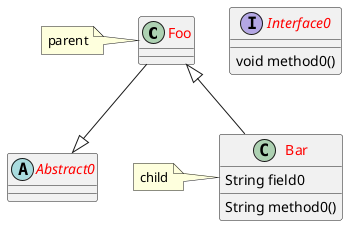
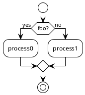
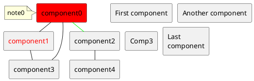
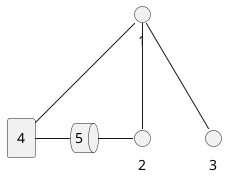
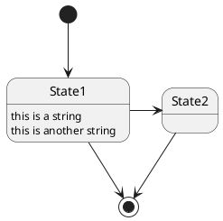
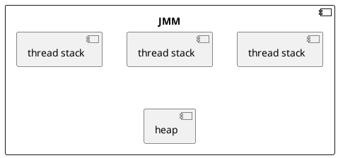
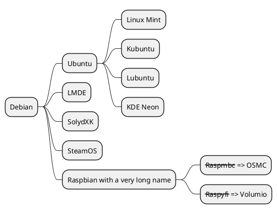

## plantuml, puml

- 时序图, Sequence Diagram
- Use Case Diagram
- 类图, Class Diagram
- Object Diagram
- 活动图, Activity Diagram
- 组件图, Component Diagram
- 部署图, Deployment Diagram
- 状态图, State Diagram
- Timing Diagram

## UML 图

### 时序图, Sequence Diagram



### 类图, Class Diagram

```puml
@startuml

skinparam class {
    BackgroundColor Lightblue
    ArrowColor #0ACF97
    BorderColor #d5d5d5
}

skinparam stereotypeCBackgroundColor YellowGreen

Class101 <|.. Class102
@enduml
```





### 活动图, Activity Diagram



### 组件图, Component Diagram

- 别名后面可以标注颜色
- 修改线和箭头的颜色
- 文字颜色

#### 语法

```bash
# 把组件显示成普通矩形
skinparam componentStyle rectangle
# 组件间横向距离
skinparam nodesep 10
# 组件间纵向距离
skinparam ranksep 10
```



### 部署图, Deployment Diagram



## 状态图, State Diagram



## 安装 graphviz

```bash
sudo apt-get install -y graphviz
```

[https://graphviz.org/download/](https://graphviz.org/download/)

VS-Code扩展

使用PlantUML

vim foo.md

## vs code 渲染 uml 的快捷键

ctrl + p> PlantUML: Preview Current Diagram

```bash
ctrl + alt + d
```

[https://www.jianshu.com/p/ed0e979657f4](https://www.jianshu.com/p/ed0e979657f4)

theme: plain,sandstone,sketchy-outline

## 线路径

添加隐藏行a -[hidden]- b
延长线a --- b的长度 (更多破折号，更长的线)
指定行的首选方向 (a -left- b)
交换关联结束 (a -- b→b -- a)
更改定义的顺序 (订单 重要......有时候)
添加空白节点，背景/边框颜色设置为透明

## plantuml server

https://hub.docker.com/r/plantuml/plantuml-server

```bash
docker run -d \
--name plantuml \
-p 30001:8080 plantuml/plantuml-server:jetty-v1.2023.13

podman run -d \
--name plantuml \
-p 30001:8080 plantuml/plantuml-server:jetty-v1.2022.14
```

## 定义组件的相对位置

一种典型的方法是将一行标记为隐藏(hidden)
hidden只支持从左到右`->`和从上到下的 `-->` 行,因此您需要相应地放置左侧和右侧(X <[hidden]- Y似乎不支持语法).



[https://github.com/plantuml/plantuml-server](https://github.com/plantuml/plantuml-server)

## dot executable /opt/local/bin/dot File does not exist

```bash
pacman -S graphviz
```

## 思维导图 mind map


