## Mermaid：VS Code 内置替代方案

Mermaid 是最佳替代方案，VS Code 的 Markdown 预览**内置支持**，无需扩展或服务器。直接在 Markdown 中写 ` ```mermaid ` 代码块，按 `Ctrl+Shift+V` 打开预览即可看到渲染结果。

| 功能             | PlantUML         | Mermaid  |
| ---------------- | ---------------- | -------- |
| VS Code 原生支持 | 需要 Java + 扩展 | 内置     |
| GitHub 渲染      | 不支持           | 支持     |
| 语法             | 更强大           | 更简洁   |
| 离线使用         | 需要 graphviz    | 完全离线 |

### Mermaid 图类型概览

Mermaid 的图类型分为两大维度：**结构型**和**行为型**。

| 维度       | 关键词                | 对应 UML 图     | 描述                                                       |
| ---------- | --------------------- | --------------- | ---------------------------------------------------------- |
| **结构型** | `classDiagram`        | 类图            | 展示类、属性、方法及继承/组合/关联关系，回答"系统中有什么" |
| **结构型** | `erDiagram`           | 实体关系图      | 展示数据库表/实体及字段关系                                |
| **行为型** | `flowchart` / `graph` | 活动图 / 流程图 | 展示控制流、判断分支、步骤顺序，回答"系统做了什么"         |
| **行为型** | `sequenceDiagram`     | 序列图          | 展示对象之间按时间顺序的消息交互                           |
| **行为型** | `stateDiagram-v2`     | 状态图          | 展示对象在不同状态间的转换                                 |
| **其他**   | `mindmap`             | 思维导图        | 非 UML，用于发散性思维整理                                 |
| **其他**   | `gantt`               | 甘特图          | 非 UML，用于项目时间线                                     |

#### `classDiagram` vs `flowchart` 的核心区别

**`classDiagram`（类图）—— 结构维度**

- 关注"系统中存在什么"：类、接口、属性、方法
- 描述静态结构，不涉及时间或执行顺序
- 用于面向对象设计、代码结构文档
- 节点是类，连线是关系（继承 `<|--`、组合 `*--`、聚合 `o--`、关联 `-->`）

**`flowchart`（流程图）—— 行为维度**

- 关注"流程如何运行"：步骤、判断、分支、循环
- 描述动态执行过程，有方向、有顺序
- 用于算法、业务流程、工作流文档
- 节点是步骤/判断，连线是流向（有向边 `-->`）
- `flowchart` 是 Mermaid v8+ 的新关键词，旧版用 `graph`（两者等价）；方向用 `TD`（上→下）或 `LR`（左→右）

**一句话记忆**：`classDiagram` 画的是"地图"（静态结构），`flowchart` 画的是"路线"（动态过程）。

### 序列图

```mermaid
sequenceDiagram
    Alice->>Bob: Authentication Request
    Bob-->>Alice: Authentication Response
    Alice->>Bob: Another authentication Request
    Alice<<--Bob: Another authentication Response
```

### 类图

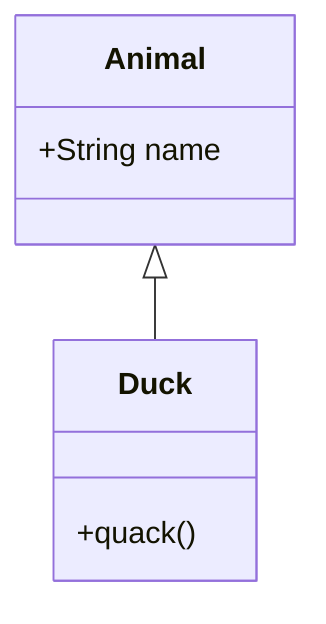
```mermaid
classDiagram
    class Animal {
        +String name
    }
    class Duck {
        +quack()
    }
    Animal <|-- Duck
```

### 活动图 / 流程图

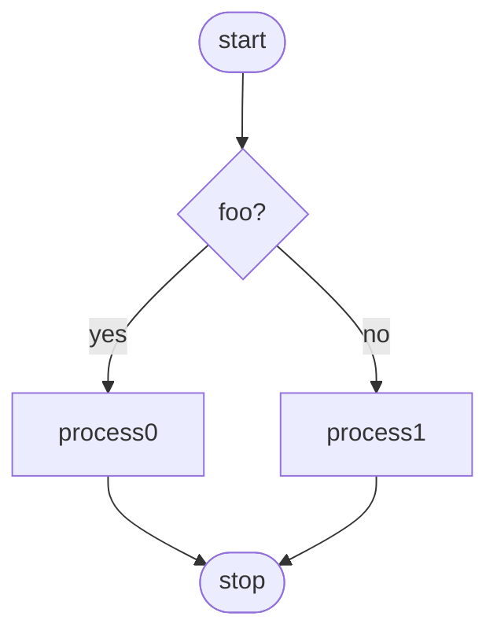
```mermaid
flowchart TD
    start([start])
    stop([stop])
    decision{foo?}

    start --> decision
    decision -->|yes| process0[process0]
    decision -->|no| process1[process1]
    process0 --> stop
    process1 --> stop
```

### 状态图

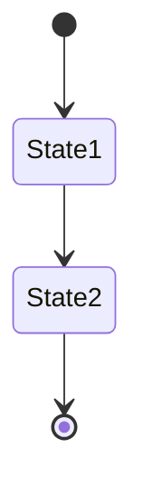
```mermaid
stateDiagram-v2
    [*] --> State1
    State1 --> State2
    State2 --> [*]
```

### 思维导图

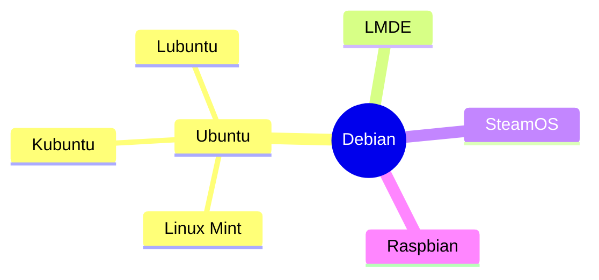
```mermaid
mindmap
  root((Debian))
    Ubuntu
      Linux Mint
      Kubuntu
      Lubuntu
    LMDE
    SteamOS
    Raspbian
```

---

## plantuml, puml

### UML

- 序列图, Sequence Diagram
- 用例图, Use Case Diagram
- 类图, Class Diagram
- 对象图, Object Diagram
- 活动图, Activity Diagram
- 组件图, Component Diagram
- 部署图, Deployment Diagram
- 状态图, State Diagram
- 时序图, Timing Diagram

### 非 UML 图

- 架构图, Archimate diagram

## UML 图

### 时序图, Sequence Diagram

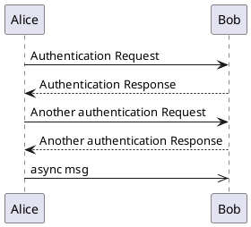
```puml
@startuml
Alice -> Bob: Authentication Request
Bob --> Alice: Authentication Response

Alice -> Bob: Another authentication Request
Alice <-- Bob: Another authentication Response
Alice ->> Bob: async msg
@enduml
```

### 类图, Class Diagram

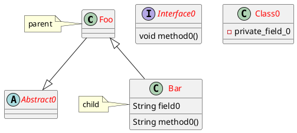
```puml
@startuml
skinparam classFontColor red

class Foo
note left: parent

class Bar
Bar : String field0
Bar : String method0()

Foo<|--Bar
note left: child

abstract class Abstract0
Foo--|>Abstract0

interface Interface0

' 注意, 接口名和冒号之间必须用空格分隔
Interface0 : void method0()

class Class0{
  - private_field_0
}
@enduml
```


```puml
@startuml

skinparam class {
    BackgroundColor Lightblue
    ArrowColor #0ACF97
    BorderColor #d5d5d5
}

skinparam stereotypeCBackgroundColor YellowGreen

Class101 <|.. Class102
@enduml
```

### 活动图, Activity Diagram

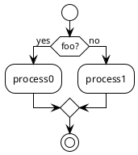
```puml
@startuml
!theme plain

start

if (foo?) then (yes)
  :process0;
else (no)
  :process1;
endif

stop
@enduml
```

### 组件图, Component Diagram

- 别名后面可以标注颜色
- 修改线和箭头的颜色
- 文字颜色

#### 语法

```bash
# 把组件显示成普通矩形
skinparam componentStyle rectangle
# 组件间横向距离
skinparam nodesep 10
# 组件间纵向距离
skinparam ranksep 10
```

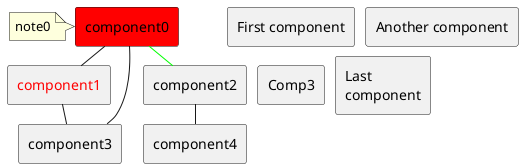
```puml
@startuml
skinparam componentStyle rectangle
skinparam nodesep 10
skinparam ranksep 10
skinparam ParticipantFontColor #A9DCDF

' comments line starts by single quote, 注释
[First component]
[Another component] as Comp2  
component Comp3
component [Last\ncomponent] as Comp4

[component0] as c0 #ff0000
[<color:#ff0000>component1</color>] as c1
[component2] as c2
[component3] as c3
[component4] as c4

c0 -- c1
c0-[#00ff00]-c2
c1--c3
c0--c3

c2--c4

note left of c0
note0
end note
@enduml
```

### 部署图, Deployment Diagram

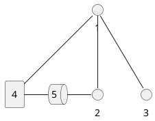
```puml
@startuml
circle 1
circle 2
circle 3
agent 4

1 -- 2
1 -- 3
1 -- 4

queue 5
4 -right- 5
5 -right-2
@enduml
```

## 状态图, State Diagram

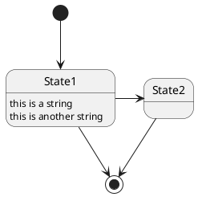
```plantuml
@startuml
[*] --> State1
State1 --> [*]
State1 : this is a string
State1 : this is another string

State1 -> State2
State2 --> [*]
@enduml

```

## 安装 graphviz

```bash
sudo apt-get install -y graphviz
```

[https://graphviz.org/download/](https://graphviz.org/download/)

VS-Code扩展

使用PlantUML

vim foo.md

## vs code 渲染 uml 的快捷键

ctrl + p> PlantUML: Preview Current Diagram

```bash
ctrl + alt + d
```

[https://www.jianshu.com/p/ed0e979657f4](https://www.jianshu.com/p/ed0e979657f4)

theme: plain,sandstone,sketchy-outline

## 线路径

添加隐藏行a -[hidden]- b
延长线a --- b的长度 (更多破折号，更长的线)
指定行的首选方向 (a -left- b)
交换关联结束 (a -- b→b -- a)
更改定义的顺序 (订单 重要......有时候)
添加空白节点，背景/边框颜色设置为透明

## plantuml server

https://hub.docker.com/r/plantuml/plantuml-server

```bash
docker run -d \
--name plantuml \
-p 30001:8080 plantuml/plantuml-server:jetty-v1.2023.13

podman run -d \
--name plantuml \
-p 30001:8080 plantuml/plantuml-server:jetty-v1.2022.14
```

## 定义组件的相对位置

一种典型的方法是将一行标记为隐藏(hidden)
hidden只支持从左到右`->`和从上到下的 `-->` 行,因此您需要相应地放置左侧和右侧(X <[hidden]- Y似乎不支持语法).

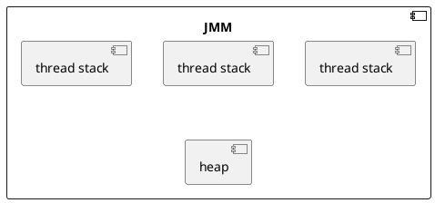
```plantuml
@startuml
component JMM {
  [heap]
  [thread stack] as ts0
  [thread stack] as ts1
  [thread stack] as ts2

  ts0 -[hidden]-> heap
  ts1 -[hidden]-> heap
  ts2 -[hidden]-> heap

}
@enduml
```

[https://github.com/plantuml/plantuml-server](https://github.com/plantuml/plantuml-server)

## dot executable /opt/local/bin/dot File does not exist

```bash
pacman -S graphviz
```

## 思维导图 mind map

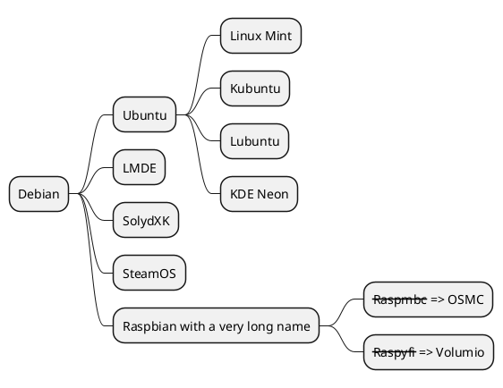
```plantuml
@startmindmap
* Debian
** Ubuntu
*** Linux Mint
*** Kubuntu
*** Lubuntu
*** KDE Neon
** LMDE
** SolydXK
** SteamOS
** Raspbian with a very long name
*** <s>Raspmbc</s> => OSMC
*** <s>Raspyfi</s> => Volumio
@endmindmap
```

## color name

https://www.w3schools.com/colors/colors_names.asp

## 架构图, Archimate diagram

https://plantuml.com/zh/archimate-diagram

https://en.wikipedia.org/wiki/ArchiMate


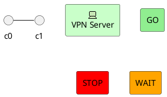
```puml
@startuml
archimate #Technology "VPN Server" as vpnServerA <<technology-device>>

rectangle GO #lightgreen
rectangle STOP #red
rectangle WAIT #orange

circle c0
circle c1

c0 -right- c1
@enduml
```

## Differences of Component Diagrams and Deployment Diagrams

https://stackoverflow.com/questions/1558835/differences-of-component-diagrams-and-deployment-diagrams

Simply put, a Component diagram shows you how different elements of your system have been grouped together (into assemblies / dlls etc) - and the link between these components. A Deployment diagram takes you one step further and describes on which hardware elements do these components reside.

So for example, if "Utility.dll" is a component and say it is deployed on the Client Machine (hardware). Then, the Component Diagram of this system will show Utility and its link with other components in the system (say.. Customer / SQL Packages). Whereas, the Deployment Diagram will show the hardware configuration - DB Server / Web Server / Client Machine .. and Utility component will be placed into the Client Machine Node.


https://plantuml.com/

## 维护记录

| 时间       | 修改内容                                                                         | 原因                                     |
| ---------- | -------------------------------------------------------------------------------- | ---------------------------------------- |
| 2026-06-17 | 添加 Mermaid 图类型概览；补充 `classDiagram` vs `flowchart` 的关系与核心区别说明 | 用户问及两者关系，文章原先缺少此部分说明 |
