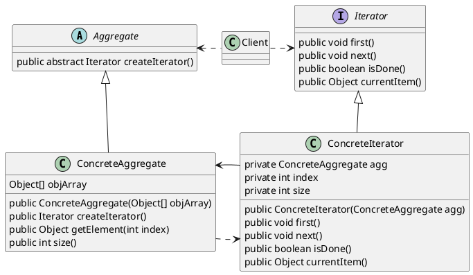

迭代器模式定义
迭代器模式提供一种方法顺序访问一个聚合对象中的各个元素，而又不暴露其内部的表示。把游走的任务放在迭代器上，而不是聚合上。这样简化了聚合的接口和实现，也让责任各得其所。

迭代器模式涉及到以下几个角色：
- 抽象迭代器(Iterator)角色：此抽象角色定义出遍历元素所需的接口。
- 具体迭代器(ConcreteIterator)角色：此角色实现了Iterator接口，并保持迭代过程中的游标位置。
- 聚集(Aggregate)角色：此抽象角色给出创建迭代器(Iterator)对象的接口。
- 具体聚集(ConcreteAggregate)角色：实现了创建迭代器(Iterator)对象的接口，返回一个合适的具体迭代器实例。
- 客户端(Client)角色：持有对聚集及其迭代器对象的引用，调用迭代子对象的迭代接口，也有可能通过迭代子操作聚集元素的增加和删除。

抽象聚集角色类，这个角色规定出所有的具体聚集必须实现的接口。迭代器模式要求聚集对象必须有一个工厂方法，也就是createIterator()方法，以向外界提供迭代器对象的实例。

作者：Ruheng
链接：https://www.jianshu.com/p/3d0406a01b73
来源：简书
著作权归作者所有。商业转载请联系作者获得授权，非商业转载请注明出处。

>https://www.jianshu.com/p/3d0406a01b73
