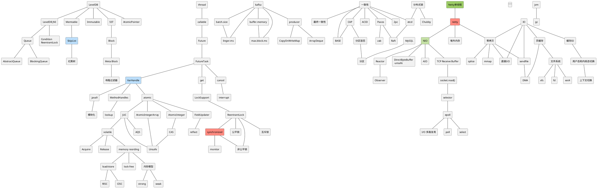

### 图

```puml
@startuml
skinparam componentStyle rectangle

[LevelDB] as leveldb
[LevelDB JNI] as leveldb_jni
leveldb--leveldb_jni
[Memtable]
leveldb--Memtable
[Immutable]
leveldb--Immutable
[SST] as sst
leveldb--sst
[SkipList] as SkipList #BBDEFB
Memtable--SkipList  
[红黑树] as red_black_tree
SkipList--red_black_tree
[Block]
sst--Block
[Meta Block] as meta_block
Block--meta_block
[布隆过滤器] as bloom_filter
meta_block--bloom_filter
[AtomicPointer]
leveldb--AtomicPointer

[thread]
[callable]
[Future]
callable--Future
[FutureTask]
Future--FutureTask
[VarHandle] as VarHandle #BBDEFB
FutureTask--VarHandle
[java9]
VarHandle--java9
[get]
FutureTask--get
[LockSupport]
get--LockSupport

[interrupt]
[cancel]
FutureTask--cancel
cancel--interrupt
thread--callable
[MethodHandles]
VarHandle--MethodHandles
[atomic]
VarHandle--atomic
[JUC] as juc
atomic--juc
[Unsafe]
juc--Unsafe
[volatile]
juc--volatile
[AtomicIntegerArray]
atomic--AtomicIntegerArray
AtomicIntegerArray--Unsafe
[CAS]
[AtomicInteger]
atomic--AtomicInteger
AtomicInteger--CAS
[FieldUpdater] 
atomic--FieldUpdater
[reflect]
FieldUpdater--reflect
CAS--Unsafe
[Acquire]
[Release]
volatile--Acquire
volatile--Release
[memory reording] as memory_reorder
volatile--memory_reorder
[load/store] as load_store
memory_reorder--load_store
[lock-free] as lock_free
memory_reorder--lock_free
[内存模型] as mem_mode
memory_reorder--mem_mode
[strong]
[weak]
mem_mode--strong
mem_mode--weak
[RISC]
[CISC]
load_store--RISC
load_store--CISC
[lookup]
MethodHandles--lookup
[AQS]
juc--AQS
[kafka]
[batch.size] as batch_size
kafka--batch_size
[buffer.memory] as buffer_memory
kafka--buffer_memory
[max.block.ms] as max_block_ms
kafka--max_block_ms
buffer_memory--max_block_ms
[linger.ms] as linger_ms
kafka--linger_ms
batch_size--linger_ms
[CopyOnWriteMap]
[producer]
kafka--producer
producer--CopyOnWriteMap
[ArrayDeque]
producer--ArrayDeque
[Queue] as queue
leveldb_jni--queue
[AbstractQueue] 
queue--AbstractQueue
[BlockingQueue]
queue--BlockingQueue
[Condition\nReentrantLock] as Condition
leveldb_jni--Condition
[ReentrantLock]
LockSupport--ReentrantLock
[synchronized] as synchronized #FF8A80
ReentrantLock--synchronized
[monitor]
synchronized--monitor
[公平锁] as fair_lock
ReentrantLock--fair_lock
[非公平锁] as unfair_lock
ReentrantLock--unfair_lock
synchronized--unfair_lock
[互斥锁] as mutex
ReentrantLock--mutex
[一致性] as consistency
[最终一致性] as eventual_consistency
[CAP] as cap
[BASE] as base
[分区容忍] as partition_tolerance
[分区] as partition
[MySQL]
[ACID] as acid
[Netty单线程] as netty_single_thread #9CCC65
[netty] as netty #FF8A80
netty_single_thread--netty
[堆外内存] as omem
netty--omem
[NIO] as NIO #C5E1A5
netty--NIO
[DirectByteBuffer\n-unsafe] as DirectByteBuffer
NIO--DirectByteBuffer
[AIO]
NIO--AIO
[TCP Receive Buffer] as tcp_receive_buffer
NIO--tcp_receive_buffer
[Reactor]
NIO--Reactor
[Observer]
Reactor--Observer
[socket.read()] as socket_read
tcp_receive_buffer--socket_read
[selector]
socket_read--selector
[epoll]
selector--epoll
[I/O 多路复用] as IO_multiplexing
epoll--IO_multiplexing
[poll]
epoll--poll
[select]
epoll--select
[零拷贝] as zero_copy
[IO] as io
[缓存IO] as buffered_io
[页缓存] as page_cache
[sendfile] as sendfile
[DMA] as dma
[文件系统] as file_system
[直接I/O] as direct_io
[mmap]
[splice]
[用户态和内核态切换] as user_kernal_switch
[上下文切换] as context_switch
[fd]
[ext4]
[xfs]
file_system--xfs
[Paxos] as paxos
 
[etcd]
[Raft] as raft
[分布式锁] as lockd
[Chubby]
lockd--Chubby

[zab]
[2pc]

[---]
cap--base
consistency--cap
partition_tolerance--partition
MySQL--partition
consistency--eventual_consistency
consistency--acid
consistency--base
consistency--2pc
consistency--paxos
cap--partition_tolerance
netty--zero_copy
io--page_cache
io--buffered_io
io--sendfile
page_cache--dma
page_cache--file_system
io--zero_copy
io--direct_io
zero_copy--direct_io
zero_copy--mmap
zero_copy--sendfile
zero_copy--splice
sendfile--dma
buffered_io--user_kernal_switch
user_kernal_switch--context_switch
file_system--fd
file_system--ext4
 
lockd--etcd

consistency--etcd
etcd--raft
 
 
paxos--raft
paxos--zab

[jvm]
[gc]
jvm--gc
[模块化] as jpms
java9--jpms
 
@enduml
```

### palette
```
#AB47BC   Point
#FF8A80   Index
#C5E1A5   Done
```