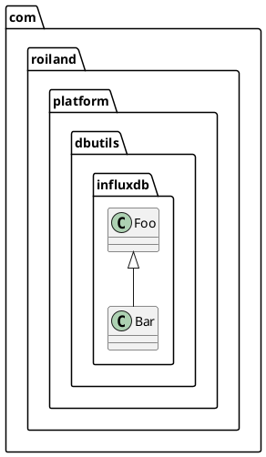
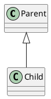
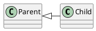
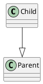
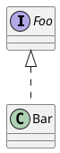
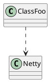
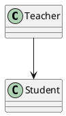
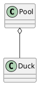

# UML 类图和关系
在UML的定义中，描述类和对象之间的关系，包括以下几种方式：依赖（Dependency）、关联（Association）、聚合（Aggregation）、组合（Composition）、泛化（Generalization）和实现（Realization）。现分别说明如下：

定义
类图基本符号可拆分为四类:线(虚线和实线)，箭头，三角(空心右三角和实心右三角)，菱形(空心菱形和实心菱形); 由这些基本的图形进行组合构成了类图的基本符号。这里要注意这几个符号的顺序，代表了类与类之间关系的耦合程度, 越向右耦合度越高。

由上述四类图形（线，箭头,三角,菱形)可构成以下类图中六类常用关系,

虚线+箭头是表示即依赖的关系;
实线+箭头表示关联的关系;
虚线+空心右三角表示实现接口;
实线+空心右三角表示的是泛化，即类的继承关系;
实线+空心菱形表示的是聚合的关系;
实线+实心菱形则表示组合的关系。
看类图的时候要注意, 类图的思想其实也还没有脱离面向对象的思想，以某个类为中心，有些线是射入的而有些线是射出的。射入的线表示的是这个类被哪些类所调用而射出的线则表示该类调用了哪些类，包括泛化，关联，依赖，聚合和组合四种关系。这类似于离散数学中有关图部分的描述。

>https://researchlab.github.io/2016/11/23/uml-symbol-desc/

### package

### 类图 (Class Diagram): 
类图是面向对象系统建模中最常用和最重要的图，是定义其它图的基础。类图主要是用来显示系统中的类、接口以及它们之间的静态结构和关系的一种静态模型。

### 继承/泛化/扩展 (generalization), Extension（扩展) : 
【泛化关系】: 是一种继承关系,它指定了子类如何特化父类的所有特征和行为例如: 老虎是动物的一种.  
【箭头指向】: 带**空心**三角箭头的**实线**，箭头**指向父类**  
表示is-a的关系，是对象之间耦合度最大的一种关系，子类继承父类的所有细节。直接使用语言中的继承表达。在类图中使用带三角箭头的实线表示，箭头从子类指向父类。

在面向对象的设计中一个非常重要的概念，_继承_，指的是一个类（子类) _继承_另外的一个类（超类) 的同一功能，并增加它自己的新功能（一个非技术性的比喻，想象我继承了我母亲的一般的音乐能力，但是在我的家里，我是唯一一个玩电吉他的人) 的能力。为了在一个类图上建模继承，从子类（要继承行为的类) 拉出一条闭合的，单键头（或三角形) 的实线指向超类。考虑银行账户的类型: 如图显示 CheckingAccount 和 SavingsAccount 类如何从 BankAccount 类继承而来

#### 指定关系图箭头方向

### 接口/实现（Realization) 
接口是一系列操作的集合，它指定了一个类所提供的服务。它直接对应于Java中的一个接口类型。接口既可用"上面一个圆圈符号，圆圈符号下面是接口名，中间是直线，直线下面是方法名"，也可由附加了<<interface>>的一个标准类来表示。通常，根据接口在类图上的样子，就能知道与其他类的关系。  
【实现关系】: 是一种类与接口的关系，表示类是接口所有特征和行为的实现  
【箭头指向】: 带**空心**三角箭头的**虚线**，箭头**指向接口**  
在类图中就是接口和实现的关系。这个没什么好讲的。在类图中使用带三角箭头的虚线表示，箭头从实现类指向接口。
  
在本文的前面，我建议你以类来考虑_分类器_。事实上，分类器是一个更为一般的概念，它包括数据类型和接口。

关于何时、以及如何高效地在系统结构图中使用数据类型和接口的完整讨论，不在本文的讨论范围之内。既然这样，我为什么要在这里提及数据类型和接口呢？你可能想在结构图上模仿这些分类器类型，在这个时候，使用正确的记号来表示，或者至少知道这些分类器类型是重要的。不正确地绘制这些分类器，很有可能将使你的结构图读者感到混乱，以后的系统将不能适应需求。

一个类和一个接口不同: 一个类可以有它形态的真实实例，然而一个接口必须至少有一个类来实现它。在 UML 2 中，一个接口被认为是类建模元素的特殊化。因此，接口就象类那样绘制，但是长方形的顶部区域也有文本"interface"

### 依赖(Dependency): 
依赖关系是一种使用的关系,所以要尽量不使用双向的互相依赖。  
代码表现: 局部变量、方法的参数 或者 对 静态方法 的调用  
箭头及指向: 带箭头的虚线，指向被使用者, ClassFoo 使用 Netty, Netty 被 ClassFoo 使用, 箭头指向 Netty

对象之间最弱的一种关联方式，是临时性的关联。代码中一般指由局部变量、函数参数、返回值建立的对于其他对象的调用关系。一个类调用被依赖类中的某些方法而得以完成这个类的一些职责。在类图使用带箭头的虚线表示，箭头从使用类指向被依赖的类。

### 关联, Association
关联关系是一种拥有的关系,它使一个类知道另一个类的属性和方法；如: 老师与学生，丈夫与妻子，关联可以是双向的，也可以是单向的。双向的关联可以有两个箭头或者没有箭头，单向的关联有一个箭头。  
代码体现: 成员变量  
箭头及指向: 带**普通箭头**的**实心**线，指向**被拥有者**, ClassFoo 拥有 Netty, Netty 被 ClassFoo 拥有, 箭头指向 Netty

### 聚合, Aggregation
聚合关系: 是**整体与部分**的关系, 如车和轮胎是整体和部分的关系.  
聚合关系是**关联**关系的一种，是强的关联关系；关联和聚合在语法上无法区分，必须考察具体的逻辑关系。  
代码体现: 成员变量  
箭头及指向: 带空心菱形的实心线，菱形指向**整体**

成分类可以不依靠聚合类而单独存在，可以具有各自的生命周期，部分可以属于多个整体对象，也可以为多个整体对象共享（sharable）。例如，池塘与（池塘中的）鸭子。再例如教授与课程就是一种聚合关系。又例如图书馆包含(owns a) 学生和书籍。即使没有图书馆，学生亦可以存在，学生和图书馆之间的关系是聚集。

### 组合(Composition)
【组合关系】: 是整体与部分的关系, 没有公司就不存在部门, 组合关系是**关联**关系的一种，是比聚合关系还要**强**的关系，它要求普通的聚合关系中代表整体的对象负责代表部分的对象的**生命周期**  
【代码体现】: 成员变量  
【箭头及指向】: 带实心菱形的实线，菱形指向整体

### 各种关系的强弱顺序: 
泛化= 实现> 组合> 聚合> 关联> 依赖

unspecified  association to unspecified  association
 unspecified  association to navigable  association
 Non-navigable  association to navigable  association
 navigable  association to navigable  association
  
  
    unspecified association 未特别指出的关系   不确定Class A 对Class B的关系的时候，可以用这个。
 navigable  association 可访问的
 Non-navigable  association  不可访问
  
  
  
  
    比如Class A有成员B b； 而Class B没有A的引用
 那么A到B的关系可以是以下情况: 
 unspecified  association to navigable  association
 因为B也许无法直接访问A 但是可以通过其他方式访问 所以定义为unspecified
  
  
    如果按设计要求要禁止B访问A，那么就把A到B的关系定义为
 Non-navigable  association to navigable  association
  
  
    如果B中也有A的引用，那么就是
 navigable  association to navigable  association
  
  
    我似乎只能说到这个程度了 例子也举的不好，不过我推荐你几篇文章看看，尤其是最后这个  我觉得这个是最清楚明白的了。包括composition  aggregation 这篇参考资料也说的非常清楚。
  
  

 ---
参考资料: 
Allen Holub's UML Quick Reference  这个讲的有些复杂  
Mapping UML Associations into Java Code 这个更难懂  
http://blog.csdn.net/tianhai110/article/details/6339565  
http://www.cnblogs.com/riky/archive/2007/04/07/704298.htm  
http://www.uml.org.cn/oobject/201104212.asp">http://www.uml.org.cn/oobject/201104212.asp  
http://www.ibm.com/developerworks/cn/rational/rationaledge/content/feb05/bell/  
http://blog.csdn.net/sfdev/article/details/3906243  
http://bbs.csdn.net/topics/340165306  
http://www.uml-diagrams.org/association.html  
  
