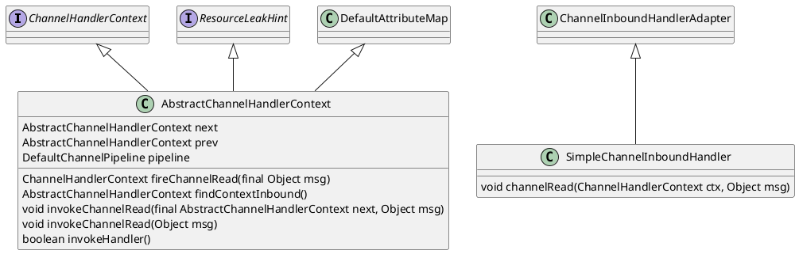

https://netty.io/4.1/api/io/netty/channel/ChannelPipeline.html

Netty是由JBOSS提供的一个java开源框架。Netty提供异步的、事件驱动的网络应用程序框架和工具，用以快速开发高性能、高可靠性的网络服务器和客户端程序。
  
也就是说，Netty 是一个基于NIO的客户，服务器端编程框架，使用Netty 可以确保你快速和简单的开发出一个网络应用，例如实现了某种协议的客户，服务端应用。Netty相当简化和流线化了网络应用的编程开发过程，例如，TCP和UDP的socket服务开发。
  
"快速"和"简单"并不意味着会让你的最终应用产生维护性或性能上的问题。Netty 是一个吸收了多种协议的实现经验，这些协议包括FTP,SMTP,HTTP，各种二进制，文本协议，并经过相当精心设计的项目，最终，Netty 成功的找到了一种方式，在保证易于开发的同时还保证了其应用的性能，稳定性和伸缩性。

### uml
