### stack
#### 语言
- Java, jdk8
- Golang
- Shell Script

#### IDE
- IDEA
- VSCODE
- Eclipse

#### 中间件, Middleware
- Redis
- Leveldb
- zookeeper
- influxdb
- kafka
- Nginx
- MySql

### 第三方包
- io.netty:netty-all:jar:4.1.22.Final, https://wiloon.com/netty
- junit:junit:jar:4.12
- com.squareup.okhttp3:okhttp:jar:4.7.2
- com.google.guava:guava:jar:19.0
- org.apache.logging.log4j:log4j-api:jar:2.13.0
- org.slf4j:slf4j-api:jar:1.7.30
- com.alibaba:fastjson:jar:1.2.73
- redis.clients:jedis:jar:3.1.0
- com.alibaba:druid:jar:1.1.21
- org.apache.curator:curator-framework:jar:4.2.0
- com.google.protobuf:protobuf-java:jar:3.10.0
- com.moandjiezana.toml:toml4j:jar:0.7.2
- io.dropwizard.metrics:metrics-core:jar:4.1.2
- commons-lang:commons-lang:jar:2.6
- commons-codec:commons-codec:jar:1.14

### OS/linux/tool
- Windows
- Archlinux
- CentOS
- ChromeOS
- Ubuntu
- vim
- tcpdump
- emacs
- grep
- sed
- awk
- putty
- xshell
- windows terminal
- ansible
- KVM

### other
- maven, setting.xml
- gradle
- plantuml
- xmind
- svn
- git
- Jenkins
- Gocd
- Grafana
- 华为云
- 阿里云
- AWS

### dev env
- 字体 https://blog.wiloon.com/?p=6077
 
### board, dev server
- ro....dx
- ro....dx-server
- pingd
- pingd-server
- nginx
- influxdb
- grafana
- redis
- mariadb
- chronograf

### 图

```puml
@startuml
skinparam componentStyle rectangle

[LevelDB] as leveldb
[LevelDB JNI] as leveldb_jni
leveldb--leveldb_jni
[Memtable]
leveldb--Memtable
[Immutable]
leveldb--Immutable
[SST] as sst
leveldb--sst 
[SkipList]
leveldb--SkipList   
[Queue] as queue
leveldb_jni--queue
[AbstractQueue] 
queue--AbstractQueue
[BlockingQueue]
queue--BlockingQueue
[Condition]
leveldb_jni--Condition
[ReentrantLock]
leveldb_jni--ReentrantLock
[synchronized]
ReentrantLock--synchronized

[一致性] as consistency
[最终一致性] as eventual_consistency
[CAP] as cap
[BASE] as base
[分区容忍] as partition_tolerance
[分区] as partition
[mysql]
[ACID] as acid
[netty]
[零拷贝] as zero_copy
[IO] as io
[缓存IO] as buffered_io
[页缓存] as page_cache
[sendfile] as sendfile
[DMA] as dma
[文件系统] as file_system
[直接I/O] as direct_io
[mmap]
[splice]
[用户态和内核态切换] as user_kernal_switch
[上下文切换] as context_switch
[fd]
[ext4]
[xfs]
file_system--xfs
[Paxos] as paxos
 
 
 
[etcd]
[Raft] as raft
[分布式锁] as lockd
[Chubby]
lockd--Chubby

[zab]
[2pc]

[---]
cap--base
consistency--cap
partition_tolerance--partition
mysql--partition
consistency--eventual_consistency
consistency--acid
consistency--base
consistency--2pc
consistency--paxos
cap--partition_tolerance
netty--zero_copy
io--page_cache
io--buffered_io
io--sendfile
page_cache--dma
page_cache--file_system
io--zero_copy
io--direct_io
zero_copy--direct_io
zero_copy--mmap
zero_copy--sendfile
zero_copy--splice
sendfile--dma
buffered_io--user_kernal_switch
user_kernal_switch--context_switch
file_system--fd
file_system--ext4
 
lockd--etcd

consistency--etcd
etcd--raft
 
 
paxos--raft
paxos--zab
 

 
@enduml

```

