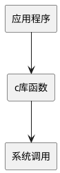

## POSIX
Pronunciation: /ˈpɒz.ɪks/, pozz-icks

POSIX代表 "可移植操作系统接口" Portable Operation System Interface。

在网上查到对于POSIX的介绍，来自《Linux内核设计与实现 (第2版) 》的第5章，就这部分来看，这本书估计不错。

一般情况下，应用程序通过应用编程接口(API)而不是直接通过 **系统调用** 来编程。这点很重要，因为应用程序使用的这种编程接口实际上并不需要和内核提供的系统调用对应。  
一个API定义了一组应用程序使用的编程接口。它们可以实现成一个系统调用，也可以通过调用多个系统调用来实现，  
而完全不使用任何系 统调用也不存在问题。  
实际上，API可以在各种不同的操作系统上实现，给应用程序提供完全相同的接口，而它们本身在这些系统上的实现却可能迥异。

在Unix世界中，最流行的应用编程接口是基于POSIX标准的。从纯技术的角度看，POSIX是由IEEE的一组标准组成，其目标是提供一套大体上基于Unix的可移植操作系统标准。Linux是与POSIX兼容的。

POSIX是说明API和系统调用之间关系的一个极好例子。在大多数Unix系统上，根据POSIX而定义的API函数和系统调用之间有着直接关 系。实际上，POSIX标准就是仿照早期Unix系统的界面建立的。另一方面，许多操作系统，像Windows NT，尽管和Unix没有什么关系，也提供了与POSIX兼容的库。

Linux的系统调用像大多数Unix系统一样，作为C库的一部分提供 , C库实现了Unix系统的主要API，包括标准C库函数和系统调用。所有的C程序都可以使用C库，而由于C语言本身的特点，其他语言也可以很方便地把它们封装起来使用。此外，C库提供了POSIX的绝大部分API。

图5-1 调用printf()函数时，应用程序、C库和内核之间的关系
  
从程序员的角度看，系统调用无关紧要；他们只需要跟API打交道就可以了。相反，内核只跟系统调用打交道；库函数及应用程序是怎么使用系统调用不是内核所关心的。

---------这是分割线-----------

简单总结: 
完成同一功能，不同内核提供的系统调用 (也就是一个函数) 是不同的，例如创建进程，linux下是fork函数，windows下是creatprocess函数。好，我现在在linux下写一个程序，用到fork函数，那么这个程序该怎么往windows上移植？我需要把源代码里的fork通通改成creatprocess，然后重新编译...

posix标准的出现就是为了解决这个问题。linux和windows都要实现基本的posix标准，linux把fork函数封装成posix_fork (随便说的) ，windows把creatprocess函数也封装成posix_fork，都声明在unistd.h里。这样，程序员编写普通应用时候，只用包含unistd.h，调用posix_fork函数，程序就在源代码级别可移植了。

### POSIX解决什么问题
POSIX解决什么问题

一般情况下，应用程序通过应用编程接口(API)而不是直接通过系统调用来编程(即并不需要和内核提供的系统调用来编程)。一个API定义了一组应用程序使用的编程接口。它们可以实现成调用一个系统，也可以通过调用多个系统来实现，而完全不使用任何系统调用也不存在问题。实际上，API可以在各种不同的操作系统上实现给应用程序提供完全相同的接口，而它们本身在这些系统上的实现却可能迥异。如下图，当应用程序调用printf()函数时，printf函数会调用C库中的printf，继而调用C库中的write，C库最后调用内核的write()。
应用程序、C库和内核之间的关系
从程序员的角度看，系统调用无关紧要，只需要跟API打交道。相反，内核只跟系统调用打交道，库函数及应用程序是怎么系统调用不是内核所关心的。

完成同一功能，不同内核提供的系统调用 (一个函数) 是不同的，例如创建进程，linux下是fork函数，windows下是creatprocess函数。好，我现在在linux下写一个程序，用到fork函数，那么这个程序该怎么往windows上移植？我需要把源代码里的fork通通改成creatprocess，然后重新编译...
主流的操作系统有两种，一种是Windows系统，另一种是Linux系统。由于操作系统的不同，API又分为Windows API和Linux API。在Windows平台开发出来的软件在Linux上无法运行，在Linux上开发的软件在Windows上又无法运行，这就导致了软件移植困难，POSIX(Protabl Operation System 可移植操作系统规范)应运而生。

posix标准的出现就是为了解决这个问题。linux和windows都要实现基本的posix标准，linux把fork函数封装成posix_fork (随便说的) ，windows把creatprocess函数也封装成posix_fork，都声明在unistd.h里。这样，程序员编写普通应用时候，只用包含unistd.h，调用posix_fork函数，程序就在源代码级别可移植了。

### posix 是什么？

可移植操作系统接口Portable Operating System Interface of UNIX，POSIX标准定义了操作系统应该为应用程序提供的接口标准，是IEEE为要在各种UNIX操作系统上运行的软件而定义的一系列API标准的总称。

### 系统调用 (OS call)
系统调用，我们可以理解是操作系统为用户提供的一系列操作的接口 (API) ，这些接口提供了对系统硬件设备功能的操作。这么说可能会比较抽象，举个例子，我们最熟悉的 hello world 程序会在屏幕上打印出信息。程序中调用了 printf() 函数，而库函数 printf 本质上是调用了系统调用 write() 函数，实现了终端信息的打印功能。

### 库函数
库函数可以理解为是对系统调用的一层封装。系统调用作为内核提供给用户程序的接口，它的执行效率是比较高效而精简的，但有时我们需要对获取的信息进行更复杂的处理，或更人性化的需要，我们把这些处理过程封装成一个函数再提供给程序员，更方便于程序猿编码。

库函数有可能包含有一个系统调用，有可能有好几个系统调用，当然也有可能没有系统调用，比如有些操作不需要涉及内核的功能。
  

### 系统调用
- 避免了用户直接对底层硬件进行编程。比如最简单的hello world程序是将信息打印到终端，终端对系统来说是硬件资源，如果没有系统调用，用户程序需要自己编写终端设备的驱动，以及控制终端如何显示的代码。
- 隐藏背后的技术细节。比如读写文件，如果使用了系统调用，用户程序无须关心数据在磁盘的哪个磁道和扇区，以及数据要加载到内存什么位置。
- 保证系统的安全性和稳定性。要知道用户程序是不能直接操作内核地址空间的，比如一个刚出道的程序猿，让他直接去访问内核底层的数据，那么内核系统的安全性就无法保证。- 而系统调用的功能是由内核来实现，用户只需要调用接口，无需关心细节，也避免了系统的安全隐患。
- 方便程序的移植性。如果针对一个系统资源的功能操作比如 write()，大家都按照自己思路去实现这个功能，那么我们写出来的程序的移植性就会非常差。
总而言之，我们只需要把系统调用当作一个接口，而这个接口能实现我们的一个功能，既方便又安全。

### 库函数 vs 系统调用
参考了《C 专家编程》书籍中的附录 A.4，书中关于两者区别的回答是这样的，函数库调用是语言或应用程序的一部分，而系统调用是操作系统的一部分。

- 所有 C 函数库是相同的，而各个操作系统的系统调用是不同的。
- 函数库调用是调用函数库中的一个程序，而系统调用是调用系统内核的服务。
- 函数库调用是与用户程序相联系，而系统调用是操作系统的一个进入点
- 函数库调用是在用户地址空间执行，而系统调用是在内核地址空间执行
- 函数库调用的运行时间属于「用户」时间，而系统调用的运行时间属于「系统」时间
- 函数库调用属于过程调用，开销较小，而系统调用需要切换到内核上下文环境然后切换回来，开销较大
- 在C函数库libc中大约 300 个程序，在 UNIX 中大约有 90 个系统调用
- 函数库典型的 C 函数: system, fprintf, malloc，而典型的系统调用: chdir, fork, write, brk
据书中记载，库函数调用大概花费时间为半微妙，而系统调用所需要的时间大约是库函数调用的 70 倍 (35微秒) ，因为系统调用会有内核上下文切换的开销。纯粹从性能上考虑，你应该尽可能地减少系统调用的数量，但是，你必须记住许多 C 函数库中的程序通过系统调用来实现功能。

### 正确理解库函数高效于系统调用
首先解释，上述说明的库函数性能远高于系统调用的前提是，库函数种没有使用系统调用。再来解释下某些包含系统调用的库函数，然而其性能确实也要高于系统调用。比如上篇文章中关于文件 IO 函数 fread、fwrite、fputc、fgetc 等，这些函数通常情况下性能确实比系统调用高，原因在于这些库函数使用了缓冲区，减少了系统调用的次数，因而显得性能比较高。

### 系统调用是如何运行的
上述内容基本说清楚了库函数与系统调用的概念以及它们之间的关系，下面我们来理解系统调用到底是如何运行的。

当一个进程正在运行，遇到读写文件操作，会发生一个中断，中断后系统会把当前用户进程的一些寄存器信息保存在内核堆栈中，接着去处理中断服务程序，这里是要去执行系统调用，Linux 中通过执行 int $0x80 来执行系统调用的中断，但内核实现了很多系统调用，这时需要传递「系统调用号」来指明需要哪个系统调用。

为了更清楚的说明系统调用的过程，我们这里参考网上的一段代码来实现系统调用: 

    int main()
    {
        time_t tt; 
        struct tm *t; 
        asm volatile (
            "mov $0,%%ebx\n\t"
            "mov $0xd,%%eax\n\t"
            "int $0x80\n\t"
            "mov %%eax,%0\n\t"
            : "=m" (tt)
        );  
        t = localtime(&tt);
        printf("Time: %d-%02d-%02d %02d:%02d:%02d\n",
            t->tm_year + 1900,
            t->tm_mon + 1, t->tm_mday,
            t->tm_hour, t->tm_min, t->tm_sec);
    }

    gcc a.c -oa && ./a
Time: 2018-05-06 03:23:46
首先通过 mov $0xd %%eax 来将系统调用放入 %eax 寄存器中，time() 的系统调用号是 13，然后执行 int $0x80 系统就会去执行 time() 这个系统调用了。其实代码中的汇编部分就是实现 time() 系统调用的功能，汇编代码不懂没关系 (我也不太懂) ，这里主要是为了说清楚系统调用的整个过程。

---

https://www.zhihu.com/question/21048638  
https://www.jianshu.com/p/7a17b34e05ee  
https://www.cnblogs.com/liwei0526vip/p/8998751.html  
