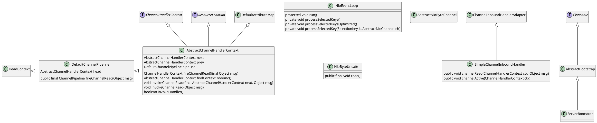
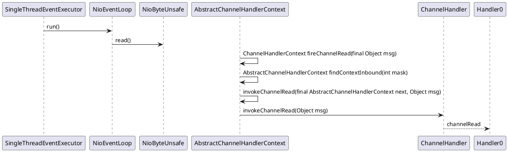

## Netty

### version

#### latest

4.1.68

#### current

4.1.22

Netty是Java领域有名的开源网络库，特点是高性能和高扩展性，因此很多流行的框架都是基于它来构建的，比如我们熟知的Dubbo、Rocketmq、Hadoop等

Netty是由JBOSS提供的一个java开源框架. Netty提供异步的, 事件驱动的网络应用程序框架和工具，用以快速开发高性能、高可靠性的网络服务器和客户端程序.
  
也就是说，Netty 是一个基于NIO的客户，服务器端编程框架, 使用Netty 可以确保你快速和简单的开发出一个网络应用，例如实现了某种协议的客户，服务端应用。Netty相当简化和流线化了网络应用的编程开发过程，例如，TCP和UDP的socket服务开发。
  
"快速"和"简单"并不意味着会让你的最终应用产生维护性或性能上的问题。Netty 是一个吸收了多种协议的实现经验，这些协议包括FTP,SMTP,HTTP，各种二进制，文本协议，并经过相当精心设计的项目，最终，Netty 成功的找到了一种方式，在保证易于开发的同时还保证了其应用的性能，稳定性和伸缩性。

### netty uml

### 时序图

<https://netty.io/4.1/api/io/netty/channel/ChannelPipeline.html>

### Netty 5.0

The major change of using a ForkJoinPool increases complexity and has not
demonstrated a clear performance benefit. Also keeping all the branches in sync is quite some work without a real need for it as there is nothin in current master which I think justifies a new major release.

Things that we should investigate to prepare for this change:

Deprecate exceptionCaught in ChannelHandler, only expose it in ChannelInboundHandler Expose EventExecutorChooser from MultithreadEventExecutorGroup to allow the user more flexibility to choose next EventLoop Add another method to be able to send user events both ways in the pipeline. (#4378)

主要意思：

使用ForkJoinPool增加了复杂性，并且没有显示出明显的性能优势。同时保持所有的分支同步是相当多的工作，没有必要。

详情请看github地址：
<https://github.com/netty/netty/issues/4466>

作者：搬运工来架构
链接：<https://www.jianshu.com/p/a76b471d0e3f>
来源：简书
著作权归作者所有。商业转载请联系作者获得授权，非商业转载请注明出处。
