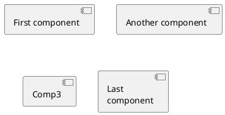
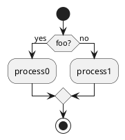
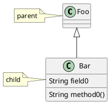

### 安装 graphviz
    sudo apt-get install -y graphviz

VS-Code扩展

使用PlantUML

vim foo.md

### content

### vs code渲染uml的快捷键
    alt+d

https://www.jianshu.com/p/ed0e979657f4

### 活动图

### 类图

### 线路径
添加隐藏行a -[hidden]- b
延长线a --- b的长度（更多破折号，更长的线）
指定行的首选方向（a -left- b）
交换关联结束（a -- b→b -- a）
更改定义的顺序（订单 重要......有时候）
添加空白节点，背景/边框颜色设置为透明

### 部署图
