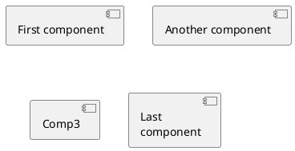
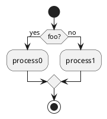
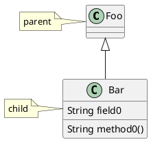

### 安装 graphviz
    sudo apt-get install -y graphviz

VS-Code扩展

使用PlantUML

vim foo.md

### content

```puml
@startuml

[First component]
[Another component] as Comp2  
component Comp3
component [Last\ncomponent] as Comp4

@enduml
```

### vs code渲染uml的快捷键
    alt+d

https://www.jianshu.com/p/ed0e979657f4

### 活动图

```puml
@startuml
start

if (foo?) then (yes)
  :process0;
else (no)
  :process1;
endif

stop
@enduml
```

### 类图

```puml
@startuml
class Foo
note left: parent

class Bar
Bar : String field0
Bar : String method0()

Foo<|--Bar
note left: child
@enduml
```
