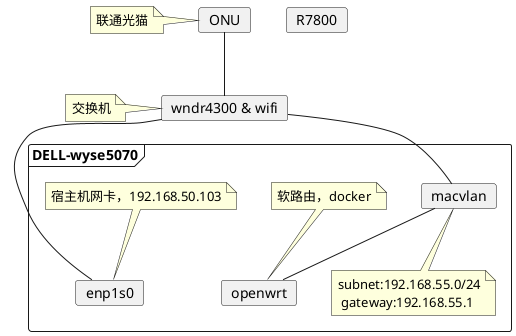

# Dell wyse 5070，单臂路由
### 网络结构图


### 宿主机配置
#### 打开网卡混杂模式
```bash
ip link set enp1s0 promisc on
```
#### 加载 PPPOE 内核模块
modprobe pppoe

### 创建macvlan网络
```bash
    podman network create \
    --subnet=192.168.55.0/24 \
    --gateway=192.168.55.1 \
    --macvlan=enp1s0 mac1

    cat /etc/cni/net.d/mac1.conflist
```

    podman import openwrt-19.07.2-x86-64-generic-rootfs.tar.gz
    podman tag 9937828b9656 openwrt:19.07.2

    podman run --name openwrt -d \
    --network mac1 \
    --privileged openwrt:19.07.2 /sbin/init


#### openwrt 配置
Lan 物理设置：取消勾选“桥接接口”， 接口选择 eth0
Wan 物理设置，接口选择 eth0

### openwrt
https://openwrt.org/
https://hub.docker.com/u/openwrtorg
https://hub.docker.com/r/openwrtorg/rootfs
```bash
podman run -it --name openwrt --hostname openwrt openwrtorg/rootfs:x86-64 /bin/sh
```

### openwrt mirror
https://mirrors.tuna.tsinghua.edu.cn/help/openwrt/
sed -i 's_downloads.openwrt.org_mirrors.tuna.tsinghua.edu.cn/openwrt_' /etc/opkg/distfeeds.conf


#### 网络
/etc/network/interfaces 不是systemd-networkd的配置文件，如果使用systemd-networkd要把 /etc/network/interfaces 备份删除。


### 修改openwrt ip
vi etc/config/network


### https://openwrt.club/93.html
宿主机Linux的基本配置
由于需要将Linux配置为宿主机，所以Linux上需要进行一些基本的设置。

打开所需要使用的网卡的混杂模式

    ip link set ens33 promisc on
    ip link set ens34 promisc on

加载pppoe内核模块

    modprobe pppoe

Docker容器的网络配置
为 docker 创建 macvlan 模式的虚拟网卡，并关联到宿主机。涉及到ipv4，ipv6地址请自行修改

LAN 口  

    docker network create -d macvlan \
    --subnet=172.16.60.0/24 \
    --gateway=172.16.60.254 \
    --ipv6 \
    --subnet=fe80::/16 \
    --gateway=fe80::1 \
    -o parent=ens33 \
    -o macvlan_mode=bridge \
    openwrt-LAN

WAN 口

    docker network create -d macvlan \
    --subnet=192.168.0.0/24 \
    --gateway=192.168.0.254 \
    --ipv6 --subnet=fe81::/16 \
    --gateway=fe81::1 \
    -o parent=ens34 \
    -o macvlan_mode=bridge \
    openwrt-WAN

建立以及启动容器
创建容器镜像

    docker import openwrt-x86-64-generic-rootfs.tar.gz lean_openwrt

启动容器

    docker run -it -d \
    --restart always \
    --network openwrt-LAN \
    --privileged \
    --name openwrt \
    lean_openwrt /sbin/init

将第二块网卡的挂接到 openwrt

    docker network connect openwrt-WAN openwrt

修改OpenWRT配置
进入容器

    docker exec -it openwrt /bin/sh

### 编辑 /etc/config/network

      config interface 'lan'
      option type 'bridge'
      option ifname 'eth0'  
      option proto 'static'
      option ipaddr '172.16.60.1'
      option netmask '255.255.255.0'
      option ip6assign '64'
 
      config interface 'wan'
      option ifname 'eth1'  
      option proto 'dhcp'
      option ip6assign '64'

重启OpenWRT网络服务

    /etc/init.d/network restart

将OpenWRT作为宿主机的网关
由于容器网络采用 macvlan 的 bridge 模式，即使宿主机与容器在同一网段，相互之间也是无法通信的。为了解决这个问题，需利用多个 macvlan 接口之间是互通的原理，新建macvlan虚拟接口：

    ip link add link ens33 vLAN type macvlan mode bridge   
    ip addr add 172.16.60.253/24 brd + dev vLAN   
    ip link set vLAN up
    ip route del default                
    ip route add default via 172.16.60.1 dev vLAN     
 
#设置宿主机的dns服务器为OpenWRT

    echo "nameserver 172.16.60.1" > /etc/resolv.conf  

将宿主机的网络配置加入到自启动脚本中
为了保证在Linux重启后，网络依然可以生效，我们将上一步中的配置加入到启动脚本（例如rc.local）。

剩下的事情就是OpenWRT的基本配置了，在这里就不在详述了。


### reference
https://vvl.me/2019/10/one-armed-router/
https://openwrt.club/93.html
https://github.com/luoqeng/OpenWrt-on-Docker
https://www.youtube.com/watch?v=jXMgAz_GQxI

http://lpwei.com/index.php/archives/39/
https://github.com/lisaac/blog/issues/4
