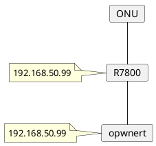

### Dell wyse 5070， 单臂路由
光猫>交换机Lan口
软路由>交换机Lan口
#### openwrt 配置
Lan 物理设置：取消勾选“桥接接口”， 接口选择 eth0
Wan 物理设置， 接口选择 eth0


### openwrt
https://openwrt.org/
https://hub.docker.com/u/openwrtorg
https://hub.docker.com/r/openwrtorg/rootfs
```bash
podman run -it --name openwrt --hostname openwrt openwrtorg/rootfs:x86-64 /bin/sh
```

### openwrt mirror
https://mirrors.tuna.tsinghua.edu.cn/help/openwrt/
sed -i 's_downloads.openwrt.org_mirrors.tuna.tsinghua.edu.cn/openwrt_' /etc/opkg/distfeeds.conf

### 宿主机配置
#### 打开网卡混杂模式
```bash
ip link set enp1s0 promisc on
```

#### 网络
/etc/network/interfaces 不是systemd-networkd的配置文件，如果使用systemd-networkd要把 /etc/network/interfaces 备份删除。

### 创建macvlan网络
```bash
podman network create \
--subnet=192.168.50.0/24 \
--gateway=192.168.50.1 \
--macvlan=enp1s0 mac1

cat /etc/cni/net.d/mac1.conflist
```

```bash
podman run -itd --name c1 --ip=192.168.50.99 --network mac1 busybox
```
    podman import openwrt-19.07.2-x86-64-generic-rootfs.tar.gz
    podman tag 9937828b9656 openwrt:19.07.2
    podman run --name openwrt -d --network mac1 --privileged openwrt:19.07.2 /sbin/init

### 修改openwrt ip
vi etc/config/network

### reference
https://vvl.me/2019/10/one-armed-router/
