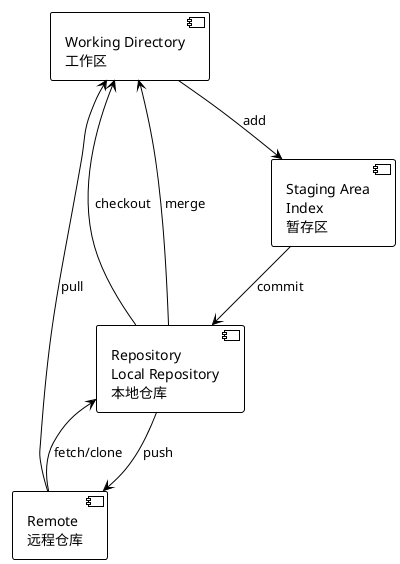

## Git

### 工作区 (Working Directory)

也称工作目录、工作副本  
我们日常开发操作是在工作区中进行的。  
工作区的内容会包含提交到暂存区和版本库(当前提交点)的内容，同时也包含自己的修改内容。

### 暂存区 (stage, Staging Area, Index )

也称缓存区  
逻辑上处于工作区和本地仓库之间，主要作用是标记修改内容，暂存区里的内容默认将在下一次提交时记录到本地仓库中。  
Git本地库中的索引Index就是一个二进制文件，默认存储在.git/index路径下。  
修改提交版本库前的一个过渡阶段。查看GIT自带帮助手册的时候，通常以index来表示暂存区。在工作目录下有一个.git的目录，里面有个index文件，存储着关于暂存区的内容。git add命令将工作区内容添加到暂存区。

### 本地仓库 (Repository, local repository)，  (.git）

在工作区中有个隐藏目录.git，这就是 Git 本地仓库的数据库。工作区中的项目文件实际上就是从这里签出 (checkout）而得到的，修改后的内容最终提交后记录到本地仓库中。
Tips：不要手动修改 .git 目录的内容  
当执行git commit命令后，会将暂存区内容提交到仓库之中。在工作区下面有.git的目录，这个目录下的内容不属于工作区，里面便是仓库的数据信息，暂存区相关内容也在其中。这里也可以使用merge或rebase将远程仓库副本合并到本地仓库。

### 远程仓库 (remote repository)

与本地仓库概念基本一致，不同之处在于一个存在远程，可用于远程协作，一个却是存在于本地。通过push/pull可实现本地与远程的交互；

### 远端仓库， 远程仓库副本

团队协作往往需要指定远端仓库 (一般是一个，也可以有多个），团队成员通过跟远端仓库交互来实现团队协作。  
存在于本地的远程仓库缓存。如需更新，可通过git fetch/pull命令获取远程仓库内容。使用fech获取时，并未合并到本地仓库，此时可使用git merge实现远程仓库副本与本地仓库的合并。git pull 根据配置的不同，可为git fetch + git merge 或 git fetch + git rebase。

### 理解 git fetch, git pull

要讲清楚git fetch，git pull,必须要附加讲清楚git remote，git merge 、远程repo， branch 、 commit-id 以及 FETCH_HEAD。

### git remote

git是一个分布式的结构，这意味着本地和远程是一个相对的名称。

本地的repo仓库要与远程的repo配合完成版本对应必须要有 git remote 子命令，通过 git remote add 来添加当前本地仓库的远程 repo， 有了这个动作本地的repo就知道了当遇到 git push 的时候应该往哪里提交代码。

### git branch

git天生就是为了多版本分支管理而创造的，因此分支一说，不得不提， 分支就相当于是为了单独记录软件的某一个发布版本而存在的，既然git是分布式的，便有了本地分支和远程分支一说，git branch 可以查看本地分支， git branch -r  可以用来查看远程分支。 本地分支和远程分支在git push 的时候可以随意指定，交错对应，只要不出现版本冲突即可。

### git merge

git 的分布式结构也非常适合多人合作开发不同的功能模块，此时如果每个人都在其各自的分支上开发一个相对独立的模块的话，在每次 release 时都需先将各成员的模块做一个合并操作，用于合并各成员的工作成果，完成集成。 此时需要的就是 git merge.

### git push 和 commit-id

在每次本地工作完成后，都会做一个 git commit 操作来保存当前工作到本地的 repo， 此时会产生一个 commit-id，这是一个能唯一标识一个版本的序列号。 在使用 git push 后，这个序列号还会同步到远程repo。

在理解了以上git要素之后，分析git fetch 和 git pull 就不再困难了。

### git fetch 有四种基本用法

- git fetch 更新 git remote 中所有的远程repo 所包含分支的最新 commit-id, 将其记录到 .git/FETCH_HEAD 文件中
- git fetch remote_repo 这将更新名称为remote_repo 的远程 repo 上的所有branch的最新commit-id，将其记录。
- git fetch remote_repo remote_branch_name 这将这将更新名称为remote_repo 的远程repo上的分支： remote_branch_name
- git fetch remote_repo remote_branch_name:local_branch_name 更新名称为remote_repo 的远程repo上的分支： remote_branch_name ，并在本地创建local_branch_name 本地分支保存远端分支的所有数据。

FETCH_HEAD： 是一个版本链接，记录在本地的一个文件中，指向着目前已经从远程仓库取下来的分支的末端版本。

### git pull 的运行过程

git pull 首先，基于本地的FETCH_HEAD记录，比对本地的FETCH_HEAD记录与远程仓库的版本号，然后git fetch 获得当前指向的远程分支的后续版本的数据，然后再利用git merge将其与本地的当前分支合并。

### git fetch, git pull

git fetch是将远程主机的最新内容拉到本地，用户在检查了以后决定是否合并到工作本机分支中。而git pull 则是将远程主机的最新内容拉下来后直接合并，即：git pull = git fetch + git merge，这样可能会产生冲突，需要手动解决。

### rebase 做了什么

#### 场景：分支合并

从 master 分支切出一个 dev 分支 (feature1)，进行开发
再执行 git rebase master
首先，git 会把 feature1 分支里面的每个 commit 取消掉；
其次，把上面的操作临时保存成 patch 文件，存在 .git/rebase 目录下；
然后，把 feature1 分支更新到最新的 master 分支；
最后，把上面保存的 patch 文件应用到 feature1 分支上；

### 分支，branch

git 中的分支，其实本质上仅仅是个指向 commit 对象的可变指针。

### HEAD

HEAD就是当前活跃分支的游标, HEAD可以指向分支中的任意一个节点，HEAD在Git内部用于追踪当前位置。

### HEAD和head

你可以认为 HEAD(大写)是"current branch"(当下的分支)。当你用git checkout切换分支的时候，HEAD 修订版本重新指向新的分支。有的时候HEAD会指向一个没有分支名字的修订版本，这种情况叫”detached HEAD“
head(小写)是commit对象的引用，每个head都有一个名字 (分支名字或者标签名字等等），但是默认情况下，每个叫master的repository都会有一个head, 一个repository可以包含任意数量的head。在任何时候，只要这个head被选择成为”current head“，那么这个head就成了HEAD,总是大写

---

><https://git-scm.com/book/zh>

<https://blog.csdn.net/taiyangdao/article/details/52761572>

作者： fandyst
出处： <http://www.cnblogs.com/todototry/>
本文版权归作者和博客园共有,欢迎转载,但未经作者同意必须保留此段声明,且在文章页面明显位置给出原文连接。

作者：波罗学
链接：<https://www.zhihu.com/question/38305012/answer/625881308>
来源：知乎
著作权归作者所有。商业转载请联系作者获得授权，非商业转载请注明出处。

><https://zhuanlan.zhihu.com/p/59591617>

作者：打我你肥十斤
链接：<https://juejin.cn/post/6844903921794859021>
来源：稀土掘金
著作权归作者所有。商业转载请联系作者获得授权，非商业转载请注明出处。

><https://segmentfault.com/a/1190000039320926>
><http://jartto.wang/2018/12/11/git-rebase/>

作者：zuopf769
链接：<https://juejin.cn/post/6844903493078089736>
来源：稀土掘金
著作权归作者所有。商业转载请联系作者获得授权，非商业转载请注明出处。

><https://www.zsythink.net/archives/3412>
