此文用于记录在 AI 时代到来之前我手搓的最后一个复杂模块.

这个 conflict check 模块的重写是在 2024 年，历时约 3 个月，当时我还没有开始大规模使用 AI 辅助编程。重写的时候注意力都在功能需求上，并没有想「要用哪种设计模式」，只是在纠结怎么把问题拆清楚、用面向对象的方式把责任分开、把可能变化的部分封装起来。Redis 里的缓存数据是嵌套的树形结构，解析时写了几个递归调用——当时认为是最复杂的几个函数。

这个文档写于此后。某次和一个朋友聊天，对方问起对设计模式有没有了解，当时长期没有专门研究过，没说出个所以然。后来那个问题偶尔还会浮上来，然后有一天和 conflict check 关联到了起来, 然后用 Copilot + Claude Sonnet 4.6 分析了一下 --- 
有些设计模式接近标准实现，有的因业务结构或 Python 语言特性而有所偏差，还有两个（Builder 和 State）目前只是符合模式意图、需要重构才能达到标准结构。整理的过程中还发现了有性能优化空间的地方。

## 背景

防火墙策略在应用到设备之前，需要先在缓存中进行冲突检测。"网络编排器" 将每台设备的数据缓存在 Redis 中，每份 profile 包含三类数据：**地址对象和分组**、**服务对象和分组**，以及**策略列表**。

每条策略的关键字段：

- **src**：源地址数组，每个元素是一个 address object name 或 address group name
- **dst**：目标地址数组，结构与 src 相同
- **service**：服务数组，每个元素是一个 service object name 或 service group name

地址对象和服务对象共用同一种数据结构，各自包含两种角色：

- **object**：基础对象，`value` 是实际 IP 地址/CIDR 网段（address）或协议/端口（service）的数组
- **group_object**：分组对象，`value` 是 object name 或另一个 group_object name 的数组

group 和 object 形成嵌套结构：一个 group 的 value 列表里，既可以直接引用 object，也可以引用其他 group，形成递归树。地址对象和服务对象结构相同，因此 `PolicyObject` 类可以统一表达这两种类型，同时处理 src、dst、service 的解析。

冲突检测模块要解决的问题是比对用户提交的网络策略与 Redis 中缓存的策略，决定后续应当新建、更新，还是无需操作。src、dst、service 三个字段与已有策略的对应字段各自存在 `匹配、子集、超集、不匹配` 四种关系，再叠加生效时间段，各字段结果的排列组合共同决定最终判定。

## 设计模式

冲突检测模块的设计模式，分布在数据表示与加载、对象构建和算法执行三个层次。

**数据表示与加载**

- **Composite**： 只用了一个类，Python 实现有偏差——Leaf/Composite 共用同一个 `PolicyObject` 类，以 `is_leaf()` 运行时区分，而非标准的子类分离
- **Facade**：GoF 标准实现, 封装 Redis 里缓存的设备策略读取
- **Proxy**：GoF 标准实现，Cache Proxy 变体

**对象构建**

- **Static Factory Method**：非 GoF 工厂方法（GoF Factory Method 依赖子类多态），更接近 *Effective Java* 的静态工厂方法：以方法名区分变体，隐藏构建差异
- **Builder**（待优化）：场景符合 GoF Builder 意图，但 Builder/Director/Product 三角色合并在 `DevicePolicy` 类自身的静态方法里，有重构方案

**算法执行**

- **Template Method**：GoF 标准模式，有偏差——`DstNatChecker`、`DeviceNatChecker` 覆盖了模板方法本身，不只是插入钩子
- **Strategy**：GoF 标准模式，有两处偏差——用继承代替组合；用 `__class__` 赋值代替替换 Context 引用
- **Special Case**：非 GoF 模式，来自 Martin Fowler 的 PoEAA；这里使用异常变体代替原书的无操作对象
- **State**（待优化）：比较结果状态机场景符合 GoF State 意图，但当前用枚举字段 + 优先级累积实现，有重构方案

### 数据表示与加载

#### Composite — 统一树形结构

将 Redis 中的 object 和 group_object 统一抽象为 `PolicyObject`，形成树形结构：

| 角色      | 映射                             |
| --------- | -------------------------------- |
| Component | `PolicyObject`（统一接口）       |
| Leaf      | `object`（IP/网段，没有子节点）  |
| Composite | `group_object`（包含子节点的组） |

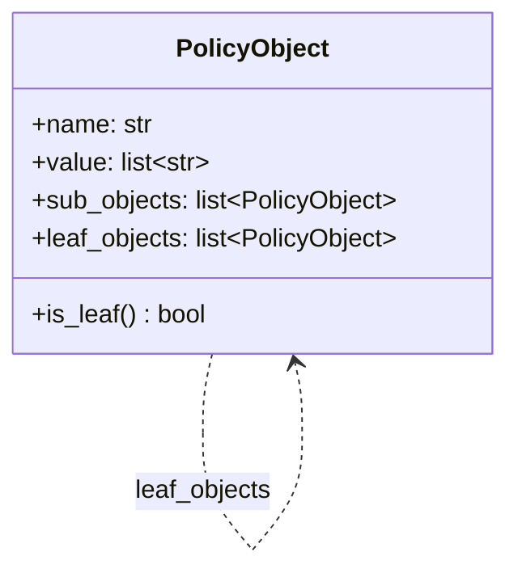

- **Leaf**：`sub_objects` 为空，`value` 存放实际的 IP 地址/CIDR 或协议/端口
- **Composite**：`sub_objects` 包含直接子节点，`value` 为空
- `leaf_objects`：递归展开后所有叶子节点的缓存，冲突检测时直接遍历，无需重复递归

每条策略用 `Policy` 对象表达，其中 src、dst、service 均为 `PolicyObject` 列表：

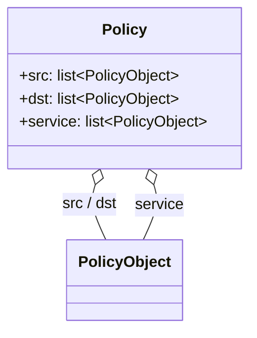

**Python 实现与标准模式的差异**

标准 GoF Composite 通常定义一个 Component 接口，Leaf 和 Composite 分别作为子类实现。Python 没有 `interface` 关键字（可以用 `abc.ABC` + `@abstractmethod` 替代，但这里没有用），且这里的 object 和 group_object 在代码中**共用同一个 `PolicyObject` 类**，通过 `is_leaf()`（即检查 `sub_objects` 是否为空）在运行时区分两种角色。这省去了单独的子类，但两种角色的行为差异由条件判断而非类型分派处理——是 Python 惯用的扁平化写法，而非标准模式的类层次结构。

#### Facade — 统一数据访问入口

Facade = **Redis 读取 + Composite 组织**，两件事全部封装在内部，外部只看到干净的对象接口。

内部数据流：

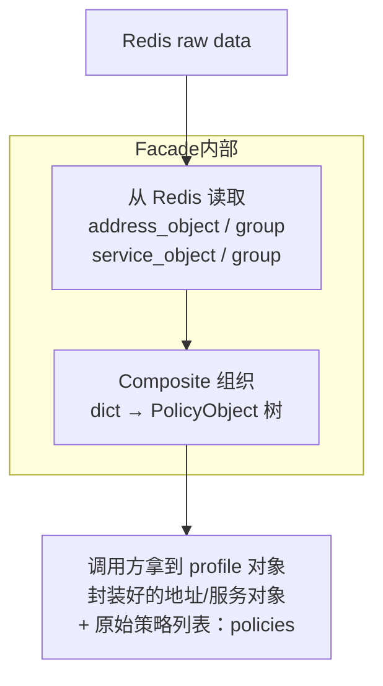

调用方只需面对 profile 对象和封装好的 PolicyObject，无需关注 Redis 数据格式、dict 转换细节或 group 的嵌套层级。

**策略列表的后续处理**：Facade 的 `policies()` 返回的是 Redis 里的原始策略列表，不是封装好的领域对象。Checker 在比较循环里逐条取出原始策略，调用 `wrap_policy(raw, profile)` 逐一封装。`profile` 也作为参数传入，因为封装时需要通过 Facade 的转换方法查询地址/服务对象。

Facade 并不在初始化时把所有 address object 批量转换成 PolicyObject 树——它只是把 Redis 的原始 dict（address_object、address_group 等）一次性 load 进内存字段。每封装一条策略时，才调用 Facade 的转换方法，用该策略的 src/dst name list 从内存 dict 里查出对应条目，实时组装 Composite 树。**dict 是预加载的，对象树是按需构建的。**

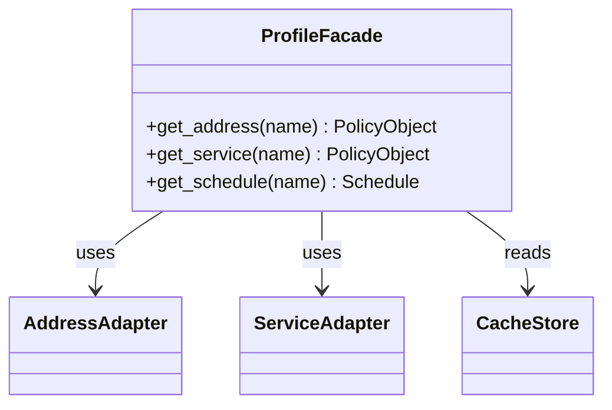

#### Proxy（缓存代理）— 减少重复访问

冲突检测时，同一设备的 profile 会被多条策略反复查询。Proxy 在调用方与底层 Redis 缓存之间增加一层本地字典，命中时直接返回，未命中时才访问底层存储并将结果存入本地字典。

Proxy 缓存的是从 Redis 反序列化出来的**原始 profile 对象**，以设备 cache key 为键。该对象包含 address/service 的原始 dict（各地址和服务相关的字典字段）以及原始策略列表等全部字段。Facade 每次都从这个已缓存的原始对象中读取数据，不再重新访问 Redis。

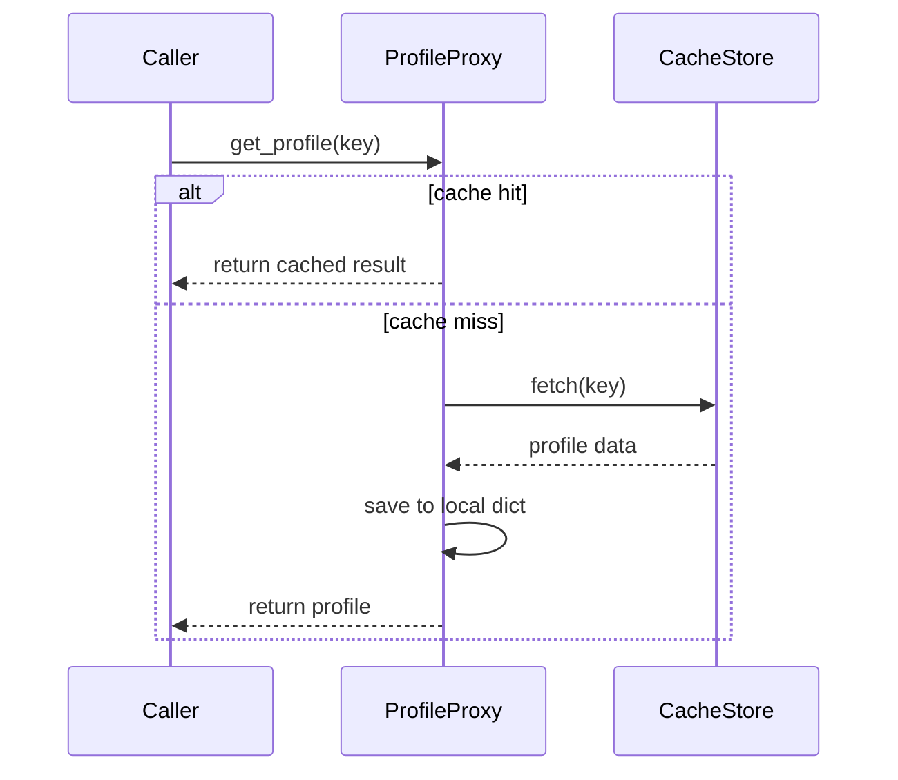

**与标准模式的一致性**

这是 GoF Proxy 中的 Cache Proxy 变体，与标准模式结构一致。GoF Proxy 的核心意图是为另一个对象提供代理以控制对它的访问；这里 ProfileProxy 拦截调用方对 Redis 的每次请求，命中时直接返回缓存结果，未命中时才访问真实主体。调用方不感知请求是否被缓存拦截，接口对外完全透明。

### 对象构建

#### Static Factory Method，静态工厂方法 — 按变体创建策略对象

`DevicePolicy` 类上有四个 `@staticmethod` 工厂方法，对应 Redis 缓存的防火墙策略的四种变体。每个方法以名称区分变体，隐藏内部构建差异。这与 GoF 工厂方法（依赖子类多态）有所不同，更接近 *Effective Java* 中描述的静态工厂方法：方法名比构造函数更有表达力，内部实现可以随版本变化而不影响调用方。

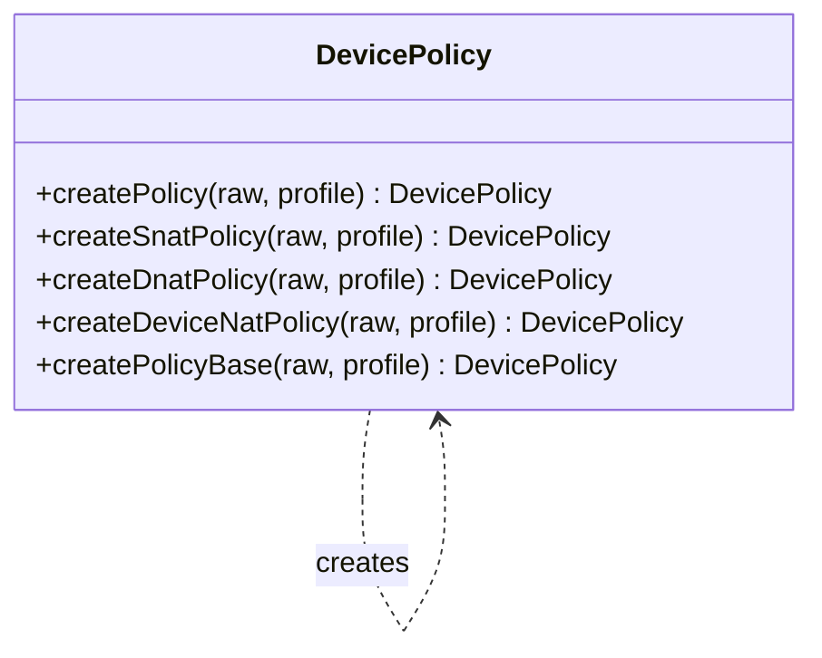

### 算法执行层

#### Template Method — 定义检测骨架

父类定义检测流程的固定步骤，子类只覆盖其中差异化的钩子方法。`check_conflict()` 定义骨架：加载策略列表 → 逐条 zone 检查 → 包装策略 → 与用户策略比较 → 错误处理。新增设备类型只需继承并覆盖钩子，无需修改骨架。

具体子类共 5 个，通过两层继承隔离不同设备类型的 NAT 差异：`NatChecker` 集中 NAT 策略的公共逻辑（加载 NAT 策略列表、发送条件、错误处理）；F* 设备的源 NAT 和目的 NAT 各自直接继承 `NatChecker`，前者只覆盖比较规则（放宽为 MATCH/SUBSET 均接受），后者在骨架末尾追加 VIP 二次检测；P* 设备有独立的 `DeviceNatChecker` 基类，它覆盖了 `check_conflict()` 实现双阶段检测（先比对 NAT 策略，匹配后再与普通策略二次比对），其下的两个叶子类只覆盖地址准备钩子。

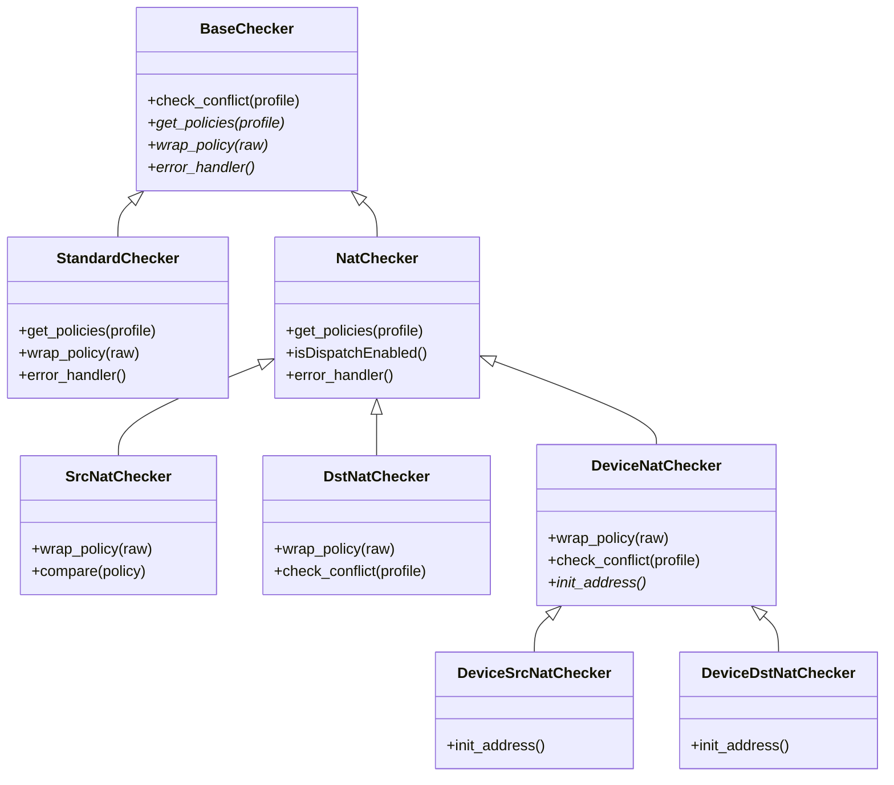

**Python 实现与标准模式的差异**

标准 GoF Template Method 要求模板方法本身不可被覆盖（Java 中标记为 `final`），子类只能替换钩子方法。这里 `DstNatChecker` 和 `DeviceNatChecker` 均覆盖了 `check_conflict()` 本身，而不只是插入钩子——前者在骨架末尾追加 VIP 二次检测，后者完全替换为双阶段检测流程。Python 没有 `final`，这是语言层面的限制，但在结构上这两个子类已经部分承担了重新定义骨架的职责，不再是纯粹的钩子实现。

#### Strategy — 运行时切换行为

冲突检测对不同类型的策略（普通、源 NAT、目的 NAT）使用不同的检测逻辑，每种逻辑对应一个检测策略。策略对象初始均以基类创建，封装阶段根据节点属性通过 `__class__` 赋值直接替换运行时子类，无需重建对象。切换完成后进入冲突检测主逻辑，调用方只调用统一接口，各对象按自身运行时类型执行对应检测行为——策略切换对外层代码完全透明。

经典 GoF Strategy 通常将策略对象单独注入（组合），这里的做法是策略对象本身即是策略的载体：通过 `__class__` 赋值，在不重建对象的情况下完成子类替换，是 Python 动态类型的一种实用变体。

源 NAT 和目的 NAT 的切换时机不同：源 NAT 节点在加入路径时即可确定，切换立即完成；目的 NAT 则只有路径末尾的最后一个节点才需要以 DNAT 方式做冲突检测，因此必须等路径上所有节点按序收集完毕后，再通过第二轮遍历定位并切换该节点的类型。

Strategy 与 Template Method 协同：Template Method 固定骨架顺序，Strategy 决定骨架中钩子的具体实现。

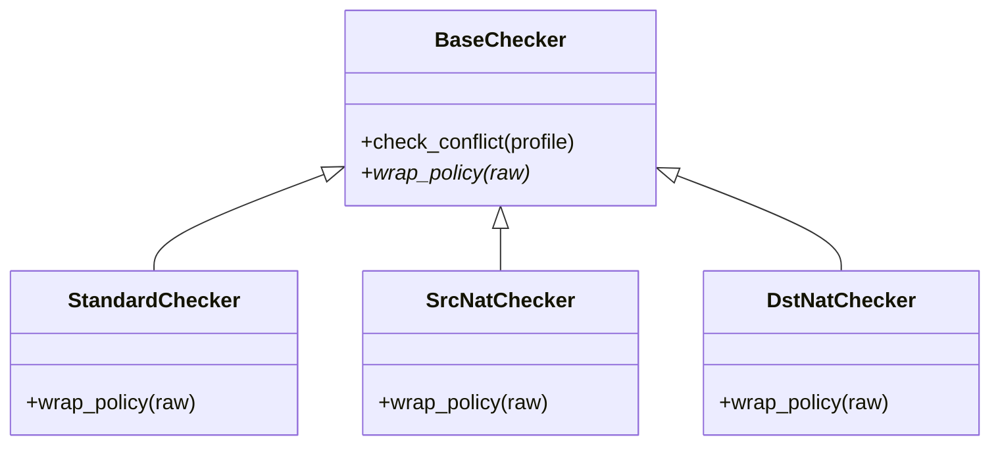

**Python 实现与标准模式的差异**

标准 GoF Strategy 的结构是：Context 持有一个 Strategy 接口引用，切换行为时替换该引用指向的具体策略对象，Context 与策略对象是组合关系。这里有两处偏离：一是用继承代替了组合——Checker 子类本身就是策略的载体，没有独立的 Context 持有 Strategy 引用；二是切换方式是 `__class__` 赋値，直接改变对象自身的运行时类型，而非在 Context 上替换已持有的引用。`__class__` 变异是 Python 特有的机制，GoF 原书不存在这种操作，但达到了同样的目的：对调用方透明地改变对象的行为。

#### Special Case — 以异常代替空返回

Special Case 来自 Martin Fowler 的 *Patterns of Enterprise Application Architecture*（PoEAA），不属于 GoF 的 23 种模式。原书中 Special Case 是一个封装了特殊情况处理行为的无操作对象，使调用方无需对特殊值做显式判断。

当策略对象包含宽泛私网地址范围（如 `10.0.0.0/8`）时，该策略不具备比较意义。包装阶段直接抛出专用异常，由比较循环的第一个 `except` 子句静默消费，循环继续。这避免了返回 `None` 后在每个调用点进行 `None` 判断的扩散。目标与原书相同（避免 null 判断扩散），但以抛出 + 捕获代替返回特殊对象——是 PoEAA Special Case 的异常变体，语义更清晰。

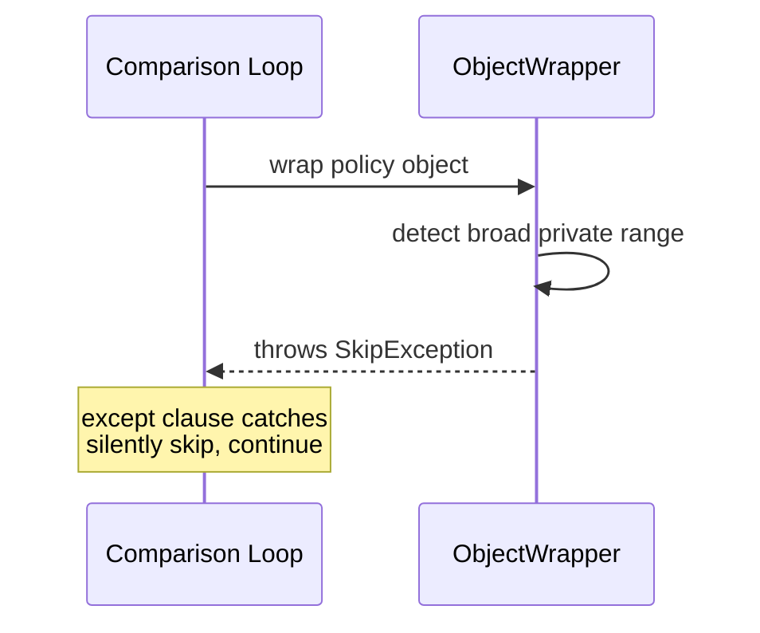

## 模式组合

这 7 种模式分层协作：

**数据加载层**：缓存原始 dict → Composite 组织为 PolicyObject 树 → Facade 对外暴露简洁接口 → Proxy 控制缓存访问避免重复查询。

**算法执行层**：Template Method 固定检测骨架 → Strategy 在运行时切换不同变体行为。

**跨层**：静态工厂方法负责各类策略对象的创建，Special Case 在源头过滤无意义输入。

## 小结

`sub_objects` 保留了原始的直接子节点关系，便于调试和展示树结构；`leaf_objects` 是为冲突检测专门缓存的展开结果，是对标准 Composite 的实用扩展——牺牲少量内存，换取检测时无需重复递归遍历。

设计模式在实际项目中很少单独出现。理解它们的关键不是记住定义，而是能识别每个模式在系统里负责解决哪个维度的问题，以及它们如何分工协作。

## 异常处理流程

比较循环内包裹了一个 `try/except` 块，按顺序声明 7 个 `except` 子句。Python 运行时按声明顺序匹配异常类型，第一个命中的子句处理，之后的子句不再执行。各子句可以静默消费、记录结果后继续循环，或向上抛出终止整条流程。

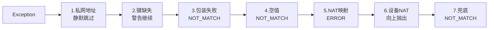

这与 GoF 责任链模式在语义上一致（有序、首匹配），但实现上是 Python 语言内置的异常分发机制，而非显式构建的 Handler 对象链。

---

## 已知优化点

### State 模式， 比较结果状态机改用 GoF State 模式

当前的比较结果跟踪用枚举字段 + `update_compare_result()` 实现，本质是优先级累积。从行为上看，四种结果之间存在明确的单向迁移规则，完全可以改用标准 GoF State 模式实现：每种结果对应一个 State 类，封装该状态下的 `update()`、`on_enter()`、`error_handler()` 行为，通过替换 Context 持有的 State 对象完成迁移，而非外部 if/elif 分支。

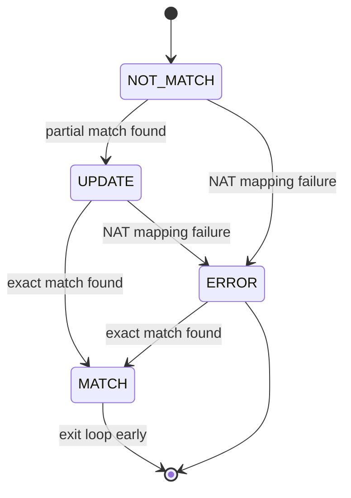

收益：各状态的进入行为（如 MATCH 时绑定现有的 policy id、ERROR 时记录 error_type）内聚到 State 类内部，消除散落在比较循环中的多处 if/elif 判断，新增状态只需新增一个类。

### 性能优化， PolicyObject 树的重复构建

当前实现中，每封装一条设备缓存策略时，都会调用 Facade 的转换方法，从内存 dict 里实时递归组装 Composite 树。如果 100 条策略都引用了同一个 `server-group-A`，这棵树会被 rebuild 100 次。

这个重复是可以消除的。Redis 的 address/service object dict 更新频率是天级的，对于同一个请求下的一组规则对应的冲突检测来说，dict 是完全稳定的；应用层也没有对 dict 的写操作。因此，同名 object 构建出的 PolicyObject 树是幂等且安全可复用的。

优化方式是在 Facade 内部增加一层以 object name 为 key 的 dict 缓存，首次构建后存入，后续同名请求直接返回缓存结果，不再递归。这是对 Facade 转换方法的 memoization，本质上也是 Flyweight 模式的变体——在同一 profile 作用域内共享不可变的 PolicyObject 实例。

### Builder 模式， 重构为标准 GoF Builder 模式

当前的 `DevicePolicy` 构建逻辑集中在 `DevicePolicy` 类自身的静态方法里：`createPolicyBase()` 承担公共基础步骤，各变体方法在其上追加 src/dst 字段——Builder 和 Director 两个角色均由静态方法兼任，构建逻辑与 Product 类耦合在一起。

这个场景完全符合 GoF Builder 的适用条件：同一构建流程（创建对象 → 填充基础字段 → 组装 src/dst）需要生产出多种变体（普通策略、源 NAT、目的 NAT），仅 src/dst 的组装逻辑不同。Python 没有 `interface`，但可以用 `abc.ABC` + `@abstractmethod` 替代。

**现有实现**：构建逻辑全部内联在 `DevicePolicy`（Product 类自身）的静态方法里——Builder、Director、Product 三个角色合并在同一个类里，方法同时充当 Director 和 ConcreteBuilder。

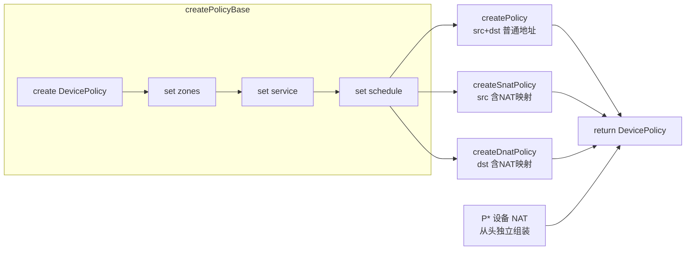

**重构后的类结构**：Builder、Director、Product 三角色分离。

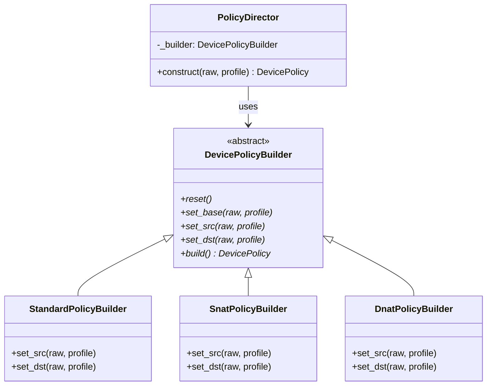

P* 设备 NAT 变体结构差异较大，可单独提供 `DeviceNatPolicyBuilder`，覆盖全部步骤，与其他 Builder 共享同一个 `PolicyDirector`。

收益：`set_src` / `set_dst` 的差异化逻辑内聚到各 Builder 子类，`PolicyDirector` 只编排通用步骤顺序，新增策略变体只需新增一个 Builder 子类，无需修改现有代码。

---

conflict check, 业务代码约 5000 行，单元测试约 3.6 万行（其中有大量重复代码——当时急于覆盖各种边界情况，靠堆 case 保证覆盖率）。

---

> 相关：[Composite Pattern](./composite-pattern.md)
