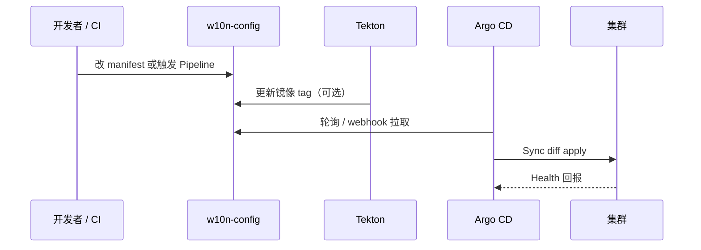

## 什么是 Argo CD

[Argo CD](https://argo-cd.readthedocs.io/) 是 CNCF 毕业项目，专为 Kubernetes 设计的 **GitOps 持续部署（CD）** 控制器。它以 Git 仓库中的 manifest（YAML、Kustomize、Helm 等）为**唯一期望状态**，持续对比集群里的实际资源，并在偏差时执行同步。

与 Tekton、GitHub Actions 等 **CI** 工具的分工常见如下：

| 阶段 | 典型工具 | 做什么 |
| ---- | -------- | ------ |
| 构建 | Tekton、CI | 编译代码、打镜像、推 registry |
| 部署 | Argo CD | 根据 Git 里的镜像 tag / manifest 更新集群 |

在 homelab 里，配置仓库是 `w10n-config`：改 `homelab/k8s/` 下的 YAML 并 push，由 Argo CD 把变更落到集群；镜像版本往往由 Tekton Pipeline 改 Git 里的 deployment 镜像字段，再交给 Argo 滚动发布。

## GitOps 在说什么

传统做法常是 `kubectl apply` 或 Helm 从本机直接改集群，容易出现「集群里到底是什么版本」与 Git 不一致的问题。

GitOps 的核心约定：

1. **Git 是事实来源**：期望状态只写在版本库里。
2. **自动化同步**：控制器拉取 Git，diff 后 apply 到集群。
3. **可观测、可回滚**：每次部署对应一个 commit revision，UI 和 CR 状态里能追溯。

Argo CD 负责第 2、3 步；人（或 CI）只负责把正确内容 merge 进 Git。

## 核心概念

### Application

`Application` 是 Argo CD 的 CRD，描述「从哪个 Git 路径同步到哪个集群/命名空间」。homelab 中 QuantDinger 的示例（节选）：

```yaml
apiVersion: argoproj.io/v1alpha1
kind: Application
metadata:
  name: quantdinger
  namespace: argocd
spec:
  project: default
  source:
    repoURL: git@github.com:wiloon/w10n-config.git
    targetRevision: main
    path: homelab/k8s/quantdinger
  destination:
    server: https://kubernetes.default.svc
    namespace: quantdinger
  syncPolicy:
    automated:
      prune: true
      selfHeal: true
```

- `source`：Git 仓库、分支、子目录（或 Helm chart 参数）。
- `destination`：目标 API Server 与 namespace（单集群时多为 in-cluster 地址）。
- `syncPolicy.automated`：开启后，Git 变更或集群被手工改掉时，控制器会自动 Sync。

### Sync 与 Health

- **Sync**：把 Git 中的 manifest 应用到集群（create/update/delete，取决于 diff 与 `prune`）。
- **Health**：Deployment、StatefulSet 等资源是否达到就绪等「业务健康」判定。
- **Sync 状态**：`Synced` / `OutOfSync` 表示 Git 与 live 是否一致；注意「显示 Synced」时 revision 仍可能未更新到最新 commit，排障时需对照 `status.sync.revision`。

### Project

`AppProject` 用于 RBAC、允许的仓库/集群/资源白名单。homelab 目前多用 `default` 项目。

### 其他常用能力

- **Kustomize / Helm / 目录**：`source.path` 指向 Kustomize 目录时，Argo 在仓库内执行 `kustomize build` 再 apply。
- **ignoreDifferences**：某些字段（如 Namespace 自动标签）不在 Git 里，可声明忽略，避免无意义 OutOfSync。
- **sync-wave 注解**：`argocd.argoproj.io/sync-wave` 控制资源应用顺序（例如先 Secret/ConfigMap，再 Deployment）。

## homelab 中的部署方式

| 项 | 说明 |
| ---- | ---- |
| UI | https://argocd.wiloon.com |
| 命名空间 | `argocd` |
| 配置目录 | `w10n-config` 仓库 `homelab/k8s/argocd/` |
| Application 清单 | 同目录下 `application-*.yaml`（如 quantdinger、pathfinder、rssx） |

典型工作流：

1. 编辑 `homelab/k8s/<服务>/` 下的 manifest（或等 Tekton 更新镜像 tag）。
2. `git push` 到 `main`。
3. Argo CD 检测到新 revision，在 `automated` 策略下自动 Sync。
4. 在 UI 或 `kubectl get application -n argocd` 查看 Sync/Health。

若需构建镜像再发布，见仓库内 `homelab/k8s/tekton/` 与各服务的 README（如 QuantDinger 的 Tekton + Argo CD 升级说明）。

## 同步策略说明

homelab 里多个 Application 启用了类似配置：

```yaml
syncPolicy:
  automated:
    prune: true
    selfHeal: true
  syncOptions:
    - CreateNamespace=true
```

| 选项 | 含义 |
| ---- | ---- |
| `automated` | Git 变更后自动同步，无需每次手点 Sync |
| `prune: true` | Git 中已删除的资源，会从集群中删除 |
| `selfHeal: true` | 有人用 `kubectl` 改了集群，会被拉回 Git 状态 |
| `CreateNamespace=true` | 目标 namespace 不存在时自动创建 |

因此日常应避免对已由 Argo 管理的资源长期 `kubectl apply -k` 旁路修改，否则会出现 OutOfSync，或与 selfHeal 互相覆盖。应急手段与正路 Sync 的对比，见 [Argo CD CLI 与 kubectl annotate 对比](/argocd-cli-vs-kubectl-annotate)。

## 常用操作

### Web UI

登录后可见应用列表、资源树、diff、同步历史、回滚到历史 revision 等，适合首次熟悉 GitOps 状态。

### CLI（可选）

```bash
# Arch Linux 示例
yay -S argocd-bin
argocd login argocd.wiloon.com --grpc-web
argocd app list
argocd app get quantdinger
argocd app sync quantdinger
argocd app diff quantdinger
```

未安装 CLI 时，可用 `kubectl annotate` 触发 hard refresh，详见上文链接的对比文。

### kubectl 查看 Application

```bash
kubectl -n argocd get application
kubectl -n argocd get application quantdinger -o yaml
```

关注 `status.sync.status`、`status.sync.revision`、`status.health.status`。

## 与 CI 的配合示意



## 小结

- Argo CD 把 **Git 里的 K8s manifest** 持续对齐到集群，是 homelab GitOps 的 CD 层。
- 日常以 **改 Git → push → 自动 Sync** 为主；`prune` + `selfHeal` 要求集群服从仓库。
- UI、CLI、`kubectl` 查看 Application 各有用途；深度排障与 refresh/sync 区别见 [Argo CD CLI 与 kubectl annotate 对比](/argocd-cli-vs-kubectl-annotate)。

官方文档：[Argo CD Documentation](https://argo-cd.readthedocs.io/en/stable/)。
