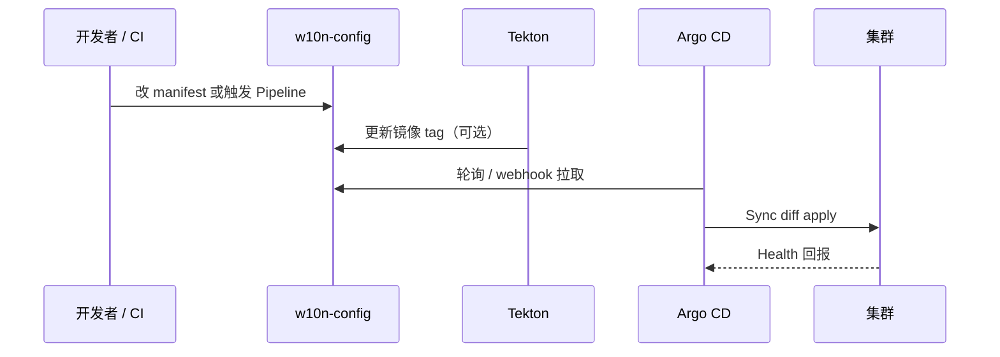

## 什么是 Argo CD

[Argo CD](https://argo-cd.readthedocs.io/) 是 CNCF 毕业项目，专为 Kubernetes 设计的 **GitOps 持续部署（CD）** 控制器。它以 Git 仓库中的 manifest（YAML、Kustomize、Helm 等）为**唯一期望状态**，持续对比集群里的实际资源，并在偏差时执行同步。

与 Tekton、GitHub Actions 等 **CI** 工具的分工常见如下：

| 阶段 | 典型工具   | 做什么                                    |
| ---- | ---------- | ----------------------------------------- |
| 构建 | Tekton、CI | 编译代码、打镜像、推 registry             |
| 部署 | Argo CD    | 根据 Git 里的镜像 tag / manifest 更新集群 |

在 homelab 里，配置仓库是 `w10n-config`：改 `homelab/k8s/` 下的 YAML 并 push，由 Argo CD 把变更落到集群；镜像版本往往由 Tekton Pipeline 改 Git 里的 deployment 镜像字段，再交给 Argo 滚动发布。

## GitOps 在说什么

传统做法常是 `kubectl apply` 或 Helm 从本机直接改集群，容易出现「集群里到底是什么版本」与 Git 不一致的问题。

GitOps 的核心约定：

1. **Git 是事实来源**：期望状态只写在版本库里。
2. **自动化同步**：控制器拉取 Git，diff 后 apply 到集群。
3. **可观测、可回滚**：每次部署对应一个 commit revision，UI 和 CR 状态里能追溯。

Argo CD 负责第 2、3 步；人（或 CI）只负责把正确内容 merge 进 Git。

## 核心概念

### Application

`Application` 是 Argo CD 的 CRD，描述「从哪个 Git 路径同步到哪个集群/命名空间」。homelab 中 QuantDinger 的示例（节选）：

```yaml
apiVersion: argoproj.io/v1alpha1
kind: Application
metadata:
  name: quantdinger
  namespace: argocd
spec:
  project: default
  source:
    repoURL: git@github.com:wiloon/w10n-config.git
    targetRevision: main
    path: homelab/k8s/quantdinger
  destination:
    server: https://kubernetes.default.svc
    namespace: quantdinger
  syncPolicy:
    automated:
      prune: true
      selfHeal: true
```

- `source`：Git 仓库、分支、子目录（或 Helm chart 参数）。
- `destination`：目标 API Server 与 namespace（单集群时多为 in-cluster 地址）。
- `syncPolicy.automated`：开启后，Git 变更或集群被手工改掉时，控制器会自动 Sync。

### Sync 与 Health

- **Sync**：把 Git 中的 manifest 应用到集群（create/update/delete，取决于 diff 与 `prune`）。
- **Health**：Deployment、StatefulSet 等资源是否达到就绪等「业务健康」判定。
- **Sync 状态**：`Synced` / `OutOfSync` 表示 Git 与 live 是否一致；注意「显示 Synced」时 revision 仍可能未更新到最新 commit，排障时需对照 `status.sync.revision`。

### Project

`AppProject` 用于 RBAC、允许的仓库/集群/资源白名单。homelab 目前多用 `default` 项目。

### 其他常用能力

- **Kustomize / Helm / 目录**：`source.path` 指向 Kustomize 目录时，Argo 在仓库内执行 `kustomize build` 再 apply。
- **ignoreDifferences**：某些字段（如 Namespace 自动标签）不在 Git 里，可声明忽略，避免无意义 OutOfSync。
- **sync-wave 注解**：`argocd.argoproj.io/sync-wave` 控制资源应用顺序（例如先 Secret/ConfigMap，再 Deployment）。

## homelab 中的部署方式

| 项               | 说明                                                              |
| ---------------- | ----------------------------------------------------------------- |
| UI               | https://argocd.wiloon.com                                         |
| 命名空间         | `argocd`                                                          |
| 配置目录         | `w10n-config` 仓库 `homelab/k8s/argocd/`                          |
| Application 清单 | 同目录下 `application-*.yaml`（如 quantdinger、pathfinder、rssx） |

典型工作流：

1. 编辑 `homelab/k8s/<服务>/` 下的 manifest（或等 Tekton 更新镜像 tag）。
2. `git push` 到 `main`。
3. Argo CD 检测到新 revision，在 `automated` 策略下自动 Sync。
4. 在 UI 或 `kubectl get application -n argocd` 查看 Sync/Health。

若需构建镜像再发布，见仓库内 `homelab/k8s/tekton/` 与各服务的 README（如 QuantDinger 的 Tekton + Argo CD 升级说明）。

## 同步策略说明

homelab 里多个 Application 启用了类似配置：

```yaml
syncPolicy:
  automated:
    prune: true
    selfHeal: true
  syncOptions:
    - CreateNamespace=true
```

| 选项                   | 含义                                         |
| ---------------------- | -------------------------------------------- |
| `automated`            | Git 变更后自动同步，无需每次手点 Sync        |
| `prune: true`          | Git 中已删除的资源，会从集群中删除           |
| `selfHeal: true`       | 有人用 `kubectl` 改了集群，会被拉回 Git 状态 |
| `CreateNamespace=true` | 目标 namespace 不存在时自动创建              |

因此日常应避免对已由 Argo 管理的资源长期 `kubectl apply -k` 旁路修改，否则会出现 OutOfSync，或与 selfHeal 互相覆盖。应急手段与正路 Sync 的对比，见 [Argo CD CLI 与 kubectl annotate 对比](./argocd-cli-vs-kubectl-annotate.md)。

## 常用操作

### Web UI

登录后可见应用列表、资源树、diff、同步历史、回滚到历史 revision 等，适合首次熟悉 GitOps 状态。

### CLI（可选）

```bash
# Arch Linux 示例
yay -S argocd-bin
argocd login argocd.wiloon.com --grpc-web
argocd app list
argocd app get quantdinger
argocd app sync quantdinger
argocd app diff quantdinger
```

未安装 CLI 时，可用 `kubectl annotate` 触发 hard refresh，详见上文链接的对比文。

### kubectl 查看 Application

```bash
kubectl -n argocd get application
kubectl -n argocd get application quantdinger -o yaml
```

关注 `status.sync.status`、`status.sync.revision`、`status.health.status`。

## 与 CI 的配合示意



## 小结

- Argo CD 把 **Git 里的 K8s manifest** 持续对齐到集群，是 homelab GitOps 的 CD 层。
- 日常以 **改 Git → push → 自动 Sync** 为主；`prune` + `selfHeal` 要求集群服从仓库。
- UI、CLI、`kubectl` 查看 Application 各有用途；深度排障与 refresh/sync 区别见 [Argo CD CLI 与 kubectl annotate 对比](./argocd-cli-vs-kubectl-annotate.md)。

官方文档：[Argo CD Documentation](https://argo-cd.readthedocs.io/en/stable/)。

## Helm 直接安装 vs ArgoCD 管理

在 K8s 集群里部署一个服务（如 Loki）有两种常见方式：

### 方式一：Helm chart 直接安装

从本机命令行直接调用 `helm install`：

```bash
helm repo add grafana https://grafana.github.io/helm-charts
helm install loki grafana/loki -n loki -f loki-values.yaml
```

- 状态存在于 **Helm release**（K8s Secret 内）和运行的 Pod。
- 只要 `values.yaml` 没有纣入版本控制，就属于“本地手动操作”，难以追溯、不易回滚。
- 升级：`helm upgrade loki grafana/loki -f loki-values.yaml`。
- 适合快速验证和一次性部署。

### 方式二：ArgoCD Application（GitOps 管理）

将 Helm values 文件纳入 Git 仓库，由 ArgoCD 将其持续同步到集群。

两种写法都可行：

**a. Application 直接引用 Helm chart**：

```yaml
apiVersion: argoproj.io/v1alpha1
kind: Application
metadata:
  name: loki
  namespace: argocd
spec:
  source:
    repoURL: https://grafana.github.io/helm-charts
    chart: loki
    targetRevision: "6.x.x"
    helm:
      valueFiles:
        - values.yaml
  destination:
    namespace: loki
```

**b. Application 引用 Git 目录（目录内有 Helm `Chart.yaml` + `values.yaml`）**：

```yaml
spec:
  source:
    repoURL: git@github.com:wiloon/w10n-config.git
    path: infra/homelab/k8s/observability/loki
    targetRevision: main
    helm:
      valueFiles:
        - loki-values.yaml
```

### 对比

| 项                       | `helm install` 直接装                   | ArgoCD Application 管理                      |
| ------------------------ | --------------------------------------- | -------------------------------------------- |
| 配置存在于               | 本地 `values.yaml`（可能没进 Git）      | **Git 仓库**（带 commit 历史）               |
| 回滚                     | `helm rollback`（仅限 Helm release 层） | `argocd app rollback`（回到任意 Git commit） |
| 异常情况自愈（selfHeal） | 无                                      | 有（手动 kubectl 改了会被拉回）              |
| 可观测性                 | 只看 Helm release                       | ArgoCD UI 展示资源树、diff、健康状态         |
| 操作复杂度               | 低（一条命令）                          | 需要维护 Application CR                      |
| 适合场景                 | 快速验证、一次性部署                    | **长期运维的生产服务**                       |

### homelab 建议

- 如果集群内**其他服务**（kube-prometheus-stack、rssx 等）已经由 ArgoCD 管理，**Loki 保持一致**也用 ArgoCD，第一次调试时稍快一些但后期维护更整齐。
- 如果只是这次临时解决问题、不想引入 GitOps 复杂度，`helm install` 直接装也完全可行。

## ArgoCD + Helm chart vs ArgoCD → git path（manifest / kustomize）

同样由 ArgoCD 管理，`source` 的写法决定了背后截然不同的工作模式。

### ArgoCD + Helm chart

`source` 指向一个 Helm chart（来自 Helm repo 或 OCI registry），并通过 `helm.values` / `helm.valueFiles` 覆盖参数：

```yaml
spec:
  source:
    repoURL: https://grafana.github.io/helm-charts
    chart: loki
    targetRevision: "6.x.x"
    helm:
      values: |
        loki:
          commonConfig:
            replication_factor: 1
```

- ArgoCD 在每次同步时执行 `helm template`，将渲染结果 apply 到集群；**不会**在集群内留下 Helm release，也不依赖 `helm` 命令行工具。
- 升级 chart 版本只需改 `targetRevision`。
- 适合部署**第三方 chart**（Prometheus、Loki、Cert-manager 等），无需维护 YAML 细节。

### ArgoCD → git path（manifest / kustomize）

`source` 指向 Git 仓库中的一个目录，Argo 检测目录内容来决定渲染引擎：

- 目录内有 `kustomization.yaml` → **Kustomize 模式**，ArgoCD 执行 `kustomize build`。
- 目录内只有普通 `.yaml` → **Directory 模式**，直接 apply 所有 manifest。

```yaml
spec:
  source:
    repoURL: git@github.com:wiloon/w10n-config.git
    path: homelab/k8s/quantdinger
    targetRevision: main
```

所有 YAML 完全由自己维护，集群里运行的资源就是 Git 里写的资源，没有任何模板层的隐式行为。

### 对比

| 维度               | Helm chart                                                            | git path（manifest / kustomize）            |
| ------------------ | --------------------------------------------------------------------- | ------------------------------------------- |
| 配置粒度           | chart 暴露什么参数就能改什么，其余固定在模板里                        | 全部 YAML 自己控制，想改什么都能改          |
| 透明度             | 渲染结果在 ArgoCD UI 的 "Live Manifest" 里可见，但源码在上游 chart 里 | Git 里即是最终 YAML，所见即所得             |
| 升级方式           | 改 `targetRevision`（chart 版本）                                     | 改 Git 里的 manifest（镜像 tag、字段等）    |
| 适合的对象         | **第三方应用**（自己不维护 chart 细节）                               | **自研服务**或需要深度定制的应用            |
| Kustomize 叠加能力 | 可配合 `patches` 但较少见                                             | 天然适合用 base + overlay 管理多环境差异    |
| 排障难度           | 需了解上游 chart 结构，`helm template` 辅助排查                       | 直接读 YAML，出错点一目了然                 |
| 版本追踪           | Git 里追踪 `targetRevision`（chart 版本号）                           | Git commit 即版本，`git log` 看所有变更历史 |

### 选型建议

- **第三方基础设施组件**（Prometheus、Loki、Cert-manager、Ingress-nginx 等）：用 **Helm chart**，跟随上游发版节奏，values 文件纳入 Git。
- **自研服务**（QuantDinger、Pathfinder、rssx 等）：用 **git path**，直接维护 Deployment/Service/ConfigMap，改什么一目了然。
- **多环境差异**（dev/staging/prod 不同副本数、不同镜像 tag）：git path + **Kustomize** 的 base/overlay 结构最直观，避免 Helm values 多层继承带来的认知负担。

## 接管已有 helm install 资源（迁移到 ArgoCD）

集群里已有 `helm install` 安装的服务，想改用 ArgoCD 管理，有一个常见陷阱：

> ⚠️ **不要 `helm uninstall` 再重装**。对于有持久化数据的服务（如 Longhorn、Prometheus），`helm uninstall` 会触发资源级联删除，包括 PVC——数据会丢失。

正确方式是**直接让 ArgoCD sync 覆盖 helm 的 ownership**，无需先卸载。

### 为什么这样可行

`helm install` 的本质是在 K8s 资源上打了一组 annotation 和 label（`helm.sh/chart`、`app.kubernetes.io/managed-by: Helm` 等）并在 `helm-system` 或对应 namespace 存了一个 release Secret。这些只是元数据，ArgoCD 用 **Server-Side Apply (SSA)** sync 时会以自己为 field-manager 直接覆盖这些字段，而不会删除底层资源。

### 关键配置

```yaml
syncPolicy:
  syncOptions:
    - ServerSideApply=true   # SSA 模式，字段级覆盖，不删除资源
spec:
  sources:
    - repoURL: https://charts.longhorn.io
      chart: longhorn
      targetRevision: "1.10.0"
      helm:
        releaseName: longhorn  # 必须与原 helm install 的 release name 一致
```

`releaseName` 与原 release 一致，ArgoCD 渲染出的资源 name 才能对上集群里的现有资源，SSA 才会是 update 而不是 create。

### 迁移步骤概要

1. **提取现有 values**：`helm get values <release> -n <namespace>`，存入 Git。
2. **写 ArgoCD Application YAML**，`releaseName` 与原 release 一致，`ServerSideApply=true`，先设 `prune: false`。
3. **`kubectl apply` 创建 Application**，ArgoCD 开始首次 sync。
4. **观察 sync 结果**：看 ArgoCD UI diff，确认是 update 而非 recreate。
5. **验证服务正常**后，将 `prune: false` 改为 `prune: true` 并 push。

### 回滚

如果 sync 出现问题，不想继续让 ArgoCD 管理，可以只删 Application CR，保留底层资源：

```bash
kubectl delete application -n argocd <name> --cascade=orphan
```

`--cascade=orphan` 使 K8s 只删除 Application 对象本身，不级联删除它管理的 Longhorn/Prometheus 等资源，回到手动管理状态。
