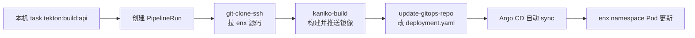

## 这篇文档讲什么

Homelab 里跑 enx-api 时，从本机一条 Taskfile 命令到 Pod 滚动更新，中间经过 Tekton 构建镜像、Nexus 存镜像、GitOps 改 manifest、Argo CD 同步集群。本文按实际配置把这条链路拆开说明。

Tekton、Kaniko、Argo CD 各自的概念见 [Tekton 与 Kaniko](./tekton-kaniko.md) 和 [Argo CD 与 GitOps 持续部署](./argocd.md)；这里只写 enx-api 这条线的落地细节。

## 涉及的两个仓库

| 仓库 | 作用 |
| ---- | ---- |
| `enx` | 应用源码、`enx-api/Containerfile`、根目录 Taskfile |
| `w10n-config`（**私有仓库**） | K8s manifest、Tekton Pipeline/PipelineRun、Argo CD Application |

CI 在集群里 clone 的是 GitHub 上的 `enx`，不是本机工作区；CD 改的是 GitHub 上的 **`w10n-config`（私有仓库，不对外公开）**，再由 Argo CD 拉到集群。文中出现的 manifest、Pipeline 路径均指该仓库内的 `infra/homelab/k8s/` 目录。

## 整体流程



一次完整发布可以概括成四步：

1. 开发者把代码 push 到 GitHub（Tekton 只认远程仓库）。
2. 本机执行 `task tekton:build:api`（或 w10n-config 里的 `task tekton-build-enx-api`）——Taskfile 在背后跑 `kubectl create -f pipelinerun-enx-api.yaml`，在集群里创建一个 PipelineRun；Tekton 控制器随后调度 Pipeline 执行。
3. Pipeline 末尾把 `w10n-config` 里 Deployment 的镜像 tag 改成本次 commit SHA 并 push。
4. Argo CD 发现 Git 变更，把 `enx` namespace 里的 Deployment 同步到新镜像。

第 2 步是**人工触发**：push 不会自动开构建。enx-api 发布频率不高，目前没接 GitHub Webhook；以后若要 push 即构建，可以用 [Tekton Triggers](./tekton-kaniko.md)（EventListener + TriggerBinding）在 `enx` 仓库收到 push 时自动 `kubectl create` 等价的 PipelineRun。

## 本机怎么触发

### 在 enx 仓库

根目录 Taskfile 定义了 `tekton:build:api`：

```yaml
tekton:build:api:
  desc: "Trigger enx-api Tekton build and GitOps deploy via ArgoCD"
  cmds:
    - kubectl create -f ../w10n-config/infra/homelab/k8s/tekton/pipelinerun-enx-api.yaml
```

前提：`enx` 与 `w10n-config` 在同一父目录（例如 `~/workspace/projects/` 下并列），且本机 `kubectl` 已指向 homelab 集群。

```bash
cd enx
git push   # 先 push，再触发
task tekton:build:api
```

### 在 w10n-config 仓库

`infra/homelab/Taskfile.yml` 里也有等价任务 `tekton-build-enx-api`，直接引用同一份 PipelineRun YAML。

### 和本地编译的区别

| 命令 | 做什么 | 是否部署 |
| ---- | ------ | -------- |
| `task build:api` | 在 `enx-api/` 里 `go build` 出二进制 | 否 |
| `task tekton:build:api` | 在集群里构建容器镜像并走 GitOps 部署 | 是 |

`task tekton:build:api` 只执行 `kubectl create`，**不会等待** Pipeline 跑完。要看进度需要另开终端查日志（下文「查看构建进度」）。

### 为什么是手动触发

当前 homelab 里 enx-api 部署不频繁，刻意保持「push 代码 → 人工决定是否构建」两步分离：Taskfile 负责创建 PipelineRun，没有 GitHub Webhook / Tekton EventListener。集群侧 Pipeline、Task、Argo CD Application 已就绪，后续若要自动化，只需补 Triggers 层，不必改现有 Pipeline 定义。

## PipelineRun 里配置了什么

文件：`w10n-config/infra/homelab/k8s/tekton/pipelinerun-enx-api.yaml`

要点：

- `generateName: build-enx-api-`：每次 create 生成新名字，如 `build-enx-api-7mpb4`。
- `git-revision: email-registration`：构建 checkout 的 **revision**（手动触发时写死在 YAML 里）。`git-clone-ssh` 的 `revision` 参数支持**分支名、tag 名或 commit SHA**，不限于分支；例如写 `v1.2.0` 或完整 SHA 同样可以。
- 若以后接 GitHub Webhook / Tekton Triggers（例如 push tag 时构建），`git-revision` 应由 TriggerBinding 从事件里取（如 `refs/tags/v1.2.0` → `v1.2.0`），**不必**在静态 `pipelinerun-enx-api.yaml` 里写死分支；那份 YAML 可只作 Pipeline 模板，或改由 TriggerTemplate 动态生成 PipelineRun。
- `image-name: docker-hosted.wiloon.com/enx-api`：镜像名；tag 由 clone 得到的 commit SHA 决定，不是 `latest`。
- `workspaces`：源码与 GitOps 各一块 Longhorn PVC；SSH 用 Secret `git-ssh-key`；推私有仓库用 `nexus-docker-cred`。
- `nodeSelector: k8s-71`：构建 Pod 固定在 k8s-71（与 Nexus 同节点，拉镜像路径短）。
- `serviceAccountName: tekton-bot`：Tekton 在集群内执行所需的 RBAC 身份。

## Pipeline 三个 Task

Pipeline 定义在 `pipeline-build-enx-api.yaml`，按顺序执行：

### 1. fetch-source（git-clone-ssh）

- 从 `git@github.com:wiloon/enx.git` clone 到 workspace。
- checkout `git-revision` 参数指定的 revision（分支、tag 或 commit SHA）。
- 输出 `results.commit`（完整 commit SHA），供后续步骤当镜像 tag。

### 2. build-image（kaniko-build）

- 读取 `enx-api/Containerfile`，context 为 clone 下来的 `./repo`。
- 构建目标：`docker-hosted.wiloon.com/enx-api:<commit-sha>`。
- Kaniko 把镜像推到 Nexus hosted 仓库（`docker-hosted.wiloon.com`）。

Kaniko Task（`task-kaniko-build-auth.yaml`）默认带上：

```yaml
- --insecure
- --skip-tls-verify
- --registry-mirror=docker-registry.wiloon.com
```

含义：

- **推产物**：`docker-hosted.wiloon.com`（hosted，存 enx-api 镜像）。
- **拉基座**（`FROM golang`、`FROM alpine` 等）：经 `docker-registry.wiloon.com` 走 Nexus 对 Docker Hub 的代理，而不是 Kaniko 直连 `index.docker.io`。

节点 containerd 拉 Pod 镜像时也配置了 `docker.io → Nexus`，但 Kaniko 构建阶段用的是自己的 registry 客户端，必须单独配 `--registry-mirror` 才会走 Nexus。

### 3. update-gitops（update-gitops-repo）

- clone `git@github.com:wiloon/w10n-config.git`，checkout `main`。
- 用 `sed` 更新 `infra/homelab/k8s/enx/deployment.yaml` 里 `enx-api` 那一行的 `image:`。
- commit 并 push，提交信息类似 `Update image to docker-hosted.wiloon.com/enx-api:<sha>`。

镜像 tag 与 Git  commit 一致，便于从 Deployment 反查对应源码版本。

## Argo CD 如何完成部署

Application 定义在 `w10n-config/infra/homelab/k8s/argocd/application-enx.yaml`：

- **source**：`w10n-config` 的 `infra/homelab/k8s/enx` 路径，`targetRevision: main`。
- **destination**：集群内 `enx` namespace。
- **syncPolicy.automated**：开启自动同步与 selfHeal；Git 里 manifest 一变，Argo CD 就会 apply。

Deployment（节选）：

```yaml
spec:
  template:
    spec:
      imagePullSecrets:
      - name: nexus-docker-cred
      containers:
      - name: enx-api
        image: docker-hosted.wiloon.com/enx-api:<commit-sha>
        imagePullPolicy: Always
```

`update-gitops` 只改 `image:` 字段；PVC、Ingress、环境变量等仍由 Git 里其它 YAML 管理。Argo CD sync 后，kubelet 从 Nexus 拉新 tag 的镜像，按 Deployment 策略替换 Pod（enx-api 使用 `Recreate` 策略）。

对外访问：`https://enx-lab.wiloon.com`（Kong Ingress）。

## 查看构建进度

在 `w10n-config/infra/homelab` 下：

```bash
task tekton-logs          # 跟随最新 PipelineRun
task tekton-list          # 列出历史 PipelineRun
```

或直接：

```bash
kubectl get pipelinerun -n tekton-pipelines -l tekton.dev/pipeline=build-enx-api --sort-by=.metadata.creationTimestamp
kubectl logs -n tekton-pipelines -l tekton.dev/pipelineRun=build-enx-api-xxxxx -f
```

集群里若部署了 Tekton Dashboard，也可通过 `tekton.wiloon.com` 看各 Step 日志。

## 部署结果怎么验证

```bash
# Argo CD 应用状态
kubectl get application enx -n argocd

# 工作负载
kubectl get pods -n enx -l app=enx-api

# 接口
curl https://enx-lab.wiloon.com/ping
curl https://enx-lab.wiloon.com/version
```

`/version` 返回里若含 Git commit 字段，可与 Pipeline 使用的 SHA 对照。

## 常见问题

### 本地改了代码，触发构建后集群没变化

Tekton 只 clone GitHub。未 commit / 未 push 的改动不会进镜像。先 `git push`，再 `task tekton:build:api`。

### 构建卡在 build-image 很久

`golang` 基座镜像体积大；首次经 Nexus 代理拉取仍可能较慢，后续会命中 Nexus 缓存。确认 Kaniko 日志里出现 `from registry mirror docker-registry.wiloon.com` 而不是长时间停在 `index.docker.io`。

### 想构建 main、某个 tag 或其他 revision

手动触发时：改 `pipelinerun-enx-api.yaml` 的 `git-revision`（分支名、`v1.0.0` 这类 tag、或 commit SHA 均可），或 create PipelineRun 时用 `--dry-run=client -o yaml` 生成临时 manifest 再 apply。接 Webhook 后：由 Trigger 按事件传入 revision，一般不再维护静态 YAML 里的固定分支名。

### Taskfile 路径报错

`enx` 的 task 依赖 `../w10n-config/...`；两个仓库需并列放置，或改为本机绝对路径 / 环境变量。

## 相关文件索引

| 文件 | 说明 |
| ---- | ---- |
| `enx/Taskfile.yml` | `tekton:build:api` 入口 |
| `w10n-config/infra/homelab/Taskfile.yml` | `tekton-build-enx-api`、`tekton-logs` |
| `w10n-config/infra/homelab/k8s/tekton/pipelinerun-enx-api.yaml` | 触发参数与 workspace |
| `w10n-config/infra/homelab/k8s/tekton/pipeline-build-enx-api.yaml` | 三阶段 Pipeline |
| `w10n-config/infra/homelab/k8s/tekton/task-kaniko-build-auth.yaml` | Kaniko 构建与 Nexus mirror |
| `w10n-config/infra/homelab/k8s/tekton/task-update-gitops.yaml` | 改 GitOps 仓库镜像 tag |
| `w10n-config/infra/homelab/k8s/argocd/application-enx.yaml` | Argo CD Application |
| `w10n-config/infra/homelab/k8s/enx/deployment.yaml` | enx-api Deployment |
| `enx/enx-api/Containerfile` | 多阶段构建定义 |

## 小结

enx-api 在 homelab 的发布路径是 **Taskfile → PipelineRun → Tekton（clone / Kaniko / 改 Git）→ Argo CD → K8s**，而不是本机 `docker build` 或 `kubectl set image`。习惯这条链之后，改代码、push、触发 task、看 Tekton 日志、用 curl 验证，就是日常发布节奏。
