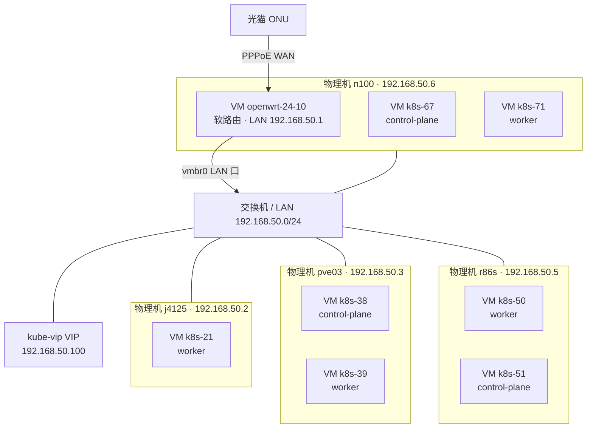

## 背景

homelab 里硬件、PVE 宿主机、K8s 节点、网络分散记录在多篇文章里：[Hardware](../Hardware/hardware.md) 记了全部硬件清单，[PVE](./proxmox-ve-pve.md)、[Proxmox VE 存储](./pve-storage.md)、[pve + openwrt](./pve-openwrt.md) 记了 PVE 与软路由操作，[k8s](./k8s.md) 记了 K8s 概念。但没有一篇把"哪台物理机 → 哪个 PVE 宿主机 → 跑了哪些 K8s 节点 → 怎么连网"串起来。

本文只画这条链路，PVE 宿主机上除 K8s 节点外的其它虚拟机（win11-ltsc、xray 客户端、netbird-router 等）不展开。数据来源于 `w10n-config` 仓库的 `infra/homelab/opentofu/pve/main.tf`（OpenTofu，宿主机与 VM 的权威定义）和 `infra/homelab/inventory/homelab-vms.ini`（IP 与节点角色）。

## 一张图：物理机 → PVE → K8s 节点 → 网络

要点：

- 4 台 PVE 宿主机（j4125、pve03、r86s、n100）**各自独立**，不组 Proxmox 集群，管理端口各自的 `https://<ip>:8006`。
- 软路由本身是 **n100 上的一台 VM**（`openwrt-24-10`），不是独立硬件；n100 用 `vmbr1` 接光猫 WAN、`vmbr0` 接 LAN，其余三台 PVE 宿主机和局域网设备都挂在 `vmbr0` 这条 LAN 上。细节见 [pve + openwrt](./pve-openwrt.md)。
- K8s 的对外入口是 **kube-vip** 维护的 VIP `192.168.50.100`，飘在某台 control-plane 节点上，Kong Ingress 走这个 VIP 的 443；VIP 与 22 端口共存的机制见 [kube-vip LoadBalancer 与节点 SSH 的 22 端口之争](./kube-vip-loadbalancer-port-22.md)。
- 局域网里另有一台 VM（`xray-client-bwg`，`192.168.50.61`）承担 K8s 节点的代理出网网关，与本文的物理/虚拟拓扑是两条独立的关注点，这里不展开。

## PVE 宿主机 ↔ K8s 节点对照表

| PVE 宿主机 | 管理 IP | K8s 节点（VM） | 角色 | 节点 IP |
| ---------- | ------- | -------------- | ---- | ------- |
| j4125 | 192.168.50.2 | k8s-21 | worker | 192.168.50.21 |
| pve03 | 192.168.50.3 | k8s-38 | control-plane | 192.168.50.38 |
| pve03 | 192.168.50.3 | k8s-39 | worker | 192.168.50.39 |
| r86s | 192.168.50.5 | k8s-50 | worker | 192.168.50.50 |
| r86s | 192.168.50.5 | k8s-51 | control-plane | 192.168.50.51 |
| n100 | 192.168.50.6 | k8s-67 | control-plane | 192.168.50.67 |
| n100 | 192.168.50.6 | k8s-71 | worker | 192.168.50.71 |

7 个节点：3 control-plane（k8s-38 / k8s-51 / k8s-67）+ 4 worker（k8s-21 / k8s-39 / k8s-50 / k8s-71），K8s 概念性内容见站内 [k8s](./k8s.md)。

r86s、n100 与 [Hardware](../Hardware/hardware.md) 里的 **ROCK 5B（R86S 型号）**、**畅网微控 n100** 是同一批硬件；pve03、j4125 这两台宿主机目前 Hardware 一文里还没有单独条目，是待补的空档。

## 与已有文章的关系

| 主题 | 看哪篇 |
| ---- | ------ |
| 全量硬件清单（含非 PVE 设备） | [Hardware](../Hardware/hardware.md) |
| PVE 安装、日常命令、备份恢复 | [PVE](./proxmox-ve-pve.md) |
| PVE 存储分层（VG/瘦池/local-lvm） | [Proxmox VE 存储](./pve-storage.md) |
| 软路由 VM 怎么搭（vmbr0/vmbr1） | [pve + openwrt](./pve-openwrt.md) |
| PVE 虚拟机内存/磁盘热扩容 | [pve-vm-memory-hotplug](./pve-vm-memory-hotplug.md) |
| K8s 概念（Pod/Service/DaemonSet 等） | [k8s](./k8s.md) |
| kube-vip VIP 与端口复用机制 | [kube-vip-loadbalancer-port-22](./kube-vip-loadbalancer-port-22.md) |
| 一次真实的节点负载排查 | [Homelab K8s Node Rebalance](./homelab-k8s-node-rebalance/index.md) |
| 2021 年旧网络拓扑（单机软路由，已被本文取代） | [network topology](../network/network-topology.md) |

## 维护记录

| 时间 | 修改内容 | 原因 |
| ---- | -------- | ---- |
| 2026-07-23 | 新建本文，梳理硬件/PVE 宿主机/K8s 节点/网络关系图 | 现有文档各记一段，缺一篇串联全局的总览 |
