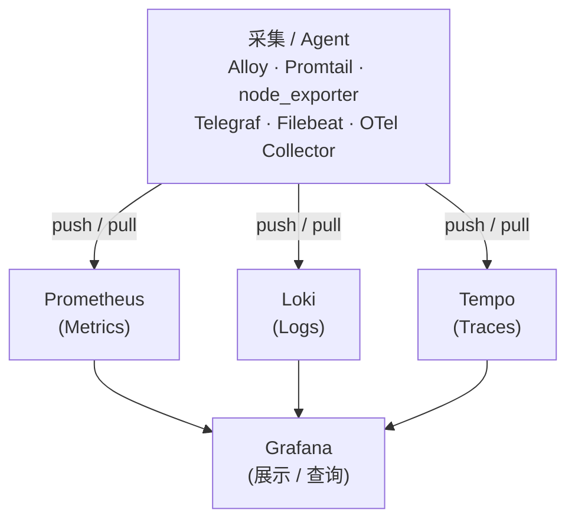
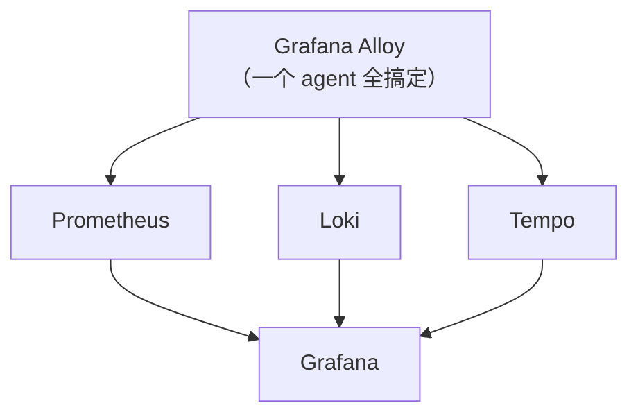
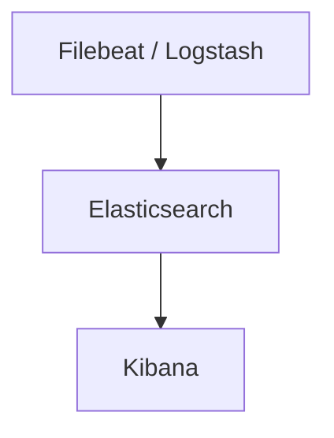

可观测性（Observability）通常分三个信号：**Metrics（指标）**、**Logs（日志）**、**Traces（链路追踪）**。每个信号都有对应的采集工具和存储后端，本文整理常见工具并说明相互关系。

## 技术栈全景

## 采集工具对比

### Metrics 采集

| 工具              | 归属              | 定位                                | 日志能力                              | Traces 能力 |
| ----------------- | ----------------- | ----------------------------------- | ------------------------------------- | ----------- |
| **node_exporter** | Prometheus / CNCF | Linux 主机 metrics 暴露             | ✗                                     | ✗           |
| **Telegraf**      | InfluxData        | 通用 metrics 采集（300+ 插件）      | 弱（有 tail/syslog 插件，非主要定位） | ✗           |
| **Grafana Alloy** | Grafana Labs      | 统一采集（metrics + logs + traces） | ✅                                     | ✅           |

- **node_exporter**：轻量，只暴露 `/metrics` 端点供 Prometheus scrape，不主动推送。几乎每个 Linux 节点标配。
- **Telegraf**：InfluxDB 生态的核心 agent，插件丰富，适合往 InfluxDB / Prometheus 写数据。如果需要完整日志采集需另加工具（如 Filebeat）。
- **Alloy**：Grafana 2024 年推出的统一 agent，一个进程替代 node_exporter + Promtail + OTel Collector，是 Grafana Agent 的继任者。

### Logs 采集

| 工具                     | 归属         | 定位                        | 写入目标                      | 维护状态                   |
| ------------------------ | ------------ | --------------------------- | ----------------------------- | -------------------------- |
| **Promtail**             | Grafana Labs | 专用日志 agent（Loki 配套） | Loki only                     | **维护模式**（停止新功能） |
| **Filebeat**             | Elastic      | 日志采集（ELK 配套）        | Elasticsearch / Logstash      | 主动开发                   |
| **Fluentd / Fluent Bit** | CNCF         | 通用日志管道                | Elasticsearch、Loki、Kafka 等 | 主动开发                   |
| **Grafana Alloy**        | Grafana Labs | 统一采集                    | Loki / Prometheus / Tempo     | 主动开发                   |

- **Promtail**：已进入维护模式，官方建议迁移到 [Alloy](./grafana-alloy.md)。详见 [Promtail 介绍](./promtail.md)。
- **Filebeat**：Elastic 全家桶（ELK）的配套工具，不属于 Grafana 技术栈。
- **Fluent Bit**：比 Fluentd 更轻量，K8s 中常用于节点级日志采集，输出目标灵活（可写 Loki 或 Elasticsearch）。
- **Alloy**：同时支持 logs，是 Grafana 技术栈里的推荐选项。

### Traces 采集

| 工具                        | 归属         | 定位                                          |
| --------------------------- | ------------ | --------------------------------------------- |
| **OpenTelemetry Collector** | CNCF         | 标准链路追踪采集，支持 OTLP / Jaeger / Zipkin |
| **Grafana Alloy**           | Grafana Labs | 内置 OTel receiver，可替代 OTel Collector     |
| **Jaeger Agent**            | CNCF         | Jaeger 专用采集，逐步被 OTel 替代             |

## 存储后端对比

| 工具                | 信号类型               | 归属            | 查询语言        | 典型搭配                       |
| ------------------- | ---------------------- | --------------- | --------------- | ------------------------------ |
| **Prometheus**      | Metrics                | CNCF            | PromQL          | Grafana + Alloy/node_exporter  |
| **Loki**            | Logs                   | Grafana Labs    | LogQL           | Grafana + Alloy/Promtail       |
| **Tempo**           | Traces                 | Grafana Labs    | TraceQL         | Grafana + Alloy/OTel Collector |
| **InfluxDB**        | Metrics（时序）        | InfluxData      | Flux / InfluxQL | Grafana + Telegraf             |
| **Elasticsearch**   | Logs（也可做 metrics） | Elastic         | Lucene / EQL    | Kibana + Filebeat              |
| **VictoriaMetrics** | Metrics                | VictoriaMetrics | PromQL 兼容     | 可替换 Prometheus，更省内存    |

## 展示工具

| 工具            | 特点                                                                              |
| --------------- | --------------------------------------------------------------------------------- |
| **Grafana**     | 支持所有主流数据源（Prometheus、Loki、Tempo、InfluxDB、Elasticsearch 等），最通用 |
| **Kibana**      | Elastic 专用，深度集成 Elasticsearch，日志搜索体验强                              |
| **InfluxDB UI** | InfluxDB 内置，适合 InfluxDB 用户                                                 |

## 两大技术栈总结

### Grafana 技术栈（推荐用于 self-hosted / homelab）

### Elastic 技术栈（ELK）

## 选型建议

- **homelab / 个人项目**：Grafana 全家桶（Prometheus + Loki + Grafana + Alloy），资源占用合理，开箱即用。
- **已有 InfluxDB**：继续用 Telegraf，不必迁移；如果想要日志需额外引入 Fluent Bit → Loki。
- **企业 K8s 日志**：Fluent Bit（DaemonSet）→ Loki 或 Elasticsearch，视现有技术栈决定。
- **新项目要全套可观测性**：OpenTelemetry（采集 SDK）+ OTel Collector / Alloy → Prometheus + Loki + Tempo + Grafana。
