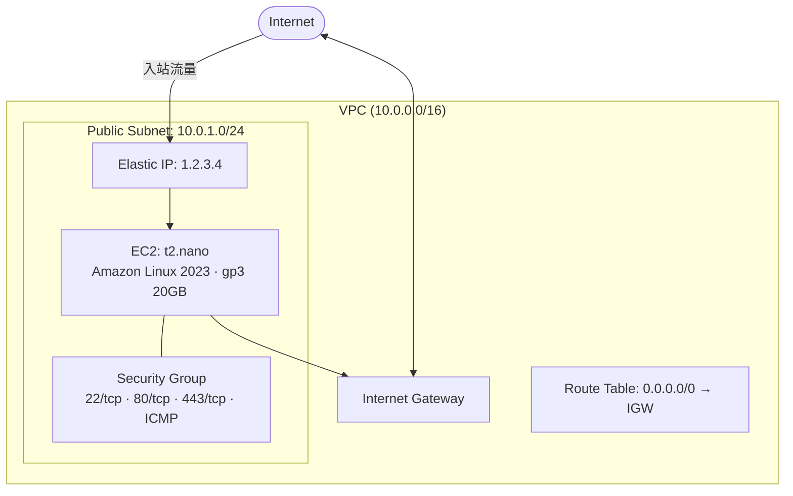

## 什么是 OpenTofu

OpenTofu 是 Terraform 的开源分支，用于以**声明式**的方式管理云基础设施（IaC，Infrastructure as Code）。

与 AWS CLI 的区别：

| | OpenTofu | AWS CLI |
| --- | --- | --- |
| 方式 | 声明式（描述终态） | 命令式（执行具体操作） |
| 状态管理 | 有 state 文件，追踪资源状态 | 无状态 |
| 典型场景 | 创建/销毁一整套基础设施 | 查询、临时操作 |

OpenTofu 和 AWS CLI 都直接调用 AWS API，不存在封装关系。

## 核心概念

### Provider

Provider 是 OpenTofu 操作各家云服务的插件，`tofu init` 时自动下载。

```hcl
required_providers {
  aws = {
    source  = "hashicorp/aws"
    version = "~> 5.0"
  }
}
```

### Resource vs Data Source

- `resource` — 创建资源（EC2、VPC、安全组等）
- `data` — 查询已有信息，不创建资源

```hcl
# 查询最新的 Amazon Linux 2023 AMI（不创建资源）
data "aws_ami" "al2023" {
  most_recent = true
  owners      = ["137112412989"]
  filter {
    name   = "name"
    values = ["al2023-ami-2023.*-x86_64"]
  }
}

# 创建 EC2 实例（使用上面查到的 AMI ID）
resource "aws_instance" "server" {
  ami           = data.aws_ami.al2023.id
  instance_type = "t2.nano"
}
```

### Variables

变量分两个文件：

- `variables.tf` — 声明变量（提交 git）
- `terraform.tfvars` — 存放实际值，如密钥（加入 `.gitignore`）

```hcl
# variables.tf
variable "ssh_public_key" {
  type = string
}

# terraform.tfvars
ssh_public_key = "ssh-ed25519 AAAA..."
```

### Backend

State 文件存放位置，推荐存到 S3 而非本地，多台机器可共用且不怕丢失。

```hcl
backend "s3" {
  bucket = "my-tofu-state"
  key    = "aws/ec2/terraform.tfstate"
  region = "ap-southeast-1"
}
```

## 目录结构

```
ec2-tokyo/
├── providers.tf      # provider 声明、backend、region
├── variables.tf      # 变量声明
├── terraform.tfvars  # 变量实际值（不提交 git）
├── main.tf           # 资源定义
└── outputs.tf        # apply 完成后输出的信息
```

## 在东京创建 EC2

### 架构



### 网络资源

VPC 由以下资源组成：

```hcl
# VPC
resource "aws_vpc" "main" {
  cidr_block = "10.0.0.0/16"
}

# 公有子网
resource "aws_subnet" "public" {
  vpc_id            = aws_vpc.main.id
  cidr_block        = "10.0.1.0/24"
  availability_zone = "ap-northeast-1a"
}

# Internet Gateway：VPC 的网络出口，没有它流量出不去
resource "aws_internet_gateway" "igw" {
  vpc_id = aws_vpc.main.id
}

# 路由表：告诉子网内流量如何转发
resource "aws_route_table" "public" {
  vpc_id = aws_vpc.main.id
  route {
    cidr_block = "0.0.0.0/0"
    gateway_id = aws_internet_gateway.igw.id
  }
}

# 路由表关联到子网
resource "aws_route_table_association" "public" {
  subnet_id      = aws_subnet.public.id
  route_table_id = aws_route_table.public.id
}
```

### 安全组

安全组相当于防火墙规则，`vpc_id` 必须指定，否则会尝试使用默认 VPC：

```hcl
resource "aws_security_group" "server" {
  vpc_id = aws_vpc.main.id

  ingress { from_port = 22;  to_port = 22;  protocol = "tcp";  cidr_blocks = ["0.0.0.0/0"] }
  ingress { from_port = 80;  to_port = 80;  protocol = "tcp";  cidr_blocks = ["0.0.0.0/0"] }
  ingress { from_port = 443; to_port = 443; protocol = "tcp";  cidr_blocks = ["0.0.0.0/0"] }
  ingress { from_port = -1;  to_port = -1;  protocol = "icmp"; cidr_blocks = ["0.0.0.0/0"] }  # ping
  egress  { from_port = 0;   to_port = 0;   protocol = "-1";   cidr_blocks = ["0.0.0.0/0"] }
}
```

ICMP 的 `from_port = -1` 和 `to_port = -1` 表示允许所有 ICMP 类型。

### Elastic IP

EC2 默认公网 IP 重启后会变，Elastic IP 是固定的静态公网 IP：

```hcl
resource "aws_eip" "server" {
  instance = aws_instance.server.id
  domain   = "vpc"
}
```

费用说明：EIP 绑定在**运行中**的实例上免费，实例停止或 EIP 未绑定时收费（约 $0.005/小时）。

## AMI

AMI（Amazon Machine Image）是虚拟机镜像，相当于装系统的 ISO。

用 `data "aws_ami"` 动态查询最新镜像，避免硬编码 AMI ID（AMI ID 各区域不同，且会更新）：

```hcl
data "aws_ami" "al2023" {
  most_recent = true
  owners      = ["137112412989"]  # Amazon 官方
  filter {
    name   = "name"
    values = ["al2023-ami-2023.*-x86_64"]
  }
}
```

Amazon Linux 2023 vs Ubuntu：

| | Amazon Linux 2023 | Ubuntu 24.04 |
| --- | --- | --- |
| 包管理器 | dnf | apt |
| 登录用户 | ec2-user | ubuntu |
| 特点 | AWS 优化，启动快 | 生态更广 |

## 常用命令

```bash
# 初始化（首次或更换 provider 后）
tofu init

# 预览变更（不实际执行）
tofu plan

# 应用变更
tofu apply

# 销毁所有资源
tofu destroy

# 查看当前 state
tofu show

# 查看输出值
tofu output
```

## 踩坑记录

### 区域没有默认 VPC

**错误**：`No default VPC for this user`

**原因**：安全组没有指定 `vpc_id`，OpenTofu 尝试使用默认 VPC，但该区域没有默认 VPC。

**解决**：创建自己的 VPC，在安全组里指定 `vpc_id = aws_vpc.main.id`。

### IAM 权限不足

**错误**：`You are not authorized to perform: ec2:DescribeImages`

**原因**：`tofu-deploy` IAM 用户缺少 EC2 相关权限。

**解决**：在 AWS 控制台给该用户附加 `AmazonEC2FullAccess` 策略。
