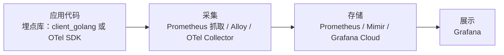

给 Go 服务加指标（比如「查一次词花了多少毫秒」），代码里要选一个埋点库。常见的两个选择是 Prometheus 官方的 `client_golang` 和 OpenTelemetry 的 Go SDK。两者都能产出同样的 Prometheus 指标，差别在覆盖范围、配置量和对后端的绑定程度。

采集、存储、展示这一层（Alloy、Prometheus、Loki、Grafana）的对比见 [可观测性工具对比](./observability-tools.md)。本文只讲应用代码里的埋点这一层。

## 埋点库在哪一层



埋点库决定两件事：代码里怎么记录一个数字，以及这个数字以什么格式交出去（Prometheus 的 `/metrics` 文本格式，或者 OTLP 协议）。它不决定数据最后存在哪。

## Prometheus client_golang

`github.com/prometheus/client_golang` 是 Prometheus 项目的官方 Go 客户端，只做指标。

工作方式是拉（pull）：应用在内存里维护计数器和直方图，通过 HTTP 暴露一个 `/metrics` 端点，Prometheus（或 Alloy）定期来抓。应用不知道谁来读，也不主动往外发。

四种指标类型：

| 类型 | 用途 | 例子 |
| ---- | ---- | ---- |
| Counter | 只增不减的计数 | 请求总数、错误总数 |
| Gauge | 可增可减的当前值 | 正在处理的请求数、队列长度 |
| Histogram | 按桶统计分布，服务端可算分位数 | 请求耗时，用来算 p95/p99 |
| Summary | 客户端直接算分位数 | 很少用；分位数无法跨实例聚合，一般用 Histogram |

最小示例：

```go
package metrics

import (
	"net/http"
	"time"

	"github.com/prometheus/client_golang/prometheus"
	"github.com/prometheus/client_golang/prometheus/promhttp"
)

// Lookup latency, labelled by where the answer came from.
var lookupDuration = prometheus.NewHistogramVec(prometheus.HistogramOpts{
	Name:    "enx_dictionary_lookup_duration_seconds",
	Help:    "Time to resolve a word lookup.",
	Buckets: []float64{.005, .01, .025, .05, .1, .25, .5, 1, 2.5},
}, []string{"source"})

func init() {
	prometheus.MustRegister(lookupDuration)
}

func ObserveLookup(source string, start time.Time) {
	lookupDuration.WithLabelValues(source).Observe(time.Since(start).Seconds())
}

// Serve /metrics on its own port so it is never exposed through the public proxy.
func Serve(addr string) error {
	mux := http.NewServeMux()
	mux.Handle("/metrics", promhttp.Handler())
	return http.ListenAndServe(addr, mux)
}
```

默认注册表还会自带 Go 运行时和进程指标（GC、goroutine 数、内存、文件描述符），不用自己写。

特点：

- 依赖少，API 小，文档和例子多，上手快。
- 只管指标，不管链路追踪（traces）和日志。
- 指标名、标签格式直接就是 Prometheus 的，不需要转换。

## OpenTelemetry

OpenTelemetry（OTel）是 CNCF 的可观测性标准，由 OpenTracing 和 OpenCensus 在 2019 年合并而来。它定义了三类信号：traces、metrics、logs，以及统一的传输协议 OTLP。

它分成几部分：

| 部分 | 作用 |
| ---- | ---- |
| API | 代码里调用的接口（`otel.Meter`、`otel.Tracer`），不含实现 |
| SDK | API 的实现：聚合、采样、批量发送 |
| Exporter | 把数据交给后端：OTLP、Prometheus 等 |
| Collector | 独立进程，接收、处理、转发遥测数据；Grafana Alloy 内置了兼容的接收器 |

OTel 本身不存数据，也不提供看图界面，它只负责埋点和传输，后端可以是 Prometheus、Grafana Cloud、Jaeger、Tempo 或各家商业 APM。

同样的直方图用 OTel 写，通过 Prometheus exporter 暴露成 `/metrics`：

```go
package metrics

import (
	"context"
	"net/http"
	"time"

	"github.com/prometheus/client_golang/prometheus/promhttp"
	"go.opentelemetry.io/otel"
	"go.opentelemetry.io/otel/attribute"
	otelprom "go.opentelemetry.io/otel/exporters/prometheus"
	"go.opentelemetry.io/otel/metric"
	sdkmetric "go.opentelemetry.io/otel/sdk/metric"
)

var lookupDuration metric.Float64Histogram

func Init() error {
	// The Prometheus exporter registers with client_golang's default registry.
	exporter, err := otelprom.New()
	if err != nil {
		return err
	}
	otel.SetMeterProvider(sdkmetric.NewMeterProvider(sdkmetric.WithReader(exporter)))

	// Exported as enx_dictionary_lookup_duration_seconds.
	lookupDuration, err = otel.Meter("enx-api").Float64Histogram(
		"enx.dictionary.lookup.duration",
		metric.WithUnit("s"),
		metric.WithExplicitBucketBoundaries(.005, .01, .025, .05, .1, .25, .5, 1, 2.5),
	)
	return err
}

func ObserveLookup(ctx context.Context, source string, start time.Time) {
	lookupDuration.Record(ctx, time.Since(start).Seconds(),
		metric.WithAttributes(attribute.String("source", source)))
}

func Serve(addr string) error {
	mux := http.NewServeMux()
	mux.Handle("/metrics", promhttp.Handler())
	return http.ListenAndServe(addr, mux)
}
```

要改成推送（push），把 Prometheus exporter 换成 OTLP exporter 即可，埋点代码不动。

特点：

- 一套 API 覆盖 traces、metrics、logs，同一个请求的三种数据可以用 trace id 关联起来。
- 厂商中立：换后端只换 exporter 或 Collector 配置。
- 概念和配置面比 client_golang 大：MeterProvider、Reader、Exporter、Resource、View 都要了解。
- 有了 traces 才能看到一个请求在多个服务之间各花了多少时间，这是它相对 client_golang 最大的额外价值。

## 对比

| | client_golang | OpenTelemetry Go SDK |
| --- | --- | --- |
| 信号 | 只有 metrics | traces、metrics、logs |
| 输出方式 | `/metrics` 拉取 | OTLP 推送，也可用 Prometheus exporter 暴露 `/metrics` |
| 指标命名 | Prometheus 风格（`a_b_seconds`） | OTel 语义约定（`a.b.duration` + unit），导出到 Prometheus 时自动转换 |
| 额外标签 | 只有自己定义的标签 | Prometheus exporter 默认给每条指标加 `otel_scope_name`、`otel_scope_version` 等标签 |
| 依赖与配置 | 少，几行即可 | 多，需要组装 provider、reader、exporter |
| 后端绑定 | Prometheus 生态（Prometheus、Mimir、Grafana Cloud、VictoriaMetrics 都能收） | 不绑定 |
| 适合 | 单个或少量服务，只需要指标 | 多服务调用链，需要 tracing，或要求厂商中立 |

两者不是单向门：

- OTel 的 Prometheus exporter 本身就注册在 client_golang 的注册表上，两套埋点可以在同一个进程里并存。
- Prometheus 3.0 起可以直接接收 OTLP 推送的指标。
- Alloy 和 OTel Collector 都能在两种格式之间转换。

所以先用 client_golang，以后需要 tracing 时再引入 OTel，不需要推翻已有指标。

## 怎么选

- 一个 Go 服务、没有跨服务调用、只想看耗时和错误率：用 client_golang。
- 已经是多个服务、排查问题需要看一个请求在哪一跳慢了：用 OTel，metrics 和 traces 一起上。
- 公司要求不能绑定具体后端，或者已经在用某家 APM：用 OTel。

ENX 的 enx-api 目前是单个 Go 服务，没有跨服务调用，所以选了 client_golang。指标由 Alloy 抓取后推到 Grafana Cloud，见 [Grafana Alloy](./grafana-alloy.md)。

## 参考

- <https://github.com/prometheus/client_golang>
- <https://prometheus.io/docs/concepts/metric_types/>
- <https://opentelemetry.io/docs/languages/go/>
- <https://opentelemetry.io/docs/specs/otel/compatibility/prometheus_and_openmetrics/>
