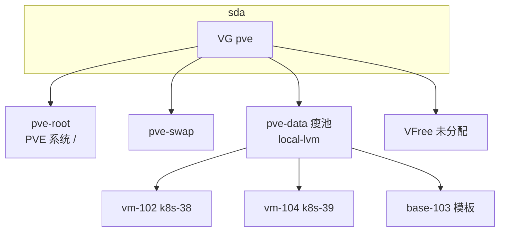

## 背景

在 homelab 里用 Proxmox VE（PVE）跑 Kubernetes 节点时，经常会同时遇到两类「空间不够」：

- PVE 宿主机上 `local-lvm` 余量、`pvesm status` 里的 Available；
- 虚拟机里 `df -h /` 根分区余量。

二者相关，但不是一回事。本文用一台实际节点 pve03（192.168.50.3）在 2026-06 的布局说明 VG、瘦池（LVM thin）、存储 ID `local-lvm`，并顺带说明 OpenTofu 里磁盘容量与现网不一致时该怎么对齐。

更偏操作步骤的扩容命令见 [硬盘扩容, PVE, Archlinux](../cs/disk-resize.md)；PVE 安装与日常命令见 [PVE](./proxmox-ve-pve.md)。IaC 侧约定在仓库 `w10n-config` 的 `homelab/opentofu/pve/`（不在本站展开）。

---

## pve03 上的分层（2026-06 快照）

物理上只有一块主盘 `sda`（约 111.8 GiB）。安装 PVE 后，典型结构如下。

```text
sda (~112G)
└─ sda3  LVM VG "pve"
   ├─ pve-swap          ~7G
   ├─ pve-root          ~28G   ext4，PVE 宿主机 /
   └─ pve-data          ~61G   LVM thin pool（供 local-lvm）
        ├─ vm-102-disk-0   k8s-38  虚拟盘 20G
        ├─ vm-104-disk-0   k8s-39  虚拟盘 25G
        └─ base-103-disk-0 模板盘 8G（已关机）
```

同一次查询里：

| 层级 | 含义 | pve03 约数 |
| ---- | ---- | ---------- |
| VG `pve` 的 `VFree` | 还没划给任何 LV 的卷组空间 | 13.87 GiB |
| LV `data`（瘦池）总量 | `local-lvm` 后端池子大小 | 60.66 GiB |
| `pvesm` → `local-lvm` Available | 瘦池内还可分给虚拟盘扩容的额度 | 17.45 GiB |
| `pve-root` | 宿主机系统盘，与瘦池并列 | 27.75 GiB，独立 LV |

另有 `mmcblk0` ~14.7G，未纳入上述 VG，当前布局下不能当作 `local-lvm` 直接扩 VM 用。



---

## `local` 和 `local-lvm` 是什么

PVE 里的「存储」是带名字的存储 ID，给备份、ISO、磁盘镜像用。

| 存储 ID | 类型 | 常见用途 |
| ------- | ---- | -------- |
| `local` | 目录（dir） | ISO、备份、snippet 等文件 |
| `local-lvm` | LVM-thin | 虚拟机系统盘等块设备镜像 |

新建 VM 系统盘选 `local-lvm` 时，PVE 会在瘦池里创建类似 `vm-104-disk-0` 的 thin 卷，再呈现给 Guest 为 `/dev/sda`。`pvesm status` 里 `local-lvm` 的 Total / Used / Available 描述的是瘦池整体，不是某一台 VM 的独享配额。

---

## 瘦池共用与 thin 直觉模型

`local-lvm` 底层是同一瘦池 `pve/data`。k8s-38、k8s-39 等 VM 的虚拟盘都从池子里按需拿块，彼此共用物理空间。

可以这样理解 thin provisioning：

1. 给 k8s-38 挂一块标称 20 GiB 的虚拟盘时，瘦池并不会立刻划出 20 GiB 实体块。
2. k8s-38 在 Guest 里写盘时，hypervisor 才从共用瘦池里把块映射到 `vm-102-disk-0`。
3. PVE 上该卷的 Data% 表示：这块 20 GiB 虚拟盘在池里已分配块，约占其标称上限的百分之几——不是 Guest 里 `df` 的文件占用比例。

```text
local-lvm（瘦池 ~61G，k8s-38 / k8s-39 共用）
│
├─ k8s-38：虚拟盘上限 20G（thin）
│     写入时从池里拿块 → 当时 Data% ~98%（约 19.6G 池内占用记在这块盘上）
│     Guest df 可能只显示 ~9.4G 已用（文件层 ≠ 池里已分配块）
│
└─ k8s-39：虚拟盘上限 25G（thin）
      当时 Data% ~72%；Guest 根分区仍有约 11G 空闲
```

同一 PVE 节点上挂在 `local-lvm` 的 VM 磁盘，底层都在同一个瘦池里。扩 k8s-39 的虚拟盘，占用的是瘦池的 Available；k8s-38 若继续写入，同样从池子里扣真实块。

pve03 上当时三台相关卷（查询快照）：

| VM | 虚拟盘标称 | 瘦卷 Data%（PVE 侧） | Guest `/` |
| -- | ---------- | -------------------- | --------- |
| k8s-38 (102) | 20 GiB | 约 98% | 约 9.4G / 20G 已用 |
| k8s-39 (104) | 25 GiB | 约 72% | 约 13G / 25G 已用 |

---

## Data% 和 `df` 不是同一个百分比

容易把 k8s-38 的「约 98%」理解成「9.4G 占 20G 的 98%」——不对。

| 指标 | 看谁 | k8s-38 当时含义 |
| ---- | ---- | --------------- |
| `df /` | Guest 文件系统 | 逻辑上约 9.4G / 20G 已用，仍显示约 10G 可用 |
| `lvs` 里 `vm-102-disk-0` 的 Data% | PVE / LVM thin | 这块 20G 虚拟盘在瘦池里已分配块 ≈ 98% × 20G ≈ 19.6G |

98% 不是整池只剩 2%，而是 k8s-38 这一张虚拟盘在池内的分配接近其 20G 上限。整池当时 Data% 约 71%，`pvesm` 仍显示 Available 约 17.5 GiB，k8s-39 当时仍可正常写入。

Guest 已用 9.4G 而 Data% 却很高，常见原因包括：删了大文件但 thin 块未回收（未 `fstrim` / 未 discard）、镜像层与文件系统分配粒度差异、曾经写满又删除等。因此会出现：Guest 里还有空闲，但该 VM 的 thin 卷在池里已几乎顶满。

k8s-39 是否「已经没空间」：当时否。Guest 根分区、`vm-104` 的 Data%、整池 Available 都还有余量。风险主要在 k8s-38 再猛写时可能在 PVE 层分配失败，而不是 k8s-39 的 98% 指标。

---

## 「Pod / 镜像继续涨，根盘会先吃紧」指什么

这句话指的是 Kubernetes 节点虚拟机里的根文件系统（例如 k8s-39 上的 `/dev/sda2` 挂载的 `/`），不是 Longhorn 等 CSI 挂进来的数据盘。

根分区上通常会涨占用的包括：

- 容器镜像层（`containerd`/`kubelet` 管理的 image）；
- 可写层、日志、临时文件；
- `/var/lib/kubelet` 下部分路径（视配置而定）。

在 k8s-39 上 `lsblk` 还能看到若干 100M～5G 的块设备挂到 kubelet pod 路径下，那是 PVC 对应的块盘，空间算在集群存储（如 Longhorn）里，不占用根分区配额。所以会出现：PVC 还够，但 `df /` 已经紧张——本文讨论的是前一种。

---

## Guest 里看到的空闲，是否都能写

### Guest 内（操作系统视角）

`df` 显示的是这块虚拟磁盘对 Guest 承诺的容量（例如 20G 或 25G）。只要文件系统没满，在 Guest 里创建文件一般不会因为「PVE 瘦池」而直接报错；Guest 不知道背后还有瘦池。

### PVE 瘦池（hypervisor 视角）

所有 VM 虚拟盘标称容量之和可以大于瘦池物理大小；真正写入时才从池里分配块。

因此可能出现：

- k8s-38 Guest 仍显示约 10G 可用，但该卷 Data% 已接近 100%：继续大量写入时，可能在 PVE 层分配失败，Guest 出现 I/O error、只读 remount 等，而不是 `df` 提前报 `No space left on device`。
- 把瘦池剩余空间全部分配给 k8s-39 的虚拟盘标称大小，并不等于 k8s-38 仍保有同等安全的写入余量；两者抢的是同一块瘦池里的真实块。

扩 k8s-39 前宜同时看 `pvesm status`、`lvs` 里各 `vm-*-disk-*` 的 Data%，必要时给 k8s-38 也扩虚拟盘或清理镜像。

---

## VG 的 VFree：扩瘦池、宿主机与 SSD「留空」

### VFree 是否在瘦池之外

是。`vgs` 里的 `VFree` 是卷组里尚未分配给任何逻辑卷的空间；既不属于 `pve-root`，也不属于 `pve-data` 瘦池。

```bash
# 示例：把 VG 空闲扩进瘦池（操作前需自行评估、备份）
lvextend -l +100%FREE /dev/pve/data
```

扩的是 `pve-data` 瘦池 LV，从而增大 `local-lvm` 的 Total。`pve-root` 是独立 LV，规范操作下 PVE 宿主机 `/` 的已分配 27.75G 不变。误缩小 `pve-root` 或误删 LV 才会伤害宿主机；扩 `data` 不是从系统盘已分配空间里「抠」容量。

扩池后 `pvesm` 的 Available 会上升，但 k8s-38 / k8s-39 仍共享同一瘦池，规划容量时要一起算。若以后可能给 `pve-root` 扩容，可不要一次性 `+100%FREE`，只扩一部分并留少量 VFree。

### 把 VFree 划给 local-lvm，会不会伤 SSD 性能

网上常说「SSD 要留一定比例空闲」，和「把 VFree 并进瘦池」不是同一层概念。

| 说法 | 说明 |
| ---- | ---- |
| VFree 在同一块物理 SSD 上 | pve03 的 VFree 本来就在 `sda` 的 LVM 分区内，只是尚未划给任何 LV |
| `lvextend` 做什么 | 把「LVM 未分配」改成「瘦池更大」——没有增加新盘，只是把同盘上的空间改归属 |
| 消费级「留 20% 空」 | 多指分区/文件系统/池子别长期 100% 满，以免分配与 GC 困难 |
| SSD 固件 OP | 厂商内部预留，与主机上是否留 VFree 不是一一对应 |
| 更值得盯的 | 瘦池 Available 见底、某块 thin 卷 Data% 顶满、宿主机 `pve-root` 满 |

把 VFree 扩进瘦池，通常不会因为「动了 SSD 预留」而明显伤性能；更应避免的是瘦池或单块 thin 卷长期顶满导致写失败。若担心整机 I/O，本质是单盘同时扛 PVE 系统与多台 VM，属于容量与负载规划，而非必须长期空着 VFree 才能保 SSD。

Guest 删数据后若配置 discard，有机会让瘦池回收块，与「留 VFree」是不同机制。

---

## OpenTofu 记录 18G、现网 25G：要不要先同步

要先与现网对齐，再谈继续扩容。

OpenTofu 里 `k8s_39_disk_size_gb` 表示目标虚拟盘总容量（GiB），不是增量。若 state 或变量仍是 18，而 PVE 上已是 25G，可能出现 `tofu plan` 试图把磁盘改回 18G（危险），或持续 drift。

推荐顺序（与 `homelab/opentofu/pve/README.md` 一致）：

1. 在 `terraform.tfvars` 把 `k8s_39_disk_size_gb` 改为 25（与 `qm config 104` / `pvesm list` 一致）。
2. 若资源尚未进 state：`tofu import proxmox_virtual_environment_vm.k8s_39 pve/104`。
3. `tofu plan`：磁盘相关应无变更或仅显示刻意修改的 diff。
4. 确认无问题后，再把变量调到目标值（例如 40）并 `apply`，最后在 Guest 内 `growpart` + `resize2fs`（见 [disk-resize](../cs/disk-resize.md)）。

原则：IaC 数字跟 PVE 现网一致 → import / plan 干净 → 再改大容量。

---

## 给 k8s-39 扩容时如何理解「还能扩多少」

仍用 2026-06 的 pve03 粗算（共享瘦池，需留余量）：

| 策略 | 约算 k8s-39 虚拟盘上限 |
| ---- | ---------------------- |
| 只吃瘦池 Available、不扩 VG | 25 + 17.5 ≈ 42～43 GiB |
| 再把 VG `VFree` 全部并入瘦池 | 再加约 14 GiB，标称合计约 56 GiB（与 k8s-38 共享，不宜榨干） |

务实做法：先改 IaC 到 40 GiB 左右，`apply` 后在节点上扩分区；同时盯 k8s-38 的瘦卷 Data%。

---

## 参考

- [Proxmox VE 存储 wiki](https://pve.proxmox.com/wiki/Storage)
- [LVM thin provisioning（RHEL 文档，概念通用）](https://docs.redhat.com/en/documentation/red_hat_enterprise_linux/html/logical_volume_manager_administration/thinly_provisioned_volume_creation)
- 本站：[硬盘扩容, PVE, Archlinux](../cs/disk-resize.md)、[PVE](./proxmox-ve-pve.md)
