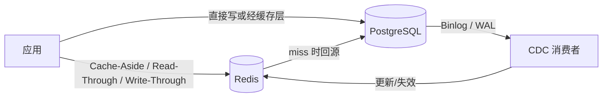
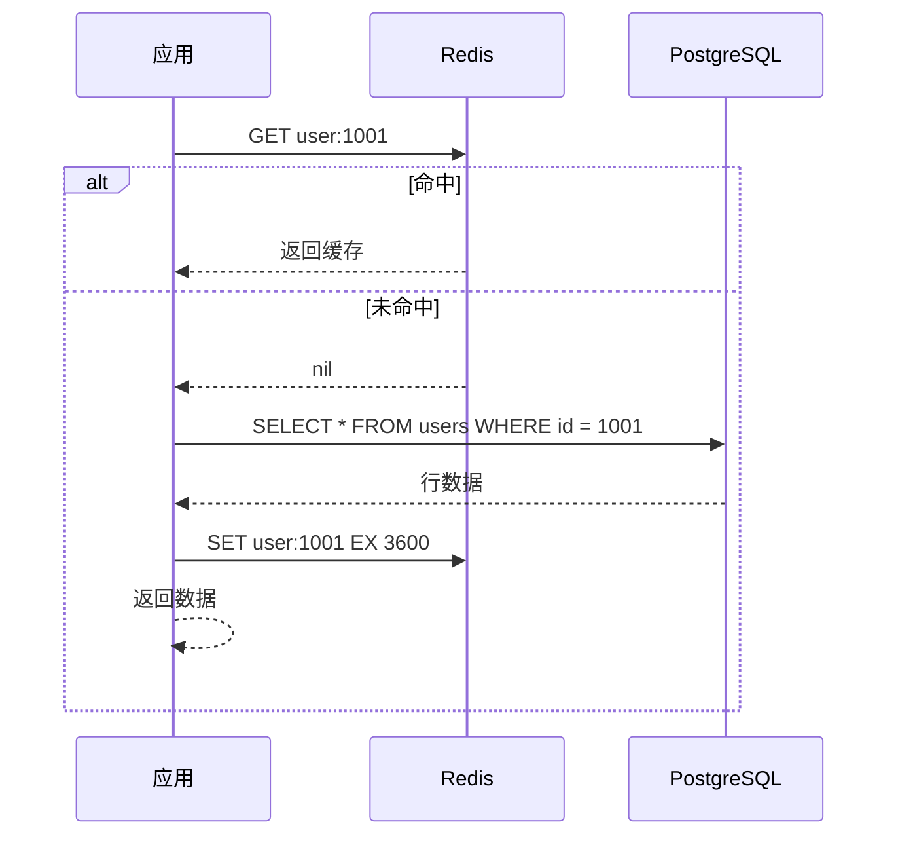
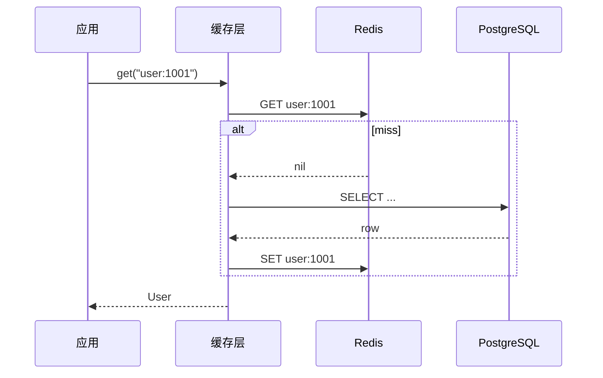
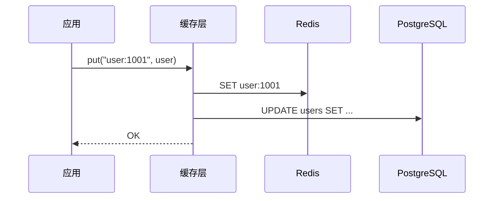
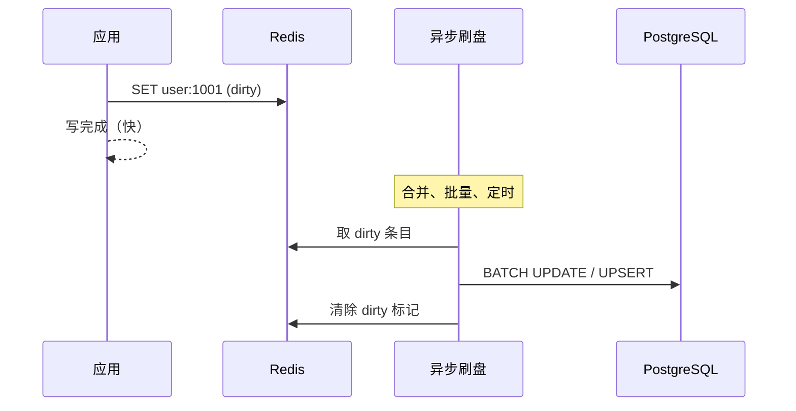
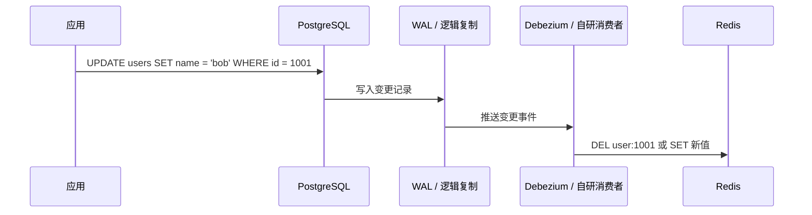
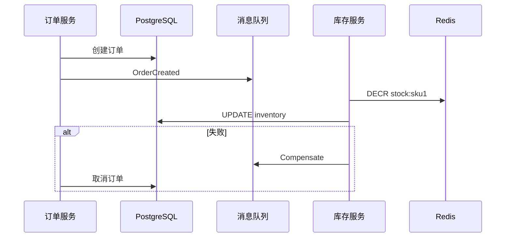

## 概述

应用读多写少时，常在 PostgreSQL 与 Redis 之间加一层缓存：热数据放 Redis，持久化仍由 PostgreSQL 负责。难点不在「能不能缓存」，而在**写路径与读路径如何协调**——数据库已更新，缓存仍是旧值；或缓存已失效，并发读把脏数据又写回缓存。

下文以 **Redis** 作缓存、**PostgreSQL** 作权威数据源，梳理几种主流缓存模式、各自的一致性特征与适用场景。示例以伪代码和常见实践为主，便于对照落地。

## 模式总览

| 模式 | 谁加载缓存 | 谁写缓存 | 一致性 | 复杂度 | 典型场景 |
| ---- | -------- | -------- | ------ | ------ | -------- |
| Cache-Aside | 应用 | 应用 | 最终一致，需自行处理竞态 | 低 | 通用业务，最常用 |
| Read-Through | 缓存层 | 缓存层 | 同 Cache-Aside | 中 | 统一缓存 SDK |
| Write-Through | 应用 | 缓存层同步写 DB | 较强一致 | 中 | 读多、可接受写延迟 |
| Write-Back | 应用 | 缓存层异步刷盘 | 弱一致，有丢数据风险 | 高 | 写密集、可容忍短暂不一致 |
| Binlog 同步 | 中间件 | CDC 消费 binlog 更新缓存 | 最终一致，解耦业务 | 高 | 多服务共享缓存、不想侵入业务 |
| 分布式事务 | 应用 + 协调者 | 2PC / TCC / Saga | 强一致或业务级一致 | 很高 | 资金、库存等强一致域 |



## Cache-Aside（旁路缓存）

也叫 **Lazy Loading**。应用自己管缓存：**读**先查 Redis，miss 再查 PostgreSQL 并回填；**写**先更新 PostgreSQL，再**删除**（推荐）或更新 Redis。

### 读路径



### 写路径（推荐：先写库再删缓存）

```java
void updateUser(User user) {
    // 1. 先更新权威数据源
    jdbcTemplate.update(
        "UPDATE users SET name = ?, updated_at = now() WHERE id = ?",
        user.getName(), user.getId());

    // 2. 再删除缓存（而非更新缓存，避免并发写乱序）
    redisTemplate.delete("user:" + user.getId());
}
```

**为什么删缓存而不是改缓存？** 见下节。

### 删缓存 vs 更新缓存

Cache-Aside 写路径的默认做法是：**先更新 PostgreSQL，再删除 Redis key**，而不是 `SET` 新值。PostgreSQL 是权威数据源，缓存只是副本；删 key 后由下次读 miss 回源加载，逻辑简单，也更容易收敛到一致状态。

#### 并发下「更新缓存」的风险

直接 `SET` 新值在并发读写时，容易出现**旧值覆盖新值**，脏数据可能长期留在 Redis：

```text
T1  线程 A：UPDATE PostgreSQL（name → "bob"）
T2  线程 B：读 miss，从 PG 读到旧值 "alice"
T3  线程 A：SET Redis = "bob"
T4  线程 B：SET Redis = "alice"   ← 旧值覆盖新值
```

删缓存把问题收窄：最坏情况是删完之后、下次读之前，有个读把**已提交的旧库数据**回填——窗口通常很短，且配合 TTL 能自愈。

#### 写库与删缓存的顺序

| 顺序 | 风险 |
| ---- | ---- |
| 先删缓存，再写库 | 写库完成前，读可能回源并把旧库数据写回 Redis，脏窗口较大 |
| 先写库，再删缓存 | 删缓存前可能有读回填旧值，但窗口通常更小；业界默认选这个 |

先写库再删缓存也不是强一致；要求更高时可配合 [延迟双删](#延迟双删)、**分布式锁**或 [CDC 补偿](#cdc-补偿)。

#### 何时可以考虑更新缓存

不是绝对禁止 `SET`，而是有条件的优化，而非默认推荐：

| 场景 | 删缓存 | 更新缓存 |
| ---- | ------ | -------- |
| 通用 CRUD、多字段、有并发写 | 推荐 | 不推荐 |
| 写路径有分布式锁 / 单写者 | 可以 | 可考虑 |
| 值可算、无乱序（如 `INCR` 计数） | 可以 | 更适合 |
| 刚写完就要极低延迟读到新值 | 需多一次读 | 可考虑，失败要有补偿 |
| 复杂对象、多表聚合 | 更安全 | 易漏字段 |

**结论**：默认删缓存；只有能管住写顺序、避免并发覆盖，且更新失败有补偿时，才考虑写后 `SET`。

### 一致性问题

| 问题 | 原因 | 缓解 |
| ---- | ---- | ---- |
| 脏读 | 删缓存与写库顺序不当 | 先写库再删缓存；延迟双删 |
| 缓存击穿 | 热点 key 失效瞬间大量回源 | 互斥锁、逻辑过期 |
| 不一致长期存在 | 删缓存失败 | 重试、[CDC 补偿](#cdc-补偿) |

Cache-Aside 灵活、侵入小，是互联网业务默认选项；一致性责任在应用代码。

### 延迟双删

「先写库、再删缓存」在删缓存前后，仍可能有并发读把**旧数据**写回 Redis：

```text
T1  线程 A：UPDATE PostgreSQL（成功）
T2  线程 B：读 miss，从 PG 读到旧值
T3  线程 B：SET Redis = 旧值        ← 脏数据回填
T4  线程 A：DEL Redis
```

若 T4 发生在 T3 之前，第一次删除无效，Redis 里会长期留着旧值。

**延迟双删**：写库后删两次缓存，中间加一段延迟，第二次删除用于清掉延迟期间被回填的脏数据。

```text
1. UPDATE PostgreSQL
2. DEL Redis                    ← 第一次删
3. sleep / 异步延迟（如 500ms～1s）
4. DEL Redis                    ← 第二次删
```

```java
void updateUser(User user) {
    jdbcTemplate.update(
        "UPDATE users SET name = ?, updated_at = now() WHERE id = ?",
        user.getName(), user.getId());
    redis.delete("user:" + user.getId());           // 第一次
    asyncExecutor.schedule(() -> {
        redis.delete("user:" + user.getId());       // 延迟后再删一次
    }, 500, TimeUnit.MILLISECONDS);
}
```

延迟应**大于**「一次读 miss → 查库 → 回填 Redis」的典型耗时，否则第二次删仍可能早于脏回填。

| 优点 | 缺点 |
| ---- | ---- |
| 实现简单，能收窄不一致窗口 | 仍非强一致；延迟难调；多一次删操作 |

适合对一致性要求比「只删一次」略高、但还不想上分布式事务的场景。

## Read-Through（读穿透）

对应用而言，缓存像一个**黑盒数据源**：应用只调 `cache.get(key)`，未命中时由**缓存组件**自己去 PostgreSQL 加载并写入 Redis，应用不直接访问数据库。



Java 里 Guava `LoadingCache`、Spring Cache 的 `CacheLoader`，或自研 `CacheService` 封装「读 Redis → miss 读 PG → 回填」，都是 Read-Through 形态。

```java
public User getUser(long id) {
    return userCache.get(id, key -> {
        return userRepository.findById(key).orElse(null);
    });
}
```

与 Cache-Aside 的实质差别：**加载逻辑收口在缓存层**，业务代码更干净。一致性策略仍与 Cache-Aside 相同——写路径一般仍是应用写 PostgreSQL 后删缓存，Read-Through 只管读。

## Write-Through（写穿透）

应用在**写**时只面对缓存层；缓存层**同步**完成两件事：更新 Redis，并**立即**写 PostgreSQL。读仍可直接走 Redis。



```java
public void saveUser(User user) {
  cacheWriter.write("user:" + user.getId(), user, () -> {
      userRepository.save(user);  // 同步落库
  });
}
```

- **优点**：读路径简单，缓存与库在写完成时对齐。
- **缺点**：写延迟 = Redis + PostgreSQL；写放大；缓存层故障会挡住写路径。
- **适用**：读远多于写、可接受同步双写延迟的场景。

若 Redis 写成功、PostgreSQL 失败，需缓存层做回滚或标记不一致，否则会出现「缓存新、库旧」。

## Write-Back（写回 / Write-Behind）

应用写时**只写 Redis**（或标记为 dirty），由缓存层**异步批量**刷入 PostgreSQL。读优先走 Redis。



```text
# 简化思路：Redis Hash 存数据 + dirty 标记，后台协程批量 UPSERT
HSET user:1001 name "alice" version 3 dirty 1
# flusher 每 N 秒或累积 M 条后：
INSERT INTO users ... ON CONFLICT (id) DO UPDATE ...
HDEL user:1001 dirty
```

- **优点**：写吞吐高，可合并写、削峰。
- **缺点**：Redis 宕机且未刷盘会**丢数据**；读到其他副本时可能看不到最新写；实现复杂（重试、幂等、顺序）。
- **适用**：计数器、浏览量、日志缓冲等**可丢或可重建**的数据；**不**适合账户余额、订单状态。

与 Write-Through 对比：Write-Through 追求「写完即可信」，Write-Back 追求「写完尽快返回」。

## Binlog 同步（CDC）

业务代码**只写 PostgreSQL**，不直接维护 Redis。通过 **逻辑复制 / WAL / [Debezium](#debezium-是什么)** 等消费 PostgreSQL 变更（类似 MySQL binlog），由独立消费者更新或删除 Redis。



### Debezium 是什么

**Debezium** 是开源的 **CDC（Change Data Capture）** 平台，由 Red Hat 发起，现属 Apache 基金会。它监听数据库变更日志（PostgreSQL 的 WAL、MySQL 的 binlog 等），把「哪张表、哪一行、改了什么」转成事件流，供下游消费。

典型链路：

```text
PostgreSQL（业务写入）
    ↓ WAL / 逻辑复制
Debezium Connector
    ↓
Kafka / Kafka Connect（常见部署方式）
    ↓
消费者（删 Redis、写 ES、发通知……）
```

| 概念 | 含义 |
| ---- | ---- |
| CDC | 捕获数据库变更的一类技术 |
| WAL / binlog | 数据库自带的变更日志 |
| Debezium | 实现 CDC 的具体框架，支持 PostgreSQL、MySQL、MongoDB 等 |

一次 `UPDATE` 可能被编成类似事件（简化）：

```json
{
  "op": "u",
  "before": { "id": 1001, "name": "alice" },
  "after":  { "id": 1001, "name": "bob" }
}
```

`op` 取值：`c` 创建、`u` 更新、`d` 删除。消费者根据主键执行 `DEL user:1001` 等操作。

Debezium 不是缓存组件，而是**旁路监听器**：PostgreSQL 一变，就通知下游修正 Redis；也可同步 Elasticsearch、数据仓库等，避免业务代码里散落「改库 + 删缓存 + 发消息」。

PostgreSQL 侧通常开启逻辑复制槽，配合 Debezium PostgreSQL Connector：

```json
{
  "name": "users-connector",
  "config": {
    "connector.class": "io.debezium.connector.postgresql.PostgresConnector",
    "database.hostname": "postgres",
    "database.dbname": "app",
    "table.include.list": "public.users",
    "plugin.name": "pgoutput"
  }
}
```

消费者伪逻辑：

```java
void onUserChange(ChangeEvent event) {
    long id = event.getKey();
    if (event.isDelete()) {
        redis.delete("user:" + id);
    } else {
        redis.delete("user:" + id);  // 删缓存，下次读回源（稳妥）
        // 或直接 SET：需保证事件顺序与全字段
    }
}
```

- **优点**：业务与缓存解耦；多服务写同一库时缓存仍可由统一管道维护；可做审计、搜索索引同步。
- **缺点**：**最终一致**，通常有毫秒～秒级延迟；需处理**消息乱序、重复消费**（幂等）；运维组件多。
- **适用**：微服务多写源、希望业务代码零缓存逻辑、可接受短暂不一致。

### CDC 补偿

应用侧「写库后删缓存」是**主路径**，但可能失败或根本没人删：

| 情况 | 后果 |
| ---- | ---- |
| PostgreSQL 写成功，Redis `DEL` 失败 | 缓存长期是旧值 |
| 多个服务写同一库，有的服务忘了删缓存 | 同上 |
| 运维直接改库、脚本 bulk update | 应用层从未删缓存 |

**CDC 补偿**：CDC 管道作为**第二道保险**，根据库里的真实变更再去删或更新 Redis——即使应用删缓存失败，只要变更被消费到，缓存仍会被修正。

```text
主路径：  应用写 PG → 应用 DEL Redis（可能失败）

补偿路径：应用写 PG → WAL 变更 → Debezium 等 → DEL Redis
```

CDC 不一定是唯一的缓存维护方式；常与 Cache-Aside 组合——业务仍用 Cache-Aside 读写，写路径尽量删缓存，CDC 负责兜底。

与 [延迟双删](#延迟双删) 对比：

| | 延迟双删 | CDC 补偿 |
| ---- | -------- | -------- |
| 触发方 | 应用自己 | 独立 CDC 消费者 |
| 针对问题 | 删缓存**之后**又被脏回填 | 删缓存**根本没成功**（或没人删） |
| 一致性 | 最终一致，窗口更短 | 最终一致，有管道延迟 |
| 复杂度 | 低 | 中高（多一套基础设施） |

实践中可组合：**先写库再删缓存** + **延迟双删**收紧竞态 + **CDC 补偿**兜底删缓存失败。

## 分布式事务

当「写 PostgreSQL」与「写/删 Redis」必须**原子**或**可补偿**时，单机双写不够，需要分布式事务或等价的业务方案。

### 两阶段提交（2PC）

协调者先 prepare 各参与者，再 commit。Redis 非 XA 参与者，原生 2PC 不直接适用；实践中多用**事务消息**或**TCC** 代替朴素 2PC。

### TCC（Try-Confirm-Cancel）

```text
Try:     预留资源 — 如 Redis 加锁 / 写临时 key，DB 冻结库存
Confirm: 确认提交 — 删缓存、扣减库存、删临时 key
Cancel:  回滚     — 释放预留
```

适合库存、优惠券等需要明确业务语义的场景，代码侵入大，但一致性强于「先写库再删缓存」。

### Saga

长事务拆成本地事务链，每步有**补偿操作**。例如：订单服务写 PostgreSQL 成功 → 发消息 → 库存服务扣减 → 失败则发补偿消息回滚订单。



### Redis 事务与 Lua

Redis 的 `MULTI`/`EXEC` 或 Lua 脚本只能保证**单 Redis 实例内**原子性，**不能**与 PostgreSQL 单机事务跨资源原子提交。常见折中：

1. **以 PostgreSQL 为权威**：事务提交后再删 Redis；失败则靠 CDC 或重试队列补偿。
2. **Canal / 事务消息**：本地消息表与业务同事务写入，异步删缓存。
3. **强一致域**：干脆**不缓存**该数据，或只缓存只读副本。

| 方案 | 一致性 | 性能 | 复杂度 |
| ---- | ------ | ---- | ------ |
| 先写库再删缓存 | 最终一致 | 高 | 低 |
| 延迟双删 + 消息补偿 | 最终一致（更紧） | 中高 | 中 |
| TCC / Saga | 业务级强一致 | 中 | 高 |
| 2PC（跨 DB） | 强一致 | 低 | 很高 |

## 如何选择

```text
默认起点     → Cache-Aside（读）+ 写库后删缓存（写）
读逻辑想收口   → Read-Through 包装
写也要简单一致 → Write-Through（接受写延迟）
写多读少、可丢  → Write-Back（慎用）
多服务、解耦   → PostgreSQL CDC → Redis
资金/库存      → 分布式事务或干脆不缓存写路径
```

无论哪种模式，都建议：

1. 给缓存 key 设**合理 TTL**，即使逻辑漏删也能自愈。
2. 对**热点 key** 使用互斥回填或逻辑过期，避免击穿。
3. 监控 **缓存命中率、CDC 延迟、删缓存失败率**。
4. 在文档里写清本接口是**强一致**还是**最终一致**，避免上下游假设错误。

## 相关阅读

- [缓存](./cache.md) — 穿透、击穿、雪崩等常见问题
- [缓存算法](../other/缓存算法.md) — LRU、LFU 等淘汰策略
