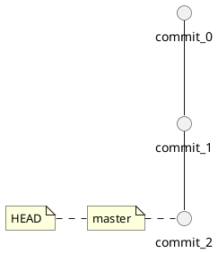
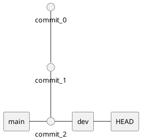
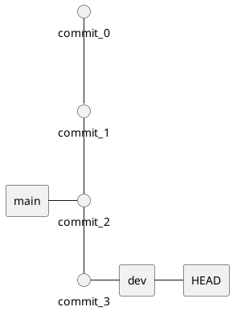

## Git HEAD

HEAD 指向当前检出的分支的最新提交（commit）。
当你提交（commit）新更改时，HEAD 会随着分支一起移动到新的提交。
当你切换分支（比如用 git checkout 或 git switch），HEAD 会改变指向，指向你切换到的分支。

这个 HEAD 随你切换分支而变化，始终指向你“当前所在”的分支或 commit。
你在 main 分支，HEAD 内容是 ref: refs/heads/main
你切换到 dev 分支，HEAD 变为 ref: refs/heads/dev
你 checkout 某个历史 commit，HEAD 内容是该 commit 的 SHA（分离 HEAD 状态）

```bash
# 查看 HEAD 指向
cat .git/HEAD
```

### HEAD 和 head

https://blog.csdn.net/albertsh/article/details/106448035

git 中的 HEAD 概念也类似一个指针，它指向是当前分支的“头”，通过这个头节点可以追寻到当前分支之前的所有提交记录。

比如 git reset --hard HEAD 代表放弃工作树和索引的修改 reset 到 这个分支的最新版本

git 的提交记录之间的关系很像一棵树，或者说是一张图，通过当前的提交记录指向上一次提交记录串联起来，形成一个头结构，
而在 git 中我们常常说的切换分支，只不过是 git 客户端帮你把要操作的那条路径的头节点，存储到了 HEAD 文件中。

HEAD 在 git 版本控制中代表头节点，也就是分支的最后一次提交，同时也是一个文件，通常在版本库中 repository/.git/HEAD，其中保存的一般是 ref: refs/heads/master 这种分支的名字，而本质上就是指向一次提交的 hash 值，一般长成这个样子 ce11d9be5cc7007995b607fb12285a43cd03154b。

#### HEAD~ 和 HEAD^

```
         A
        / \
       /   \
      B     C
     /|\    |
    / | \   |
   /  |  \ / \
  D   E   F   \
 / \     / \   \
G   H   I   J

A =      = A^0  
B = A^   = A^1     = A~1  
C = A^2  = A^2  
D = A^^  = A^1^1   = A~2  
E = B^2  = A^^2  
F = B^3  = A^^3  
G = A^^^ = A^1^1^1 = A~3  
H = D^2  = B^^2    = A^^^2  = A~2^2  
I = F^   = B^3^    = A^^3^  
J = F^2  = B^3^2   = A^^3^2  

```

G-D-B-A可以认为是主干，其他都是merge进来的其他分支节点。

A^表示A的第一个父提交，A^2表示A的第二个父提交

A~1表示A的父提交，A~2表示A的父提交的父提交，相当于A^^和A^1^1

A~2^2表示A的父提交的父提交的第二个父提交，即为H


1.“^”代表父提交,当一个提交有多个父提交时，可以通过在”^”后面跟上一个数字，表示第几个父提交，”^”相当于”^1”.

2. ~<n>相当于连续的<n>个”^”.
   ————————————————

版权声明：本文为博主原创文章，遵循 CC 4.0 BY-SA 版权协议，转载请附上原文出处链接和本声明。

原文链接：https://blog.csdn.net/sayoko06/article/details/79471173

在 HEAD 后面加 ^ 或者 ~ 其实就是以 HEAD 为基准，来表示之前的版本，因为 HEAD 被认为是当前分支的最新版本，那么 HEAD~ 和 HEAD^ 都是指次新版本，
也就是倒数第二个版本，HEAD~~ 和 HEAD^^ 都是指次次新版本，也就是倒数第三个版本，以此类推

这个说法在之前的总结 《git checkout/git reset/git revert/git restore常用回退操作》 中提到过

HEAD~ 和 HEAD^ 后面都加大于1的数字
这时就会发现两者的不同了，比如我们把数字都定为 2，那么 HEAD~2 代表后退**两步**，每一步都后退到**第一**个父提交上，
而 HEAD^2 代表**后退一步**，这一步退到**第二**个父提交上，如果没有第二个父提交就会报出以下错误：

```
fatal: ambiguous argument ‘HEAD^2’: unknown revision or path not in the working tree.
Use ‘–’ to separate paths from revisions, like this:
‘git […] – […]’
```

HEAD~ 后面加数字表示后退的步数，每次后退都默认退到第一个父提交上，HEAD~2 表示连退两步。
HEAD^ 后面加数字表示只退一步，但是这一步后退到数字表示的父提交上，HEAD^2 表示退一步到第二个父提交上。
git 在查看多分支提交记录时，日志的先后顺序不代表提交时间的先后顺序。
git reset 命令是一个重置 HEAD 的命令，可以指挥版本库指向任何一个合法提交。

查看 HEAD 文件的内容 `cat .git/HEAD`

HEAD就是当前活跃分支的游标。HEAD 的指向是跟随分支切换实时变化

不过HEAD并非只能指向分支的最顶端（时间节点距今最近的那个），实际上它可以指向任何一个节点，它就是 Git 内部用来追踪当前位置的

你可以认为 HEAD(大写) 是 "current branch" (当下的分支)。当你用 git checkout 切换分支的时候，HEAD revision 重新指向新的分支。
有的时候 HEAD 会指向一个没有分支名字的修订版本，这种情况叫 `detached HEAD`

head(小写) 是 commit 对象的引用，每个 head 都有一个名字 (分支名字或者标签名字等等），但是默认情况下，每个叫 master 的 repository 都会有一个 head, 
一个 repository 可以包含任意数量的 head。在任何时候，只要这个 head 被选择成为 `current head`，那么这个 head 就成了 HEAD

在 main 分支上，HEAD 指向 main，而 main 指向的是最近的一次提交。



新建分支时，比如 `git switch -c dev`，dev 会指向当前 main 分支的最近一次提交。
切换到 dev 分支后，HEAD 就指向当前分支 dev 了。



在 dev 上修改，比如修改 `helloworld.c`，然后提交，分支 dev 指向当前分支的最新提交，而 main 指向 main 分支的最新提交。



## Git detached HEAD

如果你检出某个具体的 commit（而不是分支），此时 HEAD 会直接指向这个 commit，而不是分支。这种状态叫做“detached HEAD”。在这种状态下提交，新的 commit 不会附加到任何分支上。

这个时候输入 git status 查看当前状态发现我没有在任何本地分支上也验证了刚才的猜想, 而这时候我又作死的进行了 commit 操作, git 提示我

使用的是 git checkout <commit id>, 即切换到指定的某一次提交,HEAD 就会处于 detached 状态 (游离状态) 。
HEAD 游离状态的利与弊
HEAD 处于游离状态时, 我们可以很方便地在历史版本之间互相切换, 比如需要回到某次提交, 直接 checkout 对应的 commit id 或者 tag 名即可。

它的弊端就是: 在这个基础上的提交会新开一个匿名分支！
也就是说我们的提交是无法可见保存的,一旦切到别的分支,游离状态以后的提交就不可追溯了。
解决办法就是新建一个分支保存游离状态后的提交:

detached head,即游离的HEAD,HEAD指向了未知的分支,即不在所有已知的分支范围内。

上网看了些资料, 道友们是遇到这样的问题然后解决了,但是出于好奇心来了解的我并没有这样的问题,但是仍然按照道友的解决顺序尝试了下,
发现执行下面这句代码 `git checkout origin/master`,会产生 `detached HEAD` 这种情况.

> git checkout origin/master
  
Note: checking out 'origin/master'.

> You are in 'detached HEAD' state. You can look around, make experimental changes and commit them, and you can discard any commits you make in this state without impacting any branches by performing another > checkout. If you want to create a new branch to retain commits you create, you may do so (now or later) by using -b with the checkout command again. Example:

```bash
git checkout -b <new-branch-name>
# HEAD is now at 3e74a7a... merge bug fixed in issue1
```
  
此时用 status 指令查看,工作目录是干净的。

>git status
  
HEAD detached at origin/master
  
nothing to commit, working tree clean
  
用git branch 可以查看到:

$ git branch
  
* (HEAD detached at origin/master)

dev

master
  
HEAD 指向了一个未知的分支, 再返回上面的提示, 可以用 git checkout -b 基于当前分支创建一个新的临时分支保留代码, 合并到合适的分支后删除。

$ git checkout -b temp
  
Switched to a new branch 'temp'
  
$ git branch

dev

master
  
* temp
  
$ git checkout master
  
Switched to branch 'master'
  
Your branch is up-to-date with 'origin/master'.
  
$ git merge temp
  
Already up-to-date.
  
$ git branch -d temp
  
Deleted branch temp (was 3e74a7a).
  
但是与道友不同的是,使用 git checkout origin/master制造的detached HEAD的情况,再次使用切换分支就会消失:

$ git checkout master //master或者任意已知分支
  
$ git checkout dev
  
Previous HEAD position was 3e74a7a... merge bug fixed in issue1
  
Switched to branch 'dev'
  
Your branch is up-to-date with 'origin/dev'.
  
$ git branch
  
* dev

master

[https://blog.csdn.net/sinat_26415011/article/details/54346318](https://blog.csdn.net/sinat_26415011/article/details/54346318)
