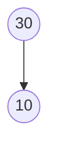
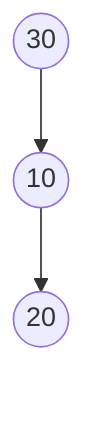
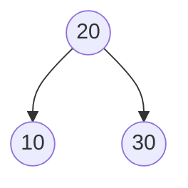

AVL 树是最早出现的自平衡二叉查找树，由 G.M. Adelson-Velsky 和 E.M. Landis 于 1962 年在论文《An algorithm for the organization of information》中提出，因此得名 AVL（发明者姓氏首字母），也叫高度平衡树。

平衡二叉树的通用定义（平衡因子、失衡、单旋恢复平衡的例子）见 [二叉树与二叉查找树 §平衡二叉树 Balanced Binary Tree](./binary-tree.md#平衡二叉树-balanced-binary-tree)，本文只讲 AVL 特有的部分：严格平衡条件、四种失衡情况的旋转、插入删除的复杂度，以及和其他平衡树、常见平衡树家族的关系。

## 严格平衡条件

一棵 AVL 树满足以下条件（递归定义）：

1. 左子树和右子树都是 AVL 树。
1. 左子树和右子树的高度差不超过 1。

相比红黑树用颜色规则换取的"相对平衡"，AVL 树是**严格平衡**：任意结点的平衡因子（左子树高度 − 右子树高度）只能取 -1、0、1。这带来的好处是查找效率稳定，代价是插入、删除时更容易触发再平衡。

## 树高的维护

判断是否失衡需要知道每个结点的子树高度，通常在结点里额外记一个 `height` 字段：

- 空结点（NIL）的高度记为 -1
- 叶子结点的高度为 0
- 非叶子结点的高度 = `max(左子树高度, 右子树高度) + 1`

插入或删除一个结点后，从该结点沿父指针回溯到根，逐层重新计算高度；一旦某个祖先的平衡因子超出 `[-1, 1]`，该结点就是**失衡点**，需要旋转恢复平衡。

## 失衡的四种情况与旋转

失衡点的位置只有 4 种可能，分别对应不同的旋转方式：

| 情况 | 触发位置 | 旋转方式 |
| ---- | -------- | -------- |
| LL（左左） | 左子树的左子树过高 | 对失衡点做一次**右旋** |
| RR（右右） | 右子树的右子树过高 | 对失衡点做一次**左旋** |
| LR（左右） | 左子树的右子树过高 | 先对左子树**左旋**，再对失衡点**右旋**（双旋） |
| RL（右左） | 右子树的左子树过高 | 先对右子树**右旋**，再对失衡点**左旋**（双旋） |

RR 单旋的完整示例见 [二叉树与二叉查找树 §插入示例](./binary-tree.md#插入示例从平衡到失衡再到旋转)，LL 是它的镜像。下面补充一个 LR 双旋的例子。

### LR 双旋示例

依次插入 30、10、20：

**步骤 1**：插入 30，再插入 10（30 的左孩子）。高度差为 1，仍平衡。

**步骤 2**：插入 20，落在 10 的右侧（左子树的右边节点，即 LR）。根 30 的左子树高度变成 1，右子树高度为 -1（空），高度差为 2，失衡。

**步骤 3**：先对失衡点的左子树（以 10 为根）做一次**左旋**，把 LR 转成 LL：20 提上来，10 变成 20 的左孩子。

**步骤 4**：再对失衡点 30 做一次**右旋**：20 成为新的根，10 挂在左边，30 挂在右边。旋转后左右子树高度均为 0，恢复平衡，BST 性质不变。

RL 是 LR 的镜像：先对右子树做一次右旋转成 RR，再对失衡点做一次左旋。

## 插入与删除

**插入**：按普通 BST 的方式递归插入新结点，然后沿插入路径回溯到根，逐层更新高度并检查平衡因子。因为一次插入最多只会让路径上的一个结点失衡，所以插入最多只需要一次旋转（单旋或双旋）就能让整棵树恢复平衡。

**删除**：先按 BST 的规则删除结点（叶子直接删，单孩子提升，双孩子用中序前驱/后继替换后再删除该前驱/后继），然后同样沿路径回溯更新高度。和插入不同的是，删除可能导致路径上**多个**祖先先后失衡，最坏情况下需要旋转 O(log n) 次才能让整棵树恢复平衡。

## 复杂度与适用场景

一棵有 n 个结点的 AVL 树，高度、平均查找长度都稳定维持在 O(log n)；查找、插入、删除的时间复杂度均为 O(log n)。

和红黑树相比：AVL 树查找更快（平衡更严格），但插入删除的旋转开销可能更大，具体对比见 [Red-Black Tree §红黑树与 AVL 树对比](./red-black-tree.md#红黑树与-avl-树对比)。简单结论是：搜索远多于插入删除时选 AVL 树（如只读或读多写少的索引结构）；搜索、插入、删除频率相近时，红黑树的综合表现更稳定，因此更常用在通用关联容器（STL、Java `TreeMap`）里。

## 平衡树家族

除了 AVL 树和红黑树，常见的自平衡 / 近似平衡结构还有：

- 树堆（Treap）
- 伸展树（Splay Tree）
- 加权平衡树（Weight Balanced Tree）
- 2-3 树
- AA 树
- 替罪羊树（Scapegoat Tree）

这些结构都是在 BST 有序性的基础上，用不同的策略换取"插入 / 删除 / 查找"三者之间不同的效率取舍。

## 参考

- [AVL树图解](https://www.cnblogs.com/huangxincheng/archive/2012/07/22/2603956.html)
- [平衡二叉树（AVL树）](https://blog.csdn.net/u010899985/article/details/80981053)
- [AVL树详解](https://cloud.tencent.com/developer/article/1177129)

## 维护记录

| 时间 | 修改内容 | 原因 |
| ---- | -------- | ---- |
| 2026-07-14 | 由 `inbox/平衡二叉树.md` 整理为正式文章，重命名为 `avl-tree.md`；补充树高维护、四种失衡情况与旋转（含 LR 双旋图解）、插入删除复杂度、与红黑树对比的内链等内容；原文缺失的示意图改为 Mermaid 图 | 原文是 inbox 目录下未整理的草稿，内容不完整（多处提到"看下图"但配图缺失）、格式不规范；整理后与 [二叉树与二叉查找树](./binary-tree.md)、[Red-Black Tree](./red-black-tree.md) 形成完整的平衡树系列 |
