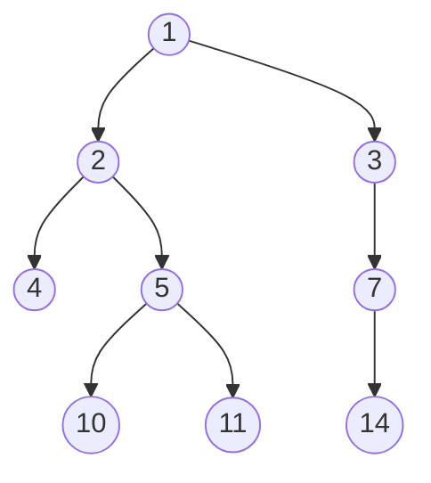
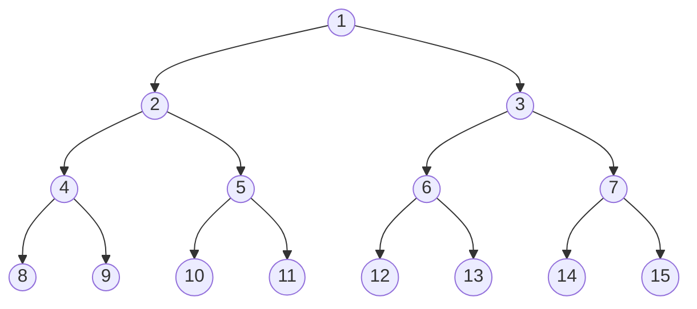
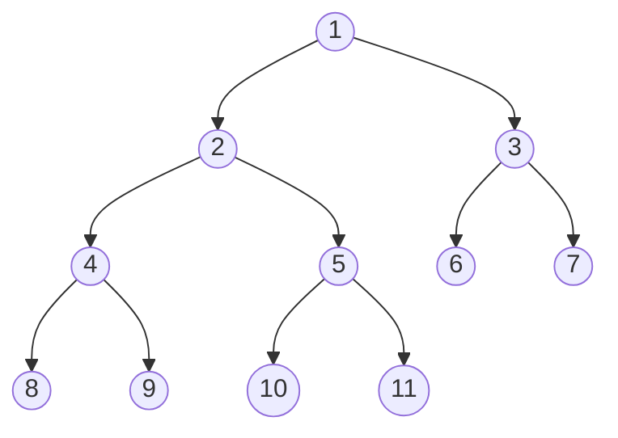
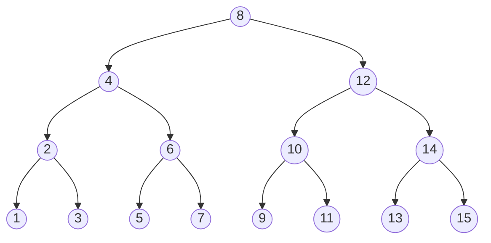
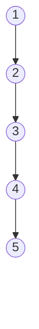
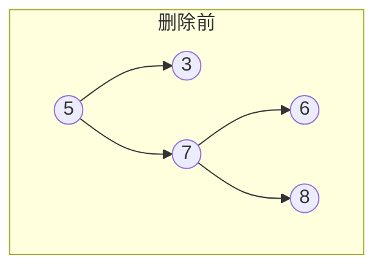
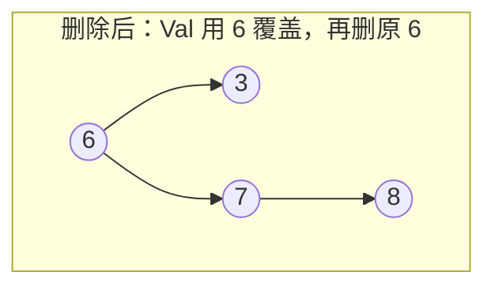
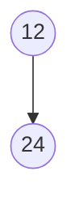
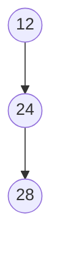
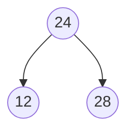

本文整理一般二叉树、二叉查找树（BST）与平衡树的概念；BST 的插入、查找、删除与中序遍历的 Go 实现见我的 [leetcode 仓库](https://github.com/wiloon/leetcode) 下的 [`tree/`](https://github.com/wiloon/leetcode/tree/main/tree)（[`bst.go`](https://github.com/wiloon/leetcode/blob/main/tree/bst.go)、[`bst_test.go`](https://github.com/wiloon/leetcode/blob/main/tree/bst_test.go)）。

### 二叉树 (Binary Tree)

二叉树 (Binary Tree) 是包含 n 个节点的有限集合，该集合或者为空集（此时，二叉树称为空树），或者由一个根节点和两棵互不相交的、分别称为根节点的左子树和右子树的二叉树组成。

二叉树中的节点至多包含两棵子树，分别称为左子树和右子树，而左子树和右子树又分别至多包含两棵子树。由上述的定义，二叉树的定义是一种递归的定义。



### 满二叉树 Full Binary Tree

对于一棵二叉树，如果每一个非叶子节点都存在左右子树，并且二叉树中所有的叶子节点都在同一层中，这样的二叉树称为满二叉树。



### 完全二叉树 Complete Binary Tree

对于一棵具有 n 个节点的二叉树按照层次编号，同时，左右子树按照先左后右编号，如果编号为 i 的节点与同样深度的满二叉树中编号为 i 的节点在二叉树中的位置完全相同，则这棵二叉树称为完全二叉树。



### 二叉查找树 Binary Search Tree

**BST（Binary Search Tree）是「二叉搜索树 / 二叉查找树」，不是「二叉树」的简称。** 一般二叉树只要求每个节点最多两个孩子；BST 在此基础上增加有序约束，用于相对高效的查找、插入与删除。

| 概念 | 含义 |
| ---- | ---- |
| 二叉树（Binary Tree） | 每个节点最多两个子节点，没有额外排序规则 |
| 二叉查找树（BST） | 左子树值小于根、右子树值大于根（递归），带排序规则的二叉树 |

二叉树的一个重要用途是提高查找效率。HashMap 在哈希冲突严重、拉链过长时，会把链表升级为红黑树；红黑树本质上也是一棵自平衡的二叉查找树。

二分查找能在有序数组上做到 O(log n)，但动态插入、删除时维护有序数组成本很高。二叉查找树（又叫二叉排序树）把「有序」这层约束放进树结构里：左子树存更小的值，右子树存更大的值，查找时可以像二分一样逐层缩小范围。

#### 定义

一棵二叉查找树满足以下三条性质（递归定义）：

1. 若左子树不空，则左子树上所有节点的值均小于根节点的值
1. 若右子树不空，则右子树上所有节点的值均大于或等于根节点的值
1. 左、右子树也分别是二叉查找树

下图 (a) 是一棵 4 层的二叉查找树。以根节点 8 为例：左子树（以 4 为根）和右子树（以 12 为根）各自都是一棵完整的 BST；再看中间的 4，它的左子树（以 2 为根）和右子树（以 6 为根）同样满足递归定义。每个非叶子节点都能拆成「左 BST + 根 + 右 BST」三部分。



#### 节点表示（LeetCode / Go）

刷题与工程里常见如下节点定义（与 LeetCode `TreeNode` 一致）：

```go
type TreeNode struct {
    Val   int
    Left  *TreeNode
    Right *TreeNode
}
```

| 字段 | 作用 |
| ---- | ---- |
| `Val` | 节点保存的数据 |
| `Left` / `Right` | 指向左右子节点的指针，本身不存业务数据 |

插入、查找、删除时，用待处理的值与 `node.Val` 比较，决定走左还是走右。链式存储的 C 写法里常把数据域写作 `data`，语义相同。

#### 实现参考

[`tree/bst.go`](https://github.com/wiloon/leetcode/blob/main/tree/bst.go) 提供 `Insert`、`Search`、`Delete`、`InOrder` 等 API，本地可运行：

```bash
go test -v ./tree/...
```

（在 [leetcode 仓库](https://github.com/wiloon/leetcode) 根目录执行。）

#### 性质与中序遍历

中序遍历（左 → 根 → 右）一棵二叉查找树，得到的序列一定是有序的。例如上图 (a) 的中序遍历结果为：1, 2, 3, 4, 5, 6, 7, 8, 9, 10, 11, 12, 13, 14, 15。

中序遍历也是验证 BST 是否正确的常用手段：结果须严格（或按约定）递增。遍历整棵树的时间复杂度为 O(n)，除结果切片外递归栈约为 O(h)（h 为树高）。

#### 查找性能

| 操作 | 平均（树较平衡） | 最坏（退化成链） |
| ---- | ---------------- | ---------------- |
| 查找 / 插入 / 删除 | O(log n) | O(n) |

| 情况 | 时间复杂度 | 说明 |
| ---- | ---------- | ---- |
| 最好 | O(log n) | 树大致平衡，每层排除约一半节点，接近折半查找 |
| 最坏 | O(n) | 树退化为链表，需遍历全部节点 |

最坏情况常见于按有序序列依次插入：每次新节点都落到同一侧，整棵树变成一条链。下图 (b) 是按 1 → 2 → 3 → 4 → 5 顺序插入后的结果。



正因为存在这种退化，实际工程中很少直接使用普通二叉查找树，而是引入 AVL 树、红黑树等自平衡结构（见下文）。

#### 插入与查找

- **插入**：从根出发，值小于当前节点则进左子树，大于则进右子树，直到空位新建节点。
- **查找**：同样从根比较 `Val`，每次排除一侧子树。

思路与有序数组上的二分查找类似，但不需要整体搬移元素。

#### 删除节点

删除要区分三种情况（[`deleteNode`](https://github.com/wiloon/leetcode/blob/main/tree/bst.go)）：

1. **无左子**：用右子顶替当前节点（改指针，返回 `node.Right`）。
1. **无右子**：用左子顶替（返回 `node.Left`）。
1. **左右都有**：不是在原位置硬删后把右子树整体上移，而是：
   - 在**右子树**中找**最小值**（一直沿 `Left` 到底）→ **中序后继（in-order successor）**
   - 将该值**复制**到当前节点的 `Val`（节点位置不变）
   - 在右子树里**再删除**这个后继（它至多只有右子，属于前两种情况）

删除值为 5 的示例（右子树最小值为 6）：





等价做法是用**左子树最大值**（中序前驱）替换；[leetcode 实现](https://github.com/wiloon/leetcode/blob/main/tree/bst.go) 选用右子树最小值，是常见写法。

### 平衡二叉树 Balanced Binary Tree

上一节图 (b) 的退化链表，查找退化为 O(n)。平衡二叉树通过限制左右子树的高度差，让树在插入、删除后仍保持大致平衡，把查找维持在 O(log n) 量级。

工程里常说的「平衡二叉树」通常指**同时满足 BST 性质与平衡条件**的树，例如 AVL 树、红黑树。本节先说明平衡条件本身，再用一个插入示例看「失衡 → 旋转 → 恢复平衡」。

#### 定义

一棵平衡二叉树满足（递归定义）：

1. 空树是平衡二叉树
1. 非空树左右子树高度之差的绝对值不超过 1
1. 左右子树也分别是平衡二叉树

常用**平衡因子**表示：`平衡因子 = 左子树高度 − 右子树高度`，合法取值为 -1、0、1。绝对值大于 1 的节点即为**失衡点**，需要通过旋转调整。

#### 插入示例：从平衡到失衡再到旋转

下面用同一组插入顺序演示（同时保持 BST 性质：左小右大）。

**步骤 1**：插入 12，再插入 24。根 12 的左子树高度 0、右子树高度 1，高度差为 1，仍平衡。



**步骤 2**：再插入 28，落到 24 的右侧（右子树的右子树，简称**右右 / RR**）。此时根 12 的左子树高度 0、右子树高度 2，高度差为 2，失衡。



**步骤 3**：在失衡点 12 处做一次**左旋**（把 24 提为根，12 成为其左孩子，28 挂在 24 右侧）。旋转后根 24 的左右子树高度均为 1，恢复平衡，BST 性质不变。



RR 只需一次单旋即可。其它三种失衡（左左 LL、左右 LR、右左 RL）也是先判断插入落在哪一侧，再选择单旋或先旋子树再旋根的「双旋」。AVL 树把这四种情况固化在插入、删除逻辑里。

#### 小结

| 概念 | 说明 |
| ---- | ---- |
| 平衡条件 | 任意节点左右子树高度差 ≤ 1 |
| 失衡原因 | 连续向同一侧重插入或删除 |
| 恢复手段 | 左旋 / 右旋（必要时双旋） |
| 与 BST 关系 | 通常叠加 BST 有序性，才用于查找 |

严格维护高度平衡的 AVL 树旋转次数较多；红黑树放宽平衡条件，换取更少的旋转，在 HashMap、Linux 内核等场景更常见。

### AVL 与常见自平衡树

BST 只保证「有序」，不保证「平衡」；AVL 树和红黑树是在 BST 之上叠加的两种不同**平衡策略**，二者的有序性都来自 BST，区别只在如何恢复平衡：

```text
BST（有序，不保证平衡）
  ├─ + AVL 平衡策略  → AVL 树（严格平衡，平衡因子 ∈ {-1, 0, 1}）
  └─ + 红黑规则策略  → 红黑树（近似平衡，靠颜色约束）
```

| 结构 | 特点 |
| ---- | ---- |
| AVL 树 | 任意节点平衡因子 ∈ {-1, 0, 1}，查找稳定，插入删除旋转可能较多 |
| 红黑树 | 通过颜色规则放宽平衡，旋转更少，Java `HashMap`、`TreeMap` 等常用 |

AVL 树的严格平衡条件、四种失衡情况的旋转（LL/RR/LR/RL）与插入删除复杂度见独立文章 [AVL Tree, AVL 树](./avl-tree.md)；红黑树的着色规则与旋转见 [Red-Black Tree, 红黑树](./red-black-tree.md)。

### 二叉树的一些性质

- 第 i 层上至多有 2<sup>i−1</sup> 个节点（i ≥ 1）
- 深度为 k 的二叉树至多有 2<sup>k</sup> − 1 个节点（k ≥ 1）
- 叶子节点数为 n<sub>0</sub>、度为 2 的节点数为 n<sub>2</sub> 时，有 n<sub>0</sub> = n<sub>2</sub> + 1
- 具有 n 个节点的完全二叉树深度为 ⌊log<sub>2</sub> n⌋ + 1

### 存储结构

对二叉树操作前需选定存储方式：

- **顺序存储**：用一维数组按层次编号存节点，下标体现逻辑关系；非完全二叉树会出现大量空位，空间浪费明显。
- **链式存储**：每个节点含数据域与左右指针，适合一般二叉树与 BST。C 语言中常写作：

```c
typedef struct BiNode {
    int data;
    struct BiNode *left;
    struct BiNode *right;
} BiNode;
```

### 二叉树的遍历

遍历是二叉树上的基本操作，常见四种：

| 遍历 | 顺序 | 在 BST 上的典型结果 |
| ---- | ---- | ------------------- |
| 前序 Preorder | 根 → 左 → 右 | 一般无序 |
| 中序 Inorder | 左 → 根 → 右 | **升序** |
| 后序 Postorder | 左 → 右 → 根 | 一般无序 |
| 层次 | 按层从左到右 | 一般无序 |

**InOrder** 里的 *In* 表示根在左右子树**之间**（in between），是算法里的固定术语，不是日常口语里的「在里面」。LeetCode、教材与面试里 `InOrder` / `inorderTraversal` 非常常见；若更强调业务语义，也可命名 `ValuesAscending`，但读他人代码时认 `InOrder` 更省事。

下面用链式节点的前 / 中 / 后序递归示例（与上文 `BiNode` 对应）：

```c
// 先序：根 → 左 → 右
void pre_order(BiNode *p) {
    if (p != NULL) {
        printf("%d\t", p->data);
        pre_order(p->left);
        pre_order(p->right);
    }
}

// 中序：左 → 根 → 右（BST 上为升序）
void in_order(BiNode *p) {
    if (p != NULL) {
        in_order(p->left);
        printf("%d\t", p->data);
        in_order(p->right);
    }
}

// 后序：左 → 右 → 根
void post_order(BiNode *p) {
    if (p != NULL) {
        post_order(p->left);
        post_order(p->right);
        printf("%d\t", p->data);
    }
}
```

层次遍历用队列按层展开，从根开始，每弹出一个节点就把其左右孩子入队：

```c
// 层次遍历（伪代码思路：队列 + 逐层扩展）
void level_order(BiNode *p) {
    // 使用队列，依次访问 front，并将 left/right 入队
}
```

Go 版 BST 的中序结果见 [`BST.InOrder`](https://github.com/wiloon/leetcode/blob/main/tree/bst.go)。

### 参考

早期部分内容整理自：

- [zhiyong_will：二叉树（CSDN）](https://blog.csdn.net/google19890102/article/details/53926704)
- [张拭心：二叉树（掘金）](https://juejin.cn/post/6844903606408183815)

## 维护记录

| 时间 | 修改内容 | 原因 |
| ---- | -------- | ---- |
| 2026-07-14 | 「AVL 与常见自平衡树」一节补充内链至新文章 [AVL Tree, AVL 树](./avl-tree.md) 与 [Red-Black Tree, 红黑树](./red-black-tree.md) | `inbox/平衡二叉树.md` 已整理为正式文章 avl-tree.md，与本文形成完整的平衡树系列，互相内链 |
