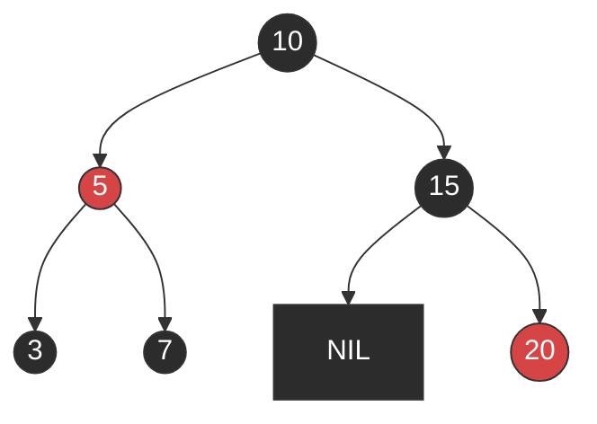
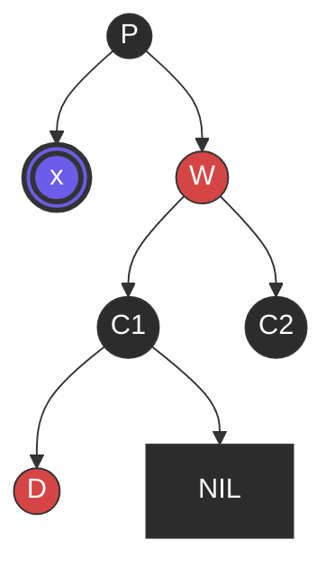
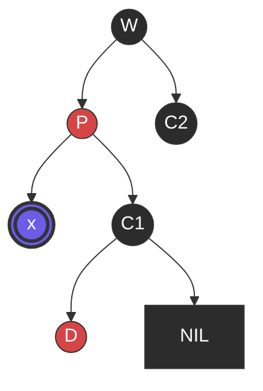
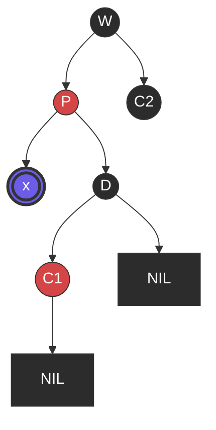
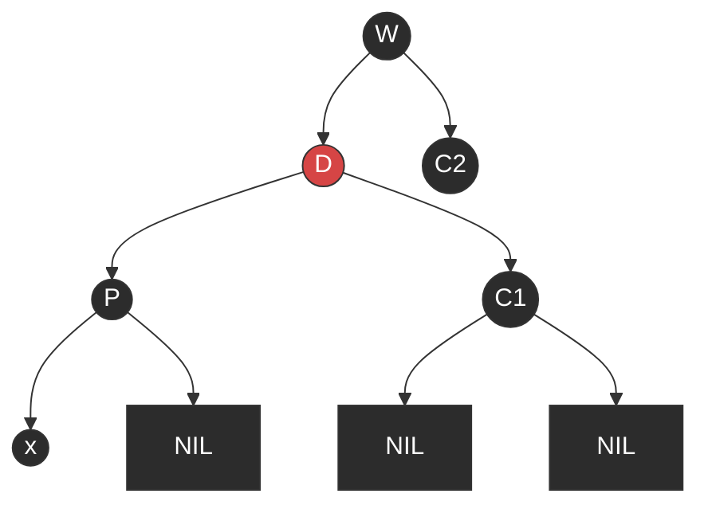

## 二叉查找树

红黑树本质上就是一棵二叉查找树（Binary Search Tree, BST）。BST 的定义、性质与退化成链表后性能变差的问题，见 [二叉树与二叉查找树 §二叉查找树 Binary Search Tree](./binary-tree.md#二叉查找树-binary-search-tree)。

## 红黑树的性质

红黑树在二叉查找树的基础上增加了着色和相关的性质，使得树相对平衡，从而保证查找、插入、删除的时间复杂度最坏为 O(log n)。要保证一棵有 n 个结点的红黑树的高度始终保持在 O(log n)，需要满足以下 5 条性质：

1. 每个结点要么是红色，要么是黑色。
1. 根结点是黑色。
1. 每个叶结点（即树尾端的 NIL 指针或 NULL 结点）是黑色。
1. 如果一个结点是红色，那么它的两个子结点都是黑色。
1. 对于任一结点，其到叶结点的每一条路径都包含相同数目的黑色结点。

正是这 5 条性质，使得一棵有 n 个结点的红黑树始终保持 O(log n) 的高度，从而解释了上面"查找、插入、删除的时间复杂度最坏为 O(log n)"这一结论的原因。

### 示例：一棵合法的红黑树

下面几张图都用同一套配色：红色底色代表红色节点，深色底色代表黑色节点（NIL 叶子也按黑色处理）；后面删除修复的例子里还会多一种"双重黑"的颜色，专门标出来。

对照上面的 5 条性质检查这棵树：根 `10` 是黑色；红色节点 `5`、`20` 的子节点都是黑色（`5` 的子节点 `3`、`7` 是黑色，`20` 的两个子节点是图中未画出的 NIL，同样按黑色计）；从根到任意一条路径上的黑色节点数都是 3（例如 `10 → 5 → 3 → NIL` 与 `10 → 15 → 20 → NIL` 都是 3 个黑色节点），满足黑高一致。

## 删除修复：为什么最多需要 3 次旋转

红黑树删除引起失衡时，最多只需要 3 次旋转就能恢复平衡（下一节「红黑树与 AVL 树对比」会用到这个结论）。这里用一个经典例子（对应教科书里删除修复的 Case 1 → Case 3 → Case 4 连续触发的最坏情况）走一遍完整过程。

约定：被删除的是一个真实的黑色叶子节点（它自己的两个子节点原本都是 NIL）。删除后这个位置没有节点可以顶替，按 BST 规则变成 NIL；但这个位置删除前是黑色，现在换成 NIL 却只算 1 次黑色，比删除前少算了一次黑高，破坏了性质 5。

**双重黑（double black）**：为了让 `RB-DELETE-FIXUP` 修复算法统一处理上面这个"少一次黑高"的问题，教科书的做法不是直接判断黑高够不够，而是让占据这个位置的 NIL 临时"多背一份黑色"——本来 1 个 NIL 只算 1 次黑色，现在让它算 2 次，记为**双重黑**，用 `x` 表示。这样一来，从任何路径经过 `x` 时黑色计数都和删除前一样，性质 5 暂时"看起来"仍然满足，但双重黑不是红黑树正式定义里的颜色，只是修复算法为了统一处理各种情况而引入的临时记账手段——修复的目标就是通过旋转/变色把这份多出来的黑色转移或消掉，让 `x` 变回普通黑色（NIL 或黑色节点），此时修复才算结束。`p` 是 `x` 的父节点，`w` 是 `x` 的兄弟节点。下面只展示需要修复的局部子树，`p` 的父节点及其他子树不受影响，图中省略。图中用紫色表示"双重黑"。

> 双重黑不等于 NIL，只是本例的起点（删除黑色叶子）恰好让两者重合。双重黑描述的是"某个位置多背了一份黑色"这个状态，不限定这个位置上坐的是 NIL 还是真实节点：例如后面 Case 2（兄弟 `w` 黑色且两个子节点都黑）的处理方式是把双重黑从 `x` 转移到父节点 `p`（即 `x = x.p`），此时新的 `x` 通常就是一个真实存在的黑色内部节点，不再是 NIL。
>
> 下文的 **Case 1~4** 是 `RB-DELETE-FIXUP` 修复算法内部的情形分类。Case 用来描述修复过程中双重黑节点 `x` 的兄弟 `w` 及其子节点的颜色组合，据此决定做哪种旋转/变色；性质则是红黑树任何时刻都必须满足的静态不变式。以 `x` 是左子为例（`x` 是右子时左右对称），4 种 Case 分别是：
>
> - **Case 1**：兄弟 `w` 是红色。（`w` 红色时它的两个子节点必为黑色，先通过一次旋转把情况转化成 Case 2/3/4 之一，不会直接结束修复。）
> - **Case 2**：兄弟 `w` 是黑色，且 `w` 的两个子节点都是黑色。（把 `w` 改红、双重黑上移给 `p`，继续向上修复或结束，不发生旋转。）
> - **Case 3**：兄弟 `w` 是黑色，`w` 的近侄（左子）红色、远侄（右子）黑色。（先做一次旋转把情况转化成 Case 4。）
> - **Case 4**：兄弟 `w` 是黑色，`w` 的远侄（右子）是红色（近侄颜色不限）。（最后一步，一次旋转后修复结束。）
>
> 「近侄／远侄」不是固定指某一侧子节点，而是相对 `x` 所在的那一侧而言：`w` 是 `x` 的兄弟，`w` 的两个子节点因此是 `x` 的"侄子"（不是 `x` 自己的子节点，用亲属关系类比区分开，和插入修复里把"父节点的兄弟"称为"叔叔节点"是同一套说法）。跟 `x` 同侧、离得更近的那个叫**近侄**，异侧、离得更远的那个叫**远侄**。上面以 `x` 是左子为例，此时 `w` 是右子，`w` 的左子（跟 `x` 同侧）是近侄、右子是远侄；如果 `x` 换成右子，近侄／远侄也会跟着镜像对调。英文常见说法是 **near nephew / far nephew**（也有写作 inner/outer 或 close/distant nephew 的），不过 CLRS 原书并未使用这套比喻，而是直接用 `w.left`/`w.right` 描述。

**初始状态**：`p` 黑色，`x` 双重黑（左子），兄弟 `w` 是红色 —— 满足 **Case 1**（兄弟为红色）。`w` 的两个子节点 `c1`、`c2` 因此必为黑色；`c1` 的左子 `d` 是红色，右子是 NIL（黑色）。

**第 1 次旋转（Case 1）**：`w` 改为黑色，`p` 改为红色，对 `p` 做一次左旋。`w` 顶替 `p` 的位置，`c1` 变成 `p` 的新右子（`x` 的新兄弟）。

此时 `x` 的新兄弟是 `c1`（黑色），`c1` 的近侧子节点（左子）`d` 是红色，远侧子节点（右子，NIL）是黑色 —— 满足 **Case 3**（兄弟黑色、近侄红、远侄黑）。

**第 2 次旋转（Case 3）**：`d` 改为黑色，`c1` 改为红色，对 `c1` 做一次右旋。`d` 顶替 `c1` 的位置，`c1` 变成 `d` 的右子。

此时 `x` 的新兄弟是 `d`（黑色），`d` 的远侧子节点（右子）`c1` 是红色 —— 满足 **Case 4**（兄弟黑色、远侄红）。

**第 3 次旋转（Case 4）**：`d` 继承 `p` 的颜色（红色），`p` 改为黑色，`c1` 改为黑色，对 `p` 做一次左旋。旋转后 `x` 不再是双重黑，恢复为普通黑色 NIL，修复结束。

可以验证：修复前后，从 `w` 出发到任意一条路径上的黑色节点数始终是 3（比如 `w → d → p → x` 与 `w → d → c1 → NIL` 都是 3 个黑色节点），红黑树的 5 条性质全部满足。整个过程恰好用了 3 次旋转（Case 1、Case 3、Case 4 各一次），这也是删除修复旋转次数的最坏情况——多数情况下（比如直接命中 Case 2 或只触发 Case 1）用不了这么多次。

## 红黑树与 AVL 树对比

红黑树不满足 AVL 树的平衡条件（即任意结点的左右子树高度差最多为 1）。红黑树用非严格的平衡换取增删结点时旋转次数的降低：任何不平衡都能在三次旋转之内解决；而 AVL 是严格平衡树，增删结点时根据情况旋转次数可能比红黑树多。

具体差异：

- **插入**：引起失衡时，AVL 树和红黑树都最多只需要 O(1) 次（1~2 次）旋转。
- **删除**：引起失衡时，AVL 树最坏情况下需要沿被删结点到根结点的路径逐层调整平衡，旋转次数为 O(log n)；红黑树最多只需要 3 次旋转，仍是 O(1)（完整例子见上文「[删除修复：为什么最多需要 3 次旋转](#删除修复为什么最多需要-3-次旋转)」）。
- **查找**：AVL 树结构更严格平衡，查找效率略高于红黑树（红黑树允许多一层不平衡，查找最多多一次比较）。
- **插入/删除频率**：AVL 树高度平衡带来的代价是插入、删除更容易触发再平衡，需要频繁调整；红黑树为维持红黑性质所做的旋转开销更小，因此在大量插入删除的场景下效率更高。

综合来看：如果搜索次数远多于插入和删除，选 AVL 树；如果搜索、插入、删除的次数相差不大，选红黑树。多数关联容器需要在读写性能之间折中，因此红黑树凭借稳定的综合性能，成为 C++ STL、Java `TreeMap`/`TreeSet`、Linux 进程调度（[CFS](../linux/cfs.md)）等场景的常见选择。

## AVL 树

AVL 树是最早出现的自平衡二叉查找树，得名于发明者 G.M. Adelson-Velsky 和 E.M. Landis。它的严格平衡条件、四种失衡情况的旋转（LL/RR/LR/RL）、插入删除复杂度等细节见独立文章 [AVL Tree, AVL 树](./avl-tree.md)。

## 应用场景

- **内存 vs 磁盘**：数据能完全放进内存时，红黑树的时间复杂度比 B 树低；数据量较大、以外存为主时，B 树因读磁盘次数少而更快。
- **进程调度**：Linux 的完全公平调度器（CFS）用红黑树管理可运行进程，详见 [CFS, Completely Fair Scheduler 完全公平调度器](../linux/cfs.md)。
- **关联容器**：红黑树的典型用途是实现关联数组，如 C++ STL 的 `map`/`set`、Java 的 `TreeMap`/`TreeSet`。

## 应用：JDK 8 HashMap

JDK 8 的 `HashMap` 在某个桶（bucket）的链表长度超过阈值时会把链表转换成红黑树，将该桶最坏情况下的查找复杂度从 O(n) 降到 O(log n)，具体实现见 [HashMap](../language/java/hashmap.md#红黑树优化jdk-18-新增-treenode)。

## 参考

- [The Art Of Programming（July）— 二叉查找树与红黑树](https://github.com/julycoding/The-Art-Of-Programming-By-July/blob/master/ebook/zh/03.01.md)
- 知乎回答（作者 Acjx）：[红黑树与 AVL 树对比](http://www.zhihu.com/question/20545708/answer/58717264)
- 知乎回答（作者 陈智超）：[红黑树与 AVL 树对比](http://www.zhihu.com/question/43744788/answer/98258881)
- 知乎回答（作者 Coldwings）：[红黑树与 AVL 树对比](http://www.zhihu.com/question/20545708/answer/44370878)
- CSDN：[红黑树的好处及用途](http://blog.csdn.net/klarclm/article/details/7780319)
- CSDN（作者 mmshixing，CC 4.0 BY-SA）：[红黑树与 AVL 树](https://blog.csdn.net/mmshixing/article/details/51692892)
- 简书：[红黑树应用于内存数据库的说明](https://www.jianshu.com/p/e3506cee4010)
