## dev env

### linux ubuntu

- kafka
- containerd + nerdctl
- yubico login
- selfsigned cert, use for nginx

- citrix OK
  - 远程桌面正常使用
  - 传文件, 用桌面版的 citrix
- Jetbrains OK
- webex
  - fcitx 输入中文, 2404 使用正常, 字体需要 配置一下
  - 会议模式 ok, 音质销差但是不影响
  - 共享屏幕, 用网页版
- 中文输入法 fcitx
- outlook 用网页版 或者 Thunderbird
- gnome terminal: 可以配置保留所有命令行的输出, windows terminal 只能保留 32767 行
- containerd + nerdctl

- install chrome, download deb
- install vscode, download deb
- install 1password, download deb
- export ssh private key from 1password


```bash
sudo apt install git
# ubuntu install python3 by default

# pdm depends on python3.12-venv
sudo apt install python3.12-venv
curl -sSL https://pdm-project.org/install-pdm.py | python3 -
export PATH=/home/ywang6/.local/bin:$PATH

sudo apt-get install libpq-dev python3-dev clang


# sudo nopassword
# install zsh
# install fcitx5
```

### windows

```bash
# install latest version of powershell
https://github.com/PowerShell/PowerShell/releases/tag/v7.1.0

# 以 admin 启动 powershell, 执行以下命令
choco install golang
choco install nodejs-lts
choco install python2
```


- winget 安装软件不知道会安装到哪
- winget 需要 admin cmd, 但是 run as admin 经常报错, 几乎用不了.
- cmd 没有 shell 好用, 也许 powershell 会更好用, 但是需要学习一下
  - 复制到 cmd里的字符串过长会折行显示,但是其实并不在同一行, 从最后一行开始删除只能删到行首, 不能删到上面一行.
- curl 在 windows 下不正常
  - powershell 里 curl --version 执行不了
  - cmd里能执行 curl --version
  - 同样的 curl 命令, linux能执行 windows里执行不了, 有可能是因为命令参数是多行的. curl用最新版本,命令 改成一行也不行.. 神奇
- 全局查找文件, 在资源管理器里搜索之后点击打开文件所在位置然后返回, 已经搜到的文件都 不见了, 得重新搜
- Command Prompt's character escaping rules are both archaic and awful.  https://superuser.com/questions/1016710/how-to-make-a-curl-post-call-in-windows 
- 让 curl 命令在 windows 下正常运行需要花太多精力...
- 用 golang 写 Api 的测试, 有时候要执行 Shell 命令, 比如 执行 `nft add rule table0 chain0 tcp sport 1025 drop` 去 禁用掉邮件服务的连接, 测试重发, 不是说不能在 win 里做, 如果在 win 里做的话就要再学习一下 windows 有没有类似 iptables, nftables 之类的工具, 假设找到了也研究出来怎么用了, 这些知识也只能适用于 windows, 如果开发环境在 linux 里, 就可以去研究 iptables, nftabls, 在解决生产环境的问题的时候, 这些知识也是可以用到的.


- 搜狗五笔
- vscode
- git
- TortoiseGit
- VirtualBox
- Bitwarden
- Chrome
- Firefox
- Python
- Go
- Flameshot, Linux/Win

```puml
@startuml
skinparam componentStyle rectangle

[LevelDB] as leveldb
[LevelDB JNI] as leveldb_jni
leveldb--leveldb_jni
[Memtable]
leveldb--Memtable
[Immutable]
leveldb--Immutable
[SST] as sst
leveldb--sst
[SkipList] as SkipList #C5E1A5
Memtable--SkipList  
[红黑树] as red_black_tree
SkipList--red_black_tree
[Block]
sst--Block
[Meta Block] as meta_block
Block--meta_block
[布隆过滤器] as bloom_filter
meta_block--bloom_filter
[AtomicPointer]
leveldb--AtomicPointer

[thread]
[Future]
[FutureTask]
Future--FutureTask
[VarHandle] as VarHandle #C5E1A5
FutureTask--VarHandle

[java9]
java--java9
VarHandle--java9
[java8]
java--java8
[Stream API] as stream_api
java8--stream_api
[get]
FutureTask--get
[LockSupport]
get--LockSupport

[interrupt]
[cancel]
FutureTask--cancel
cancel--interrupt
[MethodHandles]
VarHandle--MethodHandles
[atomic]
VarHandle--atomic
[JUC] as juc
atomic--juc
[Unsafe]
juc--Unsafe
[volatile]
juc--volatile
[AtomicIntegerArray]
atomic--AtomicIntegerArray
AtomicIntegerArray--Unsafe
[CAS]
[AtomicInteger]
atomic--AtomicInteger
AtomicInteger--CAS
[FieldUpdater] 
atomic--FieldUpdater
[reflect]
FieldUpdater--reflect
CAS--Unsafe
[Acquire]
[Release]
volatile--Acquire
volatile--Release
[memory reording] as memory_reorder
volatile--memory_reorder
[load/store] as load_store
memory_reorder--load_store
[lock-free] as lock_free
memory_reorder--lock_free
[内存模型] as mem_mode
memory_reorder--mem_mode
[strong]
[weak]
mem_mode--strong
mem_mode--weak
[RISC]
[CISC]
load_store--RISC
load_store--CISC
[lookup]
MethodHandles--lookup
[AQS]
juc--AQS
[kafka]
[batch.size] as batch_size
kafka--batch_size
[buffer.memory] as buffer_memory
kafka--buffer_memory
[max.block.ms] as max_block_ms
kafka--max_block_ms
buffer_memory--max_block_ms
[linger.ms] as linger_ms
kafka--linger_ms
batch_size--linger_ms
[CopyOnWriteMap]
[producer]
kafka--producer
producer--CopyOnWriteMap
[ArrayDeque]
producer--ArrayDeque
[Queue] as queue
leveldb_jni--queue
[AbstractQueue] 
queue--AbstractQueue
[BlockingQueue]
queue--BlockingQueue
[Condition\nReentrantLock] as Condition
leveldb_jni--Condition
[ReentrantLock]
LockSupport--ReentrantLock
[synchronized] as synchronized #FF8A80
ReentrantLock--synchronized
[mutex/锁/互斥锁] as mutex
ReentrantLock--mutex
[futex]
mutex--futex
[一致性] as consistency
[最终一致性] as eventual_consistency
[CAP] as cap
[BASE] as base
[分区容忍] as partition_tolerance
[分区] as partition
[MySQL]
[ACID] as acid
[Netty单线程] as netty_single_thread #90CAF9
[netty] as netty #FF8A80
netty_single_thread--netty
[堆外内存] as omem
netty--omem
[NIO] as NIO #C5E1A5
netty--NIO
[DirectByteBuffer\n-unsafe] as DirectByteBuffer
NIO--DirectByteBuffer
[AIO]
NIO--AIO
[TCP Receive Buffer] as tcp_receive_buffer
NIO--tcp_receive_buffer
[socket.read()] as socket_read
tcp_receive_buffer--socket_read
[selector]
socket_read--selector
[epoll]
selector--epoll
[I/O 多路复用] as IO_multiplexing
epoll--IO_multiplexing
[poll]
epoll--poll
[select]
epoll--select
[零拷贝] as zero_copy
[IO] as io

[页缓存] as page_cache
[文件系统] as file_system
[直接I/O] as direct_io
[mmap]
[splice]
[上下文切换] as context_switch
[fd]
[ext4]
[xfs]
file_system--xfs
[Paxos] as paxos
 
[etcd]
[Chubby\nmysql\nzookeepet\nredis\netcd] as Chubby 
[zab]
[2pc]

cap--base
consistency--cap
partition_tolerance--partition
MySQL--partition
consistency--eventual_consistency
consistency--acid
consistency--base
consistency--2pc
consistency--paxos
cap--partition_tolerance
netty--zero_copy
io--page_cache

page_cache--file_system
io--zero_copy
io--direct_io
zero_copy--direct_io
zero_copy--mmap
zero_copy--splice
file_system--fd
file_system--ext4

consistency--etcd

paxos--zab

[jvm]
[gc]
jvm--gc
[模块化] as jpms
java9--jpms

[模式] as pattern
[策略模式] as strategy_pattern
pattern--strategy_pattern
@enduml
```



### palette

```r
#90CAF9   Point
#FF8A80   Index
#C5E1A5   Done
```

## dev

- archlinux dev env init
- windows dev env

### 语言

- Java, jdk8
- Golang
- Shell Script

#### IDE

- IDEA
- VSCODE
- Eclipse

#### 中间件, Middleware

- Redis
- Leveldb
- zookeeper
- influxdb
- kafka
- Nginx
- MySQL

### 第三方包

- io.netty:netty-all:jar:4.1.22.Final, [https://wiloon.com/netty](https://wiloon.com/netty)
- junit:junit:jar:4.12
- com.squareup.okhttp3:okhttp:jar:4.7.2
- com.google.guava:guava:jar:19.0
- org.apache.logging.log4j:log4j-api:jar:2.13.0
- org.slf4j:slf4j-api:jar:1.7.30
- com.alibaba:fastjson:jar:1.2.73
- redis.clients:jedis:jar:3.1.0
- com.alibaba:druid:jar:1.1.21
- org.apache.curator:curator-framework:jar:4.2.0
- com.google.protobuf:protobuf-java:jar:3.10.0
- com.moandjiezana.toml:toml4j:jar:0.7.2
- io.dropwizard.metrics:metrics-core:jar:4.1.2
- commons-lang:commons-lang:jar:2.6
- commons-codec:commons-codec:jar:1.14

### OS/linux/tool

- Windows
- Archlinux
- CentOS
- ChromeOS
- Ubuntu
- vim
- tcpdump
- emacs
- grep
- sed
- awk
- putty
- xshell
- windows terminal
- ansible
- KVM

### other

- maven, setting.xml
- gradle
- plantuml
- xmind
- svn
- git
- Jenkins
- Gocd
- Grafana
- 华为云
- 阿里云
- AWS


- 字体 [https://blog.wiloon.com/?p=6077](https://blog.wiloon.com/?p=6077)

### board, dev server

- ro....dx
- ro....dx-server
- pingd
- pingd-server
- nginx
- influxdb
- grafana
- redis
- mariadb

## archlinux

```bash
pacman -S vim git maven jdk-openjdk go nodejs npm nethogs

```
