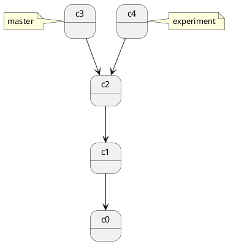
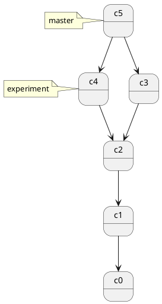
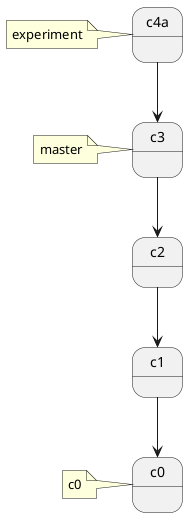
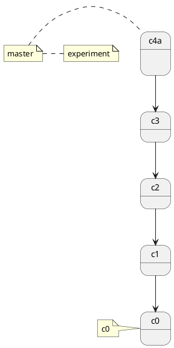

- git merge
- git rebase
  - interactive rebase
- Join two or more development histories together

## merge 合并

用于将两个或多个分支的更改合并到一起。它通常用于将一个分支上的开发成果合并到当前分支（如将 feature 分支合并回 main 分支）。其主要作用是整合不同开发者或分支上的工作，保持代码库的统一和最新。

```bash
# 基本用法
# git merge <branch-name>
# merge 默认会把 commit 的历史都合并进来
# 把 branch_0 合并到当前分支
git merge branch_0
# -m 参数用于指定合并提交（merge commit）的说明信息，即合并时生成的 commit message。
git merge branch_0 -m "MSG0"
# 禁用 Fast forward
git merge branch_0 -m "merge with no-ff" --no-ff
```

### 合并方式

#### Fast-forward（快进合并）

如果当前分支没有新的提交，仅仅是落后于目标分支，Git 会直接把指针向前移动到目标分支的位置，这种合并不会产生新的合并提交。快速合并，看不出做过合并。快进合并后不会留下一个明显的"feature 分支合并节点"，只有一条线性的记录。

**特点：**
- 不创建 merge commit
- 分支指针直接前移
- 提交历史呈线性
- 无法看出曾经有分支存在

**示意图：**
```
合并前：
main:     A---B
               \
feature:        C---D

合并后（Fast-forward）：
main:     A---B---C---D
feature:            C---D
```

#### 普通合并（Non fast-forward）

no fast-forward 模式`--no-ff`，可以保留分支拓扑(分支曾经存在并被合并)。图上能看到分叉并在 merge commit 汇合，之后仍可追溯某个提交来自哪个特性分支。会生成一个新的 commit-id。

**特点：**
- 强制创建 merge commit
- 保留分支拓扑结构
- 可以清楚地看到分支合并历史
- 便于整体回滚某个功能

**示意图：**
```
合并前：
main:     A---B
               \
feature:        C---D

合并后（--no-ff）：
main:     A---B-------M (merge commit)
               \     /
feature:        C---D
```

**为什么要禁用 Fast-forward？**

使用 `--no-ff` 参数的主要原因：

1. **保留功能边界** - 清晰地标记出哪些提交属于同一个功能分支
2. **便于回滚** - 可以通过 `git revert -m 1 <merge-commit>` 一次性回滚整个功能
3. **更好的历史追溯** - 明确显示功能何时被合并
4. **符合 Git Flow 规范** - 大多数分支管理策略推荐使用 `--no-ff`

**对比示例：**

| 特性 | Fast-forward | --no-ff |
|------|-------------|---------|
| Merge Commit | 不创建 | 创建 |
| 分支历史 | 线性 | 保留分支结构 |
| 回滚操作 | 逐个提交回滚 | 可一次回滚整个功能 |
| 历史追溯 | 难以区分功能边界 | 清晰显示功能边界 |
| 适用场景 | 个人分支更新 | 功能分支合并到主分支 |

**配置默认行为：**

```bash
# 设置合并时总是禁用 fast-forward
git config --global merge.ff false

# 设置合并时只在可能的情况下 fast-forward
git config --global merge.ff only

# 恢复默认行为（允许 fast-forward）
git config --global --unset merge.ff
```

**参考资料：**
- `Benjamin Sandofsky` 的《Understanding the Git Workflow》

### git merge --squash

```bash
# git merge --squash, 把多次 commit 的历史合并成一次 commit
# 把 branch1 的提交 合并 到 branch0
git switch branch0
git merge --squash branch1
git commit -m "comments0"
```

```bash
# 解决Git报错:error: You have not concluded your merge (MERGE_HEAD exists).
git merge --abort
```

开发任务分叉到两个不同分支，又各自提交了更新。



git merge 会把 c2, c3, c4 做三方合并



特点：自动创建一个新的 commit
如果合并的时候遇到冲突，仅需要修改后重新 commit
优点：记录了真实的 commit 情况，包括每个分支的详情
缺点：因为每次 merge 会自动产生一个 merge commit，所以在使用一些 git 的 GUI tools，特别是commit比较频繁时，看到分支很杂乱。

```bash
# git merge 不加参数的时候合并 local branch 和 local repo 对应的 branch
git merge
git merge b0

git status

git mergetool
  
#"The merge tool bc is not available as" 'bcompare'
git config -global merge.tool vimdiff
:diffg RE " get from REMOTE
:diffg BA " get from BASE
:diffg LO " get from LOCAL
:wqa
```

### 把 master merge 到 feature 上

```bash
git checkout feature
git merge master
# 或者
git merge master feature
```

### ort strategy

https://www.zhihu.com/question/518192414/answer/2369886778

https://morningspace.github.io/tech/git-merge-stories-2/

## git rebase

```Bash
# <upstream>: 上游分支, 比如 dev 分支, <branch>: topic 分支, 或者叫 feature 分支
git rebase [-i | --interactive] [<options>] [--exec <cmd>] [--onto <newbase> | --keep-base] [<upstream> [<branch>]]
git rebase [-i | --interactive] [<options>] [--exec <cmd>] [--onto <newbase>] --root [<branch>]
git rebase (--continue | --skip | --abort | --quit | --edit-todo | --show-current-patch)
```

### options

- -i, --interactive    let the user edit the list of commits to rebase, 交互模式

- git rebase 命令的文档描述是 Reapply commits on top of another base tip
- rebase 是在另一个 base 之上重新应用提交, 有人把它翻译成 "变基"
- rebase 通常用于重写/合并提交历史。得到更简洁的提交历史, 没有 merge commit
- 跟 merge 一样, rebase 也会遇到冲突
- 不要公共分支上执行 rebase, 对任何已经提交到公共仓库中的 commit 进行修改（你自己一个人玩的分支除外）
- 如果合并出现代码问题不容易定位，因为重写了历史 (re-write history) 

### 使用场景

- 把 dev 分支的 commit 更新到 feature 分支
  - 在 feature 分支开发过程中
  - 在 feature 分支跟 dev 分支合并前
- 整理 feature 分支的 commit 历史

#### 把 dev 分支的 commit 更新到 feature 分支

在开发过程中把其它人提交到 dev 分支的 commit, 更新到自己的 feature 分支.

```Bash
# rebase 之前, dev 分支先拉取远程仓库最新的 commit.
git switch dev
git pull
git switch feature_0
git rebase dev
# 有可能需要处理冲突
# 然后 git push -f
git push -f
```

#### 用交互模式整理 feature 分支 commit 历史, 同时把 feature 分支 合并到 dev 分支

1. `git rebase -i dev`
2. git 显示出 feature 分支的所有新的 commit.
3. 修改 除每一行之外其它行的 pick 到 s
4. 修改 commit msg
5. 有冲突的话处理冲突
6. push -f

#### git rebase 交互模式, 整理 feature 分支的 commit 历史

1. git switch feature0
2. git pull
3. git log 找到 rebase 的基准点 (base commit), 比如 (origin & main)
4. git rebase -i commit_id_x, 或者 git rebase -i HEAD~3
5. 第一行 保留 pick, 保留一个 commit, vim 替换命令 `:%s/^pick/squash/gc`
6. 其它后面的行用 squash, 合并其它 commit.
7. `:x` 保存退出
8. 然后会提示修改 commit message
9. 修改好之后保存退出 `:x`
10. 把合并之后的 commit 强制推送到仓库 `git push -f` (不要在公共分支上操作, 只在特性分支, 只有自己在用的分支操作.)
11. 如果以上命令是在 shell 里操作的, 回到 jetbrain 之后要操作一次 reload from dick

### feature 分支合并到 dev 分支

合并之前可以先整理 feature 分支的 commit 历史

#### 先在 feature 分支上做一次 rebase

1. git switch branch_feature0
2. branch_feature0 分支和 dev 分支都做一次 git pull
   1. git pull
   2. git fetch origin dev:dev
3. `git rebase dev`
4. 如果有冲突的话, 就处理冲突
   1. 有冲突的时候大概会显示成这样 `CONFLICT (content): Merge conflict in path/to/foo.txt`
   2. 处理冲突 `vim path/to/foo.txt`, `git add path/to/foo.txt`
   3. git rebase --continue/--skip/--abort
5. git push -f
6. 如果以上命令是在 shell 里操作的, 回到 jetbrain 之后要操作一次 reload from dick

#### 再把 feature 分支合并到 dev 分支

1. 用 github PR 做 merge, 或者用 命令行 merge
2. 用命令行 merge
3. git switch dev
4. git merge --squash branch_feature0

## rebase 过程中有可能 遇到 冲突

提示信息如下

```bash
Auto-merging path/to/file/foo.bar
CONFLICT (content): Merge conflict in path/to/file/foo.bar
error: could not apply 9f79272... msg0
hint: Resolve all conflicts manually, mark them as resolved with
hint: "git add/rm <conflicted_files>", then run "git rebase --continue".
hint: You can instead skip this commit: run "git rebase --skip".
hint: To abort and get back to the state before "git rebase", run "git rebase --abort".
Could not apply 9f79272... msg0
```

```bash
# commands
git rebase branch0
git rebase remotes/origin/branch0

git rebase --edit-todo
git rebase --continue
git rebase --abort
```

1. 假设我们有一个 main 分支, 最近一次提交是 A
2. 我们从 main 分支创建了 branch_feature0 分支进行新功能的开发, A 就是 branch_feature0 的基础 (base).
3. branch_feature0 新增了两个提交 D, E, 时间 T0, T1.
4. main 分支新增了两个提交 B, C, 时间 T2, T3, 并且 已经在 main分支 git pull working tree.
5. 切换到 branch_feature0 分支
6. 在 branch_feature0 分支上执行 git rebase main, 把 branch_feature0 分支的 base 变成 main
7. 执行 rebase 之后, 在 branch_feature0 执行 git log, 时间戳顺序是错的: B> C> D> E
8. git push origin branch_feature0:branch_feature0 会提示 Updates were rejected because the tip of your current branch is behind its remote counterpart. Integrate the remote changes (e.g."git pull ...") before pushing again.
9. git push -f, push 的时候一定要加 --force, 否则服务器不会接受 rebase 的 分支.
10. git switch main
11. git merge branch_feature0, 执行一次 Fast forward merge
12. 此时 main 和 branch_feature0 都指向了最新的提交

rebase 的执行过程是首先找到这两个分支（即当前分支 branch_feature0, rebase 操作的目标分支 main 的最近共同祖先提交 A，然后对比当前分支 (branch_feature0) 相对于该祖先 (A) 提交的历次提交（D 和 E），提取相应的修改并存为临时文件 (patch)，然后将当前分支 (branch_feature0) 指向目标分支 main 的最新的提交 C, 最后以此作为新的 base 将之前另存为临时文件 (patch) 的修改依序应用。 (commit 的时间戳有可能是乱序的)

我们也可以按上文理解成将 branch_feature0 分支的 base 从提交 A 改成了提交 C，看起来就像是从提交 C 创建了该分支，并提交了 D 和 E。但实际上这只是「看起来」，在内部 Git 复制了提交 D 和 E 的内容，创建新的提交 D' 和 E' 并将其应用到特定 base 上（A>B>C）。尽管新的 branch_feature0 分支和之前看起来是一样的，但它是由全新的提交组成的。

```bash
# checkout branch0
git check branch0
# 保存 branch0 的修改, 保存成 patch 文件, 把 branch0 更新到 main 最新的修改, 把 patch 文件应用到  main 分支上
git rebase main
# 另外一种写法, 不需要 checkout branch0 直接执行, git 会先切换到 topicbranch 再做 rebase
# git rebase <basebranch> <topicbranch>
git rebase main branch0

git checkout master
git merge branch0
```

rebase 的原理是首先找到这两个分支（即当前分支 experiment、变基操作的目标基底分支 master） 的最近共同祖先 C2，然后对比当前分支相对于该祖先的历次提交，提取相应的修改并存为临时文件， 然后将当前分支指向目标基底 C3, 最后以此将之前另存为临时文件的修改依序应用。

你在查看一个经过变基的分支的历史记录时会发现，尽管实际的开发工作是并行的， 但它们看上去就像是串行的一样，提交历史是一条直线没有分叉。

在对两个分支进行变基时，所生成的“重放”并不一定要在目标分支上应用



回到 master 分支，进行一次快进合并。

```bash
# 如果在用 github, 最好是走 github 的 PR
# 如果用过 git merge 再去操作 PR, 会发现 "There isn't anything to compare", 没有什么可以 PR的了, 因为两个分支 是一样的....
git checkout main
git merge feature0
```



### rebase 做了什么

- 场景：分支合并

从 master 分支切出一个 dev 分支 (feature1)，进行开发再执行 git rebase master

首先，git 会把 feature1 分支里面的每个 commit 取消掉；
其次，把上面的操作临时保存成 patch 文件，存在 .git/rebase 目录下；
然后，把 feature1 分支更新到最新的 master 分支；
最后，把上面保存的 patch 文件应用到 feature1 分支上；

动词一共有如下几个：

- edit
- reword
- drop
- squash
- fixup

#### edit

edit 命令表示你告诉了 rebase，当在应用这个 commit 的时候，停下来，等待你修改了文件 和/或 修改了 commit message之后在继续进行 rebase。

上面这句很不好理解，建议自己尝试一下，就明白了. 总之这个命令可以让你既能修改文件，又能修改 commit message

#### reword

reword 命令可以让你修改 commit message。当你使用这个命令后，保存这个文件并退出，执行 git rebase continue 命令之后会再次打开一个文件，让你对这个 commit 的 commit message 进行修改，再次保存退出之后继续进行 rebase

#### drop

drop 命令表示你要丢弃这个 commit 以及它的修改。同样可以删除这一行来表示。 (在 git 比较低的版本中，比如我使用的 1.9.0 版本中，只能通过删除那一行的方式来做，不支持 drop 命令）

#### squash 和 fixup

这两个命令都是用来将几个 commit 合并为一个的。其中, fixup 命令，rebase 的时候将会直接忽略掉它的 commit message，而 squash 命令，则会在 git rebase --continue 之后打开一个文件，该文件中将会出现所有设置为 squash 的 commit，这时删除掉多余的 commit message，留下 (或者修改）一行作为合并之后的 commit 的 commit message。

到此为止，讲这个文件保存并退出，输入 git status 查看需要进行什么操作 (比如需要解决冲突），之后执行 git rebase --continue 即可。

执行之后会根据你使用的命令的不同进行不同的操作，比如有的可以直接 rebase 有的则会打开一个文件让你进行一些操作，具体信息见上面的描述。

[https://git-scm.com/book/zh/v1/Git-%E5%88%86%E6%94%AF-%E5%88%86%E6%94%AF%E7%9A%84%E6%96%B0%E5%BB%BA%E4%B8%8E%E5%90%88%E5%B9%B6](https://git-scm.com/book/zh/v1/Git-%E5%88%86%E6%94%AF-%E5%88%86%E6%94%AF%E7%9A%84%E6%96%B0%E5%BB%BA%E4%B8%8E%E5%90%88%E5%B9%B6)
  
[http://blog.hanghu.me/git/2017/03/08/The-merge-tool-bc-is-not-available-as-bcompare.html](http://blog.hanghu.me/git/2017/03/08/The-merge-tool-bc-is-not-available-as-bcompare.html)
  
[http://www.rosipov.com/blog/use-vimdiff-as-git-mergetool/](http://www.rosipov.com/blog/use-vimdiff-as-git-mergetool/)

作者：AlvinStar
链接：[https://www.jianshu.com/p/f23f72251abc](https://www.jianshu.com/p/f23f72251abc)
来源：简书
著作权归作者所有。商业转载请联系作者获得授权，非商业转载请注明出处。

为什么要保持提交历史的整洁
一个看上更整洁地提交历史有什么好处？

满足某些开发者的洁癖。
当你因为某些 bug 需要回溯提交历史时，更容易定位到 bug 是从哪一个提交引入。尤其是当你需要通过 git bisect 从几十上百个提交中排查 bug，或者有一些体量较大的功能分支需要频繁的从远程的主分支拉取更新时。
使用 rebase 来将远程的变更整合到本地仓库是一种更好的选择。用 merge 拉取远程变更的结果是，每次你想获取项目的最新进展时，都会有一个多余的 merge 提交。而使用 rebase 的结果更符合我们的本意：我想在其他人的已完成工作的基础上进行我的更改。

### rebase 交互模式

```bash
rebase -i
git rebase -i  [startpoint]  [endpoint]
git rebase -i commit0
```

#### 交互模式会用到的一些命令

- pick：保留该 commit（缩写:p）
- reword：保留该 commit，但我需要修改该 commit 的注释（缩写:r）
- edit：保留该 commit, 但我要停下来修改该提交(不仅仅修改注释)（缩写:e）
- squash：将该 commit 和前一个 commit 合并（缩写:s）
- fixup：将该 commit 和前一个 commit 合并，但我不要保留该提交的注释信息（缩写:f）
- exec：执行 shell 命令（缩写:x）
- drop：我要丢弃该 commit（缩写:d）

交互模式, 即弹出交互式的界面让用户编辑完成合并操作，`[startpoint]` `[endpoint]` 指定了一个编辑区间，
如果不指定 `[endpoint]`，该区间的终点默认是当前分支 HEAD 所指向的 commit (注：该区间指定的是一个**前开后闭**的区间)。

两种模式的区别
我们前面提到， rebase 是「在另一个基端之上重新应用提交」，而在重新应用的过程中，这些提交会被重新创建，自然也可以进行修改。在 rebase 的标准模式下，当前工作分支的提交会被直接应用到传入分支的顶端；而在交互模式下，则允许我们在重新应用之前通过编辑器以及特定的命令规则对这些提交进行合并、重新排序及删除等重写操作。

两者最常见地使用场景也因此有所不同：

标准模式常用于在当前分支中集成来自其他分支的最新修改。
交互模式常用于对当前分支的提交历史进行编辑，如将多个小提交合并成大的提交。

不仅仅是分支
虽然我们之前的示例都是在不同的两个分支之间执行 rebase 操作，但事实上 rebase 命令传入的参数并不仅限于分支。

任何的提交引用，都可以被视作有效的 rebase 基底对象，包括一个提交 ID、分支名称、标签名称或 HEAD~1 这样的相对引用。

自然地，假如我们对当前分支的某次历史提交执行 rebase，其结果就是会将这次提交之后的所有提交重新应用在当前分支，在交互模式下，即允许我们对这些提交进行更改。

作者：`zuopf769`
链接：[https://juejin.cn/post/6844903600976576519](https://juejin.cn/post/6844903600976576519)
来源：稀土掘金
著作权归作者所有。商业转载请联系作者获得授权，非商业转载请注明出处。

[http://jartto.wang/2018/12/11/git-rebase/](http://jartto.wang/2018/12/11/git-rebase/)  
[https://waynerv.com/posts/git-rebase-intro/](https://waynerv.com/posts/git-rebase-intro/)  
[https://www.theserverside.com/blog/Coffee-Talk-Java-News-Stories-and-Opinions/How-to-Git-rebase-a-branch-to-master-example](https://www.theserverside.com/blog/Coffee-Talk-Java-News-Stories-and-Opinions/How-to-Git-rebase-a-branch-to-master-example)  
[https://blog.csdn.net/weixin_42310154/article/details/119004977](https://blog.csdn.net/weixin_42310154/article/details/119004977)  

### 修改最近的第 n 次 commit message

```bash
# 数字代表显示倒数第几次, # -i, --interactive
git rebase -i HEAD~2
git rebase -i commit_id_x
# git log 你可以发现，git 的最后一次提交已经变成你选的那个了
# 把 pick 修改成 edit 然后保存退出, 然后会看到提示 git commit --amend
git commit --amend
# 修改注释之后，保存退出，然后 git rebase --continue
git rebase --continue
# 把本地仓库的代码推送到远程
git push origin master
# 修改了已经push的注释，得用强制push, force push对其它人有影响慎用.
git push --force origin master
```

作者：`zuopf769`
链接：[https://juejin.cn/post/6844903600976576519](https://juejin.cn/post/6844903600976576519)
来源：稀土掘金
著作权归作者所有。商业转载请联系作者获得授权，非商业转载请注明出处。

## jetbrain git rebase

1. checkout 开发分支 branch_0
2. 点击右下角的分支名
3. 在弹出的分支列表中点击主分支, 比如 main 分支
4. 点击 rebase branch_0 onto main
5. 处理冲突, 如果有的话
6. 强制 push, 点击菜单 Git> Push, 点击 push 这边的下拉箭头, 点击 Force Push

## jetbrain git rebase 合并历史

1. 点击左下角的 git 打开 git log
2. 右键点击要合并的 n 个 commit 中的最早的一个, 选择 Interactively Rebase from Here...
3. 在弹出的窗口中选中所有的 commit
4. 点击 squash 按钮
5. 修改commit message
6. 点击 rebase 按钮
7. 在菜单中操作 git push, 在弹出的窗口中点击 push按钮后面的下拉按钮, 点击 force push


------

# Git Merge vs Rebase

## 场景说明

当你在 `feature` 分支开发,准备提 PR 合并到主分支时,需要先同步主分支的最新代码。此时有两种方式:

## 两种方式对比

### Git Merge

```bash
git checkout feature
git merge main
```

**特点:**
- ✅ 保留完整的提交历史
- ✅ 显示真实的开发时间线
- ✅ 操作安全,不会改写历史
- ❌ 会产生额外的 merge commit
- ❌ 提交历史呈现分叉结构,较复杂

**提交历史示意:**
```
main:     A---B---C---D
               \         \
feature:        E---F---G---M (merge commit)
```

### Git Rebase

```bash
git checkout feature
git rebase main
```

**特点:**
- ✅ 提交历史呈线性,清晰易读
- ✅ 没有多余的 merge commit
- ✅ 便于 Code Review
- ❌ 会改写提交历史(生成新的 commit hash)
- ❌ 需要强制推送(如果之前已推送)

**提交历史示意:**
```
main:     A---B---C---D
                       \
feature:                E'---F'---G' (重新应用的提交)
```

## 推荐方案

### ⭐ 推荐使用 Rebase

**原因:**
1. 提交历史线性清晰,便于理解
2. PR 更容易审查
3. 避免无意义的 merge commit
4. 符合现代 Git 工作流最佳实践

## 标准工作流程

### 使用 Rebase 的完整流程

```bash
# 1. 确保在 feature 分支
git checkout feature

# 2. 获取远程主分支最新代码
git fetch origin main

# 3. Rebase 到主分支
git rebase origin/main

# 4. 如果有冲突
# 解决冲突后:
git add .
git rebase --continue

# 如果想放弃 rebase:
# git rebase --abort

# 5. 推送到远程(首次推送)
git push origin feature

# 或者(如果之前已推送过)
git push --force-with-lease origin feature
```

### 使用 Merge 的完整流程

```bash
# 1. 确保在 feature 分支
git checkout feature

# 2. 拉取主分支最新代码
git pull origin main

# 3. 合并主分支
git merge main

# 4. 如果有冲突,解决后提交
git add .
git commit

# 5. 推送到远程
git push origin feature
```

## ⚠️ 重要注意事项

### Rebase 的黄金法则

**永远不要 rebase 已经推送到公共仓库且被其他人使用的提交!**

**安全使用场景:**
- ✅ 自己的 feature 分支
- ✅ 还未被其他人基于此分支开发
- ✅ 准备提 PR 之前

**危险场景:**
- ❌ 已经合并到主分支的提交
- ❌ 多人协作的共享分支
- ❌ 已发布的公共提交

### 强制推送的安全命令

```bash
# 推荐使用(更安全)
git push --force-with-lease

# 不推荐(会覆盖远程任何更改)
git push --force
```

`--force-with-lease` 会检查远程分支是否有其他人的提交,如果有则拒绝推送,更加安全。

## 何时使用 Merge?

以下情况建议使用 merge:

1. **多人协作的公共分支** - 避免影响他人工作
2. **需要保留完整历史** - 记录真实的开发过程
3. **团队规范要求** - 遵循团队约定
4. **不熟悉 rebase** - 避免操作失误

## 团队协作建议

### 个人开发分支
```bash
# 同步主分支时使用 rebase
git rebase main
```

### 提交 PR 之前
```bash
# 整理提交历史
git rebase -i main  # 交互式 rebase,可以合并、编辑提交

# 推送
git push --force-with-lease
```

### 合并 PR 时
大多数团队使用以下策略之一:
- **Squash and merge** - 将所有提交压缩成一个
- **Rebase and merge** - 保持线性历史
- **Create a merge commit** - 保留分支历史

## 常见问题

### Q: Rebase 过程中遇到冲突怎么办?

```bash
# 1. 解决冲突文件
# 2. 标记为已解决
git add <resolved-files>
# 3. 继续 rebase
git rebase --continue

# 如果想放弃整个 rebase
git rebase --abort
```

### Q: 已经 push 过代码,rebase 后如何处理?

```bash
# 使用 --force-with-lease 安全地强制推送
git push --force-with-lease origin feature
```

### Q: 如何撤销一个已完成的 rebase?

```bash
# 查找 rebase 前的 commit hash
git reflog

# 重置到之前的状态
git reset --hard <commit-hash>
```

## 总结

| 特性 | Merge | Rebase |
|------|-------|--------|
| 历史结构 | 分叉合并 | 线性 |
| 提交哈希 | 不变 | 改变 |
| Merge Commit | 产生 | 不产生 |
| 操作难度 | 简单 | 中等 |
| 历史清晰度 | 较低 | 高 |
| 推荐场景 | 公共分支 | 个人分支+PR |

**最佳实践:** 在个人 feature 分支提 PR 前使用 **rebase**,保持提交历史清晰,便于团队协作和代码审查。

## Octopus Merge（章鱼合并）

### 什么是 Octopus Merge

Octopus Merge 是 Git 的一种特殊合并策略，允许**同时合并两个以上的分支**到当前分支。这个名字很形象，就像章鱼有多条触手一样，一次性把多个分支合并到一起。

### 基本用法

```bash
# 同时合并多个分支到当前分支
git merge branch1 branch2 branch3

# 示例：在 main 分支同时合并三个功能分支
git checkout main
git merge feature-1 feature-2 feature-3
```

### 提交历史示意

```
main:     A---B-----------M (octopus merge commit)
              |          /|\
feature-1:    C---D     / | \
              |        /  |  \
feature-2:    E---F   /   |   \
              |      /    |    \
feature-3:    G---H------/     |
                              /
```

### 重要限制

#### ⚠️ 不能有冲突

Octopus Merge 的**最大限制**是：**所有被合并的分支之间不能有任何冲突**。

```bash
# 如果合并时出现冲突，Git 会拒绝继续
error: 'octopus' strategy can not handle conflicts
fatal: merge program failed

# 此时需要中止 octopus merge
git merge --abort

# 改为逐个合并
git merge feature-1
# 解决冲突...
git merge feature-2
# 解决冲突...
git merge feature-3
```

### 适用场景

#### ✅ 适合使用的情况

1. **多个独立的功能分支**
   - 各分支修改的是不同的文件或代码区域
   - 分支之间完全独立，不会产生冲突
   
2. **批量合并小改动**
   - 多个小的 bug 修复
   - 文档更新
   - 配置文件调整

3. **示例场景**
   ```bash
   # 三个独立的功能分支，互不冲突
   # feature-login: 修改了 src/auth/login.js
   # feature-api: 修改了 src/api/user.js
   # feature-ui: 修改了 src/components/Header.vue
   
   git checkout main
   git merge feature-login feature-api feature-ui
   ```

#### ❌ 不适合使用的情况

1. **分支之间可能有冲突**
   - 多个分支修改了同一个文件
   - 不确定是否有冲突的情况

2. **需要仔细审查的变更**
   - 复杂的功能分支
   - 需要逐个进行 Code Review 的情况

3. **大型项目的日常开发**
   - 风险较高，不易追溯问题
   - 不便于回滚单个功能

### 实际建议

在实际工作中，Octopus Merge **使用较少**，原因如下：

#### 为什么很少使用

1. **冲突限制严格**
   - 任何冲突都会导致合并失败
   - 大多数情况下，多个分支难免有重叠修改

2. **可维护性差**
   - 一次性合并多个分支，出问题难以定位
   - 不利于代码审查和问题追踪

3. **现代工作流不适配**
   - PR/MR 工作流提倡逐个审查合并
   - CI/CD 流程通常需要独立测试每个分支

#### 推荐的替代方案

```bash
# 方案一：逐个合并（推荐）
git checkout main
git merge feature-1
git merge feature-2
git merge feature-3

# 方案二：使用 GitHub/GitLab PR 工作流
# 1. 为每个 feature 分支创建独立的 PR
# 2. 逐个进行 Code Review
# 3. 独立测试和合并

# 方案三：如果确实需要批量合并且确认无冲突
git merge --no-ff feature-1 feature-2 feature-3
```

### 如何检查是否有冲突

在尝试 Octopus Merge 之前，可以预先检查：

```bash
# 检查分支之间是否有冲突
git diff feature-1...feature-2
git diff feature-2...feature-3
git diff feature-1...feature-3

# 或者先做一次测试合并
git checkout -b test-merge main
git merge feature-1 feature-2 feature-3

# 如果成功，说明没有冲突
# 如果失败，需要逐个处理
git checkout main
git branch -D test-merge
```

### 合并策略选择

Git 提供多种合并策略，Octopus 只是其中之一：

```bash
# 明确指定使用 octopus 策略
git merge -s octopus feature-1 feature-2 feature-3

# 其他合并策略
git merge -s recursive feature-1   # 默认策略，处理两个分支
git merge -s ours feature-1         # 忽略目标分支的更改
git merge -s subtree feature-1      # 用于子树合并
```

### 总结

- **Octopus Merge 技术上可以同时合并多个分支**
- **必须保证所有分支之间无冲突**
- **实际使用场景非常有限**
- **大多数团队更倾向于逐个合并分支**
- **现代 PR/MR 工作流更适合渐进式合并**

**最佳实践：** 除非有特殊需求且确认无冲突，否则建议逐个合并分支，这样更安全、可控且便于问题定位。
