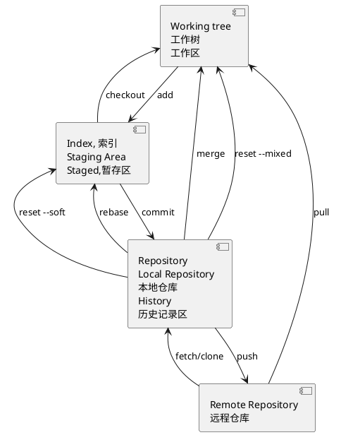
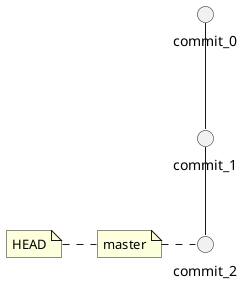
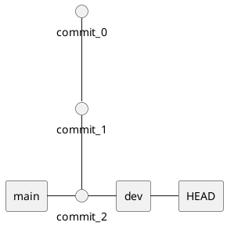
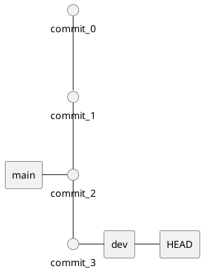

## Git



### 工作区 (working tree)

working tree, 2.9.1 之前被称作 Working Directory [https://stackoverflow.com/questions/39128500/working-tree-vs-working-directory](https://stackoverflow.com/questions/39128500/working-tree-vs-working-directory)

也称工作区, 工作目录、工作副本  
我们日常开发操作是在工作区中进行的。  
工作区的内容会包含提交到暂存区和版本库(当前提交点)的内容，同时也包含自己的修改内容。

### 索引 (Index, stage, Staging Area)

索引文件也在 .git 目录里

也称暂存区, 缓存区  
逻辑上处于工作区和本地仓库之间，主要作用是标记修改内容，暂存区里的内容默认将在下一次提交时记录到本地仓库中。  
Git本地库中的索引Index就是一个二进制文件，默认存储在.git/index路径下。  
修改提交版本库前的一个过渡阶段。查看GIT自带帮助手册的时候，通常以index来表示暂存区。在工作目录下有一个.git的目录，里面有个index文件，存储着关于暂存区的内容。git add 命令将工作树的变更添加到索引。

### 本地仓库 Repository, local repository，.git目录

在工作区中有个隐藏目录 .git，这就是 Git 本地仓库的数据库。工作区中的项目文件实际上就是从这里签出 checkout 而得到的，修改后的内容最终提交后记录到本地仓库中。
Tips：不要手动修改 .git 目录的内容  
当执行 git commit 命令后，会将索引内容提交到本地仓库。在工作区下面有 .git 的目录，这个目录下的内容不属于工作区，里面便是仓库的数据信息，暂存区相关内容也在其中。这里也可以使用 merge 或 rebase 将远程仓库副本合并到本地仓库。

### 远程仓库 (remote repository)

与本地仓库概念基本一致，不同之处在于一个存在远程，可用于远程协作，一个却是存在于本地。通过push/pull可实现本地与远程的交互；

### 远端仓库， 远程仓库副本

团队协作往往需要指定远端仓库 (一般是一个，也可以有多个），团队成员通过跟远端仓库交互来实现团队协作。  
存在于本地的远程仓库缓存。如需更新，可通过 git fetch/pull 命令获取远程仓库内容。使用 fetch 获取时，并未合并到本地仓库，此时可使用git merge实现远程仓库副本与本地仓库的合并。git pull 根据配置的不同，可为 git fetch + git merge 或 git fetch + git rebase。

## 理解 git fetch, git pull

要讲清楚 git fetch, git pull, 必须要附加讲清楚 git remote，git merge, 远程 repo, branch, commit-id 以及 FETCH_HEAD

### git remote

git 是一个分布式的结构，这意味着本地和远程是一个相对的名称。

本地的 repo 仓库要与远程的 repo 配合完成版本对应必须要有 git remote 子命令，通过 git remote add 来添加当前本地仓库的远程 repo, 有了这个动作本地的 repo 就知道了当遇到 git push 的时候应该往哪里提交代码。

### git branch

git 天生就是为了多版本分支管理而创造的, 因此分支一说, 不得不提, 分支就相当于是为了单独记录软件的某一个发布版本而存在的，既然 git 是分布式的，便有了本地分支和远程分支一说，git branch 可以查看本地分支， git branch -r 可以用来查看远程分支。 本地分支和远程分支在 git push 的时候可以**随意指定**，交错对应，只要不出现版本冲突即可。

### git merge

git 的分布式结构也非常适合多人合作开发不同的功能模块，此时如果每个人都在其各自的分支上开发一个相对独立的模块的话，在每次 release 时都需先将各成员的模块做一个合并操作，用于合并各成员的工作成果，完成集成。 此时需要的就是 git merge.

### git push 和 commit-id

在每次本地工作完成后，都会做一个 git commit 操作来保存当前工作到本地的 repo， 此时会产生一个 commit-id，这是一个能唯一标识一个版本的序列号。 在使用 git push 后，这个序列号还会同步到远程 repo。

在理解了以上 git 要素之后，分析 git fetch 和 git pull 就不再困难了。

### git fetch 有四种基本用法

- git fetch 更新 git remote 中所有的远程 repo 所包含分支的最新 commit-id, 将其记录到 .git/FETCH_HEAD 文件中
- git fetch remote_repo 这将更新名称为 remote_repo 的远程 repo 上的所有 branch 的最新 commit-id，将其记录。
- git fetch remote_repo remote_branch_name 这将这将更新名称为 remote_repo 的远程 repo 上的分支: remote_branch_name
- git fetch remote_repo remote_branch_name:local_branch_name 更新名称为 remote_repo 的远程 repo 上的分支: remote_branch_name, 并在本地创建 local_branch_name 本地分支保存远端分支的所有数据。

FETCH_HEAD： 是一个版本链接，记录在本地的一个文件中，指向着目前已经从远程仓库取下来的分支的末端版本。

### git pull 的运行过程

git pull 首先，基于本地的 FETCH_HEAD 记录，比对本地的 FETCH_HEAD 记录与远程仓库的版本号，然后 git fetch 获得当前指向的远程分支的后续版本的数据，然后再利用 git merge 将其与本地的当前分支合并。

### git fetch, git pull

git fetch 是将远程主机的最新内容拉到本地，用户在检查了以后决定是否合并到工作本机分支中。而 git pull 则是将远程主机的最新内容拉下来后直接合并，即：git pull = git fetch && git merge, 这样可能会产生冲突，需要手动解决。

### 分支，branch

git 中的分支，其实本质上仅仅是个指向 commit 对象的可变指针。

### HEAD

HEAD 就是当前活跃分支的游标, HEAD 可以指向分支中的任意一个节点，HEAD 在 Git 内部用于追踪当前位置。

```bash
cat .git/HEAD
```

### HEAD 和 head

https://blog.csdn.net/albertsh/article/details/106448035

git 中的 HEAD 概念也类似一个指针，它指向是当前分支的“头”，通过这个头节点可以追寻到当前分支之前的所有提交记录。

比如 git reset --hard HEAD 代表放弃工作树和索引的修改 reset 到 这个分支的最新版本

git 的提交记录之间的关系很像一棵树，或者说是一张图，通过当前的提交记录指向上一次提交记录串联起来，形成一个头结构，
而在 git 中我们常常说的切换分支，只不过是 git 客户端帮你把要操作的那条路径的头节点，存储到了 HEAD 文件中。

HEAD 在 git 版本控制中代表头节点，也就是分支的最后一次提交，同时也是一个文件，通常在版本库中 repository/.git/HEAD，其中保存的一般是 ref: refs/heads/master 这种分支的名字，而本质上就是指向一次提交的 hash 值，一般长成这个样子 ce11d9be5cc7007995b607fb12285a43cd03154b。

HEAD~ 和 HEAD^
在 HEAD 后面加 ^ 或者 ~ 其实就是以 HEAD 为基准，来表示之前的版本，因为 HEAD 被认为是当前分支的最新版本，那么 HEAD~ 和 HEAD^ 都是指次新版本，也就是倒数第二个版本，HEAD~~ 和 HEAD^^ 都是指次次新版本，也就是倒数第三个版本，以此类推

这个说法在之前的总结 《git checkout/git reset/git revert/git restore常用回退操作》 中提到过

HEAD~ 和 HEAD^ 后面都加大于1的数字
这时就会发现两者的不同了，比如我们把数字都定为2，那么 HEAD~2 代表后退两步，每一步都后退到第一个父提交上，
而 HEAD^2 代表后退一步，这一步退到第二个父提交上，如果没有第二个父提交就会报出以下错误：

fatal: ambiguous argument ‘HEAD^2’: unknown revision or path not in the working tree.
Use ‘–’ to separate paths from revisions, like this:
‘git […] – […]’

HEAD~ 后面加数字表示后退的步数，每次后退都默认退到第一个父提交上，HEAD~2 表示连退两步。
HEAD^ 后面加数字表示只退一步，但是这一步后退到数字表示的父提交上，HEAD^2 表示退一步到第二个父提交上。
git 在查看多分支提交记录时，日志的先后顺序不代表提交时间的先后顺序。
git reset 命令是一个重置 HEAD 的命令，可以指挥版本库指向任何一个合法提交。

查看 HEAD 文件的内容 `cat .git/HEAD`

HEAD就是当前活跃分支的游标。HEAD 的指向是跟随分支切换实时变化

不过HEAD并非只能指向分支的最顶端（时间节点距今最近的那个），实际上它可以指向任何一个节点，它就是 Git 内部用来追踪当前位置的

你可以认为 HEAD(大写) 是 "current branch" (当下的分支)。当你用 git checkout 切换分支的时候，HEAD revision 重新指向新的分支。
有的时候 HEAD 会指向一个没有分支名字的修订版本，这种情况叫 `detached HEAD`

head(小写) 是 commit 对象的引用，每个 head 都有一个名字 (分支名字或者标签名字等等），但是默认情况下，每个叫 master 的 repository 都会有一个 head, 
一个 repository 可以包含任意数量的 head。在任何时候，只要这个 head 被选择成为 `current head`，那么这个 head 就成了 HEAD

在 main 分支上，HEAD 指向 main，而 main 指向的是最近的一次提交。



新建分支时，比如 `git switch -c dev`，dev 会指向当前 main 分支的最近一次提交。
切换到 dev 分支后，HEAD 就指向当前分支 dev 了。



在 dev 上修改，比如修改 `helloworld.c`，然后提交，分支 dev 指向当前分支的最新提交，而 main 指向 main 分支的最新提交。



[https://git-scm.com/book/zh](https://git-scm.com/book/zh)

[https://blog.csdn.net/taiyangdao/article/details/52761572](https://blog.csdn.net/taiyangdao/article/details/52761572)

作者： `fandyst`
出处： [http://www.cnblogs.com/todototry/](http://www.cnblogs.com/todototry/)
本文版权归作者和博客园共有,欢迎转载,但未经作者同意必须保留此段声明,且在文章页面明显位置给出原文连接。

作者：波罗学
链接：[https://www.zhihu.com/question/38305012/answer/625881308](https://www.zhihu.com/question/38305012/answer/625881308)
来源：知乎
著作权归作者所有。商业转载请联系作者获得授权，非商业转载请注明出处。

[https://zhuanlan.zhihu.com/p/59591617](https://zhuanlan.zhihu.com/p/59591617)

作者：打我你肥十斤
链接：[https://juejin.cn/post/6844903921794859021](https://juejin.cn/post/6844903921794859021)
来源：稀土掘金
著作权归作者所有。商业转载请联系作者获得授权，非商业转载请注明出处。

[https://segmentfault.com/a/1190000039320926](https://segmentfault.com/a/1190000039320926)
[http://jartto.wang/2018/12/11/git-rebase/](http://jartto.wang/2018/12/11/git-rebase/)

作者：`zuopf769`
链接：[https://juejin.cn/post/6844903493078089736](https://juejin.cn/post/6844903493078089736)
来源：稀土掘金
著作权归作者所有。商业转载请联系作者获得授权，非商业转载请注明出处。

[https://www.zsythink.net/archives/3412](https://www.zsythink.net/archives/3412)

版权声明：本文为博主原创文章，遵循 CC 4.0 BY-NC-SA 版权协议，转载请附上原文出处链接和本声明。
原文链接：https://blog.csdn.net/albertsh/article/details/106448035
