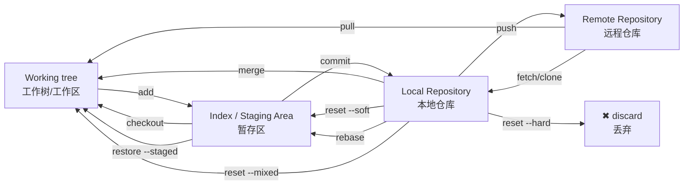
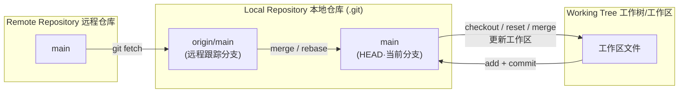

## Git


```mermaid
graph LR
    work["Working tree<br/>工作树/工作区"]
    stage["Index / Staging Area<br/>暂存区"]
    repo["Local Repository<br/>本地仓库"]
    remote["Remote Repository<br/>远程仓库"]
    discard["✖ discard<br/>丢弃"]
    work -->|add| stage
    stage -->|commit| repo
    repo -->|push| remote
    remote -->|pull| work
    remote -->|"fetch/clone"| repo
    stage -->|checkout| work
    stage -->|"restore --staged"| work
    repo -->|merge| work
    repo -->|"reset --soft"| stage
    repo -->|rebase| stage
    repo -->|"reset --mixed"| work
    repo -->|"reset --hard"| discard
```

### 工作区 (working tree)

working tree, 2.9.1 之前被称作 Working Directory [https://stackoverflow.com/questions/39128500/working-tree-vs-working-directory](https://stackoverflow.com/questions/39128500/working-tree-vs-working-directory)

也称工作区, 工作目录、工作副本  
我们日常开发操作是在工作区中进行的。  
工作区的内容会包含提交到暂存区和版本库(当前提交点)的内容，同时也包含自己的修改内容。

### 索引 (Index, stage, Staging Area)

索引文件也在 .git 目录里

也称暂存区, 缓存区
逻辑上处于工作区和本地仓库之间，主要作用是标记修改内容，暂存区里的内容默认将在下一次提交时记录到本地仓库中。  
Git 本地库中的索引 Index 就是一个二进制文件，默认存储在 .git/index 路径下。  
修改提交版本库前的一个过渡阶段。查看 GIT 自带帮助手册的时候，通常以 index 来表示暂存区。在工作目录下有一个 .git 的目录，里面有个 index 文件，存储着关于暂存区的内容。git add 命令将工作树的变更添加到索引。

### 本地仓库 Repository, local repository，.git目录

在工作区中有个隐藏目录 .git，这就是 Git 本地仓库的数据库。工作区中的项目文件实际上就是从这里签出 checkout 而得到的，修改后的内容最终提交后记录到本地仓库中。
Tips：不要手动修改 .git 目录的内容  
当执行 git commit 命令后，会将索引内容提交到本地仓库。在工作区下面有 .git 的目录，这个目录下的内容不属于工作区，里面便是仓库的数据信息，暂存区相关内容也在其中。这里也可以使用 merge 或 rebase 将远程仓库副本合并到本地仓库。

### 远程仓库 (remote repository)

与本地仓库概念基本一致，不同之处在于一个存在远程，可用于远程协作，一个却是存在于本地。通过push/pull可实现本地与远程的交互；

### 远端仓库， 远程仓库副本

团队协作往往需要指定远端仓库 (一般是一个，也可以有多个），团队成员通过跟远端仓库交互来实现团队协作。  
存在于本地的远程仓库缓存。如需更新，可通过 git fetch/pull 命令获取远程仓库内容。使用 fetch 获取时，并未合并到本地仓库，此时可使用git merge实现远程仓库副本与本地仓库的合并。git pull 根据配置的不同，可为 git fetch + git merge 或 git fetch + git rebase。

## 理解 git fetch, git pull

要讲清楚 git fetch, git pull, 必须要附加讲清楚 git remote，git merge, 远程 repo, branch, commit-id 以及 FETCH_HEAD

### git remote

git 是一个分布式的结构，这意味着本地和远程是一个相对的名称。

本地的 repo 仓库要与远程的 repo 配合完成版本对应必须要有 git remote 子命令，通过 git remote add 来添加当前本地仓库的远程 repo, 有了这个动作本地的 repo 就知道了当遇到 git push 的时候应该往哪里提交代码。

### git branch

分支本质上是指向 commit 的可变指针，用来记录某一条开发线。Git 是分布式的，所以有本地分支和远程分支：`git branch` 看本地，`git branch -r` 看远程。push 时两边可以交错对应，只要不出现版本冲突即可。

### git push 和 commit-id

在每次本地工作完成后，都会做一个 git commit 操作来保存当前工作到本地的 repo， 此时会产生一个 commit-id，这是一个能唯一标识一个版本的序列号。 在使用 git push 后，这个序列号还会同步到远程 repo。

在理解了以上 git 要素之后，分析 git fetch 和 git pull 就不再困难了。

### git fetch 做了什么

fetch 拉回来的东西不进工作区，只进 `.git`。

clone 之后，本地至少有两类分支指针：

- 本地分支，例如 `main`：跟着自己的 commit、merge、rebase 走，也决定工作区当前是哪份代码
- 远程跟踪分支（remote-tracking branch），例如 `origin/main`：存在本地 `.git` 里，专门记住「上次问过 origin 时，对方的 `main` 在哪」


```mermaid
graph LR
    subgraph remote["Remote Repository 远程仓库"]
        remoteMain["main"]
    end
    subgraph localrepo["Local Repository 本地仓库 (.git)"]
        tracking["origin/main<br/>(远程跟踪分支)"]
        localMain["main<br/>(HEAD·当前分支)"]
    end
    subgraph wt["Working Tree 工作树/工作区"]
        work["工作区文件"]
    end
    remoteMain -->|"git fetch"| tracking
    tracking -->|"merge / rebase"| localMain
    localMain -->|"checkout / reset / merge<br/>更新工作区"| work
    work -->|"add + commit"| localMain
```

各节点归属：

- **远程仓库**：`main` —— 别人机器（或服务器）上的仓库，本地只能通过 `fetch` / `push` 跟它通信。
- **本地仓库（`.git`）**：`origin/main` 和 `main` 两个分支指针都在这里。`origin/main` 是远程跟踪分支，只记「上次问过 origin 时对方的 `main` 在哪」，由 `fetch` / `pull` / `push` 自动移动；`main` 是你自己的开发线，由 `commit` / `merge` / `rebase` / `reset` 移动。
- **工作树**：`工作区文件` —— 磁盘上你能直接编辑的项目文件。（`add` 实际先经过 `.git` 里的暂存区，这里简化成一步。）

`本地 main` 与 `工作区文件` 不会自动同步，两个方向都要显式命令：`main` 移动后工作区不会自动跟着变，只有 `checkout` / `switch` / `reset` / `merge` / `rebase` / `pull` 才会把工作区刷新到新的 commit；工作区改了文件，`main` 也要经过 `add` + `commit` 才会动。严格说决定工作区内容的是 `HEAD` 指向的分支，这里默认在 `main` 上。

`git fetch` 只走第一段箭头：连上远程，把本地还没有的 commit 写进对象库（`.git/objects`），再把 `origin/main` 挪到远程现在的 tip。

它不会改工作区、不会改暂存区、也不会移动当前所在的本地分支。`main` 还停在 fetch 之前的那个 commit。所以 fetch 结束后打开编辑器，文件和刚才一样。新提交已经在本地，只是挂在 `origin/main` 上，可以用下面命令看：

```bash
git log main..origin/main
git diff main origin/main
```

看完再 `git merge origin/main`（或 rebase）。这就是先取回来、再自己决定要不要合进去。

日常记 `origin/main` 即可。`FETCH_HEAD` 是 fetch 顺带写的记录，见下一节。

### FETCH_HEAD

先记住一句：`.git/FETCH_HEAD` 记录的是**最近一次 `git fetch` 实际取回来的那些分支的 tip commit**。`git pull` 里也会先 fetch，所以同样会改它。每次 fetch 都会整份重写这个文件。

它不是一个像 `HEAD` 那样的单指针。远程多个分支、各有不同的新 commit 时，每个被取到的分支各占一行，那一行的 commit id 就是**那条远程分支自己的 tip**，不会互相覆盖。

本地只对应一个远程、且用默认 `git fetch` / `git fetch origin`（clone 后一般跟踪所有 `refs/heads/*`）时：远程有几条分支，文件里通常就几行。它记的是「这一次 fetch 取到了什么」，不是远程分支清单的永久副本：

- `git fetch origin main`：远程即使有很多分支，往往只有 `main` 一行
- `git clone --single-branch` 或改过 `remote.<name>.fetch`：行数可能少于远程分支总数
- `git fetch --tags`：tag 也可能多占行

它也不是本地当前分支，更不是 `HEAD`。`git switch` 换本地分支不会改这个文件；只有再 fetch / pull 才会更新。

`git pull` 第二步 / `git merge FETCH_HEAD` 会合哪一行，看有没有 `not-for-merge` 标记，不看你此刻停在哪条本地分支。合并候选在 **fetch 当时**就定了：通常是当时当前分支的 upstream，或命令行指定的那个远程分支。

#### 文件里每一列是什么

下面是一次 fetch 之后 `.git/FETCH_HEAD` 的实际内容：

```text
0004c0599d1324cfba30373d5f95da98f6477907	not-for-merge	branch 'main' of github.com:wiloon/enx
```

三列之间是 TAB。

| 列 | 本例 | 含义 |
| ---- | ---- | ---- |
| 1. commit | `0004c0599d1324cfba30373d5f95da98f6477907` | 这次取到的那个远程分支的 tip |
| 2. 标记 | `not-for-merge` | 有这个词：只记录，默认不合进当前分支。这一列为空：本次的合并候选 |
| 3. 说明 | `branch 'main' of github.com:wiloon/enx` | 远程哪条分支（或 tag）。本例是 `github.com:wiloon/enx` 上的 `main` |

所以这一行说的是：远程 `main` 当时停在 `0004c059…`，不是本地当前分支的 tip。本例带了 `not-for-merge`，表示这次 fetch 虽然取到了远程 `main`，但 Git 没把它当作合并候选。常见原因是 fetch 当时本地当前分支并不跟踪 `origin/main`（例如在别的功能分支上），或命令行指定取的是别的 ref。

如果当前本地分支跟踪 `origin/main`，无参数 `git fetch` 之后，`main` 那一行通常没有第二列的标记：

```text
0004c0599d1324cfba30373d5f95da98f6477907		branch 'main' of github.com:wiloon/enx
```

SHA 和说明之间是两个连续 TAB（中间那列为空）。`git pull` 的 merge / rebase，以及 `git merge FETCH_HEAD`，会合的是这种未标记 `not-for-merge` 的行。

同一远程还有其他分支时会多行，例如（第二行的 SHA 是示意）：

```text
0004c0599d1324cfba30373d5f95da98f6477907		branch 'main' of github.com:wiloon/enx
aaaaaaaaaaaaaaaaaaaaaaaaaaaaaaaaaaaaaaaa	not-for-merge	branch 'dev' of github.com:wiloon/enx
```

这里不是「多个分支里挑一个 commit 写进去」：`main` 是 `0004c059…`，`dev` 是另一条 commit，各写各的。第一行是合并候选（fetch 当时当前分支的 upstream，或命令行指定的那个分支）；其余行只是顺便记下来。

把 `FETCH_HEAD` 当成 revision 用时（例如 `git log FETCH_HEAD`、`git rev-parse FETCH_HEAD`），Git 只解析文件**第一行**的 commit，不管有没有 `not-for-merge`。文件本身仍是完整清单。

日常看远程进度看 `origin/main` 即可。`FETCH_HEAD` 给这次 fetch 之后的 pull / merge 用，一般不用手改。

### git fetch 常见写法

- `git fetch`：从当前分支跟踪的远程（通常是 origin）取回更新，刷新 `origin/*`
- `git fetch <remote>`：只从指定远程取，例如 `git fetch origin`
- `git fetch <remote> <branch>`：只取该远程上的指定分支
- `git fetch <remote> <remote-branch>:<local-branch>`：用 refspec 把远程分支写到本地的某个分支名上（会动那个本地分支，不是默认行为）

无参数的 `git fetch` 不会遍历配置里的每一个 remote；要全部 remote 用 `git fetch --all`。

### git pull 的运行过程

`git pull` 是两步：先 `git fetch`，再把对应的远程跟踪分支 merge（或 rebase，取决于配置）进当前本地分支。第二步会移动 `main`，工作区文件可能变，也可能产生冲突。

### git fetch 和 git pull

| | git fetch | git pull |
| --- | --- | --- |
| 下载新 commit 到对象库 | 会 | 会（内部先 fetch） |
| 更新 `origin/main` | 会 | 会 |
| 重写 `.git/FETCH_HEAD` | 会 | 会（内部先 fetch） |
| 移动本地 `main`、改工作区 | 不会 | 会 |

fetch 只同步「远程现在怎样」到 `origin/main`；pull 在此基础上还把它合进当前分支。

[https://git-scm.com/book/zh](https://git-scm.com/book/zh)

[https://blog.csdn.net/taiyangdao/article/details/52761572](https://blog.csdn.net/taiyangdao/article/details/52761572)

作者： `fandyst`
出处： [http://www.cnblogs.com/todototry/](http://www.cnblogs.com/todototry/)
本文版权归作者和博客园共有,欢迎转载,但未经作者同意必须保留此段声明,且在文章页面明显位置给出原文连接。

作者：波罗学
链接：[https://www.zhihu.com/question/38305012/answer/625881308](https://www.zhihu.com/question/38305012/answer/625881308)
来源：知乎
著作权归作者所有。商业转载请联系作者获得授权，非商业转载请注明出处。

[https://zhuanlan.zhihu.com/p/59591617](https://zhuanlan.zhihu.com/p/59591617)

作者：打我你肥十斤
链接：[https://juejin.cn/post/6844903921794859021](https://juejin.cn/post/6844903921794859021)
来源：稀土掘金
著作权归作者所有。商业转载请联系作者获得授权，非商业转载请注明出处。

[https://segmentfault.com/a/1190000039320926](https://segmentfault.com/a/1190000039320926)
[http://jartto.wang/2018/12/11/git-rebase/](http://jartto.wang/2018/12/11/git-rebase/)

作者：`zuopf769`
链接：[https://juejin.cn/post/6844903493078089736](https://juejin.cn/post/6844903493078089736)
来源：稀土掘金
著作权归作者所有。商业转载请联系作者获得授权，非商业转载请注明出处。

[https://www.zsythink.net/archives/3412](https://www.zsythink.net/archives/3412)

版权声明：本文为博主原创文章，遵循 CC 4.0 BY-NC-SA 版权协议，转载请附上原文出处链接和本声明。
原文链接：https://blog.csdn.net/albertsh/article/details/106448035

## 维护记录

| 时间 | 修改内容 | 原因 |
| ---- | -------- | ---- |
| 2026-09-01 | 「分支，branch」由三级标题改为二级标题 | 该节讲分支本质，不应挂在「理解 git fetch, git pull」下 |
| 2026-09-15 | 新增 FETCH_HEAD 字段说明；categories 改为 Git | 概念从命令笔记迁到本篇；分类与内容对齐 |
