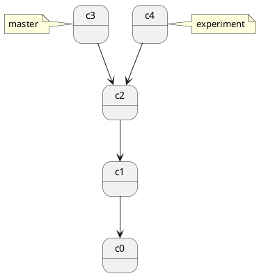
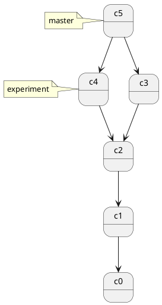
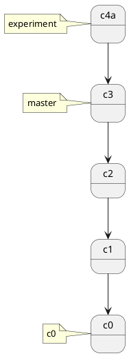
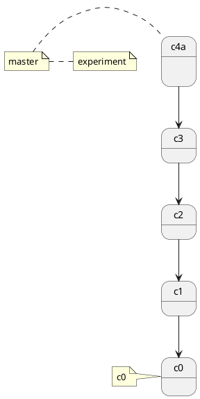

## git merge, git rebase

## git merge

- Join two or more development histories together

开发任务分叉到两个不同分支，又各自提交了更新。



git merge 会把 c2, c3, c4 做三方合并



特点：自动创建一个新的 commit
如果合并的时候遇到冲突，仅需要修改后重新 commit
优点：记录了真实的 commit 情况，包括每个分支的详情
缺点：因为每次 merge 会自动产生一个 merge commit，所以在使用一些 git 的 GUI tools，特别是commit比较频繁时，看到分支很杂乱。

```bash
git merge b0

git status

git mergetool
  
#"The merge tool bc is not available as" 'bcompare'
  
git config -global merge.tool vimdiff

:diffg RE " get from REMOTE
  
:diffg BA " get from BASE
  
:diffg LO " get from LOCAL
  
:wqa
  
```

### 把 master merge 到 feature 上

```bash
git checkout feature
git merge master
# 或者
git merge master feature
```

## git rebase

1. branch_feature0 分支和 dev 分支 git pull
2. git switch branch_feature0
3. git rebase dev
4. 处理冲突
5. git push -f
6. github PR or merge
7. git switch dev
8. git merge --squash branch_feature0

- git rebase 命令的文档描述是 Reapply commits on top of another base tip
- rebase 是「在另一个 base 之上重新应用提交」
- rebase 通常用于重写提交历史。可以保持提交历史的整洁
- 跟 merge 一样, rebase 也会遇到冲突
- 不要公共分支上执行 rebase, 比如: 不建议在以下示例中的 main 分支上执行 git rebase branch_xx
- 不要通过rebase对任何已经提交到公共仓库中的commit进行修改（你自己一个人玩的分支除外）

<http://jartto.wang/2018/12/11/git-rebase/>  
<https://waynerv.com/posts/git-rebase-intro/>  
<https://www.theserverside.com/blog/Coffee-Talk-Java-News-Stories-and-Opinions/How-to-Git-rebase-a-branch-to-master-example>  
<https://blog.csdn.net/weixin_42310154/article/details/119004977>  

```bash
# commands
git rebase branch0
git rebase remotes/origin/branch0

git rebase --edit-todo
git rebase --continue
git rebase --abort
```

1. 假设我们有一个 main 分支, 最近一次提交是 A
2. 我们从 main 分支创建了 branch_feature0 分支进行新功能的开发, A 就是 branch_feature0 的基础 (base).
3. branch_feature0 新增了两个提交 D, E, 时间 T0, T1.
4. main 分支新增了两个提交 B, C, 时间 T2, T3, 并且 已经在 main分支 git pull working tree.
5. 切换到 branch_feature0 分支
6. 在 branch_feature0 分支上执行 git rebase main, 把 branch_feature0 分支的 base 变成 main
7. 执行 rebase 之后, 在 branch_feature0 执行 git log, 时间戳顺序是错的: B> C> D> E
8. git push origin branch_feature0:branch_feature0 会提示 Updates were rejected because the tip of your current branch is behind its remote counterpart. Integrate the remote changes (e.g.'git pull ...') before pushing again.
9. git push -f, push 的时候一定要加 --fource, 否则服务器不会接受 rebase 的 分支.
10. git switch main
11. git merge branch_feature0, 执行一次 Fast forward merge
12. 此时 main 和 branch_featuer0 都指向了最新的提交

rebase 的执行过程是首先找到这两个分支（即当前分支 branch_feature0, rebase 操作的目标分支 main 的最近共同祖先提交 A，然后对比当前分支 (branch_feature0) 相对于该祖先 (A) 提交的历次提交（D 和 E），提取相应的修改并存为临时文件 (patch)，然后将当前分支 (branch_feature0) 指向目标分支 main 的最新的提交 C, 最后以此作为新的 base 将之前另存为临时文件 (patch) 的修改依序应用。 (commit 的时间戳有可能是乱序的)

我们也可以按上文理解成将 branch_feature0 分支的 base 从提交 A 改成了提交 C，看起来就像是从提交 C 创建了该分支，并提交了 D 和 E。但实际上这只是「看起来」，在内部 Git 复制了提交 D 和 E 的内容，创建新的提交 D' 和 E' 并将其应用到特定 base 上（A>B>C）。尽管新的 branch_feature0 分支和之前看起来是一样的，但它是由全新的提交组成的。

```bash
# checkout branch0
git check branch0
# 保存 branch0 的修改, 保存成 patch 文件, 把 branch0 更新到 main 最新的修改, 把 patch 文件应用到  main 分支上
git rebase main
# 另外一种写法, 不需要 checkout branch0 直接执行
# git rebase <basebranch> <topicbranch>
git rebase main branch0

git checkout master
git merge branch0
```

rebase 的原理是首先找到这两个分支（即当前分支 experiment、变基操作的目标基底分支 master） 的最近共同祖先 C2，然后对比当前分支相对于该祖先的历次提交，提取相应的修改并存为临时文件， 然后将当前分支指向目标基底 C3, 最后以此将之前另存为临时文件的修改依序应用。

你在查看一个经过变基的分支的历史记录时会发现，尽管实际的开发工作是并行的， 但它们看上去就像是串行的一样，提交历史是一条直线没有分叉。

在对两个分支进行变基时，所生成的“重放”并不一定要在目标分支上应用



回到 master 分支，进行一次快进合并。

```bash
# 如果在用 github, 最好是走 github 的 PR
# 如果用过 git merge 再去操作 PR, 会发现 "There isn't anything to compare", 没有什么可以 PR的了, 因为两个分支 是一样的....
git checkout main
git merge feature0
```



rebase 有人把它翻译成 "变基"

rebase 特点：会合并之前的 commit 历史  
优点：得到更简洁的项目历史，去掉了 merge commit  
缺点：如果合并出现代码问题不容易定位，因为 re-write 了 history  

### rebase 做了什么

### 场景：分支合并

从 master 分支切出一个 dev 分支 (feature1)，进行开发再执行 git rebase master

首先，git 会把 feature1 分支里面的每个 commit 取消掉；
其次，把上面的操作临时保存成 patch 文件，存在 .git/rebase 目录下；
然后，把 feature1 分支更新到最新的 master 分支；
最后，把上面保存的 patch 文件应用到 feature1 分支上；

动词一共有如下几个：

- edit
- reword
- drop
- squash
- fixup

#### edit

edit 命令表示你告诉了 rebase，当在应用这个 commit 的时候，停下来，等待你修改了文件 和/或 修改了 commit message之后在继续进行 rebase。

上面说的很不好理解，建议自己尝试一下，就明白了. 总之这个命令可以让你既能修改文件，又能修改 commit message

#### reword

reword 命令可以让你修改 commit message。当你使用这个命令后，保存这个文件并退出，执行 git rebase continue 命令之后会再次打开一个文件，让你对这个 commit 的 commit message 进行修改，再次保存退出之后继续进行 rebase

#### drop

drop 命令表示你要丢弃这个 commit 以及它的修改。同样可以删除这一行来表示。 (在 git 比较低的版本中，比如我使用的 1.9.0 版本中，只能通过删除那一行的方式来做，不支持 drop 命令）

#### squash 和 fixup

这两个命令都是用来将几个 commit 合并为一个的。其中, fixup 命令，rebase 的时候将会直接忽略掉它的commit message，而 squash 命令，则会在 git rebase --continue 之后打开一个文件，该文件中将会出现所有设置为 squash 的 commit，这时删除掉多余的 commit message，留下 (或者修改）一行作为合并之后的 commit 的 commit message。

到此为止，讲这个文件保存并退出，输入 git status 查看需要进行什么操作 (比如需要解决冲突），之后执行 git rebase --continue 即可。

执行之后会根据你使用的命令的不同进行不同的操作，比如有的可以直接 rebase 有的则会打开一个文件让你进行一些操作，具体信息见上面的描述。

<https://git-scm.com/book/zh/v1/Git-%E5%88%86%E6%94%AF-%E5%88%86%E6%94%AF%E7%9A%84%E6%96%B0%E5%BB%BA%E4%B8%8E%E5%90%88%E5%B9%B6>
  
<http://blog.hanghu.me/git/2017/03/08/The-merge-tool-bc-is-not-available-as-bcompare.html>
  
<http://www.rosipov.com/blog/use-vimdiff-as-git-mergetool/>

作者：AlvinStar
链接：<https://www.jianshu.com/p/f23f72251abc>
来源：简书
著作权归作者所有。商业转载请联系作者获得授权，非商业转载请注明出处。

为什么要保持提交历史的整洁
一个看上更整洁的提交历史有什么好处？

满足某些开发者的洁癖。
当你因为某些 bug 需要回溯提交历史时，更容易定位到 bug 是从哪一个提交引入。尤其是当你需要通过 git bisect 从几十上百个提交中排查 bug，或者有一些体量较大的功能分支需要频繁的从远程的主分支拉取更新时。
使用 rebase 来将远程的变更整合到本地仓库是一种更好的选择。用 merge 拉取远程变更的结果是，每次你想获取项目的最新进展时，都会有一个多余的 merge 提交。而使用 rebase 的结果更符合我们的本意：我想在其他人的已完成工作的基础上进行我的更改。

## rebase 交互模式

```bash
# 其中-i的意思是--interactive
rebase -i
git rebase -i  [startpoint]  [endpoint]
git rebase -i commit0
```

其中-i的意思是--interactive，即弹出交互式的界面让用户编辑完成合并操作，[startpoint] [endpoint]则指定了一个编辑区间，如果不指定[endpoint]，则该区间的终点默认是当前分支HEAD所指向的commit(注：该区间指定的是一个**前开后闭**的区间)。

作者：zuopf769
链接：<https://juejin.cn/post/6844903600976576519>
来源：稀土掘金
著作权归作者所有。商业转载请联系作者获得授权，非商业转载请注明出处。

两种模式的区别
我们前面提到， rebase 是「在另一个基端之上重新应用提交」，而在重新应用的过程中，这些提交会被重新创建，自然也可以进行修改。在 rebase 的标准模式下，当前工作分支的提交会被直接应用到传入分支的顶端；而在交互模式下，则允许我们在重新应用之前通过编辑器以及特定的命令规则对这些提交进行合并、重新排序及删除等重写操作。

两者最常见的使用场景也因此有所不同：

标准模式常用于在当前分支中集成来自其他分支的最新修改。
交互模式常用于对当前分支的提交历史进行编辑，如将多个小提交合并成大的提交。

不仅仅是分支
虽然我们之前的示例都是在不同的两个分支之间执行 rebase 操作，但事实上 rebase 命令传入的参数并不仅限于分支。

任何的提交引用，都可以被视作有效的 rebase 基底对象，包括一个提交 ID、分支名称、标签名称或 HEAD~1 这样的相对引用。

自然地，假如我们对当前分支的某次历史提交执行 rebase，其结果就是会将这次提交之后的所有提交重新应用在当前分支，在交互模式下，即允许我们对这些提交进行更改。

## 合并commit

1. git rebase -i commit_x
2. 或者 git rebase -i HEAD~3
3. 第一行 pick
4. 其它后面的行 squash
5. :x 保存退出
6. 修改 commit message
7. git push -f

pick：保留该commit（缩写:p）
reword：保留该commit，但我需要修改该commit的注释（缩写:r）
edit：保留该commit, 但我要停下来修改该提交(不仅仅修改注释)（缩写:e）
squash：将该commit和前一个commit合并（缩写:s）
fixup：将该commit和前一个commit合并，但我不要保留该提交的注释信息（缩写:f）
exec：执行shell命令（缩写:x）
drop：我要丢弃该commit（缩写:d）

作者：zuopf769
链接：<https://juejin.cn/post/6844903600976576519>
来源：稀土掘金
著作权归作者所有。商业转载请联系作者获得授权，非商业转载请注明出处。
