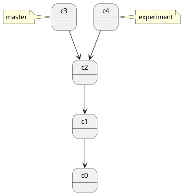
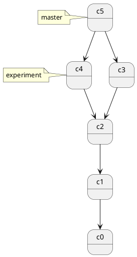
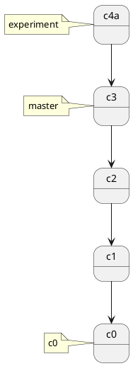
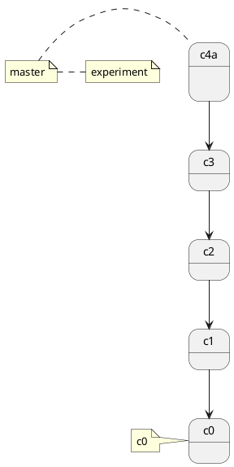

## git merge, git rebase

## git merge

开发任务分叉到两个不同分支，又各自提交了更新。



git merge 会把 c2, c3, c4 做三方合并



特点：自动创建一个新的 commit
如果合并的时候遇到冲突，仅需要修改后重新 commit
优点：记录了真实的 commit 情况，包括每个分支的详情
缺点：因为每次 merge 会自动产生一个 merge commit，所以在使用一些 git 的 GUI tools，特别是commit比较频繁时，看到分支很杂乱。

```bash
git merge b0

git status

git mergetool
  
#"The merge tool bc is not available as" 'bcompare'
  
git config -global merge.tool vimdiff

:diffg RE " get from REMOTE
  
:diffg BA " get from BASE
  
:diffg LO " get from LOCAL
  
:wqa
  
```

### 把 master merge 到 feature 上

```bash
git checkout feature
git merge master
# 或者
git merge master feature
```

## git rebase

<http://jartto.wang/2018/12/11/git-rebase/>

```bash
# checkout branch0
git check branch0
# 保存 branch0的修改,保存成 patch 文件, 把branch0更新到main最新的修改, 把 patch 文件应用到   分支上
git rebase main
# 另外一种写法, 不需要 checkout branch0 直接执行
# git rebase <basebranch> <topicbranch>
git rebase main branch0

git checkout master
git merge branch0

```

rebase 的原理是首先找到这两个分支（即当前分支 experiment、变基操作的目标基底分支 master） 的最近共同祖先 C2，然后对比当前分支相对于该祖先的历次提交，提取相应的修改并存为临时文件， 然后将当前分支指向目标基底 C3, 最后以此将之前另存为临时文件的修改依序应用。

你在查看一个经过变基的分支的历史记录时会发现，尽管实际的开发工作是并行的， 但它们看上去就像是串行的一样，提交历史是一条直线没有分叉。

在对两个分支进行变基时，所生成的“重放”并不一定要在目标分支上应用



回到 master 分支，进行一次快进合并。

```bash
git checkout master
git merge experiment
```



rebase 有人把它翻译成“变基”。

rebase 特点：会合并之前的 commit 历史
优点：得到更简洁的项目历史，去掉了 merge commit
缺点：如果合并出现代码问题不容易定位，因为 re-write 了 history

### rebase 做了什么

### 场景：分支合并

从 master 分支切出一个 dev 分支 (feature1)，进行开发再执行 git rebase master

首先，git 会把 feature1 分支里面的每个 commit 取消掉；
其次，把上面的操作临时保存成 patch 文件，存在 .git/rebase 目录下；
然后，把 feature1 分支更新到最新的 master 分支；
最后，把上面保存的 patch 文件应用到 feature1 分支上；

动词一共有如下几个：

- edit
- reword
- drop
- squash
- fixup

#### edit

edit命令表示你告诉了 rebase，当在应用这个 commit 的时候，停下来，等待你修改了文件 和/或 修改了 commit message之后在继续进行 rebase。

上面说的很不好理解，建议自己尝试一下，就明白了。总之这个命令可以让你既能修改文件，又能修改 commit message

#### reword

reword 命令可以让你修改 commit message。当你使用这个命令后，保存这个文件并退出，执行 git rebase continue 命令之后会再次打开一个文件，让你对这个 commit 的 commit message 进行修改，再次保存退出之后继续进行 rebase

#### drop

drop 命令表示你要丢弃这个 commit 以及它的修改。同样可以删除这一行来表示。 (在 git 比较低的版本中，比如我使用的 1.9.0 版本中，只能通过删除那一行的方式来做，不支持 drop 命令）

#### squash 和 fixup

这两个命令都是用来将几个 commit 合并为一个的。其中, fixup 命令，rebase 的时候将会直接忽略掉它的commit message，而 squash 命令，则会在 git rebase --continue 之后打开一个文件，该文件中将会出现所有设置为 squash 的 commit，这时删除掉多余的 commit message，留下 (或者修改）一行作为合并之后的 commit 的 commit message。

到此为止，讲这个文件保存并退出，输入 git status 查看需要进行什么操作 (比如需要解决冲突），之后执行 git rebase --continue 即可。

执行之后会根据你使用的命令的不同进行不同的操作，比如有的可以直接 rebase 有的则会打开一个文件让你进行一些操作，具体信息见上面的描述。

<https://git-scm.com/book/zh/v1/Git-%E5%88%86%E6%94%AF-%E5%88%86%E6%94%AF%E7%9A%84%E6%96%B0%E5%BB%BA%E4%B8%8E%E5%90%88%E5%B9%B6>
  
<http://blog.hanghu.me/git/2017/03/08/The-merge-tool-bc-is-not-available-as-bcompare.html>
  
<http://www.rosipov.com/blog/use-vimdiff-as-git-mergetool/>

作者：AlvinStar
链接：<https://www.jianshu.com/p/f23f72251abc>
来源：简书
著作权归作者所有。商业转载请联系作者获得授权，非商业转载请注明出处。
