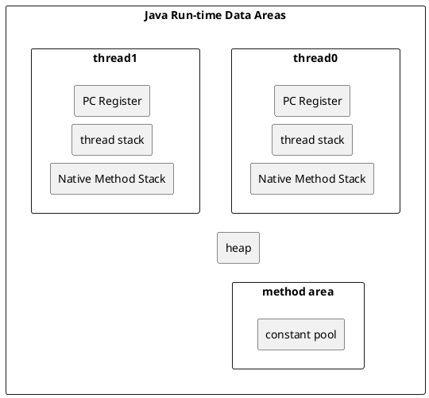

## JMM, Java Memory Model, java 内存模型

Java 虚拟机的内存空间 (运行时数据区)分为 5 个部分: 
- 程序计数器, PC register
- Java 虚拟机栈, JVM stack, 线程栈， thread stack
- 本地方法栈， native method stack
- 堆, heap
- 方法区, method area

线程私有的数据区： 程序计数器，虚拟机栈，本地方法栈
所有线程共有的数据区： Java堆，方法区

### 程序计数器 （PC register,Program Counter register, PC寄存器) 
程序计数器的定义
程序计数器是一块较小的内存空间，是当前线程正在执行的那条字节码指令的地址。若当前线程正在执行的是一个本地方法，那么此时程序计数器为 Undefined。

程序计数器的作用
字节码解释器通过改变程序计数器来依次读取指令，从而实现代码的流程控制。
在多线程情况下，程序计数器记录的是当前线程执行的位置，从而当线程切换回来时，就知道上次线程执行到哪了。
程序计数器的特点
是一块较小的内存空间。
线程私有，每条线程都有自己的程序计数器。
生命周期: 随着线程的创建而创建，随着线程的结束而销毁。
是唯一一个不会出现OutOfMemoryError的内存区域

### Java 虚拟机栈（Java 栈) 
Java 虚拟机栈的定义
Java 虚拟机栈是描述 Java 方法运行过程的内存模型。

Java 虚拟机栈会为每一个即将运行的 Java 方法创建一块叫做“栈帧”的区域，用于存放该方法运行过程中的一些信息，如: 

- 局部变量表
- 操作数栈
- 动态链接
- 方法出口信息

#### 压栈出栈过程
当方法运行过程中需要创建局部变量时，就将局部变量的值存入栈帧中的局部变量表中。

Java 虚拟机栈的栈顶的栈帧是当前正在执行的活动栈，也就是当前正在执行的方法，PC 寄存器也会指向这个地址。只有这个活动的栈帧的本地变量可以被操作数栈使用，当在这个栈帧中调用另一个方法，与之对应的栈帧又会被创建，新创建的栈帧压入栈顶，变为当前的活动栈帧。

方法结束后，当前栈帧被移出，栈帧的返回值变成新的活动栈帧中操作数栈的一个操作数。如果没有返回值，那么新的活动栈帧中操作数栈的操作数没有变化。

由于Java 虚拟机栈是与线程对应的，数据不是线程共享的，因此不用关心数据一致性问题，也不会存在同步锁的问题。

Java 虚拟机栈的特点
局部变量表随着栈帧的创建而创建，它的大小在编译时确定，创建时只需分配事先规定的大小即可。在方法运行过程中，局部变量表的大小不会发生改变。
Java 虚拟机栈会出现两种异常: StackOverFlowError 和 OutOfMemoryError。
StackOverFlowError 若 Java 虚拟机栈的大小不允许动态扩展，那么当线程请求栈的深度超过当前 Java 虚拟机栈的最大深度时，抛出 StackOverFlowError 异常。
OutOfMemoryError 若允许动态扩展，那么当线程请求栈时内存用完了，无法再动态扩展时，抛出 OutOfMemoryError 异常。
Java 虚拟机栈也是线程私有，随着线程创建而创建，随着线程的结束而销毁。
出现 StackOverFlowError 时，内存空间可能还有很多。

本地方法栈（C 栈) 
本地方法栈的定义
本地方法栈是为 JVM 运行 Native 方法准备的空间，由于很多 Native 方法都是用 C 语言实现的，所以它通常又叫 C 栈。它与 Java 虚拟机栈实现的功能类似，只不过本地方法栈是描述本地方法运行过程的内存模型。

栈帧变化过程
本地方法被执行时，在本地方法栈也会创建一块栈帧，用于存放该方法的局部变量表、操作数栈、动态链接、方法出口信息等。

方法执行结束后，相应的栈帧也会出栈，并释放内存空间。也会抛出 StackOverFlowError 和 OutOfMemoryError 异常。

如果 Java 虚拟机本身不支持 Native 方法，或是本身不依赖于传统栈，那么可以不提供本地方法栈。如果支持本地方法栈，那么这个栈一般会在线程创建的时候按线程分配。

### 堆 heap
堆的定义: 堆是用来存放对象的内存空间，几乎所有的对象都存储在堆中。
堆的特点: 
- 线程共享，整个 Java 虚拟机只有一个堆，堆是所有线程共享的, 所有的线程都访问同一个堆。而程序计数器、Java 虚拟机栈、本地方法栈都是一个线程对应一个。
- 在虚拟机启动时创建。
- 是垃圾回收的主要场所。

### 方法区
JDK 1.8 同 JDK 1.7 比，最大的差别就是: 元数据区取代了永久代。元空间的本质和永久代类似，都是对 JVM 规范中方法区的实现。不过元空间与永久代之间最大的区别在于: 元数据空间并不在虚拟机中，而是使用本地内存。

#### todo, gc 特性
堆进一步可分为: 新生代(Eden区 From Survior To Survivor)、老年代。
不同的区域存放不同生命周期的对象，这样可以根据不同的区域使用不同的垃圾回收算法，更具有针对性。

堆的大小既可以固定也可以扩展，但对于主流的虚拟机，堆的大小是可扩展的，因此当线程请求分配内存，但堆已满，且内存已无法再扩展时，就抛出 OutOfMemoryError 异常。

Java 堆所使用的内存不需要保证是连续的。而由于堆是被所有线程共享的，所以对它的访问需要注意同步问题，方法和对应的属性都需要保证一致性。

### 方法区
方法区的定义: Java 虚拟机规范中定义方法区是堆的一个逻辑部分。方法区存放以下信息: 
- 已经被虚拟机加载的类信息
- 常量
- 静态变量
- 即时编译器编译后的代码

方法区的特点
- 线程共享。 方法区是堆的一个逻辑部分，因此和堆一样，都是线程共享的。整个虚拟机中只有一个方法区。
- 永久代。 方法区中的信息一般需要长期存在，而且它又是堆的逻辑分区，因此用堆的划分方法，把方法区称为“永久代”。
- 内存回收效率低。 方法区中的信息一般需要长期存在，回收一遍之后可能只有少量信息无效。主要回收目标是: 对常量池的回收；对类型的卸载。

Java 虚拟机规范对方法区的要求比较宽松。 和堆一样，允许固定大小，也允许动态扩展，还允许不实现垃圾回收。
#### 运行时常量池
方法区中存放: 类信息、常量、静态变量、即时编译器编译后的代码。常量就存放在运行时常量池中。

当类被 Java 虚拟机加载后， .class 文件中的常量就存放在方法区的运行时常量池中。而且在运行期间，可以向常量池中添加新的常量。如 String 类的 intern() 方法就能在运行期间向常量池中添加字符串常量。

### 直接内存（堆外内存) 
直接内存是除 Java 虚拟机之外的内存，但也可能被 Java 使用。

操作直接内存
在 NIO 中引入了一种基于通道和缓冲的 IO 方式。它可以通过调用本地方法直接分配 Java 虚拟机之外的内存，然后通过一个存储在堆中的 DirectByteBuffer 对象直接操作该内存，而无须先将外部内存中的数据复制到堆中再进行操作，从而提高了数据操作的效率。

直接内存的大小不受 Java 虚拟机控制，但既然是内存，当内存不足时就会抛出 OutOfMemoryError 异常。

直接内存与堆内存比较
直接内存申请空间耗费更高的性能
直接内存读取 IO 的性能要优于普通的堆内存。
直接内存作用链:  本地 IO -> 直接内存 -> 本地 IO
堆内存作用链: 本地 IO -> 直接内存 -> 非直接内存 -> 直接内存 -> 本地 IO
服务器管理员在配置虚拟机参数时，会根据实际内存设置-Xmx等参数信息，但经常忽略直接内存，使得各个内存区域总和大于物理内存限制，从而导致动态扩展时出现OutOfMemoryError异常。

## JVM内存模型
http://gityuan.com/2016/01/09/java-memory/

java是在java虚拟机上运行,一般地大家讲到的Java内存其实就是Jvm内存
  
一、内存模型
  
Java内存模型,往往是指Java程序在运行时内存的模型,而Java代码是运行在Java虚拟机之上的,由Java虚拟机通过解释执行(解释器)或编译执行(即时编译器)来完成,故Java内存模型,也就是指Java虚拟机的运行时内存模型。

作为Java开发人员来说,并不需要像C/C++开发人员,需要时刻注意内存的释放,而是全权交给虚拟机去管理,那么有就必要了解虚拟机的运行时内存是如何构成的。运行时内存模型,分为线程私有和共享数据区两大类,其中线程私有的数据区包含程序计数器、虚拟机栈、本地方法区,所有线程共享的数据区包含Java堆、方法区,在方法区内有一个常量池。

jvm_memory_1

（1) 线程私有区: 

程序计数器,记录正在执行的虚拟机字节码的地址；
  
虚拟机栈: 方法执行的内存区,每个方法执行时会在虚拟机栈中创建栈帧；
  
本地方法栈: 虚拟机的Native方法执行的内存区；
  
（2) 线程共享区: 

Java堆: 对象分配内存的区域；
  
方法区: 存放类信息、常量、静态变量、编译器编译后的代码等数据；
  
常量池: 存放编译器生成的各种字面量和符号引用,是方法区的一部分。
  
对于大多数的程序员来说,Java内存比较流行的说法便是堆和栈,这其实是非常粗略的一种划分,这种划分的"堆"对应内存模型的Java堆,"栈"是指虚拟机栈,然而Java内存模型远比这更复杂,想深入了解Java的内存,还是有必要明白整个内存模型。

二、 详细模型
  
运行时内存分为五大块区域（常量池属于方法区,算作一块区域) ,前面简要介绍了每个区域的功能,那接下来再详细说明每个区域的内容,Java内存总体结构图如下: 

stack_heap_info

2.1 程序计数器PC
  
程序计数器PC,当前线程所执行的字节码行号指示器。每个线程都有自己计数器,是私有内存空间,该区域是整个内存中较小的一块。

当线程正在执行一个Java方法时,PC计数器记录的是正在执行的虚拟机字节码的地址；当线程正在执行的一个Native方法时,PC计数器则为空（Undefined) 。

2.2 虚拟机栈
  
虚拟机栈,生命周期与线程相同,是Java方法执行的内存模型。每个方法(不包含native方法)执行的同时都会创建一个栈帧结构,方法执行过程,对应着虚拟机栈的入栈到出栈的过程。

栈帧(Stack Frame)结构

栈帧是用于支持虚拟机进行方法执行的数据结构,是属性运行时数据区的虚拟机站的栈元素。见上图, 栈帧包括: 

局部变量表 (locals大小,编译期确定),一组变量存储空间, 容量以slot为最小单位。
  
操作栈(stack大小,编译期确定),操作栈元素的数据类型必须与字节码指令序列严格匹配
  
动态连接, 指向运行时常量池中该栈帧所属方法的引用,为了 动态连接使用。
  
前面的解析过程其实是静态解析；
  
对于运行期转化为直接引用,称为动态解析。
  
方法返回地址
  
正常退出,执行引擎遇到方法返回的字节码,将返回值传递给调用者
  
异常退出,遇到Exception,并且方法未捕捉异常,那么不会有任何返回值。
  
额外附加信息,虚拟机规范没有明确规定,由具体虚拟机实现。
  
因此,一个栈帧的大小不会受到

异常(Exception)

Java虚拟机规范规定该区域有两种异常: 

StackOverFlowError: 当线程请求栈深度超出虚拟机栈所允许的深度时抛出
  
OutOfMemoryError: 当Java虚拟机动态扩展到无法申请足够内存时抛出
  
2.3 本地方法栈
  
本地方法栈则为虚拟机使用到的Native方法提供内存空间,而前面讲的虚拟机栈式为Java方法提供内存空间。有些虚拟机的实现直接把本地方法栈和虚拟机栈合二为一,比如非常典型的Sun HotSpot虚拟机。

异常(Exception): Java虚拟机规范规定该区域可抛出StackOverFlowError和OutOfMemoryError。

2.4 Java堆
  
Java堆,是Java虚拟机管理的最大的一块内存,也是GC的主战场,里面存放的是几乎所有的对象实例和数组数据。JIT编译器有栈上分配、标量替换等优化技术的实现导致部分对象实例数据不存在Java堆,而是栈内存。

从内存回收角度,Java堆被分为新生代和老年代；这样划分的好处是为了更快的回收内存；
  
从内存分配角度,Java堆可以划分出线程私有的分配缓冲区(Thread Local Allocation Buffer,TLAB)；这样划分的好处是为了更快的分配内存；
  
对象创建的过程是在堆上分配着实例对象,那么对象实例的具体结构如下: 

### java_object
对于填充数据不是一定存在的,仅仅是为了字节对齐。HotSpot VM的自动内存管理要求对象起始地址必须是8字节的整数倍。对象头本身是8的倍数,当对象的实例数据不是8的倍数,便需要填充数据来保证8字节的对齐。该功能类似于高速缓存行的对齐。

另外,关于在堆上内存分配是并发进行的,虚拟机采用CAS加失败重试保证原子操作,或者是采用每个线程预先分配TLAB内存.

异常(Exception): Java虚拟机规范规定该区域可抛出OutOfMemoryError。

### 方法区
方法区主要存放的是已被虚拟机加载的类信息、常量、静态变量、编译器编译后的代码等数据。GC在该区域出现的比较少。

异常(Exception): Java虚拟机规范规定该区域可抛出OutOfMemoryError。

### 运行时常量池
运行时常量池也是方法区的一部分,用于存放编译器生成的各种字面量和符号引用。运行时常量池除了编译期产生的Class文件的常量池,还可以在运行期间,将新的常量加入常量池,比较常见的是String类的intern()方法。

字面量: 与Java语言层面的常量概念相近,包含文本字符串、声明为final的常量值等。
  
符号引用: 编译语言层面的概念,包括以下3类: 
  
类和接口的全限定名
  
字段的名称和描述符
  
方法的名称和描述符
  
但是该区域不会抛出OutOfMemoryError异常。

>https://github.com/wangzhiwubigdata/God-Of-BigData/blob/master/JVM/JVM%E5%86%85%E5%AD%98%E7%BB%93%E6%9E%84.md
>https://zhuanlan.zhihu.com/p/29881777

## JVM 内存

JVM内存组成结构

JVM 内存共分为本地方法栈、程序计数器、虚拟机栈、堆、方法区五个部分
  
### 堆

所有通过new创建的对象的内存都在堆中分配，其大小可以通过-Xmx和-Xms来控制。堆被划分为新生代和旧生代，新生代又被进一步划分为Eden和Survivor区，最后Survivor由FromSpace和ToSpace组成，
  
新生代。新建的对象都是用新生代分配内存，Eden空间不足的时候，会把存活的对象转移到Survivor中，新生代大小可以由-Xmn来控制，也可以用-XX:SurvivorRatio来控制Eden和Survivor的比例旧生代。用于存放新生代中经过多次垃圾回收仍然存活的对象

jvm区域总体分两类，heap区和非heap区。heap区又分: Eden Space（伊甸园) 、Survivor Space(幸存者区)、Tenured Gen（老年代-养老区) 。 非heap区又分: Code Cache(代码缓存区)、Perm Gen（永久代) 、Jvm Stack(java虚拟机栈)、Local Method Statck(本地方法栈)。

GC工作机制
  
SUN的jvm内存池被划分为以下几个部分: 
  
新生代/年轻代(Eden Space (heap)): Java对象存活周期短命的对象放在新生代
  
由Eden、两块相同大小的Survivor区构成，to总为空
  
一般在Eden分配对象，优化: Thread Local Allocation Buffer
  
保存80%-90%生命周期较短的对象，GC频率高，采用效率较高的复制算法
  
内存最初从这个线程池分配给大部分对象。

Survivor Space (heap)
  
用于保存在eden space内存池中经过垃圾回收后没有被回收的对象。

旧生代/老年代/年老代/Tenured Generation (heap): Java对象存活周期长命的对象放在老年代
  
存放新生代中(survivor space)经历多次GC仍然存活的对象
  
新建的对象也有可能直接在旧生代分配，取决于具体GC的实现
  
GC频率相对降低，标记(mark)、清理(sweep)、压缩(compaction)算法的各种结合和优化

Permanent Generation (non-heap)
  
保存虚拟机自己的静态(reflective)数据，例如类（class) 和方法（method) 对象。Java虚拟机共享这些类数据。这个区域被分割为只读的和只写的。

Code Cache (non-heap)
  
HotSpot Java虚拟机包括一个用于编译和保存本地代码（native code) 的内存，叫做"代码缓存区"（code cache) 。

简单来讲，jvm的内存回收过程是这样的: 
  
对象在Eden Space创建，当Eden Space满了的时候，gc就把所有在Eden Space中的对象扫描一次，把所有有效的对象复制到第一个Survivor Space，同时把无效的对象所占用的空间释放。当Eden Space再次变满了的时候，就启动移动程序把Eden Space中有效的对象复制到第二个Survivor Space，同时，也将第一个Survivor Space中的有效对象复制到第二个Survivor Space。如果填充到第二个Survivor Space中的有效对象被第一个Survivor Space或Eden Space中的对象引用，那么这些对象就是长期存在的，此时这些对象将被复制到Permanent Generation。
  
若垃圾收集器依据这种小幅度的调整收集不能腾出足够的空间，就会运行Full GC，此时jvm gc停止所有在堆中运行的线程并执行清除动作。

你对JVM内存组成结构和JVM垃圾回收机制是否熟悉，这里和大家简单分享一下，希望对你的学习有所帮助，首先来看一下JVM内存结构，它是由堆、栈、本地方法栈、方法区等部分组成

### 栈, 虚拟机栈

每个线程执行每个方法的时候都会在栈中申请一个栈帧，每个栈帧包括局部变量区和操作数栈，用于存放此次方法调用过程中的临时变量、参数和中间结果
一个线程对应一个 JVM Stack(虚拟机栈)。JVM Stack 中包含一组 Stack Frame(栈桢)。当 JVM 调用一个 Java 方法时，它从对应类的类型信息中得到此方法的局部变量区和操作数栈的大小，并据此分配栈帧内存，然后压入 JVM 栈中。
在活动线程中，只有位于栈顶的栈帧才是有效的，称为当前栈帧，与这个栈帧相关联的方法称为当前方法。

### Program Counter(程序计数器)
java在创建线程的时候会在jvm里为每个线程创建 自己的虚拟机栈和程序计数器 

JVM中的PC寄存器是对物理PC寄存器的一种抽象模拟。
每一个线程都有它自己的PC寄存器，也是该线程启动时创建的。PC寄存器的内容总是指向下一条将被执行指令的饿地址，这里的地址可以是一个本地指针，也可以是在方法区中相对应于该方法起始指令的偏移量。
如果线程正在执行的一个Java方法，程序计数器记录的是正在执行的虚拟机字节码指令的地址，如果是一个Native方法，程序计数器值为空(Undefined)
程序计数器（Program Conputer Register) 这是一块较小的内存空间，可以看做是当前线程所执行的字节码的行号指示器，在虚拟机的概念模型里，字节码解释器的工作就是通过改变这个计数器的值来选取下一条需要执行的字节码指令，分支、循环、跳转、异常处理、线程恢复等基础功能都需要依赖这个计数器来完成。

线程私有
Java虚拟机支持多线程，是通过线程轮流切换并分配处理器执行时间的方式来实现的，在任一确定的时刻，一个处理器只会执行一条线程中的指令，因此为了线程切换后能恢复到正确的执行位置，每条线程都需要一个独立的程序计数器。因此线程启动时，JVM 会为每个线程分配一个程序计数器（Program Conter) 。

程序计数器的空间大小不会随着程序执行而改变，始终只是保存一个 returnAdress 类型的数据或者一个与平台相关的本地指针的值。所以该区域是Java运行时内存区域中唯一一个Java虚拟机规范中没有规定任OutOfMemoryError情况的区域。
3.1、使用PC寄存器存储字节码指令地址有什么用呢（为什么使用PC寄存器记录当前线程的执行地址呢) 
多线程宏观上是并行（多个事件在同一时刻同时发生) 的，但实际上是并发交替执行的

因为CPU需要不停的切换各个线程，这时候切换回来以后，就得知道接着从哪开始继续执行

JVM的字节码解释器就需要通过改变PC寄存器的值来明确下一条应该执行什么样的字节码指令，众多线程在并发执行过程中，任何一个确定的时刻，一个处理器或者多核处理器中的一个内核，只会执行某个线程中的一条指令。这样必然导致经常中断或恢复，如何保证分毫无差呢？每个线程在创建后，都会产生自己的程序计数器和栈帧，程序计数器在各个线程之间互不影响。

3.2、PC寄存器为什么会设定为线程私有？
 我们都知道所谓的多线程在一个特定的时间段内只会执行其中某一个线程的方法，CPU会不停的做任务切换，这样必然会导致经常中断或恢复，如何保证分毫无差呢？
为了能够准确地记录各个线程正在执行的当前字节码指令地址，最好的办法自然是为每一个线程都分配一个PC寄存器,这样一来各个线程之间便可以进行独立计算，从而不会出现相互干扰的情况。 
### 本地方法栈

用于支持native方法的执行，存储了每个native方法调用的状态

### 方法区 (Permanent区)
存放了要加载的类信息、静态变量、final类型的常量、属性和方法信息。JVM用持久代（PermanetGeneration) 来存放方法区，可通过-XX:PermSize和-XX:MaxPermSize来指定最小值和最大值。介绍完了JVM内存组成结构，下面我们再来看一下JVM垃圾回收机制。

JVM垃圾回收机制

JVM分别对新生代和旧生代采用不同的垃圾回收机制

新生代的GC: 

新生代通常存活时间较短，因此基于Copying算法来进行回收，所谓Copying算法就是扫描出存活的对象，并复制到一块新的完全未使用的空间中，对应于新生代，就是在Eden和FromSpace或ToSpace之间copy。新生代采用空闲指针的方式来控制GC触发，指针保持最后一个分配的对象在新生代区间的位置，当有新的对象要分配内存时，用于检查空间是否足够，不够就触发GC。当连续分配对象时，对象会逐渐从eden到 survivor，最后到旧生代，

用javavisualVM来查看，能明显观察到新生代满了后，会把对象转移到旧生代，然后清空继续装载，当旧生代也满了后，就会报outofmemory的异常，如下图所示: 
  
在执行机制上JVM提供了串行GC（SerialGC) 、并行回收GC（ParallelScavenge) 和并行GC（ParNew) 

1) 串行GC

在整个扫描和复制过程采用单线程的方式来进行，适用于单CPU、新生代空间较小及对暂停时间要求不是非常高的应用上，是client级别默认的GC方式，可以通过-XX:+UseSerialGC来强制指定

2) 并行回收GC

在整个扫描和复制过程采用多线程的方式来进行，适用于多CPU、对暂停时间要求较短的应用上，是server级别默认采用的GC方式，可用-XX:+UseParallelGC来强制指定，用-XX:ParallelGCThreads=4来指定线程数

3) 并行GC

与旧生代的并发GC配合使用

旧生代的GC: 

旧生代与新生代不同，对象存活的时间比较长，比较稳定，因此采用标记（Mark) 算法来进行回收，所谓标记就是扫描出存活的对象，然后再进行回收未被标记的对象，回收后对用空出的空间要么进行合并，要么标记出来便于下次进行分配，总之就是要减少内存碎片带来的效率损耗。在执行机制上JVM提供了串行 GC（SerialMSC) 、并行GC（parallelMSC) 和并发GC（CMS) ，具体算法细节还有待进一步深入研究。

以上各种GC机制是需要组合使用的，指定方式由下表所示: 

近期看了看Java内存泄露的一些案例，跟原来的几个哥们讨论了一下，深入研究发现JVM里面还是有不少以前不知道的细节，这里稍微剖析一下。先看一看JVM的内部结构——
  
如图所示，JVM主要包括两个子系统和两个组件。两个子系统分别是Class loader子系统和Execution engine(执行引擎) 子系统；两个组件分别是Runtime data area (运行时数据区域)组件和Native interface(本地接口)组件。

Class loader子系统的作用: 根据给定的全限定名类名(如 java.lang.Object)来装载class文件的内容到 Runtime data area中的method area(方法区域)。Java程序员可以extends java.lang.ClassLoader类来写自己的Class loader。

Execution engine子系统的作用: 执行classes中的指令。任何JVM specification实现(JDK)的核心都是Execution engine，不同的JDK例如Sun 的JDK 和IBM的JDK好坏主要就取决于他们各自实现的Execution  engine的好坏。

Native interface组件: 与native libraries交互，是其它编程语言交互的接口。当调用native方法的时候，就进入了一个全新的并且不再受虚拟机限制的世界，所以也很容易出现JVM无法控制的native heap OutOfMemory。

---

Runtime Data Area组件: 这就是我们常说的JVM的内存了。它主要分为五个部分——
  
1. Heap (堆): 一个Java虚拟实例中只存在一个堆空间
  
2. Method Area(方法区域): 被装载的class的信息存储在Method area的内存中。当虚拟机装载某个类型时，它使用类装载器定位相应的class文件，然后读入这个class文件内容并把它传输到虚拟机中。
  
3. Java Stack(java的栈): 虚拟机只会直接对Java stack执行两种操作: 以帧为单位的压栈或出栈
  

  
5. Native method stack(本地方法栈): 保存native方法进入区域的地址

以上五部分只有Heap 和Method Area是被所有线程的共享使用的；而Java stack, Program counter 和Native method stack是以线程为粒度的，每个线程独自拥有自己的部分。

了解JVM的系统结构，再来看看JVM内存回收问题了——
  
Sun的JVM Generational Collecting(垃圾回收)原理是这样的: 把对象分为年青代(Young)、年老代(Tenured)、持久代(Perm)，对不同生命周期的对象使用不同的算法。(基于对对象生命周期分析)

如上图所示，为Java堆中的各代分布。
  
1. Young（年轻代) 
  
年轻代分三个区。一个Eden区，两个Survivor区。大部分对象在Eden区中生成。当Eden区满时，还存活的对象将被复制到Survivor区（两个中的一个) ，当这个Survivor区满时，此区的存活对象将被复制到另外一个Survivor区，当这个Survivor去也满了的时候，从第一个Survivor区复制过来的并且此时还存活的对象，将被复制年老区(Tenured。需要注意，Survivor的两个区是对称的，没先后关系，所以同一个区中可能同时存在从Eden复制过来 对象，和从前一个Survivor复制过来的对象，而复制到年老区的只有从第一个Survivor去过来的对象。而且，Survivor区总有一个是空的。
  
2. Tenured（年老代) 
  
年老代存放从年轻代存活的对象。一般来说年老代存放的都是生命期较长的对象。
  
3. Perm（持久代) 
  
用于存放静态文件，如今Java类、方法等。持久代对垃圾回收没有显著影响，但是有些应用可能动态生成或者调用一些class，例如Hibernate等，在这种时候需要设置一个比较大的持久代空间来存放这些运行过程中新增的类。持久代大小通过-XX:MaxPermSize=进行设置。

举个例子: 当在程序中生成对象时，正常对象会在年轻代中分配空间，如果是过大的对象也可能会直接在年老代生成（据观测在运行某程序时候每次会生成一个十兆的空间用收发消息，这部分内存就会直接在年老代分配) 。年轻代在空间被分配完的时候就会发起内存回收，大部分内存会被回收，一部分幸存的内存会被拷贝至Survivor的from区，经过多次回收以后如果from区内存也分配完毕，就会也发生内存回收然后将剩余的对象拷贝至to区。等到to区也满的时候，就会再次发生内存回收然后把幸存的对象拷贝至年老区。

通常我们说的JVM内存回收总是在指堆内存回收，确实只有堆中的内容是动态申请分配的，所以以上对象的年轻代和年老代都是指的JVM的Heap空间，而持久代则是之前提到的Method Area，不属于Heap。

了解完这些之后，以下的转载一热衷于钻研技术的哥们Richen Wang关于内存管理的一些建议——
  
1. 手动将生成的无用对象，中间对象置为null，加快内存回收。
  
2. 对象池技术 如果生成的对象是可重用的对象，只是其中的属性不同时，可以考虑采用对象池来较少对象的生成。如果有空闲的对象就从对象池中取出使用，没有再生成新的对象，大大提高了对象的复用率。
  
3. JVM调优 通过配置JVM的参数来提高垃圾回收的速度，如果在没有出现内存泄露且上面两种办法都不能保证内存的回收时，可以考虑采用JVM调优的方式来解决，不过一定要经过实体机的长期测试，因为不同的参数可能引起不同的效果。如-Xnoclassgc参数等。

推荐的两款内存检测工具
  
1. jconsole  JDK自带的内存监测工具，路径jdk bin目录下jconsole.exe，双击可运行。连接方式有两种，第一种是本地方式如调试时运行的进程可以直接连，第二种是远程方式，可以连接以服务形式启动的进程。远程连接方式是: 在目标进程的jvm启动参数中添加-Dcom.sun.management.jmxremote.port=1090 -Dcom.sun.management.jmxremote.ssl=false -Dcom.sun.management.jmxremote.authenticate=false  1090是监听的端口号具体使用时要进行修改，然后使用IP加端口号连接即可。通过该工具可以监测到当时内存的大小，CPU的使用量以及类的加载，还提供了手动gc的功能。优点是效率高，速度快，在不影响进行运行的情况下监测产品的运行。缺点是无法看到类或者对象之类的具体信息。使用方式很简单点击几下就可以知道功能如何了，确实有不明白之处可以上网查询文档。

2. JProfiler 收费的工具，但是到处都有破解办法。安装好以后按照配置调试的方式配置好一个本地的session即可运行。可以监测当时的内存、CPU、线程等，能具体的列出内存的占用情况，还可以就某个类进行分析。优点很多，缺点太影响速度，而且有的类可能无法被织入方法，例如我使用jprofiler时一直没有备份成功过，总会有一些类的错误。

http://www.cnblogs.com/xhr8334/archive/2011/12/01/2270994.html
  
http://zqhxuyuan.github.io/2016/07/26/JVM/
>https://www.netjstech.com/2017/10/jvm-run-time-data-areas-java-memory-allocation.html

## JVM运行时数据区
http://www.cnblogs.com/zhouyuqin/p/5161677.html
  
http://blog.csdn.net/luanlouis/article/details/40043991

>https://blog.csdn.net/Carrie_Q/article/details/107830994
>https://juejin.cn/post/6995362542386151431