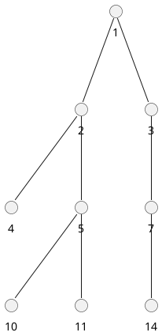
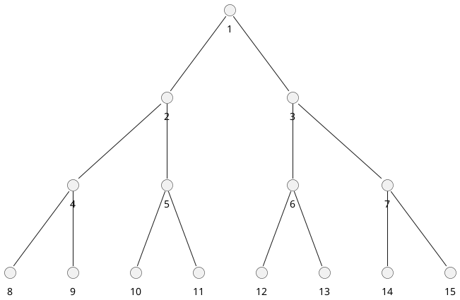
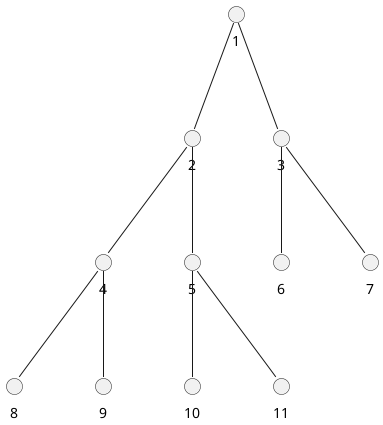

## "二叉树"

### 二叉树 (Binary Tree)

二叉树 (Binary Tree) 是包含n个节点的有限集合，该集合或者为空集 (此时，二叉树称为空树) ，或者由一个根节点和两棵互不相交的、分别称为根节点的左子树和右子树的二叉树组成。

二叉树中的节点至多包含两棵子树，分别称为左子树和右子树，而左子树和右子树又分别至多包含两棵子树。由上述的定义，二叉树的定义是一种递归的定义。

### 满二叉树 Full Binary Tree

对于一棵二叉树，如果每一个非叶子节点都存在左右子树，并且二叉树中所有的叶子节点都在同一层中，这样的二叉树称为满二叉树。

### 完全二叉树 Complete Binary Tree

对于一棵具有n个节点的二叉树按照层次编号，同时，左右子树按照先左后右编号，如果编号为i的节点与同样深度的满二叉树中编号为i的节点在二叉树中的位置完全相同，则这棵二叉树称为完全二叉树。

### 二叉查找树 Binary Search Tree, 搜索树

二叉树的提出其实主要就是为了提高查找效率，比如我们常用的 HashMap  在处理哈希冲突严重时，拉链过长导致查找效率降低，就引入了红黑树。
    我们知道，二分查找可以缩短查找的时间，但是它要求 查找的数据必须是有序的。每次查找、操作时都要维护一个有序的数据集，于是有了二叉查找树这个概念。
    二叉查找树 (又叫二叉排序树) ，它是具有下列性质的二叉树:

            若左子树不空，则左子树上所有结点的值均小于它的根结点的值；
        
        
            若右子树不空，则右子树上所有结点的值均大于或等于它的根结点的值；
        
        
            左、右子树也分别为二叉排序树。

也就是说，二叉查找树中，左子树都比节点小，右子树都比节点大，递归定义。

根据二叉排序树这个特点我们可以知道: 二叉排序树的中序遍历一定是从小到大的。
二叉排序树的性能
在最好的情况下，二叉排序树的查找效率比较高，是 O(logn)，其访问性能近似于折半查找；

但最差时候会是 O(n)，比如插入的元素是有序的，生成的二叉排序树就是一个链表，这种情况下，需要遍历全部元素才行 (见下图 b) 。

### 平衡二叉树 Balanced BinaryTree

平衡二叉树的提出就是为了保证树不至于太倾斜，尽量保证两边平衡。因此它的定义如下:

            平衡二叉树要么是一棵空树
        
        
            要么保证左右子树的高度之差不大于 1
        
        
            子树也必须是一颗平衡二叉树

也就是说，树的两个左子树的高度差别不会太大。
    那我们接着看前面的极端情况的二叉排序树，现在用它来构造一棵平衡二叉树。
    以 12 为根节点，当添加 24 为它的右子树后，根节点的左右子树高度差为 1，这时还算平衡，这时再添加一个元素 28:
这时根节点 12 觉得不平衡了，我左孩子一个都没有，右边都有俩了，超过了之前说的最大为 1，不行，给我调整！
    于是我们就需要调整当前的树结构，让它进行旋转。
    因为最后一个节点加到了右子树的右子树，就要想办法给右子树的左子树加点料，因此需要逆时针旋转，将 24 变成根节点，12 右旋成 24 的左子树，就变成了这样 (有点丑哈哈) :
 ...

### 二叉树的一些性质

对于二叉树，包含一些性质:

在二叉树中，第 ii层上至多有2i−12i−1个节点 (i≥1)
深度为kk的二叉树至多有2k−12k−1个节点 (k≥1k≥1)
对一棵二叉树，如果叶子节点的个数为n0n0，度为22的节点个数为n2n2，则n0=n2+1n0=n2+1
具有nn个节点的完全二叉树的深度为⌊log2n⌋+1

二叉树的存储结构
若要想对二叉树进行操作，首先需要定义二叉树的存储结构，对于如下图所示的二叉树:

其对应的存储有两种:

顺序存储结构
链式存储结构
首先，我们来看顺序存储结构，简单来讲，顺序存储结构是指用一维数据存储二叉树中的节点，其中，数组的下标要能体现节点之间的逻辑关系，对于上述的二叉树，其顺序存储结构为:

在顺序存储结构中，“^”表示的是没有节点，从顺序存储可以看出，若出现大量“^”，则对空间是一种极大的浪费。

在二叉树中，每一个节点至多存在左右子树，因此在链式存储结构中，每一个节点的结构为:

其中，data 称为数据域，lchild和rchild称为指针域，分别指向左孩子和右孩子。

在实际使用中，根据不同的需要，使用顺序存储结构和链式存储结构。对于链式存储结构，我们定义如下:

typedef struct BiNode{
        int data;// 数据域的值
        struct BiNode *left;// 左孩子
struct BiNode*right;// 右孩子
}binode;

### AVL，SBT，伸展树，TREAP, 红黑树

2. 二叉树的遍历
在二叉树的操作中，二叉树的遍历是基本的操作，对于二叉树的遍历操作，主要分为:

前序遍历
中序遍历
后序遍历
层次遍历
对于前序遍历，首先遍历根节点，其次遍历左孩子，再遍历右孩子，按照如此的顺序遍历整棵树，其代码如下:

// 先序遍历
void pre_order(binode *p){
        if (p != NULL){
                printf("%d\t", p->data);
                pre_order(p->left);
                pre_order(p->right);
        }
}

对于中序遍历，首先遍历左子树，其次遍历父节点，最后遍历右子树，按照如此的顺序遍历整棵树，其代码如下:

// 中序遍历
void in_order(binode *p){
        if (p != NULL){
                in_order(p->left);
                printf("%d\t", p->data);
                in_order(p->right);
        }
}

对于后序遍历，首先遍历左子树，其次遍历右子树，最后遍历父节点，其代码如下:

// 后序遍历
void post_order(binode *p){
        if (p!= NULL){
                post_order(p->left);
                post_order(p->right);
                printf("%d\t", p->data);
        }
}

对于层次遍历，需要使用链表存储每一层的节点，同时，遍历完一个节点，将其左右子节点增加近链表中，其代码为:

// 层次遍历
void lever_order(binode *p){
        // 使用队列
list<binode*> t;
        if (p != NULL){
                t.push_back(p);
        }

        while (t.size() > 0){
                printf("%d\t", (t.front())->data);
                if ((t.front())->left != NULL){
                        t.push_back((t.front())->left);
                }

                if ((t.front())->right != NULL){
                        t.push_back((t.front())->right);
                }
                t.pop_front();
        }
}
————————————————
版权声明: 本文为CSDN博主「zhiyong_will」的原创文章，遵循CC 4.0 BY-SA版权协议，转载请附上原文出处链接及本声明。
原文链接: <https://blog.csdn.net/google19890102/article/details/53926704>

作者: 张拭心
链接: <https://juejin.cn/post/6844903606408183815>
来源: 掘金
著作权归作者所有。商业转载请联系作者获得授权，非商业转载请注明出处。

## self-balancing binary search tree, 自平衡

- AVL 树
- 红黑树
