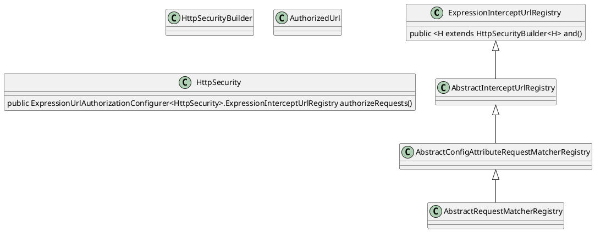

+++
author = "w1100n"
date = "2020-12-23 19:45:53" 
title = "spring security"

+++

```puml
@startuml
class ExpressionInterceptUrlRegistry
ExpressionInterceptUrlRegistry : public <H extends HttpSecurityBuilder<H> and()
ExpressionInterceptUrlRegistry <|-- AbstractInterceptUrlRegistry
AbstractInterceptUrlRegistry <|-- AbstractConfigAttributeRequestMatcherRegistry
AbstractConfigAttributeRequestMatcherRegistry <|-- AbstractRequestMatcherRegistry

class HttpSecurityBuilder
class AuthorizedUrl
class HttpSecurity
HttpSecurity : public ExpressionUrlAuthorizationConfigurer<HttpSecurity>.ExpressionInterceptUrlRegistry authorizeRequests()
@enduml
```