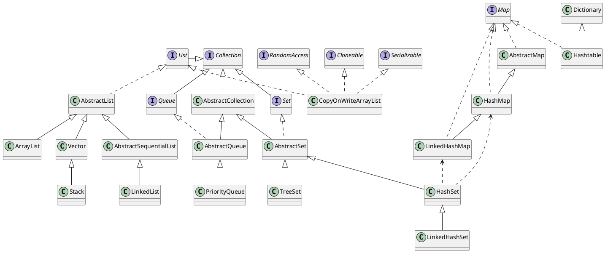

## Collection, Array, Vector, ArrayList, List, LinkedList

array(数组)和Vector是十分相似的Java构件 (constructs) ，两者全然不同，在选择使用时应根据各自的功能来确定。

### 数组 Array

Java arrays 的元素个数不能下标越界，从很大程度上保证了Java程序的安全性，而其他一些语言出现这一问题时常导致灾难性的后果。
  
Array 可以存放Object和基本数据类型，但创建时必须指定数组的大小，并不能再改变。值得注意的是: 当Array中的某一元素存放的是Objrct reference 时，Java不会调用默认的构造函数，而是将其初值设为null，当然这跟Java对各类型数据赋默认值的规则是一样的，对基本数据类型同样适用。
  
线性表，链表，哈希表是常用的数据结构，在进行Java开发时，JDK已经为我们提供了一系列相应的类来实现基本的数据结构。这些类均在java.util包中。本文试图通过简单的描述，向读者阐述各个类的作用以及如何正确使用这些类。

### Collection接口

Collection是最基本的集合接口，一个Collection代表一组Object，即Collection的元素 (Elements) 。一些 Collection允许相同的元素而另一些不行。一些能排序而另一些不行。Java SDK不提供直接继承自Collection的类， Java SDK提供的类都是继承自Collection的"子接口"如List和Set。
  
所有实现Collection接口的类都必须提供两个标准的构造函数: 无参数的构造函数用于创建一个空的Collection，有一个Collection参数的构造函数用于创建一个新的 Collection，这个新的Collection与传入的Collection有相同的元素。后一个构造函数允许用户复制一个Collection。
  
如何遍历Collection中的每一个元素？不论Collection的实际类型如何，它都支持一个iterator()的方法，该方法返回一个迭代子，使用该迭代子即可逐一访问Collection中每一个元素。典型的用法如下:

```java

Iterator it = collection.iterator(); // 获得一个迭代子
  
while(it.hasNext()) {
  
Object obj = it.next(); // 得到下一个元素
  
}

```

由Collection接口派生的两个接口是List和Set。

### List接口

List是有序的Collection，使用此接口能够精确的控制每个元素插入的位置。用户能够使用索引 (元素在List中的位置，类似于数组下标) 来访问List中的元素，这类似于Java的数组。
  
和下面要提到的Set不同，List允许有相同的元素。
  
除了具有Collection接口必备的iterator()方法外，List还提供一个listIterator()方法，返回一个 ListIterator接口，和标准的Iterator接口相比，ListIterator多了一些add()之类的方法，允许添加，删除，设定元素，还能向前或向后遍历。
  
实现List接口的常用类有LinkedList，ArrayList，Vector和Stack。

### LinkedList类

LinkedList实现了List接口，允许null元素。此外LinkedList提供额外的get，remove，insert方法在 LinkedList的首部或尾部。这些操作使LinkedList可被用作堆栈 (stack) ，队列 (queue) 或双向队列 (deque) 。
  
注意LinkedList没有同步方法。如果多个线程同时访问一个List，则必须自己实现访问同步。一种解决方法是在创建List时构造一个同步的List:
  
List list = Collections.synchronizedList(new LinkedList(...));

对于新增和删除操作add和remove，LinedList比较占优势，因为ArrayList要移动数据。

### ArrayList

ArrayList 实现了可变大小的数组。它允许所有元素，包括 null。和LinkedList一样，ArrayList也是非同步的 (unsynchronized) 。
  
size，isEmpty，get，set方法运行时间为常数。但是add方法开销为分摊的常数，添加n个元素需要O(n)的时间。其他的方法运行时间为线性。
  
每个ArrayList实例都有一个容量 (Capacity) ，即用于存储元素的数组的大小。这个容量可随着不断添加新元素而自动增加，但是增长算法并没有定义。当需要插入大量元素时，在插入前可以调用ensureCapacity方法来增加ArrayList的容量以提高插入效率。
  
ArrrayList底层的数据结构是数组，支持随机访问，而 LinkedList 的底层数据结构是双向循环链表，不支持随机访问。使用下标访问一个元素，ArrayList 的时间复杂度是 O(1)，而 LinkedList 是 O(n)。

为什么多线程环境下ArrayList是线程不安全的？因为在进行写操作（add方法）的时候，方法上为了保证并发性，没有添加synchronized修饰。

ArrayList 不是线程安全的，Vector 是线程安全。而保障 Vector 线程安全的方式，是非常粗暴的在方法上用 synchronized 独占锁，将多线程执行变成串行化。要想将 ArrayList 变成线程安全的也可以使用Collections.synchronizedList(List<T> list)方法 ArrayList 转换成线程安全的，但这种转换方式依然是通过 synchronized 修饰方法实现的，很显然这不是一种高效的方式，

### Vector

对比于Array，当更多的元素被加入进来以至超出其容量时，Vector的size会动态增长，而Array容量是定死的。

Vector在删除一些元素后，其所有下标大于被删除元素的元素都依次前移，并获得新下标比原来的小了。注意: 当调用Vector的size()方法时，返回Vector中实际元素的个数。
  
Vector内部实际是以Array实现的，也通过元素的整数索引来访问元素，但它只能存放java.lang.Object对象，不能用于存放基本类型数据，比如要存放一个整数10,得用new Integer(10)构造出一个Integer包装类对象再放进去。当Vector中的元素个数发生变化时, 其内部的Array必须重新分配并进行拷贝，因此这是一点值得考虑的效率问题。
  
Vetor同时也实现了List接口，所以也可以算作Colletion了，只是它还特殊在: **Vector is synchronized**. 即Vetor对象自身实现了同步机制。当一个Iterator被创建而且正在被使用，另一个线程改变了Vector的状态 (例如，添加或删除了一些元素) ，这时调用Iterator的方法时将抛出ConcurrentModificationException，因此必须捕获该异常。

Vector 由于使用了synchronized方法 (线程安全) ，通常性能上较 ArrayList 差，

### Stack 类

Stack继承自Vector，实现一个后进先出的堆栈。Stack提供5个额外的方法使得 Vector得以被当作堆栈使用。基本的push和pop方法，还有peek方法得到栈顶的元素，empty方法测试堆栈是否为空，search方法检测一个元素在堆栈中的位置。Stack刚创建后是空栈。

### Set 接口

Set是一种不包含重复的元素的Collection，即任意的两个元素e1和e2都有e1.equals(e2)=false，Set最多有一个null元素。
  
很明显，Set的构造函数有一个约束条件，传入的Collection参数不能包含重复的元素。
  
请注意: 必须小心操作可变对象 (Mutable Object) 。如果一个Set中的可变元素改变了自身状态导致Object.equals(Object)=true将导致一些问题。

### Map 接口

请注意，Map没有继承Collection接口，Map提供key到value的映射。一个Map中不能包含相同的key，每个key只能映射一个 value。Map接口提供3种集合的视图，Map的内容可以被当作一组key集合，一组value集合，或者一组key-value映射。

### Hashtable 类

Hashtable 实现 Map接口，实现一个key-value映射的哈希表。任何非空 (non-null) 的对象都可作为key或者value。
  
添加数据使用put(key, value)，取出数据使用get(key)，这两个基本操作的时间开销为常数。
  
Hashtable 通过initial capacity和load factor两个参数调整性能。通常缺省的load factor 0.75较好地实现了时间和空间的均衡。增大load factor可以节省空间但相应的查找时间将增大，这会影响像get和put这样的操作。
  
使用Hashtable的简单示例如下，将1，2，3放到Hashtable中，他们的key分别是"one"，"two"，"three":

```java
Hashtable numbers = new Hashtable();
numbers.put("one", new Integer(1));
numbers.put("two", new Integer(2));
numbers.put("three", new Integer(3));

// 要取出一个数，比如2，用相应的key
Integer n = (Integer)numbers.get("two");  
System.out.println("two = " + n);
```

由于作为key的对象将通过计算其散列函数来确定与之对应的value的位置，因此任何作为key的对象都必须实现hashCode和equals方法。hashCode和equals方法继承自根类Object，如果你用自定义的类当作key的话，要相当小心，按照散列函数的定义，如果两个对象相同，即obj1.equals(obj2)=true，则它们的hashCode必须相同，但如果两个对象不同，则它们的hashCode不一定不同，如果两个不同对象的hashCode相同，这种现象称为冲突，冲突会导致操作哈希表的时间开销增大，所以尽量定义好的hashCode()方法，能加快哈希表的操作。
  
如果相同的对象有不同的hashCode，对哈希表的操作会出现意想不到的结果 (期待的get方法返回null) ，要避免这种问题，只需要牢记一条: 要同时复写equals方法和hashCode方法，而不要只写其中一个。
  
Hashtable是同步的。

### HashMap类

HashMap和Hashtable类似，不同之处在于HashMap是非同步的，并且允许null，即null value和null key。，但是将HashMap视为Collection时 (values()方法可返回Collection) ，其迭代子操作时间开销和HashMap的容量成比例。因此，如果迭代操作的性能相当重要的话，不要将HashMap的初始化容量设得过高，或者load factor过低。

WeakHashMap类
  
WeakHashMap是一种改进的HashMap，它对key实行"弱引用"，如果一个key不再被外部所引用，那么该key可以被GC回收。

总结
  
如果涉及到堆栈，队列等操作，应该考虑用List，

对于需要快速插入，删除元素，应该使用LinkedList，

如果需要快速随机访问元素，应该使用ArrayList。
  
如果程序在单线程环境中，或者访问仅仅在一个线程中进行，考虑非同步的类，其效率较高，

如果多个线程可能同时操作一个类，应该使用同步的类。
  
要特别注意对哈希表的操作，作为key的对象要正确复写equals和hashCode方法。
  
尽量返回接口而非实际的类型，如返回List而非ArrayList，这样如果以后需要将ArrayList换成LinkedList时，客户端代码不用改变。这就是针对抽象编程。

同步性
  
Vector 是同步的。这个类中的一些方法保证了Vector中的对象是线程安全的。

而ArrayList则是异步的，因此ArrayList中的对象并不是线程安全的。因为同步的要求会影响执行的效率，所以如果你不需要线程安全的集合那么使用ArrayList是一个很好的选择，这样可以避免由于同步带来的不必要的性能开销。

数据增长
  
从内部实现机制来讲ArrayList和Vector都是使用数组(Array)来控制集合中的对象。当你向这两种类型中增加元素的时候，如果元素的数目超出了内部数组目前的长度它们都需要扩展内部数组的长度，Vector缺省情况下自动增长原来一倍的数组长度， ArrayList是原来的50%,所以最后你获得的这个集合所占的空间总是比你实际需要的要大。所以如果你要在集合中保存大量的数据那么使用 Vector有一些优势，因为你可以通过设置集合的初始化大小来避免不必要的资源开销。

使用模式
  
在ArrayList和Vector中，从一个指定的位置 (通过索引) 查找数据或是在集合的末尾增加、移除一个元素所花费的时间是一样的，这个时间我们用O(1)表示。但是，如果在集合的其他位置增加或移除元素那么花费的时间会呈线形增长: O(n-i)，其中n代表集合中元素的个数，i代表元素增加或移除元素的索引位置。为什么会这样呢？以为在进行上述操作的时候集合中第i和第i个元素之后的所有元素都要执行位移的操作。这一切意味着什么呢？

这意味着，你只是查找特定位置的元素或只在集合的末端增加、移除元素，那么使用Vector或ArrayList都可以。如果是其他操作，你最好选择其他的集合操作类。比如，LinkList集合类在增加或移除集合中任何位置的元素所花费的时间都是一样的?O(1)，但它在索引一个元素的使用缺比较慢－O(i),其中i是索引的位置.使用 ArrayList也很容易，因为你可以简单的使用索引来代替创建iterator对象的操作。LinkList也会为每个插入的元素创建对象，所有你要明白它也会带来额外的开销。

最后，在《Practical Java》一书中Peter Haggar建议使用一个简单的数组 (Array) 来代替Vector或ArrayList。尤其是对于执行效率要求高的程序更应如此。因为使用数组(Array)避免了同步、额外的方法调用和不必要的重新分配空间的操作。

### 为什么 java.util.concurrent 包里没有并发的 ArrayList 实现？

问: JDK 5在java.util.concurrent 里引入了 ConcurrentHashMap，在需要支持高并发的场景，我们可以使用它代替 HashMap。但是为什么没有 ArrayList 的并发实现呢？难道在多线程场景下我们只有Vector 这一种线程安全的数组实现可以选择么？为什么在 java.util.concurrent 没有一个类可以代替 Vector 呢？

答: 我认为在 java.util.concurrent 包中没有加入并发的ArrayList实现的主要原因是: 很难去开发一个通用并且没有并发瓶颈的线程安全的List。

像ConcurrentHashMap 这样的类的真正价值 (The real point / value of classes) 并不是它们保证了线程安全。而在于它们在保证线程安全的同时不存在并发瓶颈。举个例子，ConcurrentHashMap采用了锁分段技术和弱一致性的Map 迭代器去规避并发瓶颈。

所以问题在于，像"Array List"这样的数据结构，你不知道如何去规避并发的瓶颈。拿 contains() 这样一个操作来说，当你进行搜索的时候如何避免锁住整个list？

另一方面，Queue 和 Deque (基于Linked List) 有并发的实现是因为他们的接口相比 List的接口有更多的限制，这些限制使得实现并发成为可能。

CopyOnWriteArrayList 是一个有趣的例子，它规避了只读操作 (如get/contains) 并发的瓶颈，但是它为了做到这点，在修改操作中做了很多工作和修改可见性规则。 此外，修改操作还会锁住整个List，因此这也是一个并发瓶颈。所以从理论上来说，CopyOnWriteArrayList并不算是一个通用的并发List。

### LinkedHashMap

通过维护一个运行于所有条目的双向链表，LinkedHashMap保证了元素迭代的顺序。该迭代顺序可以是插入顺序或者是访问顺序。

### LinkedHashSet

由 LinkedHashMap 实现

[https://twiceyuan.com/2016/06/09/ArrayList-is-not-thread-safe/](https://twiceyuan.com/2016/06/09/ArrayList-is-not-thread-safe/)  
[http://ifeve.com/why-is-there-not-concurrent-arraylist-in-java-util-concurrent-package/](http://ifeve.com/why-is-there-not-concurrent-arraylist-in-java-util-concurrent-package/)  
[http://ifeve.com/why-is-there-not-concurrent-arraylist-in-java-util-concurrent-package/embed/#?secret=zLAPktQzUL](http://ifeve.com/why-is-there-not-concurrent-arraylist-in-java-util-concurrent-package/embed/#?secret=zLAPktQzUL)  

[http://blog.csdn.net/mandymai/article/details/3966667/](http://blog.csdn.net/mandymai/article/details/3966667/)

[http://blog.csdn.net/smallboy_5/article/details/2119123](http://blog.csdn.net/smallboy_5/article/details/2119123)

### ArrayList vs LinkedList

1. ArrayList 不是线程安全的
2. ArrayList 是实现了基于动态**数组**的数据结构，而 LinkedList 是基于**链表**的数据结构；
3. 对于随机访问 get 和 set，ArrayList 要优于 LinkedList，因为 LinkedList 要移动指针；
4. 对于添加和删除操作 add 和 remove，一般大家都会说 LinkedList 要比 ArrayList 快，因为 ArrayList 要移动数据。但是实际情况并非这样，对于添加或删除，LinkedList 和 ArrayList 并不能明确说明谁快谁慢， ArrayList 想要在指定位置插入或删除元素时，主要耗时的是 System.arraycopy 动作，会移动 index 后面所有的元素；LinkedList 主耗时的是要先通过 for 循环找到 index，然后直接插入或删除。这就导致了两者并非一定谁快谁慢，主要有两个因素决定他们的效率，插入的数据量和插入的位置。我们可以在程序里改变这两个因素来测试它们的效率。

当数据量较小时，测试程序中，大约小于30的时候，两者效率差不多，没有显著区别；当数据量较大时，大约在容量的1/10处开始，LinkedList的效率就开始没有ArrayList效率高了，特别到一半以及后半的位置插入时，LinkedList效率明显要低于ArrayList，而且数据量越大，越明显。

当插入的数据量很小时，两者区别不太大，当插入的数据量大时，大约在容量的1/10之前，LinkedList会优于ArrayList，在其后就劣与ArrayList，且越靠近后面越差。

版权声明：本文为CSDN博主「武哥聊编程」的原创文章，遵循CC 4.0 BY-SA版权协议，转载请附上原文出处链接及本声明。
原文链接：[https://blog.csdn.net/eson_15/article/details/51145788](https://blog.csdn.net/eson_15/article/details/51145788)

## HashSet

HashSet线程不安全
用CopyOnWriteArraySet（底层还是用的CopyOnWriteArrayList）

## HashMap线程不安全

HashMap线程不安全
使用Collections.synchronizedMap(new HashMap<>())
使用ConcurrentHashMap

## 图



[https://segmentfault.com/a/1190000039264628](https://segmentfault.com/a/1190000039264628)

作者：你听___
链接：https://juejin.cn/post/6844903602427805704
来源：稀土掘金
著作权归作者所有。商业转载请联系作者获得授权，非商业转载请注明出处。

