## 背景

Java 相关文章分散在多篇文章中。本文用 **关系图 + 索引表** 串起 JVM 运行时、类加载、调试、字节码织入、生产诊断等概念，便于从一点跳到专题文。

与 [BTrace](./btrace.md) 对话中沉淀的 attach / agent / ASM 链路，是下图右侧「生产诊断」分支的核心。

## 总览关系图

```mermaid
flowchart TB
  subgraph runtime [JVM 运行时]
    HS[HotSpot 简介]
    JVM[jvm 通用概念]
    CL[classloader]
    GC[java-gc 等]
  end

  subgraph native [Native 与通道]
    JVMTI[JVMTI]
    ATT[Attach API]
    JCMD[jcmd]
  end

  subgraph debug [调试与开发热更]
    JPDA[JPDA 远程调试]
    HOT[开发期热替换 DCEVM]
    SBDT[Spring Boot DevTools]
  end

  subgraph instrument [字节码与 Agent]
    INST[java.lang.instrument]
    ASM[java-asm]
  end

  subgraph prod [生产诊断]
    BTRACE[BTrace]
    TOOL[诊断工具选型]
    JFR[JFR]
  end

  HS --> CL
  HS --> GC
  HS --> ATT
  HS --> JVMTI
  JPDA --> JVMTI
  ATT --> INST
  INST --> ASM
  ASM --> BTRACE
  ATT --> BTRACE
  JCMD --> ATT
  HOT --> JPDA
  HOT --> ASM
  BTRACE --> TOOL
  JFR --> TOOL
  SBDT -.->|非 JVM HotSwap| CL
```



## 按主题索引

### JVM 与 HotSpot

| 概念 | 文章 |
| ---- | ---- |
| JVM 生态、实现选型 | [Java 虚拟机生态与选型](./jvm.md) |
| HotSpot 架构与站内索引 | [HotSpot 简介](./hotspot.md) |
| HotSpot 启动参数 | [hotspot-options](./hotspot-options.md) |
| JIT / C1·C2 / 分层编译 | [jvm-compiler](../../cs/jvm-compiler.md) |
| GC、分代（多篇） | [java-gc](./java-gc.md) 等 |
| Safepoint | [safepoint](../../other/safepoint.md) |

### 类加载

| 概念 | 文章 |
| ---- | ---- |
| 双亲委托、命名空间、Agent 与业务 ClassLoader | [java classloader](./classloader.md) |
| `java.lang.Class`（类型元信息、获取方式） | [lang-class](./lang-class.md) |
| `Class.forName` | [class-forname](./class-forname.md) |

### 调试体系（JPDA）

| 概念 | 文章 |
| ---- | ---- |
| JPDA 三层 JDI / JDWP / JVMTI、远程调试 | [JAVA 调试与 JPDA](./java-debug-JPDA.md) |
| JVMTI native 接口 | [JVMTI](./jvmti.md) |

### Attach 与内置诊断

| 概念 | 文章 |
| ---- | ---- |
| Attach API、`loadAgent`、与 jcmd 区别 | [Java Attach API](./attach-api.md) |
| jcmd、Diagnostic Command | [jcmd](./jcmd.md) |

### 字节码、Agent、织入

| 概念 | 文章 |
| ---- | ---- |
| ASM、Instrumentation、retransform、INVOKESTATIC 示意 | [Java ASM 与运行时字节码织入](./java-asm.md) |
| BTrace 安装、attach、脚本、慢调用 | [BTrace](./btrace.md) |
| 生产诊断工具选型（BTrace / Arthas / JFR） | [生产环境诊断工具选型](./java-production-diagnostics-tooling.md) |
| JFR | [Java Flight Recorder](./java-flight-recorder-jfr.md) |

### 开发期热替换（非 BTrace）

| 概念 | 文章 |
| ---- | ---- |
| HotSwap、DCEVM、HotSwapAgent | [开发期热替换](../../cs/dcevm-hotswapagent.md) |
| Spring Framework 总览与演变 | [Spring](./spring/spring.md) |
| Spring Boot DevTools Restart | [Spring Boot DevTools](./spring/spring-boot-devtools.md) |
| Spring Boot 总览 | [Spring Boot](./spring/spring-boot.md) |
| IDE / DCEVM 热更 vs attach 探针 | 见 [java-asm](./java-asm.md)、[BTrace](./btrace.md) |

### AOP / 其它织入

| 概念 | 文章 |
| ---- | ---- |
| AspectJ 编译时织入 | [AspectJ CTW](./aspectj-编译时织入compile-time-weaving-ctw.md) |
| CGLIB、AOP | [cglib](./cglib.md)、[aop](./aop.md) |

## BTrace 相关概念链（精读路径）

若从 [BTrace](./btrace.md) 出发，建议按因果顺序阅读：

```text
HotSpot + Attach 通道     →  /hotspot 、/attach-api
loadAgent / agentmain     →  /attach-api 、/btrace §概念厘清
Instrumentation + ASM     →  /java-asm
业务类 vs agent ClassLoader →  /classloader
JVMTI / JPDA（对比调试）  →  /jvmti 、/java-debug-jpda
开发热更（易混淆）        →  /dcevm-hotswapagent 、/spring-boot-devtools
工具选型                  →  /production-diagnostics-tooling
```

## 易混淆对照

| 问题 | 结论 | 详见 |
| ---- | ---- | ---- |
| `loadAgent` 会跑 agent 的 `main` 吗？ | 否，走 `agentmain` | [BTrace](./btrace.md)、[attach-api](./attach-api.md) |
| attach 时脚本进 JVM 了吗？ | 否，先 agent，后 Socket 下发 | [BTrace](./btrace.md) |
| Agent 与业务同一进程吗？ | 是；ClassLoader 路径不同 | [classloader](./classloader.md)、[BTrace](./btrace.md) |
| 开发 HotSwap = BTrace？ | 否；JPDA vs attach 探针 | [dcevm-hotswapagent](../../cs/dcevm-hotswapagent.md)、[java-asm](./java-asm.md) |
| JVM 限制 agent 只能监控？ | 否；BTrace 在校验脚本 | [java-asm](./java-asm.md)、[BTrace](./btrace.md) |
| Spring = Spring MVC？ | 否；MVC 只是 Framework 的 Web 模块 | [Spring](./spring/spring.md) |
| Spring 1.x 就用注解？ | 否；1.x 以 XML 为主，2.0 / 2.5 才注解化 | [Spring](./spring/spring.md)、[JDK 5](./jdk-5.md) |
| 用了注解就不需要 XML？ | 否；2.5 后多年 XML 骨架 + 注解业务很常见 | [Spring](./spring/spring.md) |
| 只有 Boot 才去掉 XML？ | 否；3.0 Java Config 已可零 XML；Boot 靠自动配置推到几乎零配置 | [Spring](./spring/spring.md)、[Spring Boot](./spring/spring-boot.md) |
| `@Autowired` 是 JDK 内置注解？ | 否；Spring 自定义，依赖 JDK 5 注解机制 | [annotation](./annotation.md)、[Spring](./spring/spring.md) |

## 维护说明

新增 Java 专题文时，可在本文对应主题表补一行链接，并在 mermaid 图中增加节点（保持可读即可，不必穷尽所有文章）。

| 时间 | 修改内容 |
| ---- | -------- |
| 2026-06-19 | JVM 索引表拆分：jvm 生态、hotspot-options |
| 2026-06-21 | 类加载索引增加 `lang-class.md` | Class 概念独立成文 |
| 2026-06-24 | 开发期热替换表增加 [Spring](./spring/spring.md) 链接 | 新建 Spring Framework 总览文 |
| 2026-06-24 | 易混淆对照增加 Spring / MVC / 注解相关三行 | 与 spring.md、jdk-5.md 对话沉淀对齐 |
| 2026-06-24 | 易混淆对照补充 XML 混合期、Boot 与 Java Config 分工 | 与 spring.md 配置演进章节对齐 |
