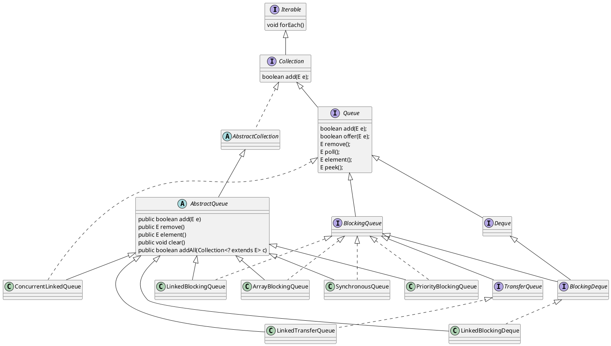

## java 队列, Queue, Deque

名称 deque 是 "double ended queue (双端队列)" 的缩写, 通常读为 "deck"。
  
大多数 Deque 实现对于它们能够包含的元素数没有固定限制, 但此接口既支持有容量限制的双端队列, 也支持没有固定大小限制的双端队列.

## ArrayBlockingQueue

基于数组的阻塞队列

[http://wiloon.com/ArrayBlockingQueue](http://wiloon.com/ArrayBlockingQueue)

## LinkedBlockingQueue

链表结构组成的有界阻塞队列。
  
## PriorityBlockingQueue

支持优先级排序的无界阻塞队列。
  
## DelayQueue

一个使用优先级队列实现的无界阻塞队列。
  
## SynchronousQueue

不存储元素的阻塞队列
  
## LinkedTransferQueue

一个由链表结构组成的无界阻塞队列。
  
## LinkedBlockingDeque

一个由链表结构组成的双向阻塞队列。
  
[https://blog.wiloon.com/?p=8256](https://blog.wiloon.com/?p=8256)
  
## ConcurrentLinkedDeque

非阻塞线程安全列表

## ConcurrentLinkedQueue

ConcurrentLinkedQueue 是一个基于链接节点的无界线程安全队列
  
[http://blog.wiloon.com/?p=11670](http://blog.wiloon.com/?p=11670)

## Queue

- add   增加一个元索 如果队列已满, 则抛出一个 IIIegaISlabEepeplian 异常
- offer 添加一个元素并返回 true 如果队列已满, 则返回 false
- put   添加一个元素 如果队列满, 则阻塞

- remove 移除并返回队列头部的元素如果队列为空, 则抛出一个 NoSuchElementException 异常
- poll   移除并返回队列头部的元素如果队列为空，则返回 null
- take   移除并返回队列头部的元素 如果队列为空，则阻塞

- element 返回队列头部的元素 如果队列为空，则抛出一个 NoSuchElementException 异常
- peek    返回队列头部的元素 如果队列为空，则返回 null

### add() 和 offer()

add() 和 offer() 都是向队列中添加一个元素。一些队列有大小限制，因此如果想在一个满的队列中加入一个新项，调用 add() 方法就会抛出一个 unchecked 异常，而调用 offer() 方法会返回 false。因此就可以在程序中进行有效的判断!

### remove() 和 poll()

remove() 和 poll() 方法都是从队列中删除第一个元素。如果队列元素为空，调用 remove() 的行为与 Collection 接口的版本相似会抛出异常，但是 poll() 方法在用空集合调用时只是返回 null。因此新的方法更适合容易出现异常条件的情况。

### element() 和 peek()

element() 和 peek() 用于在队列的头部查询元素。与 remove() 方法类似，在队列为空时， element() 抛出一个异常，而 peek() 返回 null。

[http://blog.csdn.net/u012050154/article/details/60572567](http://blog.csdn.net/u012050154/article/details/60572567)

[http://jiangzhengjun.iteye.com/blog/683593](http://jiangzhengjun.iteye.com/blog/683593)

### uml

