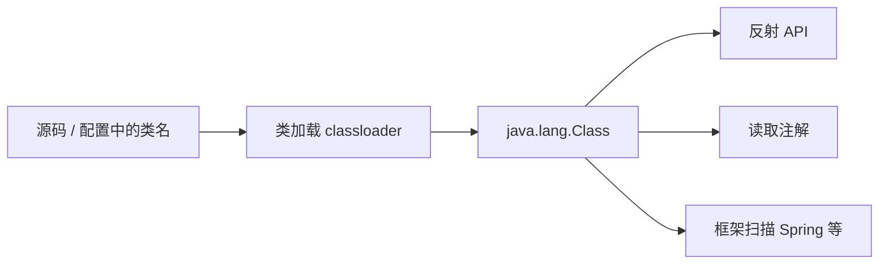

`java.lang.Class` 是 JVM 为每一种 Java 类型在运行时维护的**元信息对象**。它不代表某个业务实例，而是代表**类型本身**——类、接口、枚举、注解类型、数组、基本类型乃至 `void` 都有对应的 `Class` 实例。

反射、[注解](./annotation.md) 读取、框架扫描等能力，都依赖先拿到正确的 `Class` 对象。

## Class 与实例的区别

| | 实例对象 | `Class` 对象 |
| --- | --- | --- |
| 含义 | 某个类的具体对象 | 描述类型本身的元数据 |
| 示例 | `new SampleSubject()` | `SampleSubject.class` |
| 数量 | 可创建多个实例 | 每种类型在 JVM 中**唯一** |

```java
SampleSubject a = new SampleSubject();
SampleSubject b = new SampleSubject();

a.getClass() == SampleSubject.class;  // true
a.getClass() == b.getClass();         // true：同一类型的 Class 只有一个
a == b;                               // false：实例不同
```

## 何时创建、由谁创建

`Class` **没有 public 构造方法**，不能 `new Class()`。对象在**类加载**过程中由 JVM 通过类加载器的 `defineClass` 等机制创建。加载流程见 [java classloader](./classloader.md)。

要点：

- 某类型首次被主动使用或显式加载时，对应 `Class` 才会进入 JVM
- 基本类型（`int.class`）、`void.class`、数组类型（`int[].class`）也有各自的 `Class`，由 JVM 内置提供
- 相同元素类型与维数的数组共享同一个 `Class` 对象

## 获取 Class 对象的常见方式

### 1. 类型字面量 `.class`

类型已知且已在编译期可见时使用：

```java
Class<?> c1 = String.class;
Class<?> c2 = int.class;
Class<?> c3 = int[].class;
Class<?> c4 = SampleSubject.class;
```

包装类型的 `Integer.TYPE` 与 `int.class` 等价。

### 2. 实例的 `getClass()`

已有对象，要查其**运行时实际类型**时使用（多态场景下可能与声明类型不同）：

```java
Object obj = "hello";
Class<?> c = obj.getClass();  // String.class，不是 Object.class
```

`getClass()` 定义在 [java.lang.Object](./java-object.md) 中，所有实例都可调用。

### 3. `Class.forName(String)`

类名在**运行期**才确定时使用（字符串形式的完全限定名）。会触发加载，默认还会初始化该类。详见 [Class.forName](./class-forname.md)。

```java
Class<?> clazz = Class.forName("com.example.Foo");
```

### 三种方式对比

| 方式 | 典型场景 | 是否触发类初始化 |
| --- | --- | --- |
| `Xxx.class` | 编译期类型已知 | 否 |
| `obj.getClass()` | 已有实例，查运行时类型 | 否（类已加载） |
| `Class.forName(name)` | 配置/字符串驱动加载 | 单参数重载默认为**是** |

## `Class<?>` 是什么

`Class` 是泛型类：`Class<T>` 表示「代表 T 类型的 Class」。参数未知或任意类型时写 `Class<?>`：

```java
static String tagOf(Class<?> type) {
    Tag tag = type.getAnnotation(Tag.class);
    return tag != null ? tag.value() : "";
}
```

这里方法不关心具体是哪一个类，只要传入任意类型的 `Class` 即可。

## 常用 API

| 方法 | 作用 |
| --- | --- |
| `getName()` | 类型名称（数组类型名称较特殊） |
| `getSuperclass()` | 父类 Class |
| `getInterfaces()` | 实现的接口 |
| `getDeclaredFields()` / `getDeclaredMethods()` | 声明的成员（不含继承） |
| `getAnnotation` / `isAnnotationPresent` | 读取运行时注解（需 `@Retention(RUNTIME)`） |
| `getClassLoader()` | 加载该类的 ClassLoader |
| `isArray()` / `getComponentType()` | 数组判断与组件类型 |

更完整的反射调用（`Method.invoke`、`Field.set` 等）见 [Java 反射机制](./java反射机制.md)。

## 与其它概念的关系



- **类加载**：产生 `Class` 对象的机制 → [classloader](./classloader.md)
- **反射**：通过 `Class` 探查并调用成员 → [java反射机制](./java反射机制.md)
- **注解**：`Class.getAnnotation()` 读取元数据 → [annotation](./annotation.md)
- **动态加载类名**：`Class.forName` → [class-forname](./class-forname.md)

## 参考

- [Java `Class`（Oracle API）](https://docs.oracle.com/en/java/javase/21/docs/api/java.base/java/lang/Class.html)
- [Java Language Specification: Loading, Linking, and Initialization](https://docs.oracle.com/javase/specs/jls/se21/html/jls-12.html)
