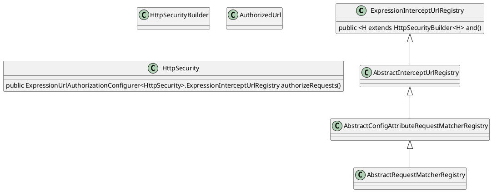

## "spring security"
## spring security

### pom.xml

 ```xml
    <dependency>
        <!-- 由于我使用的spring boot所以我是引入spring-boot-starter-security而且我使用了spring io所以不需要填写依赖的版本号 -->
        <groupId>org.springframework.boot</groupId>
        spring-boot-starter-security</artifactId>
    </dependency>
 ```

### .authorizeRequests()
通过 authorizeRequests() 方法来开始请求权限配置。
authorizeRequests()方法有多个子节点，每个macher按照他们的声明顺序执行  
可以在authorizeRequests() 后定义多个antMatchers()配置器来控制不同的url接受不同权限的用户访问，而其中 permitAll() 方法是运行所有权限用户包含匿名用户访问。
而hasRole("权限")则是允许这个url给与参数中相等的权限访问。
access("hasRole('权限') and hasRole('权限')") 是指允许访问这个url必须同时拥有参数中多个身份权限才可以访问。
hasAnyRole("ADMIN", "DBA")是指允许访问这个url必须同时拥有参数中多个身份权限中的一个就可以访问该url。

 
.anyRequest().authenticated()
对http所有的请求必须通过授权认证才可以访问。

and()是返回一个securityBuilder对象，formLogin()和httpBasic()是授权的两种方式。

.csrf().disable(); //取消csrf防护

.sessionManagement() // 定制我们自己的 session 策略
.sessionCreationPolicy(SessionCreationPolicy.STATELESS); // 调整为让 Spring Security 不创建和使用 session


HttpSecurity 提供的 exceptionHandling() 方法用来提供异常处理。该方法构造出 ExceptionHandlingConfigurer 异常处理配置类。该配置类提供了两个实用接口: 


AuthenticationEntryPoint 该类用来统一处理 AuthenticationException 异常
AccessDeniedHandler  该类用来统一处理 AccessDeniedException 异常


我们只要实现并配置这两个异常处理类即可实现对 Spring Security 认证授权相关的异常进行统一的自定义处理。

作者: 码农小胖哥
链接: https://juejin.cn/post/6844903988895154184
来源: 掘金
著作权归作者所有。商业转载请联系作者获得授权，非商业转载请注明出处。





---

https://www.jianshu.com/p/e6655328b211


## spring security 拦截器
1、ChannelProcessingFilter，使用它因为我们可能会指向不同的协议(如:Http,Https)

2、SecurityContextPersistenceFilter，负责从SecurityContextRepository 获取或存储 SecurityContext。SecurityContext 代表了用户安全和认证过的session

3、ConcurrentSessionFilter,使用SecurityContextHolder的功能，更新来自“安全对象”不间断的请求,进而更新SessionRegistry

4、认证进行机制，UsernamePasswordAuthenticationFilter，CasAuthenticationFilter，BasicAuthenticationFilter等等--SecurityContextHolder可能会修改含有Authentication这样认证信息的token值

5、SecurityContextHolderAwareRequestFilter,如果你想用它的话，需要初始化spring security中的HttpServletRequestWrapper到你的servlet容器中。

6、JaasApiIntegrationFilter，如果JaasAuthenticationToken在SecurityContextHolder的上下文中，在过滤器链中JaasAuthenticationToken将作为一个对象。

7. RememberMeAuthenticationFilter, 如果还没有新的认证程序机制更新SecurityContextHolder，并且请求已经被一个“记住我”的服务替代，那么将会有一个Authentication对象将存放到这 (就是 已经作为cookie请求的内容）。

8、AnonymousAuthenticationFilter，如果没有任何认证程序机制更新SecurityContextHolder，一个匿名的对象将存放到这。

9、ExceptionTranslationFilter，为了捕获spring security的错误，所以一个http响应将返回一个Exception或是触发AuthenticationEntryPoint。

10、FilterSecurityInterceptor，当连接被拒绝时，保护web URLS并且抛出异常。
