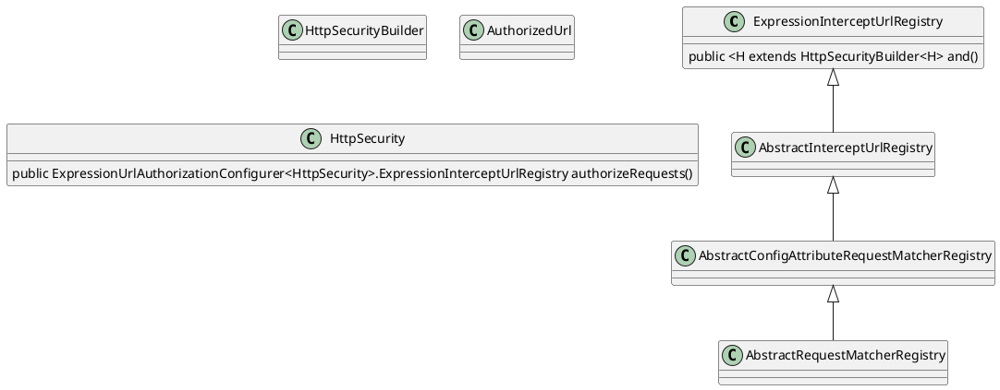

## SecurityFilterChain

`SecurityFilterChain` 是 Spring Security 的核心抽象，代表一条作用于 HTTP 请求的**安全过滤器链**。每个进入应用的请求都会依次经过链中的若干 `Filter`，完成认证（Authentication）、授权（Authorization）、CSRF 防护、会话管理等工作。

### 底层机制：从 Servlet Filter 到 Spring Security

Servlet 规范本身有 `Filter` 接口和 `FilterChain` 接口。Spring Security 通过以下两层代理接入这套机制：

1. **`DelegatingFilterProxy`**：在 Servlet 容器（Tomcat）层面注册的 `Filter`，作用是把请求桥接到 Spring 容器中的 Bean。它本身不做安全逻辑，只是一个"入口代理"。
2. **`FilterChainProxy`**：Spring 容器中的真正实现，也是一个特殊的 `Filter`。它持有所有注册的 `SecurityFilterChain` Bean，收到请求后，按顺序匹配第一条能处理该 URL 的链，然后依次执行链中的每个 `Filter`。

```
HTTP 请求
  → Tomcat FilterChain
    → DelegatingFilterProxy（Servlet Filter，桥接到 Spring）
      → FilterChainProxy（Spring Bean）
        → SecurityFilterChain 1（匹配 /api/**）
            UsernamePasswordAuthenticationFilter
            BearerTokenAuthenticationFilter
            ExceptionTranslationFilter
            AuthorizationFilter
            ...
        → SecurityFilterChain 2（匹配 /**）
            ...
```

### 定义一个 SecurityFilterChain

```java
@Configuration
@EnableWebSecurity
public class SecurityConfig {

    @Bean
    public SecurityFilterChain apiSecurityChain(HttpSecurity http) throws Exception {
        http
            .securityMatcher("/api/**")           // 只匹配 /api/** 路径
            .authorizeHttpRequests(auth -> auth
                .requestMatchers("/api/public/**").permitAll()
                .anyRequest().authenticated()
            )
            .sessionManagement(session -> session
                .sessionCreationPolicy(SessionCreationPolicy.STATELESS)  // 无状态，适合 JWT
            )
            .csrf(csrf -> csrf.disable());        // REST API 通常关闭 CSRF

        return http.build();
    }
}
```

`HttpSecurity` 是 `SecurityFilterChain` 的构建器，调用 `.build()` 后生成链实例并注册为 Bean。

### 多条链：按 URL 区分安全策略

可以注册多个 `SecurityFilterChain` Bean，用 `@Order` 控制优先级（数字越小越优先）。`FilterChainProxy` 会用第一条匹配的链处理请求，后续链不再参与。

```java
@Bean
@Order(1)                              // 优先级更高
public SecurityFilterChain apiChain(HttpSecurity http) throws Exception {
    http
        .securityMatcher("/api/**")
        .authorizeHttpRequests(auth -> auth.anyRequest().authenticated())
        .httpBasic(Customizer.withDefaults());
    return http.build();
}

@Bean
@Order(2)
public SecurityFilterChain webChain(HttpSecurity http) throws Exception {
    http
        .authorizeHttpRequests(auth -> auth
            .requestMatchers("/login", "/css/**").permitAll()
            .anyRequest().authenticated()
        )
        .formLogin(Customizer.withDefaults());
    return http.build();
}
```

### 链中的关键内置 Filter

| Filter                                 | 作用                                                   |
| -------------------------------------- | ------------------------------------------------------ |
| `SecurityContextHolderFilter`          | 加载/保存 `SecurityContext`（当前用户信息）            |
| `UsernamePasswordAuthenticationFilter` | 处理表单登录（`POST /login`）                          |
| `BearerTokenAuthenticationFilter`      | 处理 JWT/OAuth2 Bearer Token                           |
| `ExceptionTranslationFilter`           | 将认证/授权异常转换为 HTTP 401/403 响应                |
| `AuthorizationFilter`                  | 最终的权限校验（替代旧的 `FilterSecurityInterceptor`） |
| `CsrfFilter`                           | CSRF Token 校验                                        |
| `CorsFilter`                           | 处理跨域预检请求                                       |

### permitAll、authenticated、hasRole

`authorizeHttpRequests` 中的规则从上到下**第一条匹配即生效**，顺序很重要：

```java
http.authorizeHttpRequests(auth -> auth
    .requestMatchers("/public/**").permitAll()          // 公开访问
    .requestMatchers("/admin/**").hasRole("ADMIN")      // 需要 ADMIN 角色
    .requestMatchers("/user/**").hasAnyRole("USER", "ADMIN")
    .anyRequest().authenticated()                       // 其余需要登录
);
```

`hasRole("ADMIN")` 等价于 `hasAuthority("ROLE_ADMIN")`——Spring Security 约定角色名在存储时带 `ROLE_` 前缀，`hasRole` 会自动补充。

---

## authorizeRequests（旧 API）

Spring Security 5.x 之前的写法，6.x 已移除，仅供参考。

## spring security

### pom.xml

 ```xml
    <dependency>
        <!-- 由于我使用的spring boot所以我是引入spring-boot-starter-security而且我使用了spring io所以不需要填写依赖的版本号 -->
        <groupId>org.springframework.boot</groupId>
        spring-boot-starter-security</artifactId>
    </dependency>
 ```

### .authorizeRequests()
通过 authorizeRequests() 方法来开始请求权限配置。
authorizeRequests()方法有多个子节点，每个macher按照他们的声明顺序执行  
可以在authorizeRequests() 后定义多个antMatchers()配置器来控制不同的url接受不同权限的用户访问，而其中 permitAll() 方法是运行所有权限用户包含匿名用户访问。
而hasRole("权限")则是允许这个url给与参数中相等的权限访问。
access("hasRole('权限') and hasRole('权限')") 是指允许访问这个url必须同时拥有参数中多个身份权限才可以访问。
hasAnyRole("ADMIN", "DBA")是指允许访问这个url必须同时拥有参数中多个身份权限中的一个就可以访问该url。

 
.anyRequest().authenticated()
对http所有的请求必须通过授权认证才可以访问。

and()是返回一个securityBuilder对象，formLogin()和httpBasic()是授权的两种方式。

.csrf().disable(); //取消csrf防护

.sessionManagement() // 定制我们自己的 session 策略
.sessionCreationPolicy(SessionCreationPolicy.STATELESS); // 调整为让 Spring Security 不创建和使用 session


HttpSecurity 提供的 exceptionHandling() 方法用来提供异常处理。该方法构造出 ExceptionHandlingConfigurer 异常处理配置类。该配置类提供了两个实用接口: 


AuthenticationEntryPoint 该类用来统一处理 AuthenticationException 异常
AccessDeniedHandler  该类用来统一处理 AccessDeniedException 异常


我们只要实现并配置这两个异常处理类即可实现对 Spring Security 认证授权相关的异常进行统一的自定义处理。

作者: 码农小胖哥
链接: https://juejin.cn/post/6844903988895154184
来源: 掘金
著作权归作者所有。商业转载请联系作者获得授权，非商业转载请注明出处。



```puml
@startuml
class ExpressionInterceptUrlRegistry
ExpressionInterceptUrlRegistry : public <H extends HttpSecurityBuilder<H> and()
ExpressionInterceptUrlRegistry <|-- AbstractInterceptUrlRegistry
AbstractInterceptUrlRegistry <|-- AbstractConfigAttributeRequestMatcherRegistry
AbstractConfigAttributeRequestMatcherRegistry <|-- AbstractRequestMatcherRegistry

class HttpSecurityBuilder
class AuthorizedUrl
class HttpSecurity
HttpSecurity : public ExpressionUrlAuthorizationConfigurer<HttpSecurity>.ExpressionInterceptUrlRegistry authorizeRequests()
@enduml
```


---

https://www.jianshu.com/p/e6655328b211


## spring security 拦截器
1、ChannelProcessingFilter，使用它因为我们可能会指向不同的协议(如:Http,Https)

2、SecurityContextPersistenceFilter，负责从SecurityContextRepository 获取或存储 SecurityContext。SecurityContext 代表了用户安全和认证过的session

3、ConcurrentSessionFilter,使用SecurityContextHolder的功能，更新来自“安全对象”不间断的请求,进而更新SessionRegistry

4、认证进行机制，UsernamePasswordAuthenticationFilter，CasAuthenticationFilter，BasicAuthenticationFilter等等--SecurityContextHolder可能会修改含有Authentication这样认证信息的token值

5、SecurityContextHolderAwareRequestFilter,如果你想用它的话，需要初始化spring security中的HttpServletRequestWrapper到你的servlet容器中。

6、JaasApiIntegrationFilter，如果JaasAuthenticationToken在SecurityContextHolder的上下文中，在过滤器链中JaasAuthenticationToken将作为一个对象。

7. RememberMeAuthenticationFilter, 如果还没有新的认证程序机制更新SecurityContextHolder，并且请求已经被一个“记住我”的服务替代，那么将会有一个Authentication对象将存放到这 (就是 已经作为cookie请求的内容）。

8、AnonymousAuthenticationFilter，如果没有任何认证程序机制更新SecurityContextHolder，一个匿名的对象将存放到这。

9、ExceptionTranslationFilter，为了捕获spring security的错误，所以一个http响应将返回一个Exception或是触发AuthenticationEntryPoint。

10、FilterSecurityInterceptor，当连接被拒绝时，保护web URLS并且抛出异常。
