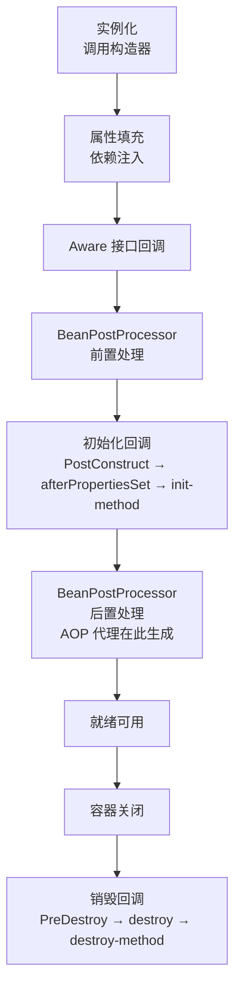
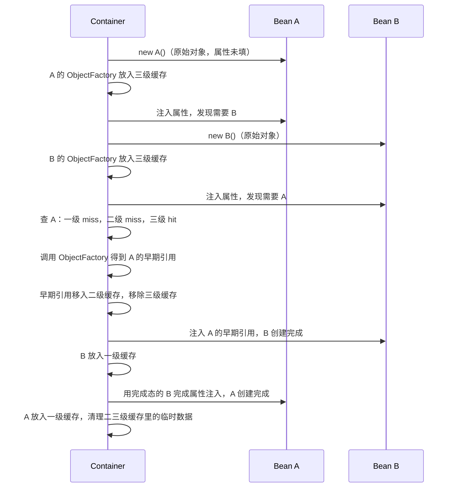

Spring 容器管理的不只是"创建对象"，还包括从实例化到销毁的完整过程。容器概览见 [Spring IoC](./spring-ioc.md)；本文聚焦单个 singleton Bean 从 `new` 到被销毁经历的各个阶段。

## 整体流程



singleton Bean 只走一次这套完整流程；`prototype` Bean 只做到"就绪可用"，容器交出对象后就不再管理，销毁阶段（`H`、`I`）不会发生——细节见 [Spring 中 Bean 的作用域](../../../other/spring中bean的作用域.md)。

## 实例化与属性填充

容器先按 `BeanDefinition` 里记录的构造器（或工厂方法）创建**原始对象**，再做属性填充（即依赖注入，见 [Spring IoC §依赖注入的三种方式](./spring-ioc.md#依赖注入的三种方式)）。这两步是循环依赖唯一可能出现的阶段——对象已存在但还没准备好被别人安全引用。

### 三级缓存与循环依赖

以 `A` 依赖 `B`、`B` 又依赖 `A`（字段注入或 Setter 注入场景）为例：



1. 容器创建 `A`：`new A()` 已经创建出 A 的**真实原始对象**（构造器已执行完毕，只是属性还没注入）。Spring 把「如何暴露这个已存在的原始对象」包装成一个 `ObjectFactory`（本质是个 `() -> getEarlyBeanReference(...)` 的 lambda，调用它才会决定返回原始对象还是 AOP 代理），再把这个**工厂本身**放进**三级缓存** `singletonFactories`，并把 `A` 标记为「正在创建中」。也就是说，三级缓存里存的是「怎么拿到早期引用」的工厂，不是对象本身；对象在 `new` 这一步就已经真实存在了。
2. 给 `A` 注入属性时发现需要 `B`，转去创建 `B`，同理：`new B()` 创建出真实的原始对象，再把它的 `ObjectFactory` 放进三级缓存。
3. 给 `B` 注入属性时发现需要 `A`：依次查一级（没有，`A` 还没做完）、二级（没有）、三级缓存——命中 `A` 的 `ObjectFactory`，调用它拿到 `A` 的**早期引用**，挪进二级缓存并从三级缓存移除。
4. `B` 用这个早期引用完成注入、创建完成，放入一级缓存。
5. 流程回到 `A`：用刚创建好的 `B` 完成属性注入，`A` 也创建完成，放入一级缓存。

**三级缓存各自存的到底是什么**（一级、二级缓存的底层结构见 [Spring IoC §单例缓存怎么存](./spring-ioc.md#单例缓存怎么存)）：

| 缓存                         | 存的内容                                                         | 状态                                                      |
| ---------------------------- | ------------------------------------------------------------------ | ----------------------------------------------------------- |
| 三级 `singletonFactories`    | `ObjectFactory`（还没被调用，即「要不要包装 AOP 代理」还没判断） | 决策未定                                                  |
| 二级 `earlySingletonObjects` | 早期引用（原始对象还是代理对象已经定型）                          | 决策已定，但 `populateBean()`/`initializeBean()` 还没跑完 |
| 一级 `singletonObjects`      | 成品对象                                                          | 属性注入、生命周期回调全部完成                            |

**ObjectFactory 只会被调用一次**：一旦被调用（如步骤 3），Spring 立刻把它从三级缓存里 `remove` 掉，之后谁再查 `A` 都只会命中二级缓存里已经算好的引用，不会重复调用。

**调用 `ObjectFactory` 时如何判断要不要包 AOP 代理**：调用的实际是 `getEarlyBeanReference()`，它委托给 `SmartInstantiationAwareBeanPostProcessor`（AOP 自动代理创建器的实现），用 `A` 的真实 Class 去匹配容器里所有已注册的 `Advisor`（`@Aspect` 切面、`@Transactional` 专属的 `BeanFactoryTransactionAttributeSourceAdvisor` 等切点表达式），命中则生成代理，否则返回原始对象——这与正常初始化流程里 `postProcessAfterInitialization()` 判断是否代理，走的是**同一套逻辑**（见下文「后置处理与 AOP 代理」）。

**为什么这个判断不在 `new A()` 之后立刻做，而是等调用时才做**：并不是因为信息不够——`A` 的 Class 和容器里的 `Advisor` 列表在 `new A()` 完成时其实已经具备。真正的原因是**惰性**：这个判断在正常流程里反正也要在 `A` 自己的 `initializeBean()` 里做一次；把它包成 `ObjectFactory` 延迟到「第一次真正有人需要早期引用」时才执行，就能保证——没有循环依赖的绝大多数 Bean 从头到尾只判断一次（在 `initializeBean()` 里）；只有真正发生循环依赖时，才会被提前触发，且同样只算一次。

**"从三级挪到二级""从二级挪到一级"不是真的搬运数据**，而是容器在 `addSingleton()` 里同时做「登记 + 清理」：

```java
// simplified from DefaultSingletonBeanRegistry.addSingleton()
this.singletonObjects.put(beanName, singletonObject);   // register into level 1
this.singletonFactories.remove(beanName);                 // clean up level 3
this.earlySingletonObjects.remove(beanName);              // clean up level 2
```

并且 `A` 最终登记进一级缓存前，容器会做一次**一致性检查**：如果发现 `A` 因为 `B` 的循环依赖已经在二级缓存里存在早期引用，就直接复用这个引用，而不是用 `initializeBean()` 另算出来的对象——这保证了 `B` 手里拿到的 `A` 和最终一级缓存里的 `A` 是同一个引用（同一份身份：要么都是原始对象，要么都是同一个代理对象）。

**登记三级缓存是无条件的，读取/调用三级缓存才是有条件的**：只要是 singleton 且没关闭循环依赖检测（默认开启），**每个 Bean 实例化后都会**把自己的 `ObjectFactory` 放进三级缓存，跟它是否真的参与循环依赖无关。但这个 `ObjectFactory` 会不会被真正**调用**（进而在二级缓存留下条目），只在真的发生循环依赖时才会发生。绝大多数没有循环依赖的 Bean，三级缓存里的这个条目从头到尾没被任何人读取过，只是在自己创建完成、放入一级缓存的那一刻被顺手清除。

**没有循环依赖时，`A` 不会在三级缓存里"等待"**：`B` 依赖 `A` 时调用的 `getBean("A")`，本身就是在**驱动** `A` 走完从实例化到属性注入、初始化回调、放入一级缓存的完整流程，然后**同步返回**成品对象给 `B`——不是 `B` 去查缓存、等 `A` 慢慢就绪。只有当 `A` 自己还卡在属性注入阶段、又被另一个也在创建中的 Bean 反过来需要时（即循环依赖），才会出现"半成品被提前取用"的情况。

**为什么要三级而不是两级**：三级缓存存的是 `ObjectFactory`（工厂），不是现成对象。只有在调用工厂的这一刻，才真正决定「暴露原始对象」还是「暴露 AOP 代理后的对象」。如果没有这一层，AOP 代理场景下就可能出现「循环依赖提前拿到的是原始对象，其他地方后来拿到的是代理对象」这种不一致。

**这套机制只对 `singleton` + 字段/Setter 注入生效**，两种情况解决不了：

- **构造器注入的循环依赖**：对象必须执行完构造器才能被放进任何缓存，而构造器本身又需要对方实例作为参数，无解——Spring 会在启动时直接抛 `BeanCurrentlyInCreationException`。
- **`prototype` scope 的循环依赖**：prototype bean 创建后容器不放入任何缓存，没有「早期引用」可提前暴露，Spring 会直接抛异常拒绝创建。

> **三级缓存能解决循环依赖，不代表循环依赖是值得追求的设计**。它本质是历史遗留的兜底机制：把「字段/Setter 注入 + 单例」场景下原本无法创建的循环依赖，变成能凑合创建出来，但这掩盖了 `A`、`B` 互相依赖背后通常存在的职责划分问题。这也是为什么 [Spring IoC §为什么推荐构造器注入](./spring-ioc.md#构造器注入推荐) 把「循环依赖的早期发现」列为优点之一——构造器注入会让循环依赖在启动时直接报错，倒逼重新设计（拆分职责、抽取第三个协作类、改用事件解耦），而不是依赖三级缓存蒙混过关。**遇到循环依赖，优先考虑的应是消除它，而不是依赖这套机制。**

## Aware 接口回调

属性填充完成后，容器按需回调 Bean 实现的 `*Aware` 接口，把容器自身的一些能力"塞"给 Bean。常见的几个（按 Spring 内部固定顺序执行）：

| 接口                       | 回调方法                          | 拿到什么                     |
| -------------------------- | --------------------------------- | ----------------------------- |
| `BeanNameAware`             | `setBeanName(String name)`        | 自己在容器里注册的 Bean 名   |
| `BeanClassLoaderAware`      | `setBeanClassLoader(ClassLoader)` | 加载该 Bean 的类加载器        |
| `BeanFactoryAware`          | `setBeanFactory(BeanFactory)`     | 容器自身的 `BeanFactory` 引用 |
| `EnvironmentAware`          | `setEnvironment(Environment)`     | 配置属性、Profile 等环境信息  |
| `ApplicationContextAware`   | `setApplicationContext(...)`      | 完整的 `ApplicationContext`   |

这几个接口很少直接用——多数场景下 `@Autowired ApplicationContext applicationContext` 字段注入就够了，`*Aware` 接口主要用于 Spring 自身及一些底层框架组件（在容器还没完全就绪、或需要避免循环依赖去直接持有容器引用时使用）。

## 前置处理：BeanPostProcessor.postProcessBeforeInitialization

`BeanPostProcessor` 是容器暴露的扩展点，每个 Bean 初始化前后都会被所有已注册的 `BeanPostProcessor` 依次处理一遍。`postProcessBeforeInitialization()` 在初始化回调（下一节）**之前**执行。

`@PostConstruct` 之所以能生效，正是因为 Spring 内置了一个 `CommonAnnotationBeanPostProcessor`，它在 `postProcessBeforeInitialization()` 里扫描并调用带 `@PostConstruct` 注解的方法——`@PostConstruct` 本质上是"前置处理"阶段的产物，而不是独立的一个阶段。

## 初始化回调：三种方式与执行顺序

同一个 Bean 上，三种初始化回调方式可以同时存在，Spring 按固定顺序依次调用：

```java
@Component
public class CacheManager implements InitializingBean {

    @PostConstruct
    public void postConstruct() {
        // called first
    }

    @Override
    public void afterPropertiesSet() {
        // called second
    }

    public void customInit() {
        // called third, only if wired via @Bean(initMethod = "customInit")
    }
}
```

1. **`@PostConstruct`**——通过前置 `BeanPostProcessor` 触发，最先执行
2. **`InitializingBean.afterPropertiesSet()`**——实现接口的方式，早于自定义 init-method
3. **自定义 init-method**——`@Bean(initMethod = "...")` 或 XML `init-method` 属性指定，最后执行

三者做的事情高度重合（都是"依赖注入完成后跑一段初始化逻辑"），实践中通常**只选一种**：新代码优先用 `@PostConstruct`（不依赖 Spring 接口，测试友好）；只有引入第三方类、不方便加注解时才用 `initMethod`。

## 后置处理与 AOP 代理

`postProcessAfterInitialization()` 在初始化回调**之后**执行，这是 Bean 生命周期里**生成 AOP 代理的地方**：`AnnotationAwareAspectJAutoProxyCreator`（同样是一个 `BeanPostProcessor`）在这一步判断 Bean 是否匹配某个 `Advisor`（`@Aspect` 切面、`@Transactional` 等），命中就返回一个代理对象**替换**原始对象——容器后续登记进一级缓存、注入给其他 Bean 的，都是这个代理对象，而不是 `initializeBean()` 之前那个原始实例。

这也是为什么 `@Autowired` 注入的实例可能不是目标类本身，而是 CGLIB/JDK 动态代理对象；`@Transactional`、`@Cacheable` 等注解必须加在 Spring 管理的 Bean 上才生效，原理都在这里。

## 就绪可用

走完上述所有步骤，Bean 才算真正"就绪"：放入一级缓存 `singletonObjects`，可以被其他 Bean 注入、可以从容器 `getBean()` 取出使用。singleton Bean 此后只有这一份实例，直到容器关闭。

## 销毁

容器关闭（`ApplicationContext.close()` 或 JVM 正常退出触发的 shutdown hook）时，对每个 singleton Bean 按固定顺序执行销毁回调，与初始化顺序对称：

1. **`@PreDestroy`**——同样由 `CommonAnnotationBeanPostProcessor`（这次是它实现的 `DestructionAwareBeanPostProcessor` 接口）触发，最先执行
2. **`DisposableBean.destroy()`**——实现接口的方式
3. **自定义 destroy-method**——`@Bean(destroyMethod = "...")` 或 XML `destroy-method` 属性指定，最后执行

```java
@Component
public class CacheManager {

    @PreDestroy
    public void preDestroy() {
        // called first, e.g. flush cache to disk
    }
}
```

**`prototype` Bean 不参与这一整套销毁流程**：容器创建完就把对象交给调用方，不会保留引用，也就无法在 `close()` 时找到它并回调销毁方法——清理 `prototype` 对象持有的资源是调用方自己的责任，详见 [Spring 中 Bean 的作用域](../../../other/spring中bean的作用域.md)。

## 参考

- [Spring IoC](./spring-ioc.md)（容器概览、单例缓存底层结构、依赖注入三种方式）
- [Spring 中 Bean 的作用域](../../../other/spring中bean的作用域.md)（prototype 为何不参与销毁回调）
- [Spring Boot Startup Callbacks](./spring-boot-startup-callbacks.md)（应用启动就绪后的回调，与 Bean 自身生命周期回调是两回事）
- [Spring Framework 官方文档 - Bean 生命周期](https://docs.spring.io/spring-framework/reference/core/beans/factory-nature.html)
