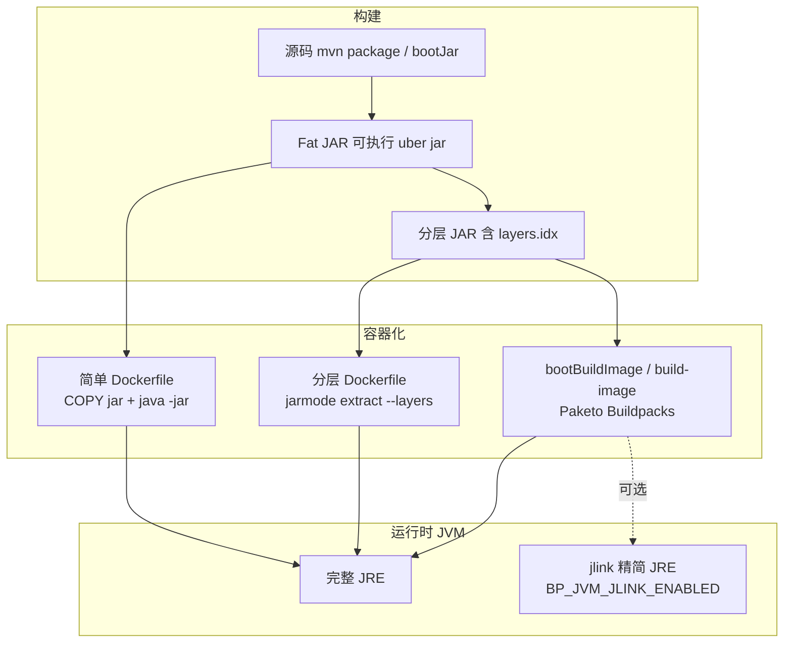

## 背景

Spring Boot REST API 打成 jar 之后，放进容器常见有三层递进：先有一个能跑的 fat jar，再用分层 JAR 优化 Docker 缓存，最后用 Cloud Native Buildpacks 一键出镜像；若还要缩小运行时，可在 Buildpack 上显式开启 jlink 裁剪 JRE。fat jar 布局与 `JarLauncher` 见专文 [Spring Boot Executable JAR](./spring-boot-executable-jar.md)。

Spring Framework 本身几乎不讲容器镜像；相关说明集中在 Spring Boot Reference 的 Packaging → Container Images。本文把分层 JAR、`bootBuildImage`、Paketo jlink 串成一条阅读路径，并附上官方文档索引。GraalVM Native Image 是另一条路线，见 [GraalVM Native Image 简介](../graalvm-native-image.md)。

## 三条路径总览



| 路径 | 典型产物 | 主要收益 | 复杂度 |
| ---- | -------- | -------- | ------ |
| Fat jar + 简单镜像 | 单层 `app.jar` + JRE 基础镜像 | 上手最快 | 低 |
| 分层 JAR + Dockerfile | 多 `COPY` 层 + JRE | 推送镜像时依赖层可缓存 | 中 |
| Buildpack（`bootBuildImage`） | OCI 镜像，自动检测 jar | 零 Dockerfile、与 Paketo 生态一致 | 低～中 |
| Buildpack + jlink | 同上，运行时 JRE 更小 | 缩小镜像体积 | 中（需调 env） |

## 分层 JAR

分层 JAR 在 fat jar 布局不变的前提下，额外写入 `BOOT-INF/layers.idx`，声明哪些路径属于哪一层、层的写入顺序。Spring Boot 2.3 起默认开启；Maven `repackage` / Gradle `bootJar` 的 `layered` 无需额外配置即可得到。

若暂不做分层，最简容器化是把整个 fat jar 放进单层镜像：

```dockerfile
FROM eclipse-temurin:21-jre
WORKDIR /app
COPY target/*.jar app.jar
ENTRYPOINT ["java", "-jar", "app.jar"]
```

能跑，但业务代码一改，依赖层也无法被 Docker 缓存复用。官方 [Efficient Container Images](https://docs.spring.io/spring-boot/reference/packaging/container-images/efficient-images.html) 明确建议不要长期把 fat jar 原样塞进单层镜像；下文分层 JAR 与 Buildpack 即为此优化。

默认四层（从不易变到易变）：

| 层名 | 典型内容 |
| ---- | -------- |
| `dependencies` | 非 SNAPSHOT 的 `BOOT-INF/lib/*.jar` |
| `spring-boot-loader` | `org/springframework/boot/loader/**` |
| `snapshot-dependencies` | 版本号含 `SNAPSHOT` 的依赖 |
| `application` | `BOOT-INF/classes`、清单、索引文件等 |

`layers.idx` 片段示例：

```yaml
- "dependencies":
  - BOOT-INF/lib/library1.jar
- "spring-boot-loader":
  - org/springframework/boot/loader/launch/JarLauncher.class
- "snapshot-dependencies":
- "application":
  - BOOT-INF/classes/
  - META-INF/MANIFEST.MF
```

查看分层（需 jar 内带 `spring-boot-jarmode-tools`）：

```bash
java -Djarmode=tools -jar my-app.jar list-layers
java -Djarmode=tools -jar my-app.jar extract --layers --destination extracted
```

### 手写 Dockerfile（jarmode）

官方 [Dockerfiles](https://docs.spring.io/spring-boot/reference/packaging/container-images/dockerfiles.html) 推荐多阶段构建：builder 阶段解压分层，runtime 阶段按层 `COPY`：

```dockerfile
FROM eclipse-temurin:21-jre AS builder
WORKDIR /builder
ARG JAR_FILE=target/*.jar
COPY ${JAR_FILE} application.jar
RUN java -Djarmode=tools -jar application.jar extract --layers --destination extracted

FROM eclipse-temurin:21-jre
WORKDIR /application
COPY --from=builder /builder/extracted/dependencies/ ./
COPY --from=builder /builder/extracted/spring-boot-loader/ ./
COPY --from=builder /builder/extracted/snapshot-dependencies/ ./
COPY --from=builder /builder/extracted/application/ ./
ENTRYPOINT ["java", "-jar", "application.jar"]
```

业务代码变更时，通常只需重建最后的 `application` 层；依赖层可命中 Docker 缓存。同一文档还介绍在该布局上叠加 AOT Cache / CDS 以缩短 JVM 冷启动（与分层正交，本文不展开）。

自定义分层规则见 Maven [Packaging Layered Jar](https://docs.spring.io/spring-boot/maven-plugin/packaging.html) 或 Gradle [Packaging Layered Jar or War](https://docs.spring.io/spring-boot/gradle-plugin/packaging.html)。

## Cloud Native Buildpacks（bootBuildImage）

CNB 规范与 Paketo 实现见专文 [CNB: Cloud Native Buildpacks 与 Paketo](../../cloud/cloud-native-buildpacks.md)。下文只保留与 Spring Boot 插件相关的要点。

Spring Boot 内置 [Cloud Native Buildpacks](https://docs.spring.io/spring-boot/reference/packaging/container-images/cloud-native-buildpacks.html) 集成：插件把可执行 jar 交给 builder（默认 Paketo），buildpack 检测 artifact、安装 JRE、生成启动命令并产出 OCI 镜像。

```bash
./mvnw spring-boot:build-image
# Gradle
./gradlew bootBuildImage
```

要点：

- 无需先手动 `repackage`：插件会在需要时自动打可执行 jar。
- 需要本机可访问的 Docker daemon（或按插件文档配置远程构建）。
- 默认 builder 为 `paketobuildpacks/builder-noble-java-tiny:latest`（以当前 Spring Boot 插件文档为准）。
- [Paketo Spring Boot buildpack](https://github.com/paketo-buildpacks/spring-boot) 会读取 jar 中的 `Spring-Boot-Layers-Index` / `layers.idx`，日志里可见 `Creating slices from layers index`，把应用切成多个镜像层——与上一节分层 JAR 设计对齐。

Maven 配置 JVM 版本示例（传给 Paketo 环境变量）：

```xml
<plugin>
  <groupId>org.springframework.boot</groupId>
  <artifactId>spring-boot-maven-plugin</artifactId>
  <configuration>
    <image>
      <env>
        <BP_JVM_VERSION>21</BP_JVM_VERSION>
      </env>
    </image>
  </configuration>
</plugin>
```

Gradle 等价配置见 [BootBuildImage](https://docs.spring.io/spring-boot/gradle-plugin/api/java/org/springframework/boot/gradle/tasks/bundling/BootBuildImage.html) API 文档中的 `environment` / `builder`。

Buildpack 路径下，运行时默认安装的是 JRE（`BP_JVM_TYPE` 默认为 `JRE`），不是 GraalVM Native；Native 需另开 `BP_NATIVE_IMAGE=true` 等配置，见 [GraalVM Native Image 简介](../graalvm-native-image.md)。

### K8s CI：Tekton + buildpacks-phases

上一节的 `bootBuildImage` / `pack build` 属于 CNB 的 **Platform** 层：需要 Docker daemon 来拉 builder、起构建容器、把镜像写入本地。在 Kubernetes 里若已用 [Tekton 与 Kaniko](../../cloud/tekton-kaniko.md) 做无 daemon 构建，**不能**把 Paketo 塞进 Kaniko，也不能在 Pod 里挂 `docker.sock` 跑 `pack`——后者需要 privileged，与 Kaniko 的安全模型相反。

CNB 真正干活的是 builder 镜像里的 **lifecycle**。无 Docker daemon 时，由 Platform 直接调 lifecycle 各 phase，并把镜像 **push 到 registry**。Tekton 侧官方做法是安装 Catalog 里的 [buildpacks-phases Task](https://buildpacks.io/docs/for-platform-operators/how-to/integrate-ci/tekton/)：把 prepare、detect、build、export 等步骤拆成多个 Tekton step，而不是用 `pack` CLI。

```text
PipelineRun
  → git-clone
  → buildpacks-phases（CNB lifecycle，无 daemon）
  → update-gitops / 部署
```

与现有 **Tekton + Kaniko 完全并存**：二者只是不同的 Task，共用同一套 Tekton 平台、workspace、registry Secret（如 `nexus-docker-cred`）。Go 等有 Containerfile 的项目继续 `kaniko-build`；Spring Boot 想零 Dockerfile 的 Pipeline 把 build step 换成 `buildpacks-phases` 即可。homelab 落地示例见 [enx-api Homelab CI/CD](../../cloud/enx-api-homelab-cicd.md)。

典型 Pipeline 片段（在 clone 之后；若 workspace 里已是 fat jar，可省略 Maven 编译 step）：

```yaml
- name: build-image
  taskRef:
    name: buildpacks-phases
  params:
  - name: APP_IMAGE
    value: docker-hosted.example.com/myapp:$(tasks.fetch-source.results.commit)
  - name: CNB_BUILDER_IMAGE
    value: paketobuildpacks/builder-noble-java-tiny:latest
  - name: SOURCE_SUBPATH
    value: repo/my-spring-app
  - name: CNB_ENV_VARS
    value:
    - BP_JVM_VERSION=21
  workspaces:
  - name: source
    workspace: source-code
```

要点：

- **输入**：源码目录（Paketo Maven buildpack 会编译）或已 `mvn package` 的 jar 所在目录；`SOURCE_SUBPATH` 指向 workspace 内相对路径。
- **输出**：`APP_IMAGE` 指定的远程镜像；无 daemon 时必须 push 到 registry，不能 `--publish=false` 只留本地。
- **环境变量**：与 `bootBuildImage` 相同，`BP_JVM_VERSION`、`BP_JVM_JLINK_ENABLED` 等通过 `CNB_ENV_VARS` 传入。
- **产物行为**：仍走 Paketo Spring Boot buildpack，会读 `layers.idx` 切镜像层，与本地 `bootBuildImage` 一致。

三种 K8s 构建路径对比：

| 路径 | 需要 Docker daemon | 需要 Dockerfile | 典型场景 |
| ---- | ------------------ | --------------- | -------- |
| `bootBuildImage` / `pack` | 是 | 否 | 本机或 CI 有 Docker |
| Tekton + Kaniko | 否 | 是（含分层 JAR 模板） | 已有 Containerfile、多语言混部 |
| Tekton + buildpacks-phases | 否 | 否 | K8s 无 daemon、想走 Paketo |

Kaniko 与 buildpacks-phases 不是二选一的全局策略，而是 **按项目选 Task**。若 Pipeline 里还要跑测试、lint，失败则不构建，Tekton 串 step 比单独装 kpack Operator 更直接；kpack 适合平台级声明式镜像治理，与 Tekton 职责不同，本文不展开。

## Buildpack + jlink 裁剪 JRE

jlink（JDK 9+ 模块系统）可从完整 JDK 生成只含所需模块的定制 JRE，仍用 HotSpot 跑字节码，与 GraalVM Native Image（AOT 成本地二进制）不同。手工多阶段 Dockerfile 里常用 `jdeps` + `jlink`；走 Paketo 时由 Java buildpack 代为执行。

重要事实：Paketo 文档写明 [Install a Minimal JRE with JLink](https://paketo.io/docs/howto/java/) 中 `BP_JVM_JLINK_ENABLED` 默认为 `false`。即 `bootBuildImage` 默认装完整 JRE，不会自动 jlink；要缩小运行时需显式开启。

```bash
pack build my-app \
  --path target/myapp.jar \
  --env BP_JVM_JLINK_ENABLED=true
```

自定义 jlink 参数（传入后不再使用 Paketo 默认参数集）：

```bash
pack build my-app \
  --env BP_JVM_JLINK_ENABLED=true \
  --env BP_JVM_JLINK_ARGS="--no-header-files --compress=1 --add-modules java.base,java.se"
```

在 Spring Boot 插件中通过 `image.env` 传入相同变量即可。典型场景：JVM 发行版只提供 JDK、镜像里被迫带完整 JDK 时，用 jlink 生成精简 JRE（Paketo 文档以 Amazon Corretto 为例）。

| 维度 | 默认 Buildpack（JRE） | Buildpack + jlink | GraalVM Native（另文） |
| ---- | --------------------- | ----------------- | ---------------------- |
| 运行时 | HotSpot + 完整 JRE | HotSpot + 定制 JRE | Substrate VM，无 `java -jar` |
| 应用形态 | 字节码 fat jar | 字节码 fat jar | AOT 本地可执行文件 |
| 默认是否开启 | 是 | 否，需 `BP_JVM_JLINK_ENABLED=true` | 否，需 native profile / env |
| Spring AOT | 不需要 | 不需要 | 需要 |

jlink 模块裁剪与 JPMS 关系见 [JPMS 与 Jigsaw](../../../cs/jpms-jigsaw.md)；与 [Spring AOT](./spring-aot.md) 无直接关系。

## 如何选型（简表）

| 场景 | 建议 |
| ---- | ---- |
| 本地试容器、学习 | Fat jar + 简单 Dockerfile |
| 自建 CI、要控制每一层 COPY | 分层 JAR + 官方 Dockerfile 模板 |
| 团队想少维护 Dockerfile、与 Paketo 生态一致 | `bootBuildImage` / `spring-boot:build-image`（本机有 Docker） |
| K8s CI 无 Docker daemon、仍想走 Paketo | Tekton + `buildpacks-phases` Task（与 Kaniko 可并存） |
| K8s CI 无 daemon、已有 Containerfile | Tekton + Kaniko + 分层 JAR Dockerfile |
| 镜像体积敏感、仍要完整 JVM 语义 | Buildpack + `BP_JVM_JLINK_ENABLED=true`，或手写 jlink 多阶段构建 |
| 冷启动毫秒级、接受 AOT 约束 | 见 [GraalVM Native Image 简介](../graalvm-native-image.md)，不是本文三条 JVM 路径的延伸 |

多数长期运行的 REST 服务：分层 JAR + Buildpack 或分层 Dockerfile 即可；jlink 在镜像体积成为瓶颈时再开。

## 官方文档索引

| 主题 | 链接 |
| ---- | ---- |
| Packaging 总览 | https://docs.spring.io/spring-boot/reference/packaging/index.html |
| Container Images 章节入口 | https://docs.spring.io/spring-boot/reference/packaging/container-images/index.html |
| Efficient Container Images（分层 JAR 原理） | https://docs.spring.io/spring-boot/reference/packaging/container-images/efficient-images.html |
| Dockerfiles + jarmode | https://docs.spring.io/spring-boot/reference/packaging/container-images/dockerfiles.html |
| Cloud Native Buildpacks 概述 | https://docs.spring.io/spring-boot/reference/packaging/container-images/cloud-native-buildpacks.html |
| Maven `spring-boot:build-image` | https://docs.spring.io/spring-boot/maven-plugin/build-image.html |
| Gradle `bootBuildImage` | https://docs.spring.io/spring-boot/gradle-plugin/api/java/org/springframework/boot/gradle/tasks/bundling/BootBuildImage.html |
| Maven 可执行 jar / 分层配置 | https://docs.spring.io/spring-boot/maven-plugin/packaging.html |
| Gradle `bootJar` / 分层配置 | https://docs.spring.io/spring-boot/gradle-plugin/packaging.html |
| Paketo Java（含 jlink env） | https://paketo.io/docs/howto/java/ |
| Paketo Spring Boot buildpack | https://github.com/paketo-buildpacks/spring-boot |
| CNB + Tekton（buildpacks-phases） | https://buildpacks.io/docs/for-platform-operators/how-to/integrate-ci/tekton/ |

## 参考

- [CNB: Cloud Native Buildpacks 与 Paketo](../../cloud/cloud-native-buildpacks.md)
- [Tekton 与 Kaniko](../../cloud/tekton-kaniko.md)
- [enx-api Homelab CI/CD](../../cloud/enx-api-homelab-cicd.md)
- [Spring Boot](./spring-boot.md)
- [Spring Boot Executable JAR](./spring-boot-executable-jar.md)
- [Spring AOT 简介](./spring-aot.md)
- [GraalVM Native Image 简介](../graalvm-native-image.md)
- [JPMS 与 Jigsaw](../../../cs/jpms-jigsaw.md)

## 维护记录

| 时间 | 修改内容 | 原因 |
| ---- | -------- | ---- |
| 2026-06-24 | 补充 K8s CI 小节（Tekton + buildpacks-phases）；更新选型表与文档索引 | 说明无 Docker daemon 时如何在 Tekton 中与 Kaniko 并存使用 Paketo |
| 2026-06-24 | Fat JAR / JarLauncher 拆至 [spring-boot-executable-jar.md](./spring-boot-executable-jar.md)；精简本文为容器打包主线 | 机制专文与容器化索引分工 |
