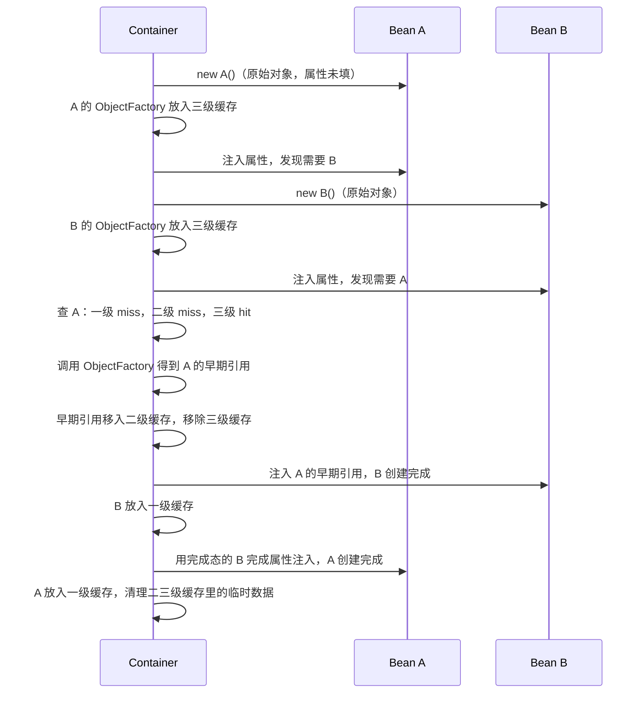

IoC（Inversion of Control，控制反转）是 Spring 的核心机制。它把"创建和管理对象"的控制权从应用代码交给 Spring 容器，应用代码只需声明依赖，容器负责提供。Spring Framework 整体定位见 [Spring](./spring.md)。

IoC 的具体实现方式叫 **DI（Dependency Injection，依赖注入）**，容器通过构造器、字段或 Setter 方法将依赖对象注入进来。

## IoC 解决了什么问题

传统写法中，对象自己负责创建依赖：

```java
// 传统写法：自己创建依赖，紧耦合
public class OrderService {
    private UserDao userDao = new UserDaoImpl();  // 自己 new，换实现要改代码
    private EmailService email = new EmailService("smtp.example.com", 465);
}
```

这带来三个问题：

1. **紧耦合**：`OrderService` 直接依赖具体实现类，换实现必须修改源码
2. **难以测试**：无法替换成 Mock 对象，单元测试困难
3. **对象生命周期散乱**：每次 `new` 都产生新对象，无法复用单例

IoC 写法：

```java
// IoC 写法：声明需要什么，容器负责提供（推荐构造器注入）
@Service
public class OrderService {
    private final UserDao userDao;
    private final EmailService emailService;

    public OrderService(UserDao userDao, EmailService emailService) {
        this.userDao = userDao;
        this.emailService = emailService;
    }
}
```

切换实现时只需修改容器配置（或替换实现类上的 `@Primary` / `@Qualifier`），`OrderService` 代码本身不用动。

## Spring IoC 容器

Spring 提供两个核心容器接口：

| 接口                 | 说明                                                             |
| -------------------- | ---------------------------------------------------------------- |
| `BeanFactory`        | IoC 容器最基础的接口，懒加载 Bean                                |
| `ApplicationContext` | `BeanFactory` 的扩展，支持事件、国际化、AOP 等，是实际使用的容器 |

Spring Boot 通过 `SpringApplication.run()` 创建并启动 `ApplicationContext`：Web 应用常见为 `AnnotationConfigServletWebServerApplicationContext`，非 Web 为 `AnnotationConfigApplicationContext`。这就是 IoC 容器在运行时的实体。

两者是**包含 + 增强**关系，不是非此即彼：`ApplicationContext` 内部组合了一个 `BeanFactory` 实现（`DefaultListableBeanFactory`）真正登记和存放 Bean，自己在其上叠加事件、国际化、注解处理、AOP 等能力。所以日常说的「IoC 容器」运行时就是 `ApplicationContext`，底层干活的是它持有的 `BeanFactory`。

### 单例缓存怎么存

容器对每个 Bean 先登记一份 **`BeanDefinition`**（元数据：类型、怎么创建、依赖谁），实例化后把**默认作用域 singleton** 的对象放进**单例缓存**。这个缓存的底层就是 `Map`——`DefaultSingletonBeanRegistry` 里的几个 `ConcurrentHashMap`：

```java
// 简化自 DefaultSingletonBeanRegistry
private final Map<String, Object> singletonObjects = new ConcurrentHashMap<>(256);        // 成品单例
private final Map<String, ObjectFactory<?>> singletonFactories = new HashMap<>(16);        // 提前暴露的工厂
private final Map<String, Object> earlySingletonObjects = new ConcurrentHashMap<>(16);     // 半成品
```

- 一级 `singletonObjects` 就是「单例缓存」：key 是 Bean 名，value 是成品对象，`@Autowired` 最终从这里（及类型索引）取。
- 另两级是为了解决**循环依赖**（A 依赖 B、B 又依赖 A）时提前暴露未完成的对象，普通场景用不到。

所以「单例只创建一次、各处注入同一个引用」是因为它就缓存在这张 Map 里，不会重复 `new`。

### 三级缓存如何解决循环依赖

以 `A` 依赖 `B`、`B` 又依赖 `A`（字段注入或 Setter 注入场景）为例：



1. 容器创建 `A`：`new A()` 已经创建出 A 的**真实原始对象**（构造器已执行完毕，只是属性还没注入）。Spring 把「如何暴露这个已存在的原始对象」包装成一个 `ObjectFactory`（本质是个 `() -> getEarlyBeanReference(...)` 的 lambda，调用它才会决定返回原始对象还是 AOP 代理），再把这个**工厂本身**放进**三级缓存** `singletonFactories`，并把 `A` 标记为「正在创建中」。也就是说，三级缓存里存的是「怎么拿到早期引用」的工厂，不是对象本身；对象在 `new` 这一步就已经真实存在了。
2. 给 `A` 注入属性时发现需要 `B`，转去创建 `B`，同理：`new B()` 创建出真实的原始对象，再把它的 `ObjectFactory` 放进三级缓存。
3. 给 `B` 注入属性时发现需要 `A`：依次查一级（没有，`A` 还没做完）、二级（没有）、三级缓存——命中 `A` 的 `ObjectFactory`，调用它拿到 `A` 的**早期引用**，挪进二级缓存并从三级缓存移除。
4. `B` 用这个早期引用完成注入、创建完成，放入一级缓存。
5. 流程回到 `A`：用刚创建好的 `B` 完成属性注入，`A` 也创建完成，放入一级缓存。

**三级缓存各自存的到底是什么**：

| 缓存                         | 存的内容                                                         | 状态                                                      |
| ---------------------------- | ---------------------------------------------------------------- | --------------------------------------------------------- |
| 三级 `singletonFactories`    | `ObjectFactory`（还没被调用，即「要不要包装 AOP 代理」还没判断） | 决策未定                                                  |
| 二级 `earlySingletonObjects` | 早期引用（原始对象还是代理对象已经定型）                         | 决策已定，但 `populateBean()`/`initializeBean()` 还没跑完 |
| 一级 `singletonObjects`      | 成品对象                                                         | 属性注入、生命周期回调全部完成                            |

**ObjectFactory 只会被调用一次**：一旦被调用（如步骤 3），Spring 立刻把它从三级缓存里 `remove` 掉，之后谁再查 `A` 都只会命中二级缓存里已经算好的引用，不会重复调用。

**调用 `ObjectFactory` 时如何判断要不要包 AOP 代理**：调用的实际是 `getEarlyBeanReference()`，它委托给 `SmartInstantiationAwareBeanPostProcessor`（AOP 自动代理创建器的实现），用 `A` 的真实 Class 去匹配容器里所有已注册的 `Advisor`（`@Aspect` 切面、`@Transactional` 专属的 `BeanFactoryTransactionAttributeSourceAdvisor` 等切点表达式），命中则生成代理，否则返回原始对象——这与正常初始化流程里 `postProcessAfterInitialization()` 判断是否代理，走的是**同一套逻辑**。

**为什么这个判断不在 `new A()` 之后立刻做，而是等调用时才做**：并不是因为信息不够——`A` 的 Class 和容器里的 `Advisor` 列表在 `new A()` 完成时其实已经具备。真正的原因是**惰性**：这个判断在正常流程里反正也要在 `A` 自己的 `initializeBean()` 里做一次；把它包成 `ObjectFactory` 延迟到「第一次真正有人需要早期引用」时才执行，就能保证——没有循环依赖的绝大多数 Bean 从头到尾只判断一次（在 `initializeBean()` 里）；只有真正发生循环依赖时，才会被提前触发，且同样只算一次。

**"从三级挪到二级""从二级挪到一级"不是真的搬运数据**，而是容器在 `addSingleton()` 里同时做「登记 + 清理」：

```java
// 简化自 DefaultSingletonBeanRegistry.addSingleton()
this.singletonObjects.put(beanName, singletonObject);   // 登记进一级
this.singletonFactories.remove(beanName);                 // 清理三级
this.earlySingletonObjects.remove(beanName);              // 清理二级
```

并且 `A` 最终登记进一级缓存前，容器会做一次**一致性检查**：如果发现 `A` 因为 `B` 的循环依赖已经在二级缓存里存在早期引用，就直接复用这个引用，而不是用 `initializeBean()` 另算出来的对象——这保证了 `B` 手里拿到的 `A` 和最终一级缓存里的 `A` 是同一个引用（同一份身份：要么都是原始对象，要么都是同一个代理对象）。

**登记三级缓存是无条件的，读取/调用三级缓存才是有条件的**：只要是 singleton 且没关闭循环依赖检测（默认开启），**每个 Bean 实例化后都会**把自己的 `ObjectFactory` 放进三级缓存，跟它是否真的参与循环依赖无关。但这个 `ObjectFactory` 会不会被真正**调用**（进而在二级缓存留下条目），只在真的发生循环依赖时才会发生。绝大多数没有循环依赖的 Bean，三级缓存里的这个条目从头到尾没被任何人读取过，只是在自己创建完成、放入一级缓存的那一刻被顺手清除。

**没有循环依赖时，`A` 不会在三级缓存里"等待"**：`B` 依赖 `A` 时调用的 `getBean("A")`，本身就是在**驱动** `A` 走完从实例化到属性注入、初始化回调、放入一级缓存的完整流程，然后**同步返回**成品对象给 `B`——不是 `B` 去查缓存、等 `A` 慢慢就绪。只有当 `A` 自己还卡在属性注入阶段、又被另一个也在创建中的 Bean 反过来需要时（即循环依赖），才会出现"半成品被提前取用"的情况。

**为什么要三级而不是两级**：三级缓存存的是 `ObjectFactory`（工厂），不是现成对象。只有在调用工厂的这一刻，才真正决定「暴露原始对象」还是「暴露 AOP 代理后的对象」。如果没有这一层，AOP 代理场景下就可能出现「循环依赖提前拿到的是原始对象，其他地方后来拿到的是代理对象」这种不一致。

**这套机制只对 `singleton` + 字段/Setter 注入生效**，两种情况解决不了：

- **构造器注入的循环依赖**：对象必须执行完构造器才能被放进任何缓存，而构造器本身又需要对方实例作为参数，无解——Spring 会在启动时直接抛 `BeanCurrentlyInCreationException`。
- **`prototype` scope 的循环依赖**：prototype bean 创建后容器不放入任何缓存，没有「早期引用」可提前暴露，Spring 会直接抛异常拒绝创建。

> **三级缓存能解决循环依赖，不代表循环依赖是值得追求的设计**。它本质是历史遗留的兜底机制：把「字段/Setter 注入 + 单例」场景下原本无法创建的循环依赖，变成能凑合创建出来，但这掩盖了 `A`、`B` 互相依赖背后通常存在的职责划分问题。这也是为什么前文[「为什么推荐构造器注入」](#构造器注入推荐) 把「循环依赖的早期发现」列为优点之一——构造器注入会让循环依赖在启动时直接报错，倒逼重新设计（拆分职责、抽取第三个协作类、改用事件解耦），而不是依赖三级缓存蒙混过关。**遇到循环依赖，优先考虑的应是消除它，而不是依赖这套机制。**

主类上的 `@SpringBootApplication` 是组合注解，**不会创建容器**，而是为即将启动的 `ApplicationContext` 提供启动所需的配置元数据（可理解为「启动说明书」）。`SpringApplication.run(主类.class, args)` 会把该主类作为 **primary source** 传给容器；容器在 `refresh()` 里按这些元数据扫描、注册 Bean，再完成实例化与依赖注入。

| 组成部分                                              | 为容器提供什么                               |
| ----------------------------------------------------- | -------------------------------------------- |
| `@ComponentScan`                                      | 组件扫描范围与规则（默认主类所在包及子包）   |
| `@EnableAutoConfiguration`                            | 要加载的 Spring Boot 自动配置类              |
| `@SpringBootConfiguration`（本质是 `@Configuration`） | 主类本身作为配置源，可配合 `@Bean` 注册 Bean |

三者分工：`@SpringBootApplication` 声明容器该怎么启动 → `SpringApplication.run()` 创建 `ApplicationContext` → 容器执行 IoC（注册、实例化、注入）。

### 启动时 refresh() 概览

容器在 `ApplicationContext.refresh()` 中的启动过程：

```
@ComponentScan 扫描 @Component/@Service/@Repository 等注解
  → 解析 @Configuration 类（@Bean / @Import 等）→ 登记 Bean 定义
  → @EnableAutoConfiguration 加载自动配置类（同样走配置解析）
  → 评估 @Conditional，决定哪些 Bean 定义真正注册
  → 实例化单例 Bean
  → 注入依赖（@Autowired）
  → 执行 @PostConstruct 初始化方法
  → 容器就绪，应用可以处理请求
```

### refresh() 为什么叫 refresh

`refresh()` 定义在 `ConfigurableApplicationContext` 上：

```java
public interface ConfigurableApplicationContext {
    void refresh();  // 丢弃全部 Bean、重新扫描配置、重建整个容器
    void close();    // 关闭容器
}
```

名字体现的是接口契约：**丢掉当前状态、从头重新加载**，是整体重建而非增量更新。普通 Spring Boot 应用启动时只调用一次；以下场景会再次触发：

| 场景                 | 说明                                                                                       |
| -------------------- | ------------------------------------------------------------------------------------------ |
| Spring Cloud         | 配置中心（Nacos/Consul）推送新配置 → `ContextRefresher.refresh()` 重建上下文               |
| Spring Boot DevTools | 开发期检测到 `.class` 变化 → `close()` + 新建上下文 + `refresh()`（两个 ClassLoader 交替） |
| `@RefreshScope`      | 标注的 Bean 在刷新时销毁并重建，其它 Bean 不受影响                                         |
| 集成测试             | 多个测试用例可能各自创建上下文                                                             |

三者区别：

```text
refresh()  = 在同一上下文对象上：销毁全部 Bean、重新扫描、重新实例化
close()    = 销毁上下文并释放全部资源
restart    = close() + 新建上下文 + refresh()
```

## @ComponentScan 与组件注解

`@ComponentScan`（`org.springframework.context.annotation.ComponentScan`）是 Spring Framework 注解，作用是**开启组件扫描，并配置扫哪里、扫什么、怎么登记**。最常见用法是声明**扫描哪些包**（`basePackages` / `value`），但不限于此。

`@SpringBootApplication` 已组合了 `@ComponentScan`；Boot 还提供 `scanBasePackages`、`scanBasePackageClasses` 等属性，本质相同。第三方 starter 的 Bean **不在**组件扫描路径里，靠 [Auto-configuration](./spring-boot.md#auto-configuration自动配置) 另一条机制注册。

### 扫描出来的类有什么用

扫描不会「白找一圈类就结束」。每个被发现的组件类会：

1. **登记为 Bean 定义**（元数据：类名、作用域、依赖关系等）
2. 容器在后续步骤 **实例化** 该类（默认单例）
3. **注入** 其构造器/`@Autowired` 所需的依赖
4. 成为可被其他地方 `@Autowired`、AOP 增强（`@Transactional` 等）的 **Spring 管理对象**

因此，`@ComponentScan` 解决的是「**哪些业务类交给容器管**」；没有它（或没扫到），类就只是普通 POJO，`new` 出来的实例不受容器管理，也无法被注入。

### @Component 与派生注解

`@ComponentScan` 默认查找带 **`@Component`** 及其**派生（.stereotype）**注解的类。它们技术上等价——都标记「我是 Spring 组件」，容器扫描时一视同仁；派生注解主要表达**分层语义**，个别还带额外行为：

| 注解              | 与 `@Component` 关系            | 常见用途                         |
| ----------------- | ------------------------------- | -------------------------------- |
| `@Component`      | 基注解                          | 通用组件，不属于特定层           |
| `@Service`        | 标注了 `@Component`             | 业务服务层                       |
| `@Repository`     | 标注了 `@Component`             | 数据访问层；额外做持久化异常转换 |
| `@Controller`     | 标注了 `@Component`             | Web 控制器（常配合视图）         |
| `@RestController` | `@Controller` + `@ResponseBody` | REST 控制器，返回 JSON 等        |

```java
@Service           // 等价于 @Component，语义上表示业务服务层
public class UserService { ... }

@Repository        // 数据访问层
public class UserDao { ... }

@RestController    // REST API 入口
public class UserController { ... }
```

**有关联**：`@Service`、`@Repository`、`@Controller` 都是 `@Component` 的特化；`@RestController` 是 `@Controller` 的特化。扫描过滤器认的是「是否带 `@Component` 元注解」，所以写 `@Service` 和写 `@Component` 一样会被扫到。

`@Configuration` 也带有 `@Component`，扫描时会一并发现；发现后还要走下面的 [配置解析](#configuration-解析)，读出其中的 `@Bean` 方法。

### @Indexed 与组件索引

`@Indexed`（`org.springframework.stereotype.Indexed`）是 Spring Framework 5.0 引入的**元注解**，标在 `@Component` 及其派生注解（`@Service`、`@Repository`、`@Controller` 等）的定义上，表示该类型是「可被编入组件索引（component index）的候选」。

日常开发**几乎不需要手写** `@Indexed`——使用 `@Service`、`@Repository` 等时，注解定义里已经带了它。只有自定义组件 stereotype 注解、并希望参与索引时，才在自己定义的注解上加上 `@Indexed`。

组件索引如何加速启动：

1. **编译期**：classpath 上有 `spring-context-indexer`（Spring Boot 项目通常通过 starter 间接引入）时，注解处理器扫描所有带 `@Indexed` 的类，生成 `META-INF/spring.components`，列出候选组件的全限定类名。
2. **启动期**：Spring Boot 优先读这份索引并直接加载列出的类，而不必对整个 classpath 做全量扫描。

依赖多、类数量大的项目里，这能明显缩短启动时间。若索引文件缺失或与实际情况不一致，Spring 会**回退**到传统 classpath 扫描，行为与没索引时一致。索引由编译期生成，改完代码需重新编译才会更新 `spring.components`。

> 另：Spring Data MongoDB 等也有名为 `@Indexed` 的注解，用于在**数据库字段**上声明索引，与上述组件索引无关。

### 不只定义扫描包

| 属性                     | 作用                                                                                     |
| ------------------------ | ---------------------------------------------------------------------------------------- |
| `basePackages` / `value` | 要扫描的包（最常用）                                                                     |
| `basePackageClasses`     | 以某几个类所在包为根扫描，避免硬编码包名字符串                                           |
| `includeFilters`         | 额外纳入规则（如自定义注解）                                                             |
| `excludeFilters`         | 排除规则（如排除某配置类、某子包）                                                       |
| `useDefaultFilters`      | 是否识别 `@Component` 系列（默认 `true`）；设为 `false` 时常配合 `includeFilters` 自定义 |
| `lazyInit`               | 扫描到的 Bean 是否懒加载                                                                 |

自定义只扫某注解：

```java
@Configuration
@ComponentScan(
    basePackages = "com.example",
    includeFilters = @Filter(type = FilterType.ANNOTATION, classes = MyMarker.class),
    useDefaultFilters = false
)
public class AppConfig { }
```

Boot 主类上扩大范围并排除某类：

```java
@SpringBootApplication(
    scanBasePackages = { "com.example.app", "com.example.shared" },
    excludeFilters = @Filter(type = FilterType.ASSIGNABLE_TYPE, classes = DevOnlyConfig.class)
)
public class MyApp { }
```

### 可以有多个 @ComponentScan 吗

**可以**，不限于一个。常见情况是主类上的 `@SpringBootApplication` 已带一次默认扫描；若还有代码在别的包（如 `com.example.legacy`），可在另一个 `@Configuration` 上再声明：

```java
@Configuration
@ComponentScan("com.example.legacy")
public class LegacyModuleConfig { }
```

多处扫描结果会**合并**进同一容器。注意同一类被重复登记或 Bean 名称冲突会导致启动失败；多数项目只改主类 `scanBasePackages` 即可，不必再写第二个 `@ComponentScan`。

扫描只负责发现「类本身是组件」；`@Configuration` 里的 `@Bean` 工厂方法不由扫描直接处理，而由下面的配置解析完成。

## @Configuration 解析

**组件扫描**回答「哪些类是 Spring 组件」；**配置解析**回答「`@Configuration` 类里要产出哪些 Bean、怎么产出」。这里的「配置」指 Java Config（`@Configuration`、`@Bean`），不是 `application.yml`。

容器在 `refresh()` 早期由 `ConfigurationClassPostProcessor` 等组件完成解析，典型工作包括：

| 解析什么              | 例子                            | 目的                                               |
| --------------------- | ------------------------------- | -------------------------------------------------- |
| `@Bean` 方法          | `@Bean DataSource dataSource()` | 登记 Bean 定义：工厂方法、返回类型、方法参数即依赖 |
| `@Import`             | `@Import(RedisConfig.class)`    | 把其他配置类或 `ImportSelector` 拉进容器           |
| 嵌套 `@ComponentScan` | 配置类上再扫别的包              | 扩大组件发现范围                                   |
| `@PropertySource` 等  | 指定属性文件                    | 与配置类绑定的外部配置                             |

`@Configuration` 与带 `@Component` 的普通类有一个关键区别：配置类里的 `@Bean` 方法**互相调用**时，必须拿到容器里的**同一个单例**，不能像普通 Java 方法那样每次 `new`：

```java
@Configuration
public class AppConfig {

    @Bean
    public DataSource dataSource() {
        HikariDataSource ds = new HikariDataSource();
        ds.setJdbcUrl("jdbc:mysql://localhost/mydb");
        return ds;
    }

    @Bean
    public UserDao userDao() {
        // dataSource() 被调用两次也必须返回同一实例，而非两个连接池
        return new UserDao(dataSource());
    }
}
```

为此 Spring 会对 `@Configuration` 类做增强（常见为 CGLIB 子类代理），让 `@Bean` 方法之间的调用走容器，而不是直接执行原方法。

> **配置类本身也是一个 Bean。** `@Configuration` 是 `@Component` 的派生，会被 Component Scan（或 `@Import`、自动配置）注册进容器，无需额外开关——容器正是拿这个 Bean（增强后的代理）来托管它的 `@Bean` 方法。这点常和 `@ConfigurationProperties` 标注的 **配置 POJO** 混淆：后者**默认不进容器**，需要 `@Component`、`@EnableConfigurationProperties` 或 `@ConfigurationPropertiesScan` 之一才注册，见 [Spring Boot §@ConfigurationPropertiesScan](./spring-boot.md#configurationpropertiesscan)。

传统启动时，上述解析靠反射在运行时完成。读 [Spring AOT](./spring-aot.md) 时会看到：AOT 把解析结果固化成生成代码，运行时跳过反射解析，但**仍会按 Bean 定义实例化对象并做依赖注入**——固化的是元数据，不是运行时的 Bean 实例。

**条件装配**（`@Conditional`）决定某个 Bean 定义要不要注册；Spring Boot 的 `@ConditionalOnClass`、`@ConditionalOnProperty` 等是它的常用封装，见 [Spring Boot §@ConditionalOn*](./spring-boot.md#conditionalon-条件注解)。

### @Import

`@Import`（`org.springframework.context.annotation.Import`）用来把**不在当前组件扫描范围内**的类显式拉进容器，标在类上（通常是 `@Configuration` 类），支持三种目标：

| 导入目标                                                  | 例子                              | 效果                                                                       |
| --------------------------------------------------------- | --------------------------------- | -------------------------------------------------------------------------- |
| 另一个 `@Configuration` 类                                | `@Import(RedisConfig.class)`      | 把 `RedisConfig` 里的 `@Bean` 一并纳入解析                                 |
| 普通类（Spring 4+ 支持）                                  | `@Import(MyHelper.class)`         | 直接把 `MyHelper` 注册为 Bean，等价于给它加了 `@Component`                 |
| `ImportSelector` / `ImportBeanDefinitionRegistrar` 实现类 | `@Import(MyImportSelector.class)` | 编程式决定「导入哪些类」，可读取注解元数据、配置文件等在运行时动态计算列表 |

**实际用例**：个人项目里一个 `@WebMvcTest` 切片测试类（`LogControllerTest`）的写法：

```java
@WebMvcTest(LogController.class)
@ActiveProfiles("test")
@Import({TestJwtDecoderConfig.class, SecurityConfig.class, CorsConfig.class})
class LogControllerTest {
```

`@WebMvcTest` 是一个**切片测试**注解，只自动装配 Web 层相关的 Bean（控制器、`HttpMessageConverter`、`@ControllerAdvice` 等），**不会**做全量组件扫描，也不会加载业务 `@Service`/`@Repository`。测试类里要用到的 `SecurityConfig`（认证过滤链）、`CorsConfig`（跨域配置）、`TestJwtDecoderConfig`（测试专用的 JWT 解码器）都在切片扫描范围之外，所以必须用 `@Import` 显式点名把它们拉进这个测试专属的容器上下文，才能让 `mockMvc.perform(...)` 走到真实的安全校验和 CORS 逻辑。

**和自动配置是同一套底层机制**：`@EnableAutoConfiguration` 内部就是 `@Import(AutoConfigurationImportSelector.class)`——一个 `ImportSelector` 实现，在运行时读取 `META-INF/spring/...AutoConfiguration.imports` 文件，动态算出要导入哪些自动配置类。所以 `@Import` 是连接「手动指定导入」和「自动配置动态导入」的共同底层入口，区别只在于导入列表是写死的类名，还是由 `ImportSelector` 在运行时计算出来的。

## Bean 的注册方式

### 方式 1：注解扫描（最常用）

在类上标注 `@Component` 或其派生注解（`@Service`、`@Repository`、`@Controller`、`@RestController`），由 `@ComponentScan` 发现并注册。语义区别与扫描机制见上文 [§@ComponentScan 与组件注解](#componentscan-与组件注解)。

Spring Boot 默认扫描主类所在包及其子包下的所有组件。

### 方式 2：@Bean 方法

适合注册第三方库的类（无法在源码上加注解）：

```java
@Configuration
public class AppConfig {

    @Bean
    public RestTemplate restTemplate() {
        return new RestTemplate();
    }

    @Bean
    public DataSource dataSource() {
        HikariDataSource ds = new HikariDataSource();
        ds.setJdbcUrl("jdbc:mysql://localhost/mydb");
        return ds;
    }
}
```

### 方式 3：XML 配置（旧项目）

Spring **1.x 时代几乎全靠 XML** 定义 Bean；`@ComponentScan` 与 `@Autowired` 等注解扫描是 **2.5（2007）** 之后才成主流。见 [Spring](./spring.md) §Spring 1.x。

```xml
<bean id="userService" class="com.example.UserService">
    <property name="userDao" ref="userDao"/>
</bean>
```

现代项目几乎不再使用，了解即可。

## Spring 注解体系概览

Spring 注解按职责可分为以下几类：

| 类型                       | 说明                         | 典型例子                                                                       |
| -------------------------- | ---------------------------- | ------------------------------------------------------------------------------ |
| **标记注解**（Stereotype） | 声明类的角色，让容器扫描注册 | `@Component` `@Service` `@Repository` `@Controller`                            |
| **配置注解**               | 定义 Bean、导入配置          | `@Configuration` `@Bean` `@Import` `@ComponentScan`                            |
| **依赖注入注解**           | 声明依赖关系，让容器自动装配 | `@Autowired` `@Qualifier` `@Value` `@Resource`                                 |
| **Web 注解**               | 定义 HTTP 路由和参数绑定     | `@RequestMapping` `@GetMapping` `@RequestParam` `@PathVariable` `@RequestBody` |
| **AOP 注解**               | 在方法执行时插入额外逻辑     | `@Aspect` `@Before` `@Around` `@Transactional` `@Cacheable` `@PreAuthorize`    |
| **校验注解**               | 声明参数约束规则             | `@NotNull` `@Size` `@Email` `@Valid` `@Validated`                              |
| **条件注解**               | 按条件决定是否加载 Bean      | `@ConditionalOnClass` `@ConditionalOnProperty` `@Profile`                      |
| **生命周期注解**           | 控制 Bean 的初始化和销毁     | `@PostConstruct` `@PreDestroy` `@Scope`                                        |
| **调度注解**               | 定时任务                     | `@Scheduled` `@EnableScheduling`                                               |
| **测试注解**               | 测试环境专用                 | `@SpringBootTest` `@MockBean`                                                  |

AOP 注解与其他类型的本质区别：AOP 注解会在**运行时**动态拦截方法，其余大多数注解只在**启动时**被容器读取一次用于注册或配置。判断一个注解是否属于 AOP：**它是否会在方法执行时悄悄做点额外的事？**

- `@Transactional` → 会，方法执行前开事务、执行后提交 → **AOP**
- `@RestController` → 不会，只是让 Spring 认识这个类 → **标记注解，不是 AOP**

## 注入发生的两个前提

依赖注入不是「只要两个对象都在容器里，就会自动连起来」。要让 Spring 把 B 注入到 A，必须**同时**满足两点：

1. **B 是容器管理的 Bean**：通过 `@Component` 系列、`@Bean` 方法，或 `@ConfigurationProperties` + 注册（见上文 [Bean 的注册方式](#bean-的注册方式)，配置类注册见 [Spring Boot §@SpringBootApplication](./spring-boot.md#springbootapplication) 的 `@ConfigurationPropertiesScan` 小节）。
2. **A 显式声明了对 B 的依赖**：在构造器参数、`@Bean` 方法参数，或 `@Autowired` 字段 / Setter 上写出 B 的类型。

两者缺一不可，可以拆成两句话记：

- **能不能注入** —— 取决于「容器里有没有这个 Bean」；
- **会不会注入** —— 取决于「使用方有没有声明这个依赖」。

容器里所有 Bean 构成一个「可注入对象池」：谁声明了依赖，容器就从池里取对应 Bean 交给它；没人声明的两个 Bean 不会凭空互相装配。Bean 来自 `@Service`、`@Component` 还是 `@Bean` 方法都不影响这一点——关键只看「它是不是 Bean」。

> 配置类同理：`@ConfigurationProperties` 只声明「绑定哪段配置」，**不会**自己进容器；靠 `@ConfigurationPropertiesScan` 或 `@EnableConfigurationProperties` 注册成 Bean 后，才能像普通 Bean 一样被注入到 `@Bean` 方法参数或构造器里。

声明了依赖但注入仍失败，常见原因：

| 情况                                          | 结果                                        |
| --------------------------------------------- | ------------------------------------------- |
| 容器里没有该类型 Bean                         | 启动报错（`NoSuchBeanDefinitionException`） |
| 容器里有多个同类型 Bean                       | 报错，需 `@Qualifier` / `@Primary` 指定     |
| 该 Bean 因 `@Profile` / `@Conditional` 未激活 | 视情况注入失败                              |

## 依赖注入的三种方式

Spring 支持三种注入方式：构造器注入、Setter 注入和字段注入。

| 注入方式    | 写法                                | Spring 官方推荐 |
| ----------- | ----------------------------------- | --------------- |
| 构造器注入  | 通过构造函数参数                    | ✅ 推荐          |
| Setter 注入 | 通过 `setXxx()` 方法 + `@Autowired` | 可选依赖时使用  |
| 字段注入    | 字段上直接 `@Autowired`             | ❌ 不推荐        |

### 构造器注入（推荐）

构造器注入是 **Spring 官方推荐的首选方式**：通过构造函数参数声明依赖，由 Spring 容器在实例化 Bean 时把依赖传入。

```java
@Service
public class OrderService {

    private final UserRepository userRepository;
    private final PaymentService paymentService;

    // Spring 4.3+: omit @Autowired when there is only one constructor
    public OrderService(UserRepository userRepository, PaymentService paymentService) {
        this.userRepository = userRepository;
        this.paymentService = paymentService;
    }
}
```

**为什么推荐构造器注入**

**1. 依赖不可变（`final` 字段）**

构造器注入允许将依赖字段声明为 `private final`：对象在构造完成后，其协作对象的引用不能再被替换。

| 注入方式    | 依赖字段能否 `final` | 含义                              |
| ----------- | -------------------- | --------------------------------- |
| 构造器注入  | ✅ 可以               | 创建后依赖引用不可变              |
| 字段注入    | ❌ 不行               | `@Autowired` 在对象构造之后才赋值 |
| Setter 注入 | ❌ 通常不行           | 依赖可被再次 `set`，适合可选依赖  |

**2. 依赖完整性保证**

构造器参数是必须提供的，如果依赖没有注册到容器，启动时就会立刻报错，而不是等到第一次调用某个方法时才出现 `NullPointerException`。

**3. 可测试性更好**

```java
@Test
void should_create_order() {
    UserRepository mockRepo = mock(UserRepository.class);
    PaymentService mockPayment = mock(PaymentService.class);
    OrderService service = new OrderService(mockRepo, mockPayment);
    // ...
}
```

**4. 循环依赖的早期发现**

两个类互相依赖时，构造器注入会在启动时抛出 `BeanCurrentlyInCreationException`，强制解决设计问题；字段注入在某些情况下会通过三级缓存「成功」，掩盖架构问题。

**Lombok 简化写法**

```java
@Service
@RequiredArgsConstructor
public class OrderService {
    private final UserRepository userRepository;
    private final PaymentService paymentService;
}
```

### Setter 注入（可选依赖场景）

```java
@Service
public class NotificationService {

    private EmailClient emailClient;

    @Autowired(required = false)
    public void setEmailClient(EmailClient emailClient) {
        this.emailClient = emailClient;
    }
}
```

### 字段注入（不推荐）

```java
@Service
public class OrderService {

    @Autowired
    private UserRepository userRepository;
}
```

缺点：

- 字段无法声明为 `final`，依赖可以在任何时刻被替换
- 依赖缺失不会在启动时暴露
- 脱离 Spring 容器无法直接实例化，单元测试需要借助反射
- IDE 通常会给出 "Field injection is not recommended" 警告

### 字段注入：不推荐，但 API 并未废弃

| 层面           | 实际情况                                                                                      |
| -------------- | --------------------------------------------------------------------------------------------- |
| **API / 语言** | `@Autowired` 字段注入在 Spring Framework 6、Spring Boot 3 中 **仍然合法**，没有 `@Deprecated` |
| **工程实践**   | Spring 官方文档、IDE 检查等 **普遍推荐构造器注入**                                            |

更准确的说法是：**这是 Spring 生态的共识，不是 Boot 单独废弃了某个注解。** 新代码与 `@Service` / `@Repository` 等 Bean 应优先构造器注入；`@Value("${...}")` 注在字段上属于 **配置绑定**，与 **注入其他 Bean** 是不同问题。

## @Autowired 与 @Qualifier

当容器中同一类型有多个 Bean 时，`@Autowired` 按类型匹配会失败，需要用 `@Qualifier` 指定 Bean 名称：

```java
@Configuration
public class DataSourceConfig {
    @Bean("primaryDs")
    public DataSource primaryDataSource() { ... }

    @Bean("replicaDs")
    public DataSource replicaDataSource() { ... }
}

@Service
public class UserService {
    private final DataSource dataSource;

    public UserService(@Qualifier("primaryDs") DataSource dataSource) {
        this.dataSource = dataSource;
    }
}
```

## @Value：注入配置值

```java
@Service
public class PayService {
    @Value("${pay.timeout:30}")          // 读取配置，默认值 30
    private int timeout;

    @Value("${pay.api-key}")             // 没有默认值，缺少时启动报错
    private String apiKey;
}
```

对应 `application.yml`：

```yaml
pay:
  timeout: 60
  api-key: sk-xxxxxxxx
```

## Bean 的作用域

| 作用域              | 说明                                   |
| ------------------- | -------------------------------------- |
| `singleton`（默认） | 整个容器只有一个实例，所有注入点共享   |
| `prototype`         | 每次注入/获取都创建新实例              |
| `request`           | 每个 HTTP 请求一个实例（Web 应用）     |
| `session`           | 每个 HTTP Session 一个实例（Web 应用） |

```java
@Component
@Scope("prototype")
public class ReportGenerator { ... }
```

绝大多数 Bean 用默认的 `singleton` 即可，`prototype` 适合有状态的、不可复用的对象。

## 单例 Bean 与线程安全

理解了「单例只有一个实例、注入的是引用」之后，自然会引出一个并发问题：**多个线程共用同一个单例 Bean，会不会互相干扰？**

### Bean 在堆上，线程栈上只有引用

依赖注入发生在**应用启动、容器 `refresh()` 时**，不是每次请求或线程开始执行时才注入：

```text
应用启动
  → 容器创建单例 Bean（每个定义 new 一次，放在堆上）
  → 完成依赖注入（构造器 / 字段 / Setter）
  → 容器就绪

HTTP 请求到来
  → 处理线程从容器拿到「已存在的」Bean 引用
  → 调用其方法：方法参数、局部变量在该线程的栈帧上
  → 方法返回，栈帧销毁；Bean 对象仍在堆上，不受影响
```

要点：**Bean 对象始终在堆上、由容器长期持有；线程栈上只有局部变量和指向 Bean 的引用。** 多个线程调用同一个单例，操作的是堆上同一个对象。

### 无状态是设计出来的，不是 Spring 给的

Spring **不会**在线程结束后自动清空 Bean 的字段。是否线程安全，取决于你**有没有在实例字段里放「可变且被并发共享」的状态**：

```java
@Service
public class FrontendLogService {
    private final FrontendLogWriter writer;   // 启动注入后不再变（只读，安全）

    public void record(FrontendLog log) {     // log 是方法参数，本次调用专用，在栈上
        writer.write(log);
    }
}
```

上面没有可变实例字段，并发调用 `record()` 互不干扰。反例则有风险：

```java
@Service
public class BadService {
    private String currentUser;               // 危险：单例 + 可变共享字段

    public void handle(String user) {
        this.currentUser = user;              // 线程 A 写入后，线程 B 可能已覆盖
        // ... 后续用到 this.currentUser 时可能已不是本线程的值
    }
}
```

### 处理共享状态的几种取向

按优先级：

| 取向                       | 说明                                                                                      |
| -------------------------- | ----------------------------------------------------------------------------------------- |
| **尽量无状态**（首选）     | 请求相关数据走方法参数 / 局部变量，最简单、最不易错                                       |
| **只读共享状态可以**       | `final` 字段、启动后不再变的配置（如 `CognitoProperties`）多线程安全                      |
| **可变共享状态需同步**     | 必须共享可变数据时，用锁、`AtomicXxx`、`ConcurrentHashMap` 等小心处理                     |
| **请求级可变状态换作用域** | 天然需要每请求 / 每会话独立状态时，用 `prototype` / `request` / `session`，而非硬塞进单例 |

一句话：**默认单例 Bean 尽量无状态或只读；确需可变共享状态就加锁/用并发安全结构，或改用更小的作用域。** Spring 完全可以管理有状态的 Bean，关键是用合适的作用域隔离状态。

## Bean 的生命周期

```java
@Component
public class CacheManager {

    @PostConstruct           // 依赖注入完成后执行，用于初始化
    public void init() {
        System.out.println("缓存初始化...");
    }

    @PreDestroy              // 容器关闭前执行，用于释放资源
    public void destroy() {
        System.out.println("缓存清理...");
    }
}
```

## 与 AOP 的关系

IoC 容器负责**管理对象**，AOP 负责**增强对象行为**，两者配合：

- 容器创建 Bean 后，如果该 Bean 匹配 AOP 切面，容器会将其替换为**代理对象**再注入
- 所以 `@Autowired` 注入的实际上可能是代理对象，而非原始类的实例
- 这也是为什么 `@Transactional`、`@Cacheable` 等 AOP 注解必须加在 Spring 管理的 Bean 上才生效

## 参考

- [Spring Boot §@ConditionalOn*](./spring-boot.md#conditionalon-条件注解)（条件装配与自动配置）
- [Spring Boot Startup Callbacks](./spring-boot-startup-callbacks.md)（启动后回调）
- [Spring AOT](./spring-aot.md)（构建期固化扫描、配置解析与条件装配结果）
- [Spring Framework 官方文档 - IoC Container](https://docs.spring.io/spring-framework/reference/core/beans.html)

## 维护记录

| 时间       | 修改内容                                                                                                                                                                            | 原因                                                    |
| ---------- | ----------------------------------------------------------------------------------------------------------------------------------------------------------------------------------- | ------------------------------------------------------- |
| 2026-06-24 | 修正 IoC 容器创建主体为 `SpringApplication.run()`；补充 `@SpringBootApplication` 与 `refresh()` 分工                                                                                | 原文易误解为注解直接创建并注入 Bean                     |
| 2026-06-24 | 补充 `@SpringBootApplication` 为 `ApplicationContext` 提供启动元数据的分工说明                                                                                                      | 明确注解与 IoC 容器的职责边界                           |
| 2026-06-24 | 移至 `language/java/spring/spring-ioc.md`                                                                                                                                           | 与 Spring 专题文章同目录归类                            |
| 2026-06-24 | XML 配置节补充 1.x 时代说明；链到 spring.md                                                                                                                                         | 与 Spring 总览文对齐                                    |
| 2026-06-24 | 新增 `@Configuration` 解析节；`refresh()` 流程补充条件装配；拆分组件扫描小节                                                                                                        | 澄清配置解析含义，便于理解 Spring AOT                   |
| 2026-06-24 | 展开 `@ComponentScan` 与 `@Component` 派生注解；说明扫描结果用途与多扫描点                                                                                                          | 回应读者对组件扫描机制的疑问                            |
| 2026-06-26 | 新增「Spring 注解体系概览」；扩写依赖注入三种方式（从 spring-boot.md 迁入）                                                                                                         | spring-boot.md 拆分，DI 内容集中到 IoC 文               |
| 2026-06-27 | 新增 `@Indexed` 与组件索引小节                                                                                                                                                      | 回应 `@Indexed` 用途疑问                                |
| 2026-06-27 | 新增「注入发生的两个前提」小节（在容器里 ≠ 自动互相注入，需显式声明依赖）                                                                                                           | 读者 Q&A 沉淀                                           |
| 2026-06-27 | 新增「单例 Bean 与线程安全」小节（堆/栈与引用、无状态是设计结果、共享状态处理取向）                                                                                                 | 读者 Q&A 沉淀                                           |
| 2026-06-27 | 新增「refresh() 为什么叫 refresh」小节（contract、重建场景、refresh/close/restart 区别）                                                                                            | 合并 comments-tree 启动打包文档 ApplicationContext 章节 |
| 2026-06-28 | 补 BeanFactory/ApplicationContext 包含关系、单例缓存底层 Map 实现；`@Configuration` 类本身是 Bean 与 `@ConfigurationProperties` POJO 的区别                                         | 读者 Q&A 沉淀                                           |
| 2026-06-30 | 新增 `@Import` 小节：三种导入目标、`@WebMvcTest` 切片测试里显式导入配置类的实际用例、与自动配置共用 `@Import` 机制的说明                                                            | 读者 Q&A 沉淀                                           |
| 2026-07-01 | 新增「三级缓存如何解决循环依赖」小节，含时序图与构造器注入/prototype 场景为何无法解决的说明                                                                                         | 读者 Q&A 沉淀                                           |
| 2026-07-01 | 澄清 `new A()` 已创建真实原始对象，`ObjectFactory` 只是包装「如何暴露」的延迟决策工厂，两者不是替代关系                                                                             | 读者 Q&A 沉淀                                           |
| 2026-07-01 | 补三级缓存精确定义表格；说明 AOP 代理决策机制与延迟到调用时的惰性原因；澄清"移入/移出缓存"是 `addSingleton()` 登记+清理、并复用早期引用的一致性检查；新增循环依赖应尽量避免的结论段 | 读者 Q&A 沉淀                                           |
| 2026-07-01 | 新增"登记三级缓存是无条件的、读取才是有条件的"说明；澄清无循环依赖时 `getBean()` 会同步驱动 Bean 走完整个创建流程，不会在三级缓存里"等待"                                           | 读者 Q&A 沉淀                                           |
