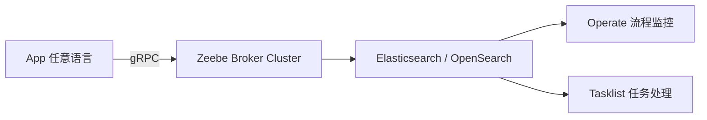
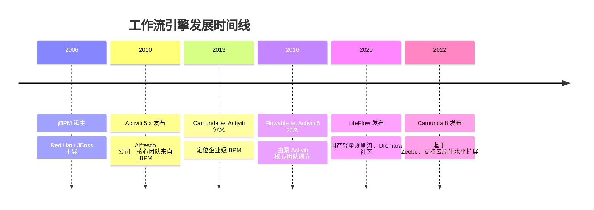
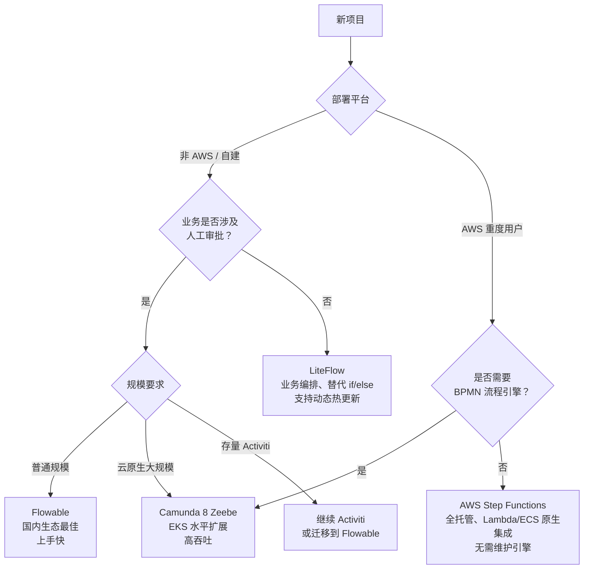

## 什么是工作流引擎

工作流引擎（Workflow Engine / Process Engine）是一种用于定义、执行和管理业务流程的中间件。它把业务逻辑从代码中剥离出来，用流程图（或规则配置）来描述"下一步该做什么、由谁来做、满足什么条件才能流转"，从而让业务流程可配置、可追踪、可审计。

典型应用场景：

- 审批流：请假、报销、合同会签
- 订单流转：下单 → 支付 → 发货 → 收货 → 售后
- 任务编排：复杂的多步骤业务处理链路
- 规则驱动的路由决策

## 主流引擎一览

工作流引擎大致分两类：

- **BPMN 流程引擎**：遵循 BPMN 2.0 标准，配套可视化设计器，偏重人工审批、流程管理
- **轻量规则流引擎**：不依赖 BPMN，以组件编排为核心，更适合纯代码驱动的业务链路

### jBPM

> 官网：<https://jbpm.org>  
> 仓库：<https://github.com/kiegroup/jbpm>

jBPM 是 Java 工作流引擎的"鼻祖"，由 Red Hat（JBoss）维护，历史最悠久。

**特点：**

- 与 **Drools**（规则引擎）深度集成，适合流程 + 规则组合的场景
- 提供 KIE Workbench 可视化管理平台
- 技术栈较重，学习曲线陡峭
- 社区活跃度不如 Flowable，国内使用较少

**适用场景：** 已有 Red Hat/JBoss 技术栈，或需要流程与 Drools 规则引擎联动。

---

### Activiti

> 官网：<https://www.activiti.org>  
> 仓库：<https://github.com/Activiti/Activiti>

Activiti 是国内使用最广泛的开源 BPMN 流程引擎，诞生于 2010 年，由 Alfresco 公司主导，核心开发者来自 jBPM。

**两次分叉的历史背景：**

Activiti 先后分叉出两个重要项目，但背景不同：

- **2013 年 → Camunda**：Camunda GmbH 是一家德国咨询公司，是 Activiti 的重度用户和贡献者。他们认为 Alfresco 把 Activiti 的方向带偏向自家内容管理产品，而非纯粹的 BPM 引擎，于是 fork 出去自己做。属于**重度外部贡献者对产品方向不满，单独出走**。
- **2016 年 → Flowable**：Activiti 的几位核心开发者（Joram Barrez、Tijs Rademakers 等，即写 Activiti 的那批人）与 Alfresco 产生分歧后集体离职，直接把 Activiti 5 的代码 fork 出来建了 Flowable。属于**亲生父母带着孩子出走，另起门户**。Flowable 与 Activiti API 高度兼容、表结构完全兼容，正是因为是同一批人写的，相当于"原版续集"。

**特点：**

- 完整支持 BPMN 2.0 标准，包含任务、网关、事件、子流程等元素
- 内置 REST API，配套 Activiti Modeler 可视化设计器
- 与 Spring/Spring Boot 集成成熟，提供 `activiti-spring-boot-starter`
- 表结构清晰（`ACT_` 前缀），流程实例、任务、历史数据分表存储
- 两次分叉后核心人才流失，Alfresco 维护惰性增加，社区活跃度持续下降

**适用场景：** 传统企业 OA、审批流、已有 Activiti 存量项目维护。

**快速依赖（Spring Boot）：**

```xml
<dependency>
    <groupId>org.activiti</groupId>
    <artifactId>activiti-spring-boot-starter</artifactId>
    <version>7.1.0.M6</version>
</dependency>
```

---

### Flowable

> 官网：<https://www.flowable.com>  
> 仓库：<https://github.com/flowable/flowable-engine>

Flowable 是 Activiti 5 的分叉项目，由原 Activiti 核心团队于 2016 年创立，目前维护更积极。

**特点：**

- 完整兼容 Activiti 5 的流程定义和数据库表结构，迁移成本低
- 除 BPMN 外，还支持 **CMMN**（案例管理）和 **DMN**（决策表）
- 提供商业版 Flowable Work，含拖拽设计器、监控面板、多租户
- 开源版功能完整，Spring Boot Starter 开箱即用
- 性能优于 Activiti 6，bug 修复更及时

**适用场景：** 新项目首选 BPMN 引擎，或从 Activiti 迁移升级。

**快速依赖（Spring Boot）：**

```xml
<dependency>
    <groupId>org.flowable</groupId>
    <artifactId>flowable-spring-boot-starter</artifactId>
    <version>7.0.0</version>
</dependency>
```

---

### Camunda

> 官网：<https://camunda.com>  
> 仓库：<https://github.com/camunda/camunda-bpm-platform>

Camunda 源自 Activiti，由 Camunda GmbH 于 2013 年 fork，先后推出两个架构完全不同的版本：**Camunda 7**（基于关系型数据库的嵌入式引擎）和 **Camunda 8**（基于 Zeebe 的云原生分布式引擎），两者 API 不兼容。

**Camunda 7 特点：**

- 完整支持 BPMN 2.0、CMMN、DMN
- 提供功能强大的 **Cockpit**（监控）、**Tasklist**（任务处理）、**Admin**（权限管理）Web 应用
- 支持嵌入式（embedded）和独立服务（standalone REST）两种部署模式
- 商业支持完善，国内使用相对较少

**适用场景：** 对流程监控和合规要求较高、需要开箱即用 Web 管理界面的企业。

---

### Camunda 8 (Zeebe)

> 官网：<https://camunda.com/platform/>  
> 仓库：<https://github.com/camunda/camunda>

Camunda 8 于 2022 年发布，核心引擎 **Zeebe** 从零重写，与 Camunda 7 架构完全不同，API 不兼容。

**与 Camunda 7 的根本区别：**

|          | Camunda 7                | Camunda 8 (Zeebe)          |
| -------- | ------------------------ | -------------------------- |
| 运行方式 | 嵌入式 / 独立服务        | 独立分布式集群（不可嵌入） |
| 存储     | 关系型数据库（MySQL/PG） | 事件溯源 + Elasticsearch   |
| 扩展方式 | 垂直扩展                 | 水平分区扩展               |
| 通信协议 | Java API / REST          | gRPC                       |
| 升级兼容 | —                        | 与 v7 API 不兼容           |

**架构图：**



**特点：**

- Zeebe Broker 基于 Raft 一致性协议，分区（Partition）机制，高吞吐低延迟
- Worker 模型：应用注册 Job Worker，Broker 推送任务，天然解耦
- **语言无关**：Worker 通过 gRPC 与 Broker 通信，官方提供 Java/Go 客户端，社区有 Python（`pyzeebe`）、Node.js、C# 等客户端
- 官方 Helm Chart，部署到 EKS / GKE / AKS 开箱即用
- 提供 **Camunda SaaS**（全托管版），免运维集群
- 历史数据导出到 Elasticsearch，可对接 **AWS OpenSearch Service**

**Spring Boot 集成（spring-zeebe）：**

```java
@JobWorker(type = "payment")
public void handlePayment(ActivatedJob job) {
    Map<String, Object> vars = job.getVariablesAsMap();
    // 处理业务逻辑，完成后自动 complete
}
```

**适用场景：** 大规模云原生、跑在 K8s（EKS）上的微服务架构、需要水平扩展的高吞吐流程场景。

---

### LiteFlow

> 官网：<https://liteflow.cc>  
> 仓库：<https://github.com/dromara/liteflow>

LiteFlow 是国产轻量级规则流引擎，隶属 Dromara 开源社区，近年来在国内迅速流行。

**特点：**

- **不基于 BPMN**，用自研的 EL 表达式语言（Chain EL）描述流程，例如：
  ```
  THEN(a, b, WHEN(c, d), e)
  ```
- 以"组件"为最小单元，每个节点是一个独立的 `@LiteflowComponent`
- 支持串行、并行、条件分支、循环、子流程等编排方式
- 流程规则支持从数据库、Nacos、Zookeeper 等动态加载，热更新无需重启
- 无可视化设计器（社区有第三方实现），纯代码 / 配置驱动
- 与 Spring Boot 集成极简，引入 starter 即可使用

**适用场景：** 业务编排（非审批流）、替代大量 if/else 的复杂业务逻辑、需要动态热更新规则的场景。

**快速依赖（Spring Boot）：**

```xml
<dependency>
    <groupId>com.yomahub</groupId>
    <artifactId>liteflow-spring-boot-starter</artifactId>
    <version>2.12.4</version>
</dependency>
```

**示例组件：**

```java
@LiteflowComponent("a")
public class ACmp extends NodeComponent {
    @Override
    public void process() {
        // 业务逻辑
        System.out.println("执行组件 A");
    }
}
```

**示例规则（chain.xml）：**

```xml
<chain name="main">
    THEN(a, b, WHEN(c, d), e);
</chain>
```

---

### AWS Step Functions

> 官方文档：<https://docs.aws.amazon.com/step-functions/>

AWS Step Functions 是 AWS 的全托管工作流编排服务，不是 Java 引擎，而是云原生工作流平台。Java 应用通过 AWS SDK 与之交互。

**特点：**

- 完全托管，无需运维引擎，按执行次数计费
- 用 **Amazon States Language（ASL，JSON/YAML）** 定义流程状态机
- 与 Lambda、ECS、SQS、SNS、DynamoDB、API Gateway **原生集成**，IAM 鉴权
- 两种工作流模式：
  - **Standard Workflow**：exactly-once 语义，最长支持 1 年，适合长流程审批
  - **Express Workflow**：高吞吐（10 万+次/秒），at-least-once，最长 5 分钟
- 控制台提供可视化执行历史和状态图
- **语言无关**：Lambda 函数、ECS Task、Activity Worker 均可用任意语言实现；`boto3` 提供 Python 完整支持

**Java 应用启动执行：**

```java
StartExecutionRequest request = StartExecutionRequest.builder()
    .stateMachineArn("arn:aws:states:us-east-1:123456789:stateMachine:OrderFlow")
    .input("{\"orderId\": \"12345\"}")
    .build();

sfnClient.startExecution(request);
```

**Lambda 函数（Java）作为流程节点：**

```java
public class PaymentHandler implements RequestHandler<Map<String, Object>, Map<String, Object>> {
    @Override
    public Map<String, Object> handleRequest(Map<String, Object> input, Context context) {
        // 处理支付逻辑，返回结果传给下一个状态
        return Map.of("paymentStatus", "SUCCESS");
    }
}
```

**适合场景：** 已重度使用 AWS、需要与 Lambda/ECS 编排、不想自维护流程引擎的团队。

**不适合场景：** 需要 BPMN 可视化设计器、不在 AWS 上部署、需要人工审批 UI 的场景。

---

## Python 生态

Camunda 8 和 Step Functions 作为**独立部署**的服务，通过网络协议（gRPC / HTTP）与工作节点通信，天然支持任意语言接入。嵌入式引擎（Flowable、Activiti、jBPM、LiteFlow）则只能跑在 JVM 上。

Python 生态中也有对应的原生引擎可供选择：

| 引擎                  | 定位          | 特点                                                                 |
| --------------------- | ------------- | -------------------------------------------------------------------- |
| **SpiffWorkflow**     | BPMN 2.0 引擎 | 纯 Python，直接执行 BPMN XML，最接近 Flowable/Camunda 7 定位         |
| **Temporal**          | 分布式工作流  | 多语言 SDK（Python/Java/Go/TS），高可靠长流程，理念与 Camunda 8 相近 |
| **Apache Airflow**    | DAG 任务编排  | 最流行，主要用于数据管道；**无人工任务节点**，不适合审批流           |
| **Prefect / Dagster** | 数据编排      | 现代化 Python 优先，适合数据工程，不适合业务审批流                   |

### Camunda 8 + Python

社区提供 `pyzeebe` 客户端（`pip install pyzeebe`），与 Java Worker 等价：

```python
from pyzeebe import ZeebeWorker, create_insecure_channel

channel = create_insecure_channel(grpc_address="localhost:26500")
worker = ZeebeWorker(channel)

@worker.task(
    task_type="payment",
    exception_handler=lambda e, j, c: c.set_failure_status(j, str(e))
)
async def handle_payment(order_id: str):
    # 处理支付逻辑
    return {"payment_status": "completed"}
```

### AWS Step Functions + Python

`boto3` 完整支持，Lambda 函数可直接用 Python 实现：

```python
import boto3

# 启动流程
client = boto3.client("stepfunctions", region_name="us-east-1")
client.start_execution(
    stateMachineArn="arn:aws:states:us-east-1:123456789:stateMachine:OrderFlow",
    input='{"orderId": "12345"}'
)
```

Python Lambda 作为流程节点：

```python
def handler(event, context):
    order_id = event["orderId"]
    # 返回结果传给下一个状态
    return {"paymentStatus": "SUCCESS"}
```

## 发展时间线



## 横向对比

以下重点比较当前推荐的四个方向：

| 维度           | Flowable      | Camunda 8 (Zeebe) | Temporal                | AWS Step Functions |
| -------------- | ------------- | ----------------- | ----------------------- | ------------------ |
| 标准协议       | BPMN/CMMN/DMN | BPMN 2.0          | 代码定义（SDK）         | ASL (JSON)         |
| 审批流支持     | ✅ 强          | ✅ 强              | ✅ 可实现                | ✅ Standard         |
| 可视化设计器   | ✅ 商业更佳    | ✅ Operate         | ✅ Temporal UI           | ✅ AWS 控制台       |
| 水平扩展       | ❌             | ✅ 原生            | ✅ 原生                  | ✅ 全托管           |
| 动态热更新     | ❌             | ❌                 | ❌                       | ❌                  |
| 嵌入式部署     | ✅             | ❌                 | ❌                       | ❌                  |
| **多语言支持** | ❌ Java 专属   | ✅ gRPC 任意语言   | ✅ 官方多语言 SDK        | ✅ Lambda 任意语言  |
| 流程定义方式   | BPMN XML      | BPMN XML          | 纯代码（Workflow 类）   | JSON/YAML          |
| 国内社区活跃度 | 高            | 低                | 低                      | 低                 |
| 学习成本       | 中            | 高                | 中                      | 中（AWS 生态）     |
| 适合场景       | 审批流/新项目 | 云原生/K8s        | 高可靠长流程/微服务编排 | AWS 原生编排       |

## 如何选型



> Flowable 与 LiteFlow 可共存：用 **Flowable** 管审批流，用 **LiteFlow** 编排内部业务逻辑。
>
> 在 AWS 上跑 EKS 且有高并发流程需求，Camunda 8 的历史数据可直接对接 **AWS OpenSearch Service**；如果团队更倾向 AWS 原生服务则选 **Step Functions**。

## 参考链接

- [Flowable 官方文档](https://www.flowable.com/open-source/docs/)
- [LiteFlow 官方文档](https://liteflow.cc/pages/5816c5/)
- [Camunda 官方文档](https://docs.camunda.org/)
- [Activiti GitHub](https://github.com/Activiti/Activiti)
