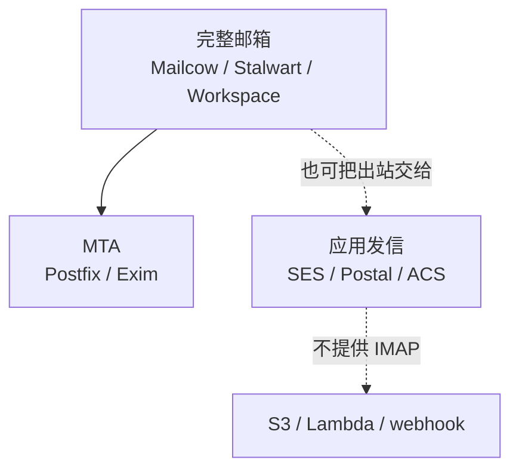

自建邮箱常被说成「装一套 Postfix」，云厂商又常被说成「AWS 有邮件服务」。这两句话都只对了一半：Postfix 只是 SMTP 引擎；AWS 现在给新用户提供的是发信 API，不是完整邮箱。下面按用途把常见方案摊开。

更早的 Debian 上手记录见 [Debian Postfix and Dovecot](./debian-postfix.md)，协议背景见 [SMTP](../network/smtp.md) 和 [Dovecot](../network/dovecot.md)。

## 先分清三层

| 层    | 解决什么                                  | 用户能不能在 Thunderbird / 手机里收信 |
| ---- | ------------------------------------- | -------------------------- |
| MTA  | 在互联网上收发 SMTP                          | 不能。还缺 IMAP/POP3 和存储        |
| 完整邮箱 | SMTP + IMAP + 反垃圾 + DKIM +（可选）Webmail | 能                          |
| 应用发信 | 程序发验证码、告警、营销信                         | 不能当个人收件箱                   |

Mailcow 属于第二层，内部的 SMTP 容器仍是 Postfix。Amazon SES 属于第三层。把三者放在同一张「哪个更好」的表里没有意义。

## 自建：Postfix + Dovecot 这一路

底层仍是同一套老软件，差别在谁帮你接线。

### 自己拼 Postfix + Dovecot

自己装 [Postfix](./debian-postfix.md) 做 MTA、[Dovecot](../network/dovecot.md) 做 IMAP/POP3，再接 OpenDKIM 或 Rspamd、Let’s Encrypt、Roundcube。配置全在 `main.cf` 和系统用户上，内存可以很小。缺的是：SPF/DKIM/DMARC、反垃圾、证书续期、Webmail、多域名管理，都要自己接。适合学习 SMTP，或已经有完整运维的内网中继。

### Mailcow

[mailcow: dockerized](https://docs.mailcow.email/) 是目前讨论最多的完整邮箱套件。Docker Compose 拉起大约 15–20 个容器，SMTP 仍是 Postfix，另外带 Dovecot、Rspamd、ClamAV、SOGo（Webmail / 日历 / 通讯录 / ActiveSync）、Nginx、MariaDB、Redis、Let’s Encrypt、以及类似 Fail2ban 的 netfilter。管理靠 Web UI：加域名、加邮箱、看 DKIM。

官方最低配置是 6 GiB RAM + 1 GiB swap；个人用建议 8 GiB。不要装在 LXC / OpenVZ / NAS 上，要用完整虚拟化。Mailcow 重，是因为它把 groupware、杀毒、索引、SQL 全带上了，不是因为 Postfix 本身吃内存。

### Mailu

同样 Docker 化的完整套件，比 Mailcow 轻，社区小一些。需要 Rspamd 级反垃圾、机器内存大概 4 GiB、又不太想上 Mailcow 全家桶时，常被拿来比较。

### docker-mailserver

[docker-mailserver](https://github.com/docker-mailserver/docker-mailserver) 把 Postfix + Dovecot 打进单个容器，用配置文件管理，没有 PHP 管理面板。适合配置进 git、不想要 Web UI 的部署。Webmail 和日历要自己另接。

### Mail-in-a-Box

一条命令装个人邮箱，默认 Ubuntu，附带 Nextcloud 做日历和通讯录。固执、少决策，适合「只要自己用」。发行版和目录布局几乎不能改。

### iRedMail

安装脚本把 Postfix 栈装到主机上（也有容器版），有免费社区版和付费版。偏传统主机安装，而不是 Mailcow 那种长期用 Compose 升级的路径。

## 自建：不再用 Postfix 的一体机

### Stalwart

[Stalwart](https://stalw.art/) 用 Rust 重写 SMTP / IMAP / JMAP / 反垃圾 / 管理 UI，一个进程（也可以容器跑）。内存可以低到数百 MB 量级，和 Mailcow 的 6 GiB 起步不是同一档。协议支持新（尤其是 JMAP），代码库比 Postfix 年轻。需要 ActiveSync 手机同步时，Mailcow 的 SOGo 更现成。

### Mox、Maddy

Mox（Go）和 Maddy 更偏个人、更精简。适合想少运维几个守护进程、能接受较新实现的人。

## 自建：只负责发出去

[Postal](https://docs.postalserver.io/) 是自建版的 Mailgun：投递追踪、webhook、多组织。没有 IMAP，也没有给人用的收件箱。应用告警、注册邮件走这一类；个人邮箱不要用它。

## Mailcow 和 Postfix

|      | 裸 Postfix（再自己配 Dovecot） | Mailcow                              |
| ---- | ----------------------- | ------------------------------------ |
| 本质   | 一个 SMTP 程序              | 套件；SMTP 容器里就是 Postfix                |
| 还带什么 | 无                       | Dovecot、Rspamd、ClamAV、SOGo、证书、Web UI |
| 管理   | 改配置文件 / 系统用户            | 网页加域名和邮箱                             |
| 内存   | 纯 MTA 一百多 MB 也能跑        | 官方最低 6 GiB                           |
| 适合   | 学习、极简中继                 | 想要完整邮箱体验                             |

选 Mailcow 等于选「别人配好的 Postfix 全家桶」；选裸 Postfix 等于自己当 mailcow。

## 自建真正卡住的通常不是软件

无论 Mailcow 还是裸 Postfix，信能不能进 Gmail / Outlook，几乎不取决于用哪套软件：

1. VPS 是否放行 25 端口（很多商家默认封）
2. [PTR / rDNS](../network/dns-ptr记录.md) 必须指向 mail hostname
3. SPF + DKIM + DMARC（Mailcow 会生成记录，裸 Postfix 要自己接）
4. IP 信誉：住宅宽带、云厂商共享段很容易进 Spamhaus
5. 大型邮箱服务商的入站门槛逐年变高

没有独立 IP、不能改 PTR、家宽 CGNAT 的机器，只适合当客户端，不适合当 MX。

## 云端：给人用的邮箱

这一层对标的是 Gmail / Outlook，不是 Postfix。

| 产品                              | 谁在卖       | 说明                                               |
| ------------------------------- | --------- | ------------------------------------------------ |
| Google Workspace                | Google    | 完整邮箱 + 日历 + Drive。按人付费。GCP 控制台里没有另一个「Gmail 托管」产品 |
| Microsoft 365 / Exchange Online | Microsoft | 企业邮箱的默认选项。Azure 上的「邮箱」就是这一套                      |
| Fastmail                        | 独立厂商      | IMAP 做得稳，没有套件绑架                                  |
| Migadu                          | 独立厂商      | 自建圈里常见的托管折中：MX 放过去，自己少养 IP 信誉                    |
| Proton Mail                     | 独立厂商      | 偏加密和隐私                                           |
| Zoho Mail                       | Zoho      | 价格低，功能够小团队用                                      |
| iCloud+ 自定义域名                   | Apple     | 个人域名转进苹果邮箱，绑在苹果 ID 上                             |

### Amazon WorkMail：已经不接受新用户

AWS 曾经提供过完整商务邮箱 [Amazon WorkMail](https://docs.aws.amazon.com/workmail/latest/adminguide/workmail-end-of-support.html)（网页端、日历、IMAP，大约 $4/用户/月）。2026-04-30 起不再接受新客户，2027-03-31 停止全部访问。官方让现有用户迁到第三方（文档里点名 Kopano Cloud、Zoho Mail、Zoom Mail；业界更常迁 Microsoft 365 / Google Workspace）。

2026 年 9 月之后，不能再把 WorkMail 当成「AWS 上的 Gmail」去新开。

## 云端：给程序发信

这一层对标 Postal / 裸 Postfix 出站，不是完整邮箱。没有 IMAP，用户不能「登录收信」。

### Amazon SES

[Amazon Simple Email Service](https://aws.amazon.com/ses/) 是 AWS 现在还在卖、也最常被提到的邮件产品。

它能做：

- 应用发验证码、订单通知、营销信（SMTP 或 API）
- 自建 Postfix 把 SES 当 smarthost，躲开自己 VPS 的 25 端口和 IP 信誉问题
- 入站：按规则把收到的信丢到 S3、Lambda、SNS，做工单或自动处理

它不能做：

- 给人用的邮箱（没有 IMAP/POP3，没有 Webmail）
- 当 MX 之后用普通邮件客户端收信

新账号默认在 sandbox：只能给已验证地址发信，要先申请 production access。发信域名要做 SPF/DKIM 验证。按封计费，量大时比按人买 Workspace 便宜一个数量级，但这是发信基础设施的价格，不是邮箱的价格。

SES 首页仍会提到 WorkMail。那是历史交叉链接，不代表新用户还能开通 WorkMail。

### 其它云厂商的发信 API

| 产品                                 | 说明                                                                          |
| ---------------------------------- | --------------------------------------------------------------------------- |
| Azure Communication Services Email | Azure 侧的 SES：SMTP / SDK 发事务和营销信。人用的邮箱仍是 Microsoft 365                       |
| 阿里云 DirectMail                     | 应用发信。人用的邮箱是另一条「企业邮箱」产品，不要把同一域名的 MX 和 DirectMail 搅在一起                        |
| Google Cloud                       | 没有 SES 同类托管。App Engine 旧 Mail API 已要求迁到 SendGrid / Mailgun 等；GCP 还默认封 25 出站 |
| Cloudflare Email Routing           | 免费把 `you@yourdomain` 转到已有邮箱，本身不存信。2026 年另有 Email Sending 公测，面向事务发信，不是 IMAP  |
| SendGrid / Mailgun / Postmark      | 云厂商之外最常用的事务邮件 SaaS，和 SES 同一层                                                |

## 公司买了域名：从简单到复杂

公司要的通常是：每人一个 `name@company.com`、共用 `info@` / `hr@`、手机和网页能收发、人走了账号能关、日历能约。DNS 侧无论选哪一档，都要配 MX、SPF、DKIM、DMARC。应用发的 `noreply@` 和给人用的邮箱不是同一件事，可以后加，不必第一步就自建。

下面按运维量和失败面从低到高。对公司来说，停在第 2 或第 3 档是常态；第 4 档以后才是「有人专职养邮件」。

### 1. 域名转发到已有邮箱

Cloudflare Email Routing（或注册商自带的转发）把 `you@company.com` 转到个人 Gmail / QQ 邮箱。当天能收到信，自己不存邮件、没有公司通讯录、员工离职清不干净。

只适合「域名刚买、先占住能收信」。正式公司邮箱不要停在这一档。

### 2. 托管套件：Google Workspace 或 Microsoft 365

按人头买席位，在 DNS 填对方给的 MX / SPF / DKIM。网页端、手机、日历、共享日历、管理员关账号，都是现成的。中国团队若日常已经在用飞书/钉钉文档，仍可能选这一档做对外邮箱，因为对端（客户、招聘、银行）认的是 Gmail / Outlook 那套投递路径。

怎么挑：公司已经用 Word / Excel / Teams → Microsoft 365；已经用 Docs / Drive → Google Workspace。没有偏好时，两者都能当邮箱用。AWS 不再卖这一层（WorkMail 停新开）。

这一档是大多数公司的默认解。复杂度和买域名同一数量级：改几条 DNS，等 TTL。

费用上，自定义域名的公司邮箱没有长期免费额度。个人 Gmail（`@gmail.com`）和 Outlook.com 是免费的，但不能把 `company.com` 当成公司邮箱来管账号、关离职员工。Workspace 有 14 天试用；Microsoft 365 商务版有 30 天试用（试用席位有上限）。试用结束要按人付费。2026 年公开价大约是：

- Google Workspace Business Starter：年付约 $7/人/月（月付约 $8.40）。[官方定价页](https://workspace.google.com/pricing) 上新客户常有首年促销（例如前 20 人更低），过了促销期回到标价。
- Microsoft 365 Business Basic：约 $7/人/月（含 Exchange 邮箱、网页版 Office、Teams；2026-07 起的美元标价）。只要邮箱、不要套件时，也可以只买 Exchange Online，比整套 Basic 便宜一档。

例外：学校走 Google Workspace for Education / Microsoft 365 Education，合规非营利走 Google for Nonprofits 等，经审核后可以免费或大幅折扣。普通公司申请不到。Workspace 另有一个免费的 Essentials Starter，带 Drive / Meet，明确不含 Gmail，不能当邮箱方案。Cloudflare Email Routing 是免费转发，不是公司邮箱。更便宜的邮箱厂商见下一档。

### 3. 只要邮箱、不要办公套件

Zoho Mail、Migadu、Fastmail、Proton Mail 和 Google / Microsoft 同一层：都是**第三方托管邮箱**，你买域名，把 MX 指过去，邮件存在他们的机器上。差别是他们主要卖邮箱（外加日历），不绑 Drive / Teams 那套办公套件，所以通常更便宜，管理面也更窄。

| | 是谁 | 自定义域名公司邮箱免费吗 | 付费大概多少（2026 公开价） |
| --- | ---- | ---------------------- | -------------------------- |
| [Zoho Mail](https://www.zoho.com/mail/) | 印度 Zoho 的邮箱产品，常和 CRM 一起用 | 部分机房有「最多 5 人、一个域名」免费档；网页端为主，不含 IMAP/POP，手机系统邮箱 App 配不上 | Mail Lite 大约 $1/人/月；付费档另有 15 天试用 |
| [Migadu](https://www.migadu.com/) | 瑞士小厂，按账号不按人头，别名/域名加很多也不加钱 | 以前有免费档，已取消，改成 Micro | Micro **$19/年**（全账号共用额度，日入 200 / 日出 20，约 5 GB）；可试用、不用信用卡。小团队比按人买 Workspace 便宜一个数量级 |
| [Fastmail](https://www.fastmail.com/) | 澳大利亚，IMAP / 网页端做得稳 | 无长期免费。有 `@fastmail.com` 地址，那是他们的域名，不是你的公司域名 | 30 天试用。个人档年付大约 $5/月（含自己的域名）；公司按人，自定义域名要 Standard 起（大约 $5–6/人/月） |
| [Proton Mail](https://proton.me/mail) | 瑞士，端到端加密 | 有免费档：`@proton.me` 地址、约 1 GB，**不能绑公司域名** | 绑 `company.com` 要付费。个人 Mail Plus 起；公司 Mail Essentials 大约 $7/人/月，和 Workspace Starter 同一量级。免费档也不能用普通 IMAP，要付费才走 Bridge |

对公司邮箱（`you@company.com`）来说：只有 Zoho 的免费档能勉强算「自定义域名免费」，而且缺 IMAP，正式用通常还是付费。Migadu / Fastmail / Proton 的免费或试用，要么是他们自己的域名，要么到期要付钱。

小团队、只要邮箱时，Migadu Micro 或 Zoho 付费档往往比 Workspace 便宜。要加密、能接受客户端要走 Proton 自己的 Bridge，再看 Proton。要「打开就能用、任意邮件客户端」选 Fastmail 或 Migadu。

### 4. 人用邮箱 + 应用发信拆开

人继续走第 2 或第 3 档。网站注册信、发票、监控告警走 Amazon SES、SendGrid、Mailgun，或 Azure Communication Services Email。常见拆法：`company.com` 的 MX 指向 Workspace；`mail.company.com` 或单独的发信域名做 DKIM，只给 SES 用。

这一档开始有两条产品、两套 DNS，但仍不用自己跑 SMTP。有 App 的公司迟早会到这里——把事务信从员工邮箱里拆出去，避免 `noreply` 把公司域名的信誉打脏。

### 5. 自建完整邮箱，出站仍交给云

VPS 上跑 Mailcow 或 Stalwart：自己管邮箱存储、别名、Webmail。25 端口出站仍经 SES SMTP（smarthost），躲开 VPS 共享 IP 和封 25。

要自己管备份、升级、磁盘、账号回收；投递问题少一半（出站信誉在 SES）。适合：数据不想放 Google / Microsoft，又有人能值班。不要把 Mail-in-a-Box 当公司方案。

### 6. 自建收信 + 自建出站

Mailcow / Stalwart 自己跑 MX 和出站。需要：独立 IP、能改 [PTR](../network/dns-ptr记录.md)、25 端口放行、IP 预热、Spamhaus 申诉、持续看投递。应用侧再自建 Postal，或仍用 SES。

失败面最大：IP 一上黑名单，全公司对外邮件一起挂。只有「必须邮件数据不出自己的机器、且接受投递是长期运维」时才走到这一档。裸 Postfix 不够当公司邮箱，还要自己补 Dovecot、反垃圾、证书、账号管理，等于手工实现 Mailcow。

| 档   | 做什么                       | 大概工作量       | 对人邮箱够不够   |
| --- | ------------------------- | ----------- | --------- |
| 1   | 域名转发                      | 几分钟         | 不够        |
| 2   | Workspace / Microsoft 365 | 几小时         | 够         |
| 3   | Migadu / Fastmail / Zoho  | 几小时         | 够（无办公套件）  |
| 4   | 上面任意 + SES 类发信            | 再加一天        | 够，App 也够  |
| 5   | Mailcow + SES 出站          | 持续运维        | 够         |
| 6   | 自建 MX 和出站                 | 持续运维 + 养 IP | 够，投递风险自己扛 |

个人或 homelab 若只是自己用：第 1 档或 Migadu 就够；想练手再上 Mailcow。公司场景不要从第 5、第 6 档起手。

## 和 AWS 有关的结论

- 要个人或公司邮箱：AWS 已经不再卖（WorkMail 停新开）。用 Workspace、Microsoft 365，或 Migadu / Fastmail 这类邮箱厂商。
- 要程序发信、或给自建 Postfix 找一个信誉更好的出站：用 SES。
- 不要在 EC2 上裸跑 Mailcow 却指望「因为在 AWS 上所以 Gmail 会收」——EC2 的 25 端口经常是封的，IP 也是共享段，投递问题和自建 VPS 一样。

软件好装；自建完整邮箱在 2026 年完全能跑，但日常维护的是 DNS、PTR 和 IP 信誉，不是 `main.cf`。