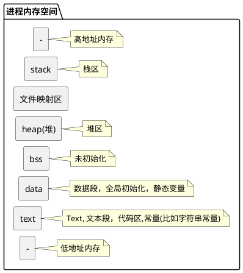

## 程序，进程, 线程, 内核线程, 轻量级进程, 用户线程

## 程序

程序用于描述进程要完成的功能，是控制进程执行的指令集；
数据集合是程序在执行时所需要的数据和工作区；  
程序控制块(Program Control Block，简称PCB)，包含进程的描述信息和控制信息，是进程存在的唯一标志。  

## 进程

动态性：进程是程序的一次执行过程，是临时的，有生命期的，是动态产生，动态消亡的；
并发性：任何进程都可以同其他进程一起并发执行；
独立性：进程是系统进行资源分配和调度的一个独立单位；
结构性：进程由程序、数据和进程控制块三部分组成。

Linux进程类别
虽然我们在区分Linux进程类别, 但是我还是想说Linux下只有一种类型的进程，那就是task_struct，当然我也想说linux其实也没有线程的概念, 只是将那些与其他进程共享资源的进程称之为线程。
一个进程由于其运行空间的不同, 从而有内核线程和用户进程的区分, 内核线程运行在内核空间, 之所以称之为线程是因为它没有虚拟地址空间, 只能访问内核的代码和数据, 而用户进程则运行在用户空间, 但是可以通过中断, 系统调用等方式从用户态陷入内核态。
用户进程运行在用户空间上, 而一些通过共享资源实现的一组进程我们称之为线程组, Linux下内核其实本质上没有线程的概念, Linux下线程其实上是与其他进程共享某些资源的进程而已。但是我们习惯上还是称他们为线程或者轻量级进程
因此, Linux上进程分3种，内核线程 (或者叫核心进程）、用户进程、用户线程, 当然如果更严谨的，你也可以认为用户进程和用户线程都是用户进程。

>关于轻量级进程这个概念, 其实并不等价于线程
>不同的操作系统中依据其实现的不同, 轻量级进程其实是一个不一样的概念

### 内核进程

内核中没有进程的概念  
不存在的概念, 内核空间的进程共享内核空间的内存, 没有独立的地址空间, 不能算是进程, 所以没有内核进程这个概念.
[https://www.coder.work/article/6802420](https://www.coder.work/article/6802420)

内核中没有进程的概念，所以你的问题没有意义。 Linux 内核可以并且确实创建了完全在内核上下文中运行的线程，但是所有这些线程都运行在相同的地址空间中。尽管相关线程通常具有相关名称，但没有按 PID 对类似线程进行分组。

如果多个内核线程正在处理同一任务或以其他方式共享数据，则它们需要通过锁定或其他并发算法来协调对该数据的访问。当然，内核中不提供 pthreads API，但是可以使用内核互斥锁、等待队列等来获得与 pthread 互斥锁、条件变量等相同的功能。

将这些执行上下文称为“内核线程”是一个相当不错的名字，因为它们非常类似于用户空间进程中的多个线程。它们都共享(内核的)地址空间，但有自己的执行上下文(堆栈、程序计数器等)，并且每个都被独立调度并并行运行。另一方面，内核实际上实现了所有漂亮的 POSIX API 抽象(在用户空间中的 C 库的帮助下)，因此在该实现的内部我们没有完整的抽象。

### 内核线程

内核线程一般特指由内核自己启动的只运行在内核态的一些服务进程.

- 只运行在内核态
- ps命令输出里名字带中括号
- 内核线程也可以叫内核任务，它们周期性地执行例如，磁盘高速缓存的刷新，网络连接的维护，页面的换入换出等等。
- 内核线程执行的是内核中的函数，而普通进程只有通过系统调用才能执行内核中的函数。
- 内核线程只运行在内核态，而普通进程既可以运行在用户态，也可以运行在内核态。
- 因为内核线程指只运行在内核态，因此，它只能使用大于PAGE_OFFSET (3G）的地址空间。另一方面，不管在用户态还是内核态，普通进程可以使用4GB的地址空间。
- 内核线程是由kernel_thread( )函数在内核态下创建的

内核线程和用户进程的区分, 内核线程运行在内核空间, 之所以称之为线程是因为它没有虚拟地址空间
内核线程就是内核的分身，一个分身可以处理一件特定事情。这在处理异步事件如异步IO时特别有用。内核线程的使用是廉价的，唯一使用的资源就是内核栈和上下文切换时保存寄存器的空间。支持多线程的内核叫做多线程内核(Multi-Threads kernel )。

内核线程只运行在内核态，不受用户态上下文的拖累。

处理器竞争: 可以在全系统范围内竞争处理器资源；

使用资源: 唯一使用的资源是内核栈和上下文切换时保持寄存器的空间

调度: 调度的开销可能和进程自身差不多昂贵

同步效率: 资源的同步和数据共享比整个进程的数据同步和共享要低一些。

内核级线程是指由内核管理、只运行在内核态、不受用户态上下文拖累的线程。其依赖于操作系统核心，由内核的内部需求进行创建和撤销。内核线程的线程表位于内核中，包括了线程控制块，一旦线程阻塞，内核会从当前或者其他进程中重现选择一个线程保证程序的执行。用户应用程序通过API和系统调用 (system call) 来访问内核级线程。

内核线程就是内核的分身，一个分身可以处理一件特定事情。这在处理异步事件如异步IO时特别有用。内核线程的使用是廉价的，唯一使用的资源就是内核栈和上下文切换时保存寄存器的空间。支持多线程的内核叫做多线程内核(Multi-Threads kernel )。

内核线程只运行在内核态，不受用户态上下文的拖累。

处理器竞争: 可以在全系统范围内竞争处理器资源；
使用资源: 唯一使用的资源是内核栈和上下文切换时保持寄存器的空间
调度: 调度的开销可能和进程自身差不多昂贵
同步效率: 资源的同步和数据共享比整个进程的数据同步和共享要低一些。

内核级线程的缺点
 (1) 把控制从一个线程传送到同一个进程的另一个线程时，需要到内核的状态切换，这样会造成系统开销。

>wiloon.com/ktl

[[ktl#kernel thread, 内核线程, KTL]]

### Linux 守护进程

Linux Daemon (守护进程）是运行在后台的一种特殊进程。它独立于控制终端并且周期性地执行某种任务或等待处理某些发生的事件。它不需要用户输入就能运行而且提供某种服务，不是对整个系统就是对某个用户程序提供服务。Linux系统的大多数服务器就是通过守护进程实现的。常见的守护进程包括系统日志进程syslogd、 web服务器httpd、邮件服务器 sendmail 和数据库服务器mysqld等。

守护进程一般在系统启动时开始运行，除非强行终止，否则直到系统关机都保持运行。守护进程经常以超级用户 (root）权限运行，因为它们要使用特殊的端口 (1-1024）或访问某些特殊的资源。

一个守护进程的父进程是init进程，因为它真正的父进程在fork出子进程后就先于子进程exit退出了，所以它是一个由init继承的孤儿进程。守护进程是非交互式程序，没有控制终端，所以任何输出，无论是向标准输出设备stdout还是标准出错设备stderr的输出都需要特殊处理。

### pthread_create, 内核线程, 用户线程

这个事情，还真不是一句话就能回答的，因为涉及到Linux和编译器的版本关于线程的概念不多说了，内核级和用户级线程的定义网上也有，简单的说: 内核级就是操作系统内核支持，用户级就是函数库实现 (也就是说，不管你操作系统是不是支持线程的，我都可以在你上面用多线程编程) 。好了，那么，我们首先明白一件事: 不管Linux还是什么OS，都可以多线程编程的，怎么多线程编程呢？程序员要创建一个线程，当然需要使用xxx函数，这个函数如果是操作系统本身就提供的系统函数，当然没问题，操作系统创建的线程，自然是内核级的了。如果操作系统没有提供"创建线程"的函数 (比如Linux 2.4及以前的版本，因为Linux刚诞生那时候，还没有"线程"的概念，能处理多"进程"就不错了) ，当然你程序员也没办法在操作系统上创建线程。所以，Linux 2.4内核中不知道什么是"线程"，只有一个"task_struct"的数据结构，就是进程。那么，后来随着科学技术的发展，大家提出线程的概念，而且，线程有时候的确是个好东西，于是，我们希望Linux能加入"多线程"编程。要修改一个操作系统，那是很复杂的事情，特别是当操作系统越来越庞大的时候。怎么才能让Linux支持"多线程"呢？首先，最简单的，就是不去动操作系统的"内核"，而是写一个函数库来"模拟"线程。也就是说，我用 C 写一个函数，比如 create_thread，这个函数最终在Linux的内核里还是去调用了创建"进程"的函数去创建了一个进程 (因为OS没变嘛，没有线程这个东西) 。 如果有人要多线程编程，那么你就调用 这个create_thread 去创建线程吧，好了，这个线程，就是用库函数创建的线程，就是所谓的"用户级线程"了。等等，这是神马意思？赤裸裸的欺骗？也不是。为什么不是？因为别人给你提供了这个线程函数，你创建了"线程"，那么，你的线程 (虽然本质上还是进程) 就有了"线程"的一些"特征"，比如可以共享变量啊什么的，咦？那怎么做到的？当然有一套机制，反正人家给你做好了，你用就行了。这种欺骗自然是不"完美"的，有线程的"一些"特征，但不能完全符合理论上的"线程"的概念(POSIX的要求) ，比如，这种多线程不能被分配到多核上，用户创建的N个线程，对于着内核里面其实就一个"进程"，导致调度啊，管理啊麻烦.....为什么要采用这种"模拟"的方式呢？改内核不是一天两天的事情，先将就用着吧。内核慢慢来改。怎么干改内核这个艰苦卓越的工作？Linux是开源、免费的，谁愿意来干这个活？有两家公司参与了对 LinuxThreads 的改进 (向他们致敬) : IBM启动的 **NGTP(Next Generation POSIX Threads)** 项目，以及红帽Redhat公司的 **NPTL (Native POSIX Thread Library)** ，IBM那个项目，在2003年因为种种原因放弃了，大家都转到NPTL这个项目来了。最终，当然是成功了，在Linux 2.6的内核版本中，这个NPTL项目怎么做的呢？并不是在Linux内核中加了一个"线程"，仍然和原来一样，进程 (其实，进程线程就是个概念，对于计算机，只要能高效的实现这个概念就行，程序员能用就OK，管它究竟怎么实现的) ，不过，用的clone实现的轻量级进程，内核又增加了若干机制来保证线程的表现和POSIX相同，最关键的一点，用户调用 pthread 库创建的一个线程，会在内核创建一个"线程"，这就是所谓的1: 1模型。所以，Linux下，是有"内核级"线程的，网上很多说Linux是用户级线程，都是不完整的，说的Linux很早以前的版本 (现在Linux已经是4.X的版本了) 。还有个 pthread 的问题，pthread 是个线程函数库，他提供了一些函数，让程序员可以用它来创建，使用线程。那么问题是，这个函数库里面的函数，比如 pthread_create 创建线程的函数，他是怎么实现的呢？ 他如果是用以前的方法，那程序员用它来创建的线程，还是"用户级"线程；如果它使用了 NPTL 方式创建线程，那么，它创建的线程，就是"内核级"线程。OK，结论，如果你  1: 使用2.6的内核的系统平台，2: 你的gcc支持NPTL  (现在一般都支持) ，那么你编译出来的多线程程序，就是"内核级"线程了。所以，现在回答问题，只要你不是很古董级的电脑，Linux下用pthread创建的线程是"内核级线程"最后，这NPTL也并不是完美的，还有一些小问题，像有一些商业操作系统，可以实现混合模型，如1:1，N:M等 (就是内核线程和用户线程的对应关系) ，这就强大了，Linux仍有改进的空间

## 进程 process

在大部分情况下，我们认为内核态是一种CPU的特权态，这个特权态下，CPU可以执行这个特权态才允许执行的指令，访问这个特权态才运行访问的资源。这和当前的进程无关。OS通过控制不同的特权态来控制资源分配。一般有两种方法切换特权态，一种是特殊的指令，比如x86的软中断指令，或者大部分RISC系统的系统调用指令 (比如SC) ，第二种是执行异常或者外部中断。发生切换后，现在到底是哪个进程，其实是无所谓的。现在说说现代LINUX如何定义线程和进程。我倾向于这样解释线程和进程:线程本质就是堆栈，当一段程序在执行，能代表它的是他的过去和现在。"过去"在堆栈中，"现在"则是CPU的所有寄存器，如果我们要挂起一个线程，我们把寄存器也保存到堆栈中，我们就具有它的所有状态，可以随时恢复它。这是线程。当我们切换线程的时候，同时切换它的地址空间 (通过修改MMU即可) ，则我们认为发生了进程切换。所以进程的本质是地址空间，我们可以认为地址空间决定了进程是否发生切换。回到最初的问题，当CPU的特权级刚刚发生切换的时候，显然和进程，线程的切换是无关的，但之后调度器是否切换线程和进程，则和具体的情形相关了。

进程是便于资源分配与管理而发明的逻辑概念, 不是物理实体  
在现代操作系统中，进程支持多线程。  
进程是资源管理的最小单元， 进程是作为资源分配的基本单位。
线程是程序执行的最小单元， 是进程中的实际运作单位， 是被系统独立调度和分派的基本单位。  
即线程作为调度和分配的基本单位，进程作为资源分配的基本单位

### 进程地址空间， process address space

所谓进程地址空间 (process address space），就是从进程的视角看到的地址空间，是进程运行时所用到的虚拟地址的集合。

32位系统的进程地址空间

以IA-32处理器为例，其虚拟地址为32位，因此其虚拟地址空间的范围为 4G ，Linux系统将地址空间按3:1比例划分，其中用户空间 (user space）占3GB，内核空间 (kernel space）占1GB。

64位系统的进程地址空间

在64位系统中，进程地址空间的大小就不固定了，以ARMv8-A为例，它的page大小可以是4KB, 16KB或者64KB (默认为4KB，选一种来用，不要混用），可采用3级页表或4级页表，因此可以有多种组合的形式。

以采用4KB的页，4级页表，虚拟地址为48位的系统为例 (从ARMv8.2架构开始，支持虚拟地址和物理地址的大小最多为52位），其虚拟地址空间的范围为 [公式] ，按照1:1的比例划分，内核空间和用户空间各占128TB。

进程的地址空间，包括进程上下文、进程堆栈、内存信息、打开的文件描述符、信号控制设定、进程优先级、进程组号、当前工作目录、根目录、资源限制、控制终端等



### code segment/text segment,文本段，代码段, 程序文本段, 正文段

通常是指用来存放程序执行代码的一块内存区域。这部分区域的大小在程序运行前就已经确定，并且内存区域通常属于只读, 某些架构也允许代码段为可写，即允许修改程序。在代码段中，也有可能包含一些只读的常数变量，例如字符串常量等。

主要保存的是进程的二进制程序代码、也可能有可读的常量变量，例如字符串常量。
这是由cpu执行的机器指令部分。通常，正文段是可共享的，所以即使是经常执行的程序(如文本编辑程序、C编译程序、shell等)在存储器中也只需要有一个副本，另外，正文段常常是只读的，以防止程序由于意外事故而修改器自身的指令。

### data segment, 数据段

data放的是初始化过的全局变量或静态变量
初始化数据段。通常将此段称为数据段，它包含了程序中需赋初值的变量。例如，C程序中任何函数之外的声明:

int maxcount = 99;(全局变量)

### bss segment, bss段， block started by symbol

bss放的是未初始化的全局变量或静态变量
bss存储的是未初始化或者初始化为0的全局变量、静态变量，表示一个占位符，并不给该段的数据分配空间，只是记录数据所需空间的大小。数据段存储的是已初始化的数据段和静态变量

非初始化数据段。通常将此段称为bss段，这一名称来源于早期汇编程序的一个操作，意思是"block started by symbol",在程序开始执行之前，内核将此段初始化为0。函数外的声明:
long  sum[1000];

使此变量存放在非初始化数据段中。
bss段属于静态内存分配。
程序运行 main 之前时会统一清零。即未初始化的全局变量编译器会初始化为 0。  

### 堆, heap

栈又称堆栈， 是用户存放程序临时创建的局部变量，也就是说我们函数括弧“{}”中定义的变量 (但不包括static声明的变量，static意味着在数据段中存放变量）。除此以外，在函数被调用时，其参数也会被压入发起调用的进程栈中，并且待到调用结束后，函数的返回值也会被存放回栈中。由于栈的先进后出特点，所以栈特别方便用来保存/恢复调用现场。从这个意义上讲，我们可以把堆栈看成一个寄存、交换临时数据的内存区。

它是由操作系统分配的，内存的申请与回收都由OS管理。

堆是用于存放进程运行中被动态分配的内存段，它的大小并不固定，可动态扩张或缩减。当进程调用malloc等函数分配内存时，新分配的内存就被动态添加到堆上 (堆被扩张）；当利用free等函数释放内存时，被释放的内存从堆中被剔除 (堆被缩减）

这段空间由程序分配、释放，例如: malloc，回收时 free、delete 等，如果程序不释放，则在程序结束后由操作系统释放, 是一种由低地址向高地址扩展的数据结构，类似链表，是一块不连续的内存区域，链表存储空闲地址，链表遍历时由低地址向高地址。

通常在堆中进行动态存储分配。由于历史上形成的惯例，堆位于非初始化数据段顶和栈底之间。

堆空间是从下增长的，从低地址 到高地址  

### 栈, stack

栈又称堆栈

由编译器自动分配，主要保存进程使用的

- 局部变量
- 临时变量
- 声明
- 函数的参数
- 返回值
- 指向堆对象的地址 (指针）
等，类似栈，是一块连续的内存区域，大小一般为2M或者1M，如果申请的空间超过栈的剩余空间，将提示 overflow。

局部变量以及每次函数调用时所需保存的信息都存放在此段中。每次函数调用时，其返回地址、以及调用者的环境信息(例如某些机器寄存器)都存放在栈中。然后，新被调用的函数在栈上为其自动和临时变量分配存储空间。通过以这种方式使用栈，C函数可以递归调用。

空间是下增长的， 从高地址到低地址

### 文件映射区(memory mapping segment)

存储动态链接库等文件映射以及申请大内存时调用 mmap 函数的区域。

PS：

全局的未初始化变量存在于.bss段中，具体体现为一个占位符；全局的已初始化变量存于.data段中；而函数内的局部变量都在栈上分配空间。.bss是不占用.exe文件空间的，其内容由操作系统初始化 (清零）；而.data却需要占用，其内容由程序初始化，因此造成了上述情况。

bss段 (未手动初始化的数据）并不给该段的数据分配空间，只是记录数据所需空间的大小。
data (已手动初始化的数据）段则为数据分配空间，数据保存在目标文件中。 数据段包含经过初始化的全局变量以及它们的值。BSS段的大小从可执行文件中得到 ，然后链接器得到这个大小的内存块，紧跟在数据段后面。当这个内存区进入程序的地址空间后全部清零。包含数据段和BSS段的整个区段此时通常称为数据区。

### mm_struct

内存描述符由 mm_struct 结构体表示，下面给出内存描述符结构中各个域的描述，请大家结合前面的 进程内存段布局 图一起看：

```c
struct mm_struct {
    struct vm_area_struct *mmap;           /* 内存区域链表 */
    struct rb_root mm_rb;                  /* VMA 形成的红黑树 */
    ...
    struct list_head mmlist;               /* 所有 mm_struct 形成的链表 */
    ...
    unsigned long total_vm;                /* 全部页面数目 */
    unsigned long locked_vm;               /* 上锁的页面数据 */
    unsigned long pinned_vm;               /* Refcount permanently increased */
    unsigned long shared_vm;               /* 共享页面数目 Shared pages (files) */
    unsigned long exec_vm;                 /* 可执行页面数目 VM_EXEC & ~VM_WRITE */
    unsigned long stack_vm;                /* 栈区页面数目 VM_GROWSUP/DOWN */
    unsigned long def_flags;
    unsigned long start_code, end_code, start_data, end_data;    /* 代码段、数据段 起始地址和结束地址 */
    unsigned long start_brk, brk, start_stack;                   /* 栈区 的起始地址，堆区 起始地址和结束地址 */
    unsigned long arg_start, arg_end, env_start, env_end;        /* 命令行参数 和 环境变量的 起始地址和结束地址 */
    ...
    /* Architecture-specific MM context */
    mm_context_t context;                  /* 体系结构特殊数据 */

    /* Must use atomic bitops to access the bits */
    unsigned long flags;                   /* 状态标志位 */
    ...
    /* Coredumping and NUMA and HugePage 相关结构体 */
};
```

[](https://imgtu.com/i/TbZdVf)

### linux 查看线程

其实linux没有线程，都是用进程模仿的  

```bash
ps -ef f
ps -ef |grep xxx
# H Show threads as if they were processes, 查看所有存在的线程。
ps xH
# m Show threads after processes, 查看一个进程起的线程数
ps -mp <PID>

ps -Lf <PID>
ps -eLf |grep <PID>|grep -v grep
# tty值为"?"是守护进程，叫deamon 无终端，大多系统服务是此进程，内核态进程是看不到的
ps ax
ps axf #看进程树，以树形方式现实进程列表敲 ，init是1号进程，系统所有进程都是它派生的，杀不掉
ps axm #会把线程列出来。在Linux下进程和线程是统一的，是轻量级进程的两种方式。
ps axu : 显示进程的详细状态。
# "-T"选项可以开启线程查看。下面的命令列出了由进程号为<pid>的进程创建的所有线程。
ps -T -p <pid>
pstree -c
pstree -p <PID>
top -p <PID>
# -H : Threads toggle
top -Hp <PID>
top -bH -d 3 -p <PID>
cat /proc/<PID>/status
sudo gdb -batch -ex bt -p <PID>
```

### 单线程进程的缺点  

现实中有很多需要并发处理的任务，如数据库的服务器端、网络服务器、大容量计算等。

传统的UNIX进程是单线程的，单线程意味着程序必须是顺序执行，不能并发；既在一个时刻只能运行在一个处理器上，因此不能充分利用多处理器框架的计算机。

如果采用多进程的方法，则有如下问题:

fork 一个子进程的消耗是很大的，fork是一个昂贵的系统调用，即使使用现代的写时复制(copy-on-write)技术。
各个进程拥有自己独立的地址空间，进程间的协作需要复杂的IPC技术，如消息传递和共享内存等。

### 多线程的优缺点

多线程的优点和缺点实际上是对立统一的。

支持多线程的程序(进程)可以取得真正的并行(parallelism)，且由于共享进程的代码和全局数据，故线程间的通信是方便的。它的缺点也是由于线程共享进程的地址空间，因此可能会导致竞争，因此对某一块有多个线程要访问的数据需要一些同步技术。

线程的设计过程演变
在操作系统设计上，从进程演化出线程，最主要的目的就是更好的支持SMP以及减小 (进程/线程) 上下文切换开销。

SMP机器上多线程的并行性
无论按照怎样的分法，一个进程至少需要一个线程作为它的指令执行体，进程管理着资源 (比如cpu、内存、文件等等) ，而将线程分配到某个cpu上执行。

一个进程当然可以拥有多个线程，此时，如果进程运行在SMP机器上，它就可以同时使用多个cpu来执行各个线程，达到最大程度的并行，以提高效率；同时，即使是在单cpu的机器上，采用多线程模型来设计程序，正如当年采用多进程模型代替单进程模型一样，使设计更简洁、功能更完备，程序的执行效率也更高，例如采用多个线程响应多个输入，而此时多线程模型所实现的功能实际上也可以用多进程模型来实现，而与后者相比，线程的上下文切换开销就比进程要小多了，从语义上来说，同时响应多个输入这样的功能，实际上就是共享了除cpu以外的所有资源的。

### 线程模型 - 内核级线程和用户级线程

针对线程模型的两大意义，分别开发出了内核级线程和用户级线程两种线程模型，分类的标准主要是线程的调度者在核内还是在核外。前者更利于并发使用多处理器的资源，而后者则更多考虑的是上下文切换开销。

#### 目前的实现策略

在目前的商用系统中，通常都将两者结合起来使用，既提供内核线程以满足smp系统的需要，也支持用线程库的方式在用户态实现另一套线程机制，此时一个内核线程同时成为多个用户态线程的调度者。

正如很多技术一样，"混合"通常都能带来更高的效率，但同时也 带来更大的实现难度，出于"简单"的设计思路，Linux从一开始就没有实现混合模型的计划，但它在实现上采用了另一种思路的"混合"。

在线程机制的具体实现上，可以在操作系统内核上实现线程，也可以在核外实现，后者显然要求核内至少实现了进程，而前者则一般要求在核内同时也支持进程。内核级线程模型显然要求前者的支持，而用户级线程模型则不一定基于后者实现。这种差异，正如前所述，是两种分类方式的标准不同带来的。

当核内既支持进程也支持线程时，就可以实现线程-进程的"多对多"模型，即一个进程的某个线程由核内调度，而同时它也可以作为用户级线程池的调度 者，选择合适的用户级线程在其空间中运行。这就是前面提到的"混合"线程模型，既可满足多处理机系统的需要，也可以最大限度的减小调度开销。

绝大多数商业操作系统 (如Digital Unix、Solaris、Irix) 都采用的这种能够完全实现POSIX1003.1c标准的线程模型。在核外实现的线程又可以分为"一对一"、"多对 一"两种模型，前者用一个核心进程 (也许是轻量进程) 对应一个线程，将线程调度等同于进程调度，交给核心完成，而后者则完全在核外实现多线程，调度也在用户态完成。后者就是前面提到的单纯的用户级线程模型的实现方式，显然，这种核外的线程调度器实际上只需要完成线程运行栈的切换，调度开销非常小，但同时因为核心信号 (无论是同步的还是异步的) 都是以进程为单位的，因而无法定位到线程，所以这种实现方式不能用于多处理器系统，而这个需求正变得越来越大，因此，在现实中，纯用户级线程的实现，除算法研究目的以外，几乎已经消失了。

Linux内核只提供了轻量进程的支持，限制了更高效的线程模型的实现，但Linux着重优化了进程的调度开销，一定程度上也弥补了这一缺陷。

## 三种线程概念 - 内核线程、轻量级进程、用户线程

### 轻量级进程 Light-weight process，LWP

操作系统内核能够感知到线程，每一个线程都会有一个内核调用栈 (kenerl stack)  和 保存CPU 寄存器下文的 table 。

1. Linux中没有真正的线程，但windows中确实有线程
2. Linux中没有的线程是由进程来模拟实现的  (又称作: 轻量级进程)

轻量级进程是建立在内核之上并由内核支持的用户线程，它是基于内核线程的高级抽象，因此只有先支持内核线程，才能有LWP。
每一个进程有一个或多个LWPs，每个LWP由一个内核线程支持。每一个轻量级进程都与一个特定的内核线程关联。
内核线程只能由内核管理并像普通进程一样被调度。
这种模型实际上就是恐龙书上所提到的一对一线程模型。在这种实现的操作系统中，LWP就是用户线程。
由于每个LWP都与一个特定的内核线程关联，因此每个LWP都是一个独立的线程调度单元。即使有一个LWP在系统调用中阻塞，也不会影响整个进程的执行。

a LWP runs in user space on top of a single kernel thread and shares its address space and system resources with other LWPs within the same process

轻量级进程由 clone() 系统调用创建，参数是 CLONE_VM, 即与父进程是共享进程地址空间和系统资源。

#### 与普通进程区别

LWP 只有一个最小的执行上下文和调度程序所需的统计信息, 他是进程的执行部分，只带有执行相关的信息。
使用资源: 与父进程共享进程地址空间  
处理器竞争: 因与特定内核线程关联，因此可以在全系统范围内竞争处理器资源  
调度: 像普通进程一样调度

#### 轻量级进程具有局限性

首先，大多数LWP的操作，如建立、析构以及同步，都需要进行系统调用。系统调用的代价相对较高: 需要在 user mode 和 kernel mode 之间切换。

其次，每个LWP  都需要有一个内核线程支持，因此 LWP 要消耗内核资源 (内核线程的栈空间) 。因此一个系统不能支持大量的LWP。

LWP 的术语是借自于 SVR4/MP 和Solaris 2.x。
有些系统将LWP称为虚拟处理器。
将之称为轻量级进程的原因可能是: 在内核线程的支持下，LWP是独立的调度单元，就像普通的进程一样。所以LWP的最大特点还是每个LWP都有一个内核线程支持。

既然称作轻量级进程，可见其本质仍然是进程，与普通进程相比，

- LWP与其它进程共享所有 (或大部分) 逻辑地址空间和系统资源，一个进程可以创建多个LWP，这样它们共享大部分资源；
- LWP有它自己的进程标识符，并和其他进程有着父子关系；这是和类Unix操作系统的系统调用 vfork() 生成的进程一样的。
- LWP由内核管理并像普通进程一样被调度。Linux内核是支持LWP的典型例子。Linux内核在 2.0.x 版本就已经实现了轻量进程，应用程序可以通过一个统一的clone()系统调用接口，用不同的参数指定创建轻量进程还是普通进程，通过参数决定子进程和父进程共享的资源种类和数量，这样就有了轻重之分。在内核中， clone()调用经过参数传递和解释后会调用do_fork()，这个核内函数同时也是fork()、vfork()系统调用的最终实现。

在大多数系统中，LWP与普通进程的区别也在于它只有一个最小的执行上下文和调度程序所需的统计信息，而这也是它之所以被称为轻量级的原因。
因为LWP之间共享它们的大部分资源，所以它在某些应用程序就不适用了；这个时候就要使用多个普通的进程了。

### 线程栈， 轻量级进程栈

从 Linux 内核的角度来说，其实它并没有线程的概念。 Linux 把所有线程都当做进程来实现， 它将线程和进程不加区分的统一到了 task_struct 中。线程仅仅被视为一个与其他进程共享某些资源的进程，而是否共享地址空间几乎是进程和 Linux 中所谓线程的唯一区别。线程创建的时候，加上了 CLONE_VM 标记，这样 线程的内存描述符 将直接指向 父进程的内存描述符。

if (clone_flags & CLONE_VM) {
    /*
     * current 是父进程而 tsk 在 fork() 执行期间是共享子进程
     */
    atomic_inc(¤t->mm->mm_users);
    tsk->mm = current->mm;
  }
虽然线程的地址空间和进程一样，但是对待其地址空间的 stack 还是有些区别的。对于 Linux 进程或者说主线程，其 stack 是在 fork 的时候生成的，实际上就是复制了父亲的 stack 空间地址，然后写时拷贝 (cow) 以及动态增长。然而对于主线程生成的子线程而言，其 stack 将不再是这样的了，而是事先固定下来的，使用 mmap 系统调用，它不带有 VM_STACK_FLAGS 标记。这个可以从 glibc 的nptl/allocatestack.c 中的 allocate_stack() 函数中看到：

mem = mmap (NULL, size, prot,
            MAP_PRIVATE | MAP_ANONYMOUS | MAP_STACK, -1, 0);
由于线程的 mm->start_stack 栈地址和所属进程相同，所以线程栈的起始地址并没有存放在 task_struct 中，应该是使用 pthread_attr_t 中的 stackaddr 来初始化 task_struct->thread->sp (sp 指向 struct pt_regs 对象，该结构体用于保存用户进程或者线程的寄存器现场）。这些都不重要，重要的是，线程栈不能动态增长，一旦用尽就没了，这是和生成进程的 fork 不同的地方。由于线程栈是从进程的地址空间中 map 出来的一块内存区域，原则上是线程私有的。但是同一个进程的所有线程生成的时候浅拷贝生成者的 task_struct 的很多字段，其中包括所有的 vma，如果愿意，其它线程也还是可以访问到的，于是一定要注意
>[https://zhuanlan.zhihu.com/p/188577062](https://zhuanlan.zhihu.com/p/188577062)

### 用户线程

用户级线程是指有关线程的管理工作都是由应用程序完成，内核意识不到用户级线程的存在，也不会对这些用户级线程进行调度。如果某个进程创建了多个用户级线程，那么所有这些用户级线程仅有一个对应的内核线程,在用户级线程策略中，内核是以进程为单位进行调度的，不管进程内有多少线程，内核一次只把一个进程分配给一个处理器，因此一个进程中只有一个线程可以执行，所以只有一个对应的内核线程。
用户线程是完全建立在用户空间的线程，用户线程的创建、调度、同步和销毁全由库函数在用户空间完成，不需要内核的帮助。因此这种线程是极其低消耗和高效的。

处理器竞争: 单纯的用户线程是建立在用户空间，其对内核是透明的，因此其所属进程单独参与处理器的竞争，而进程的所有线程参与竞争该进程的资源。

使用资源: 与所属进程共享进程地址空间和系统资源。

调度: 由在用户空间实现的线程库，在所属进程内进行调度

LWP虽然本质上属于用户线程，但LWP线程库是建立在内核之上的，LWP的许多操作都要进行系统调用，因此效率不高。而这里的用户线程指的是完全建立在用户空间的线程库，用户线程的建立，同步，销毁，调度完全在用户空间完成，不需要内核的帮助。因此这种线程的操作是极其快速的且低消耗的。

进程中包含线程，用户线程在用户空间中实现，内核并没有直接对用户线程进程调度，内核的调度对象和传统进程一样，还是进程本身，内核并不知道用户线程的存在。

用户线程之间的调度由在用户空间实现的线程库实现。

这种模型对应着恐龙书中提到的多对一线程模型，其缺点是一个用户线程如果阻塞在系统调用中，则整个进程都将会阻塞。

加强版的用户线程——用户线程+LWP
这种模型对应着恐龙书中多对多模型。

用户线程库还是完全建立在用户空间中，因此用户线程的操作还是很廉价，因此可以建立任意多需要的用户线程。

操作系统提供了LWP作为用户线程和内核线程之间的桥梁。LWP还是和前面提到的一样，具有内核线程支持，是内核的调度单元，并且用户线程的系统调用要通过LWP，因此进程中某个用户线程的阻塞不会影响整个进程的执行。

用户线程库将建立的用户线程关联到LWP上，LWP与用户线程的数量不一定一致。当内核调度到某个LWP上时，此时与该LWP关联的用户线程就被执行。

用户级线程的优点
 (1) 用户级线程切换不需要内核态特权，因此，进程不需要为了线程管理而切换到内核态，节省了两次状态转换 (从用户态到内核态，从内核态返回到用户态) 的开销。
   (2) 用户级线程可以在任何操作系统上运行，不需要对底层内核进行修改以支持用户级线程。

用户级线程的缺点
   (1) 当用户级线程执行一个系统调用时，不仅这个线程会被阻塞，进程中的所有线程都会被阻塞。
   (2) 在一个纯粹的用户级线程中，一个多线程应用程序不能利用多处理器技术。而在现实中多处理系统变得越来越普遍，所以提供纯用户级线程的操作系统几乎没有了。

小结:

很多文献中都认为轻量级进程就是线程，实际上这种说法并不完全正确，从前面的分析中可以看到，只有在用户线程完全由轻量级进程构成时，才可以说轻量级进程就是线程。

1 线程的3种实现方式
在传统的操作系统中，拥有资源和独立调度的基本单位都是进程。在引入线程的操作系统中，线程是独立调度的基本单位，进程是资源拥有的基本单位。在同一进程中，线程的切换不会引起进程切换。在不同进程中进行线程切换,如从一个进程内的线程切换到另一个进程中的线程时，会引起进程切换

根据操作系统内核是否对线程可感知，可以把线程分为内核线程和用户线程

名称                                描述
用户级线程(User-LevelThread, ULT)    由应用程序所支持的线程实现, 内核意识不到用户级线程的实现
内核级线程(Kemel-LevelThread, KLT)    内核级线程又称为内核支持的线程

在多线程操作系统中，各个系统的实现方式并不相同，在有的系统中实现了用户级线程，有的系统中实现了内核级线程

有些情况下,也把内核级线程叫做轻量级进程(LWP), 但是这个是一个不准确的描述, 其实LWP的术语是借自于SVR4/MP和Solaris 2.x系统中, 有些系统将LWP称为虚拟处理器, 将之称为轻量级进程的原因可能是, 在内核线程的支持下，LWP是独立的调度单元，就像普通的进程一样。所以LWP的最大特点还是每个LWP都有一个内核线程支持

### 用户级线程(多对一模型)

2.1 线程的用户级线程实现方式
在用户级线程中，

有关线程管理的所有工作都由应用程序完成，内核意识不到线程的存在. 应用程序可以通过使用线程库设计成多线程程序. 通常，应用程序从单线程起始，在该线程中开始运行，在其运行的任何时刻，可以通过调用线程库中的派生例程创建一个在相同进程中运行的新线程。

用户级线程仅存在于用户空间中，此类线程的创建、撤销、线程之间的同步与通信功能，都无须利用系统调用来实现。用户进程利用线程库来控制用户线程。由于线程在进程内切换的规则远比进程调度和切换的规则简单，不需要用户态/核心态切换，所以切换速度快。由于这里的处理器时间片分配是以进程为基本单位，所以每个线程执行的时间相对减少为了在操作系统中加入线程支持，采用了在用户空间增加运行库来实现线程，这些运行库被称为"线程包"，用户线程是不能被操作系统所感知的。用户线程多见于一些历史悠久的操作系统，例如Unix操作系统

用户级线程驻留在用户空间或模式。运行时库管理这些线程，它也位于用户空间。它们对于操作系统是不可见的，因此无法被调度到处理器内核。每个线程并不具有自身的线程上下文。因此，就线程的同时执行而言，任意给定时刻每个进程只能够有一个线程在运行，而且只有一个处理器内核会被分配给该进程。对于一个进程，可能有成千上万个用户级线程，但是它们对系统资源没有影响。运行时库调度并分派这些线程。

库调度器从进程的多个线程中选择一个线程，然后该线程和该进程允许的一个内核线程关联起来。内核线程将被操作系统调度器指派到处理器内核。用户级线程是一种"多对一"的线程映射

2.2 用户级线程的特点
内核对线程包一无所知。从内核角度考虑，就是按正常的方式管理，即单线程进程 (存在运行时系统)

2.3 用户级线程的优点
用户线程的优点主要有

可以在不支持线程的操作系统中实现。

创建和销毁线程、线程切换代价等线程管理的代价比内核线程少得多, 因为保存线程状态的过程和调用程序都只是本地过程

允许每个进程定制自己的调度算法，线程管理比较灵活。这就是必须自己写管理程序，与内核线程的区别

线程能够利用的表空间和堆栈空间比内核级线程多

不需要陷阱，不需要上下文切换，也不需要对内存高速缓存进行刷新，使得线程调用非常快捷

线程的调度不需要内核直接参与，控制简单。
2.4 用户线程的缺点
用户线程的缺点主要有

线程发生I/O或页面故障引起的阻塞时，如果调用阻塞系统调用则内核由于不知道有多线程的存在，而会阻塞整个进程从而阻塞所有线程, 因此同一进程中只能同时有一个线程在运行

页面失效也会产生类似的问题。

一个单独的进程内部，没有时钟中断，所以不可能用轮转调度的方式调度线程

资源调度按照进程进行，多个处理机下，同一个进程中的线程只能在同一个处理机下分时复用

补充
在用户级线程中，每个进程里的线程表由运行时系统管理。当一个线程转换到就绪状态或阻塞状态时，在该线程表中存放重新启动该线程所需的信息，与内核在进程表中存放的进程的信息完全一样

3 内核级线程
3.1 线程的内核级线程实现
在内核级线程中，

内核线程建立和销毁都是由操作系统负责、通过系统调用完成的。在内核的支持下运行，无论是用户进程的线程，或者是系统进程的线程，他们的创建、撤销、切换都是依靠内核实现的。

线程管理的所有工作由内核完成，应用程序没有进行线程管理的代码，只有一个到内核级线程的编程接口. 内核为进程及其内部的每个线程维护上下文信息，调度也是在内核基于线程架构的基础上完成。图2-2(b)说明了内核级线程的实现方式。

内核线程驻留在内核空间，它们是内核对象。有了内核线程，每个用户线程被映射或绑定到一个内核线程。用户线程在其生命期内都会绑定到该内核线程。一旦用户线程终止，两个线程都将离开系统。这被称作"一对一"线程映射，

线程的创建、撤销和切换等，都需要内核直接实现，即内核了解每一个作为可调度实体的线程

这些线程可以在全系统内进行资源的竞争

内核空间内为每一个内核支持线程设置了一个线程控制块 (TCB) ，内核根据该控制块，感知线程的存在，并进行控制

如图所示,即内核级线程的实现方式, 每个用户线程都直接与一个内核线程相关联.

操作系统调度器管理、调度并分派这些线程。运行时库为每个用户级线程请求一个内核级线程。操作系统的内存管理和调度子系统必须要考虑到数量巨大的用户级线程。您必须了解每个进程允许的线程的最大数目是多少。操作系统为每个线程创建上下文。进程的每个线程在资源可用时都可以被指派到处理器内核。

3.2 内核线程的特点
当某个线程希望创建一个新线程或撤销一个已有线程时，它进行一个系统调用

3.3 内核线程的优点
内核线程的优点:

多处理器系统中，内核能够并行执行同一进程内的多个线程

如果进程中的一个线程被阻塞，能够切换同一进程内的其他线程继续执行 (用户级线程的一个缺点)

所有能够阻塞线程的调用都以系统调用的形式实现，代价可观

当一个线程阻塞时，内核根据选择可以运行另一个进程的线程，而用户空间实现的线程中，运行时系统始终运行自己进程中的线程

信号是发给进程而不是线程的，当一个信号到达时，应该由哪一个线程处理它？线程可以"注册"它们感兴趣的信号

4 组合方式
在一些系统中，使用组合方式的多线程实现, 线程创建完全在用户空间中完成，线程的调度和同步也在应用程序中进行. 一个应用程序中的多个用户级线程被映射到一些 (小于或等于用户级线程的数目) 内核级线程上。

下图说明了用户级与内核级的组合实现方式, 在这种模型中，每个内核级线程有一个可以轮流使用的用户级线程集合

posix线程调度是一个混合模型，很灵活，足以在标准的特定实现中支持用户级和内核级的线程。模型中包括两级调度–线程及和内核实体级。线程级与用户级线程类似，内核实体由内核调度。由线程库来决定它需要多少内核实体，以及他们是如何映射的。

POSIX 引入了一个线程调度竞争范围(thread-scheduling contention scope)的概念，这个. 概念赋予了程序员一些控制权，使它们可以控制怎样将内核实体映射为线程。线程的contentionscope属性可是PTHREAD_SCOPE_PROCESS,也可以是PTHREAD_SCOPE_SYSTEM。带有PTHREAD_SCOPE_PROCESS属性的线程与它所在的进程中的其他线程竞争处理器资源。带有PTHREAD_SCOPE_SYSTEM属性的线程很像内核级线程，他们在全系统的范围内竞争处理器资源。POSIX的一种映射方式将PTHREAD_SCOPE_SYSTEM线程和内核实体之间绑定起来。

内核级线程创建时先设置线程属性PTHREAD_SCOPE_SYSTEM，代码如下，:

pthread_attr_t attr;

pthread_attr_init(&attr);
pthread_attr_setscope(&attr, PTHREAD_SCOPE_SYSTEM); //设置内核级的线程,以获取较高的响应速度
//创建线程

ret = pthread_create(&iAcceptThreadId, &attr, AcceptThread, NULL);

POSIX的标准中定义了两个值:

PTHREAD_SCOPE_SYSTEM和PTHREAD_SCOPE_PROCESS，前者表示与系统中所有线程一起竞争CPU时间，后者表示仅与同进程中的线程竞争CPU

默认为PTHREAD_SCOPE_PROCESS。目前LinuxThreads仅实现了PTHREAD_SCOPE_SYSTEM一值。

关于线程的绑定，牵涉到另外一个概念: 轻进程 (LWP: Light Weight Process) 。轻进程可以理解为内核线程，它位于用户层和系统层之间。系统对线程资源的分配、对线程的控制是通过轻进程来实现的，一个轻进程可以控制一个或多个线程。默认状况下，启动多少轻进程、哪些轻进程来控制哪些线程是由系统来控制的，这种状况即称为非绑定的。绑定状况下，则顾名思义，即某个线程固定的"绑"在一个轻进程之上。被绑定的线程具有较高的响应速度，这是因为CPU时间片的调度是面向轻进程的，绑定的线程可以保证在需要的时候它总有一个轻进程可用。通过设置被绑定的轻进程的优先级和调度级可以使得绑定的线程满足诸如实时反应之类的要求。

设置线程绑定状态的函数为pthread_attr_setscope，它有两个参数，第一个是指向属性结构的指针，第二个是绑定类型，它有两个取值: PTHREAD_SCOPE_SYSTEM (绑定的) 和PTHREAD_SCOPE_PROCESS (非绑定的) 。

5 用户级线程和内核级线程的区别
内核支持线程是OS内核可感知的，而用户级线程是OS内核不可感知的。

用户级线程的创建、撤消和调度不需要OS内核的支持，是在语言 (如Java) 这一级处理的；而内核支持线程的创建、撤消和调度都需OS内核提供支持，而且与进程的创建、撤消和调度大体是相同的。

用户级线程执行系统调用指令时将导致其所属进程被中断，而内核支持线程执行系统调用指令时，只导致该线程被中断。

在只有用户级线程的系统内，CPU调度还是以进程为单位，处于运行状态的进程中的多个线程，由用户程序控制线程的轮换运行；在有内核支持线程的系统内，CPU调度则以线程为单位，由OS的线程调度程序负责线程的调度。

用户级线程的程序实体是运行在用户态下的程序，而内核支持线程的程序实体则是可以运行在任何状态下的程序。
————————————————
版权声明: 本文为CSDN博主「CHENG Jian」的原创文章，遵循CC 4.0 BY-SA版权协议，转载请附上原文出处链接及本声明。
原文链接: [https://blog.csdn.net/gatieme/article/details/51892437](https://blog.csdn.net/gatieme/article/details/51892437)

---

一个进程的组成实体可以分为两大部分: 线程集和资源集。进程中的线程是动态的对象；代表了进程指令的执行。资源，包括地址空间、打开的文件、用户信息等等，由进程内的线程共享。

从线程的运行空间来说，分为用户级线程 (user-level thread, ULT) 和内核级线程 (kernel-level, KLT) 。分类标准主要是线程的调度者是在核内还核外。还有一种线程叫做轻量级进程 (lightweight process, LWP) 。

### 单线程和多线程

进程中的所有线程共享该进程的状态和资源，它们驻留在同一块地址空间中，当一个线程改变了内存中的一个数据项时，其他线程在访问这一数据项时能够看到变化后的结果。
线程相比单线程的优点是可并发、效率高；而缺点是资源竞争带来的不稳定，比如死锁问题，因此对有多个线程要访问的数据需要一些同步技术。

### Linux线程的发展

早在LINUX2.2内核中。并不存在真正意义上的线程，当时Linux中常用的线程pthread实际上是通过进程来模拟的，也就是同过fork来创建"轻"进程，并且这种轻进程的线程也有个数的限制: 最多只能有4096和此类线程同时运行。
2.4内核消除了个数上的限制，并且允许在系统运行中动态的调整进程数的上限，当时采用的是Linux Thread 线程库，它对应的线程模型是"一对一"，而线程的管理是在内核为的函数库中实现，这种线程得到了广泛的应用。但是它不与POSIX兼容。另外还有许多诸如信号处理，进程ID等方面的问题没有完全解决。
相似新的2.6内核中，进程调度通过重新的编写，删除了以前版本中的效率不高的算法，内核框架页也被重新编写。开始使用NPTL(Native POSIX Thread Library)线程库，这个线程库有以下几个目标:  POSIX兼容，都处理结果和应用，底启动开销，低链接开销，与Linux Thread应用的二进制兼容，软硬件的可扩展能力，与C++集成等。 这一切使2.6的内核多线程机制更加完备。

死锁，
活锁，
优先级反转

线程模型好就好在，它的资源分享: 共享变量
角色模型 (Actor Model)  比线程模型好就好在，它的资源分享不像线程模型那样通过共享变量来进行。  角色模型中的资源分享只能通过特定的机制 (消息传递) 来进行。

### Pthread

POSIX线程 (POSIX threads) ，简称Pthreads，是线程的POSIX标准。该标准定义了创建和操纵线程的一整套API。在类Unix操作系统 (Unix、Linux、Mac OS X等) 中，都使用 Pthreads 作为操作系统的线程。Windows操作系统也有其移植版pthreads-win32。

### 抽象

抽象的实质是对问题的转换。我们可以把抽象应用于一个问题，把它转换成另一个 (或许) 更简单的问题来解决。解决了转换后的简单问题，就意味着解决了原有的困难问题。严格来说，一个抽象一定要保存原有问题的结构，同时去除无关细节。但是，由于我们生活的世界并没有什么东西是完全"严格"的，现实中使用的抽象有时会隐藏解决问题的关键细节，或者残留一些不该漏出来的东西。评价一个抽象的好坏，也就不止是看它能节省多少代码，和它的界面有多优美这么简单，同时还要看看在一个问题被抽象转换之后，留了下来的细节还能不能好好地解决它。

一般来说，在修复一个糟糕的抽象时，可以采取的策略分如下两类:

把造成问题的那部分抽象拿掉，直接露出底层的细节
换一个和底层兼容性更好的抽象模型

角色模型，通信进程 (Communicating Sequential Processes, CSP) ，以及函数式编程 (FP)

墨菲定律的变体: 布劳尔技术惯性定律 (已经成功的技术在新的，更好的技术出现时也会赖着不走)

### 线程栈, callstack 调用栈

先从操作系统的角度来复习下基础知识, 进程是操作系统进行资源分配的基本单位, 线程是 CPU 进行调度和分派的基本单位。我们通常意义下的进程包括: 由二进制代码组成的应用程序、线程、分配给该应用程序的一组资源 (如内存、文件等)
  
wikipedia上叫callstack调用栈，并没有进程栈这个说法，进程只是在分配时通过如随机化方式指定了栈底的初始地址，进程的子线程们有各自的私有栈，可以共享父进程分配的堆内存空间，只有一个主线程的进程也就是有主线程对应的栈，所以栈这个说法通常只有线程栈，并没有明确的进程栈之说，那就更没有所谓的进程栈大小了。

线程包含了表示进程内执行环境必需的信息，其中包括进程中标示线程的线程ID，一组寄存器值，栈，调度优先级和策略, 信号屏蔽字，errno变量以及线程私有数据。进程的所有信息对该进程的所有线程都是共享的，包括可执行的程序文本, 程序的全局内存和堆内存，栈以及文件描述符.
  
线程栈起始于进程虚拟内存的高地址，并向虚拟内存底地址方向扩展。取决于线程本身的大小以及其它线程内存分配的情况，进程虚拟地址空间消耗过快可能导致创建线程失败。

我们通常使用 ulimit -s 可以看到"进程对应栈"的大小 (现代linux系统下通常是8MB大小) ，不论在只有一个主线程的进程，还是包含许多子线程的进程，都是指线程栈大小，默认8MB，
  
线程栈的空间开辟在**所属进程的堆区**，线程与其所属的进程共享进程的用户空间，所以线程栈之间可以互访。

通过 /proc/PID/task 来看该程序有多少线程在运行
  
进程的地址空间 /proc/PID/maps

### for java

不显式设置-Xss或-XX:ThreadStackSize时，在Linux x64上ThreadStackSize的默认值就是1024KB，给Java线程创建栈会用这个参数指定的大小。这是前一块代码的意思。如果把-Xss或者-XX:ThreadStackSize设为0，就是使用"系统默认值"。而在Linux x64上HotSpot VM给Java栈定义的"系统默认"大小也是1MB。所以这个条件下普通Java线程的默认栈大小怎样都是1MB。至于操作系统栈大小 (ulimit -s) : 这个配置只影响进程的初始线程；后续用pthread_create创建的线程都可以指定栈大小。HotSpot VM为了能精确控制Java线程的栈大小，特意不使用进程的初始线程 (primordial thread) 作为Java线程。

### Htop

通过htop查看单个进程的线程，它是一个基于ncurses的交互进程查看器。该程序允许你在树状视图中监控单个独立线程。  
要在htop中启用线程查看，请开启htop，然后按`<F2>`来进入htop的设置菜单。选择"设置"栏下面的"显示选项"，然后开启"树状视图"和"显示自定义线程名"选项。按`<F10>`退出设置。

```bash
    htop -p 343496
```

### Linux进程类别

虽然我们在区分Linux进程类别, 但是我还是想说Linux下只有一种类型的进程，那就是task_struct，当然我也想说linux其实也没有线程的概念, 只是将那些与其他进程共享资源的进程称之为线程。
一个进程由于其运行空间的不同, 从而有内核线程和用户进程的区分, 内核线程运行在内核空间, 之所以称之为线程是因为它没有虚拟地址空间, 只能访问内核的代码和数据, 而用户进程则运行在用户空间, 但是可以通过中断, 系统调用等方式从用户态陷入内核态。
用户进程运行在用户空间上, 而一些通过共享资源实现的一组进程我们称之为线程组, Linux下内核其实本质上没有线程的概念, Linux下线程其实上是与其他进程共享某些资源的进程而已。但是我们习惯上还是称他们为线程或者轻量级进程

因此, Linux上进程分3种，内核线程 (或者叫核心进程) 、用户进程、用户线程, 当然如果更严谨的，你也可以认为用户进程和用户线程都是用户进程。

关于轻量级进程这个概念, 其实并不等价于线程
 不同的操作系统中依据其实现的不同, 轻量级进程其实是一个不一样的概念

 三种线程概念——内核线程、轻量级进程、用户线程

### 总结

Linux使用task_struct来描述进程和线程

一个进程由于其运行空间的不同, 从而有内核线程和用户进程的区分, 内核线程运行在内核空间, 之所以称之为线程是因为它没有虚拟地址空间, 只能访问内核的代码和数据, 而用户进程则运行在用户空间, 不能直接访问内核的数据但是可以通过中断, 系统调用等方式从用户态陷入内核态，但是内核态只是进程的一种状态, 与内核线程有本质区别
用户进程运行在用户空间上, 而一些通过共享资源实现的一组进程我们称之为线程组, Linux下内核其实本质上没有线程的概念, Linux下线程其实上是与其他进程共享某些资源的进程而已。但是我们习惯上还是称他们为线程或者轻量级进程
因此, Linux上进程分3种，内核线程 (或者叫核心进程) 、用户进程、用户线程, 当然如果更严谨的，你也可以认为用户进程和用户线程都是用户进程。

内核线程拥有 进程描述符、PID、进程正文段、核心堆栈

用户进程拥有 进程描述符、PID、进程正文段、核心堆栈 、用户空间的数据段和堆栈

用户线程拥有 进程描述符、PID、进程正文段、核心堆栈，同父进程共享用户空间的数据段和堆栈

### 进程资源

#### Linux进程地址空间 && 进程内存布局

[https://blog.csdn.net/yusiguyuan/article/details/45155035](https://blog.csdn.net/yusiguyuan/article/details/45155035)  

程序段(文本段)(Text): 程序代码在内存中的映射，存放函数体的二进制代码。

初始化过的数据(Data): 在程序运行初已经对变量进行初始化的数据。

未初始化过的数据(BSS): 在程序运行初未对变量进行初始化的数据。

栈 (Stack):存储局部、临时变量，函数调用时，存储函数的返回指针，用于控制函数的调用和返回。在程序块开始时自动分配内存,结束时自动释放内存，其操作方式类似于数据结构中的栈。

堆 (Heap):存储动态内存分配,需要程序员手工分配,手工释放.注意它与数据结构中的堆是两回事，分配方式类似于链表。

注:

1. Text, BSS, Data段在编译时已经决定了进程将占用多少VM，可以通过size，知道这些信息:
2. 正常情况下，Linux进程不能对用来存放程序代码的内存区域执行写操作，即程序代码是以只读的方式加载到内存中，但它可以被多个进程安全的共享。

### 内核空间和用户空间

Linux的虚拟地址空间范围为0～4G，Linux内核将这4G字节的空间分为两部分， 将最高的1G字节 (从虚拟地址0xC0000000到0xFFFFFFFF) 供内核使用，称为"内核空间"。而将较低的3G字节 (从虚拟地址0x00000000到0xBFFFFFFF) 供各个进程使用，称为"用户空间。因为每个进程可以通过系统调用进入内核，因此，Linux内核由系统内的所有进程共享。于是，从具体进程的角度来看，每个进程可以拥有4G字节的虚拟空间。

Linux使用两级保护机制: 0级供内核使用，3级供用户程序使用，每个进程有各自的私有用户空间 (0～3G) ，这个空间对系统中的其他进程是不可见的，最高的1GB字节虚拟内核空间则为所有进程以及内核所共享。

内核空间中存放的是内核代码和数据，而进程的用户空间中存放的是用户程序的代码和数据。不管是内核空间还是用户空间，它们都处于虚拟空间中。 虽然内核空间占据了每个虚拟空间中的最高1GB字节，但映射到物理内存却总是从最低地址 (0x00000000) ，另外， 使用虚拟地址可以很好的保护 内核空间被用户空间破坏，虚拟地址到物理地址转换过程有操作系统和CPU共同完成(操作系统为CPU设置好页表，CPU通过MMU单元进行地址转换)。

注: 多任务操作系统中的每一个进程都运行在一个属于它自己的内存沙盒中，这个 沙盒就是虚拟地址空间 (virtual address space) ，在32位模式下，它总是一个4GB的内存地址块。这些虚拟地址通过页表 (page table) 映射到物理内存，页表由操作系统维护并被处理器引用。每个进程都拥有一套属于它自己的页表。

通常32位Linux内核地址空间划分0~3G为用户空间，3~4G为内核空间

注:

1. 这里是32位内核地址空间划分，64位内核地址空间划分是不同的
2. 现代的操作系统都处于32位保护模式下。每个进程一般都能寻址4G的物理空间。但是我们的物理内存一般都是几百M，进程怎么能获得4G 的物理空间呢？这就是使用了虚拟地址的好处，通常我们使用一种叫做虚拟内存的技术来实现，因为可以使用硬盘中的一部分来当作内存使用 。

Linux系统对自身进行了划分，一部分核心软件独立于普通应用程序，运行在较高的特权级别上，它们驻留在被保护的内存空间上，拥有访问硬件设备的所有权限，Linux将此称为内核空间。
        相对地，应用程序则是在"用户空间"中运行。运行在用户空间的应用程序只能看到允许它们使用的部分系统资源，并且不能使用某些特定的系统功能，也不能直接访问内核空间和硬件设备，以及其他一些具体的使用限制。
        将用户空间和内核空间置于这种非对称访问机制下有很好的安全性，能有效抵御恶意用户的窥探，也能防止质量低劣的用户程序的侵害，从而使系统运行得更稳定可靠。
内核空间在页表中拥有较高的特权级 (ring2或以下) ，因此只要用户态的程序试图访问这些页，就会导致一个页错误 (page fault) 。在 Linux 中，内核空间是持续存在的，并且在所有进程中都映射到同样的物理内存，内核代码和数据总是可寻址的，随时准备处理中断和系统调用。与之相反，用户模式地址空间的映射随着进程切换的发生而不断的变化，如下图所示:

上图中蓝色区域表示映射到物理内存的虚拟地址，而白色区域表示未映射的部分。可以看出，Firefox使用了相当多的虚拟地址空间，因为它占用内存较多。

### 进程内存布局

Linux 进程标准的内存段布局，如下图所示，地址空间中的各个条带对应于不同的内存段 (memory segment) ，如: 堆、栈之类的。

注: 这些段只是简单的虚拟内存地址空间范围，与Intel处理器的段没有任何关系。

几乎每个进程的虚拟地址空间中各段的分布都与上图完全一致， 这就给远程发掘程序漏洞的人打开了方便之门。一个发掘过程往往需要引用绝对内存地址: 栈地址，库函数地址等。远程攻击者必须依赖地址空间分布的一致性，来探索出这些地址。如果让他们猜个正着，那么有人就会被整了。因此，地址空间的随机排布方式便逐渐流行起来，Linux通过对栈、内存映射段、堆的起始地址加上随机的偏移量来打乱布局。但不幸的是，32位地址空间相当紧凑，这给随机化所留下的空间不大，削弱了这种技巧的效果。

栈
进程地址空间中最顶部的段是栈，大多数编程语言将之用于存储函数参数和局部变量。调用一个方法或函数会将一个新的栈帧 (stack frame) 压入到栈中，这个栈帧会在函数返回时被清理掉。由于栈中数据严格的遵守FIFO的顺序，这个简单的设计意味着不必使用复杂的数据结构来追踪栈中的内容，只需要一个简单的指针指向栈的顶端即可，因此压栈 (pushing) 和退栈 (popping) 过程非常迅速、准确。进程中的每一个线程都有属于自己的栈。

通过不断向栈中压入数据，超出其容量就会耗尽栈所对应的内存区域，这将触发一个页故障 (page fault) ，而被Linux的expand_stack()处理，它会调用acct_stack_growth()来检查是否还有合适的地方用于栈的增长。如果栈的大小低于RLIMIT_STACK (通常为8MB) ，那么一般情况下栈会被加长，程序继续执行，感觉不到发生了什么事情。这是一种将栈扩展到所需大小的常规机制。然而，如果达到了最大栈空间的大小，就会栈溢出 (stack overflow) ，程序收到一个段错误 (segmentation fault) 。

注:动态栈增长是唯一一种访问未映射内存区域而被允许的情形，其他任何对未映射内存区域的访问都会触发页错误，从而导致段错误。一些被映射的区域是只读的，因此企图写这些区域也会导致段错误。

内存映射段
     在栈的下方是内存映射段，内核将文件的内容直接映射到内存。任何应用程序都可以通过Linux的mmap()系统调用或者Windows的CreateFileMapping()/MapViewOfFile()请求这种映射。内存映射是一种方便高效的文件I/O方式，所以它被用来加载动态库。创建一个不对应于任何文件的匿名内存映射也是可能的，此方法用于存放程序的数据。在Linux中，如果你通过malloc()请求一大块内存，C运行库将会创建这样一个匿名映射而不是使用堆内存。"大块"意味着比MMAP_THRESHOLD还大，缺省128KB，可以通过mallocp()调整。

堆
      与栈一样，堆用于运行时内存分配；但不同的是，堆用于存储那些生存期与函数调用无关的数据。大部分语言都提供了堆管理功能。在C语言中，堆分配的接口是malloc()函数。如果堆中有足够的空间来满足内存请求，它就可以被语言运行时库处理而不需要内核参与，否则，堆会被扩大，通过brk()系统调用来分配请求所需的内存块。堆管理是很复杂的，需要精细的算法来应付我们程序中杂乱的分配模式，优化速度和内存使用效率。处理一个堆请求所需的时间会大幅度的变动。实时系统通过特殊目的分配器来解决这个问题。堆在分配过程中可能会变得零零碎碎，如下图所示:

一般由程序员分配释放， 若程序员不释放，程序结束时可能由OS回收 。注意它与数据结构中的堆是两回事，分配方式类似于链表。

### BBS 和数据段

在C语言中，BSS和数据段保存的都是静态 (全局) 变量的内容。区别在于BSS保存的是未被初始化的静态变量内容，他们的值不是直接在程序的源码中设定的。BSS内存区域是匿名的，它不映射到任何文件。如果你写static intcntActiveUsers，则cntActiveUsers的内容就会保存到BSS中去。
      数据段保存在源代码中已经初始化的静态变量的内容。数据段不是匿名的，它映射了一部分的程序二进制镜像，也就是源代码中指定了初始值的静态变量。所以，如果你写static int cntActiveUsers=10，则cntActiveUsers的内容就保存在了数据段中，而且初始值是10。尽管数据段映射了一个文件，但它是一个私有内存映射，这意味着更改此处的内存不会影响被映射的文件。
      你可以通过阅读文件/proc/pid_of_process/maps来检验一个 Linux进程中的内存区域。记住: 一个段可能包含许多区域。比如，每个内存映射文件在 mmap 段中都有属于自己的区域，动态库拥有类似BSS和数据段的额外区域。有时人们提到"数据段"，指的是全部的数据段+BSS+堆。

你还可以通过 nm 和 objdump 命令来察看二进制镜像，打印其中的符号，它们的地址，段等信息。最后需要指出的是，前文描述的虚拟地址布局在linux中是一种"灵活布局"，而且作为默认方式已经有些年头了，它假设我们有值RLIMT_STACK。但是，当没有该值得限制时，Linux退回到"经典布局"，如下图所示: 

C语言程序实例分析如下所示:

```c
     #include<stdio.h>  
     #include <malloc.h>  
       
     void print(char *,int);  
     int main()  
    {  
          char *s1 = "abcde";  //"abcde"作为字符串常量存储在常量区 s1、s2、s5拥有相同的地址
          char *s2 = "abcde";  
          char s3[] = "abcd";  
          long int *s4[100];  
          char *s5 = "abcde";  
          int a = 5;  
          int b =6;//a,b在栈上，&a>&b地址反向增长  
       
         printf("variables address in main function: s1=%p  s2=%p s3=%p s4=%p s5=%p a=%p b=%p \n",   
                 s1,s2,s3,s4,s5,&a,&b); 
         printf("variables address in processcall:n");  
         print("ddddddddd",5);//参数入栈从右至左进行,p先进栈,str后进 &p>&str  
         printf("main=%p print=%p \n",main,print);  
         //打印代码段中主函数和子函数的地址，编译时先编译的地址低，后编译的地址高main<print  
     }  
 
     void print(char *str,int p)  
    {  
         char *s1 = "abcde";  //abcde在常量区，s1在栈上  
         char *s2 = "abcde";  //abcde在常量区，s2在栈上 s2-s1=6可能等于0，编译器优化了相同的常量，只在内存保存一份  
         //而&s1>&s2  
         char s3[] = "abcdeee";//abcdeee在常量区，s3在栈上，数组保存的内容为abcdeee的一份拷贝  
        long int *s4[100];  
         char *s5 = "abcde";  
         int a = 5;  
         int b =6;  
         int c;  
         int d;           //a,b,c,d均在栈上，&a>&b>&c>&d地址反向增长  
        char *q=str; 
        int m=p;         
        char *r=(char *)malloc(1);  
        char *w=(char *)malloc(1) ;  // r<w 堆正向增长  
      
        printf("s1=%p s2=%p s3=%p s4=%p s5=%p a=%p b=%p c=%p d=%p str=%p q=%p p=%p m=%p r=%p w=%p \n",  
                s1,s2,s3,s4,s5,&a,&b,&c,&d,&str,q,&p,&m,r,w); 
        /* 栈和堆是在程序运行时候动态分配的，局部变量均在栈上分配。
            栈是反向增长的，地址递减；malloc等分配的内存空间在堆空间。堆是正向增长的，地址递增。  
            r,w变量在栈上(则&r>&w)，r,w所指内容在堆中(即r<w)。*/ 
     }  

```

附录:

栈与堆的区别

### 进程上下文与中断上下文[总结]

 用户空间与内核空间

我们知道现在操作系统都是采用虚拟存储器，那么对32位操作系统而言，它的寻址空间 (虚拟存储空间) 为4G (2的32次方) 。操心系统的核心是内核，独立于普通的应用程序，可以访问受保护的内存空间，也有访问底层硬件设备的所有权限。为了保证用户进程不能直接操作内核，保证内核的安全，操心系统将虚拟空间划分为两部分，一部分为内核空间，一部分为用户空间。针对linux操作系统而言，将最高的1G字节 (从虚拟地址0xC0000000到0xFFFFFFFF) ，供内核使用，称为内核空间，而将较低的3G字节 (从虚拟地址0x00000000到0xBFFFFFFF) ，供各个进程使用，称为用户空间。每个进程可以通过系统调用进入内核，因此，Linux内核由系统内的所有进程共享。于是，从具体进程的角度来看，每个进程可以拥有4G字节的虚拟空间。空间分配如下图所示:

有了用户空间和内核空间，整个linux内部结构可以分为三部分，从最底层到最上层依次是: 硬件-->内核空间-->用户空间。如下图所示:

需要注意的细节问题:

 (1)  内核空间中存放的是内核代码和数据，而进程的用户空间中存放的是用户程序的代码和数据。不管是内核空间还是用户空间，它们都处于虚拟空间中。

 (2)  Linux使用两级保护机制: 0级供内核使用，3级供用户程序使用。

内核态与用户态:

 (1) 当一个任务 (进程) 执行系统调用而陷入内核代码中执行时，称进程处于内核运行态 (内核态) 。此时处理器处于特权级最高的 (0级) 内核代码中执行。当进程处于内核态时，执行的内核代码会使用当前进程的内核栈。每个进程都有自己的内核栈。

 (2) 当进程在执行用户自己的代码时，则称其处于用户运行态 (用户态) 。此时处理器在特权级最低的 (3级) 用户代码中运行。当正在执行用户程序而突然被中断程序中断时，此时用户程序也可以象征性地称为处于进程的内核态。因为中断处理程序将使用当前进程的内核栈。

参考资料:

[http://blog.csdn.net/f22jay/article/details/7925531](http://blog.csdn.net/f22jay/article/details/7925531)

[http://blog.csdn.net/zhangskd/article/details/6956638](http://blog.csdn.net/zhangskd/article/details/6956638)

[http://blog.chinaunix.net/uid-26838492-id-3162146.html](http://blog.chinaunix.net/uid-26838492-id-3162146.html)

### 进程上下文与中断上下文

我在看《linux内核设计与实现》这本书的第三章进程管理时候，看到进程上下文。书中说当一个程序执行了系统调用或者触发某个异常 (软中断) ，此时就会陷入内核空间，内核此时代表进程执行，并处于进程上下文中。看后还是没有弄清楚，什么是进程上下文，如何上google上面狂搜一把，总结如下:

程序在执行过程中通常有用户态和内核态两种状态，CPU对处于内核态根据上下文环境进一步细分，因此有了下面三种状态:

1. 内核态，运行于进程上下文，内核代表进程运行于内核空间。
2. 内核态，运行于中断上下文，内核代表硬件运行于内核空间。
3. 用户态，运行于用户空间。

上下文context:  上下文简单说来就是一个环境。

用户空间的应用程序, 通过系统调用，进入内核空间。这个时候用户空间的进程要传递很多变量、参数的值给内核，内核态运行的时候也要保存用户进程的一些寄存器值、变量等。
所谓的"进程上下文", 可以看作是用户进程传递给内核的这些参数以及内核要保存的那一整套的变量和寄存器值和当时的环境等。

相对于进程而言，就是进程执行时的环境。具体来说就是各个变量和数据，包括所有的寄存器变量、进程打开的文件、内存信息等。一个进程的上下文可以分为三个部分:用户级上下文、寄存器上下文以及系统级上下文。

1. 用户级上下文: 正文、数据、用户堆栈以及共享存储区；
2. 寄存器上下文: 通用寄存器、程序寄存器(IP)、处理器状态寄存器(EFLAGS), 栈指针(ESP)；
3. 系统级上下文: 进程控制块 task_struct、内存管理信息 (mm_struct、vm_area_struct、pgd、pte)、内核栈。

当发生进程调度时，进行进程切换就是上下文切换(context switch). 操作系统必须对上面提到的全部信息进行切换，新调度的进程才能运行。而系统调用进行的模式切换(mode switch)。模式切换与进程切换比较起来，容易很多，而且节省时间，因为模式切换最主要的任务只是切换进程寄存器上下文的切换。

硬件通过触发信号，导致内核调用中断处理程序，进入内核空间。这个过程中，硬件的一些变量和参数也要传递给内核，内核通过这些参数进行中断处理。所谓的" 中断上下文"，其实也可以看作就是硬件传递过来的这些参数和内核需要保存的一些其他环境 (主要是当前被打断执行的进程环境) 。中断时，内核不代表任何进程运行，它一般只访问系统空间，而不会访问进程空间，内核在中断上下文中执行时一般不会阻塞。

摘录Linux注释的内容如下:

```c
  Process Context
  -------------------------------------------
  One of the most important parts of a process is the executing program code. This code is read in from an executable file and executed within the program's address space. Normal program execution occurs in user-space. When a program executes a system call or triggers an exception, it enters kernel-space. At this point, the kernel is said to be "executing on behalf of the process" and is in process context. When in process context, the current macro is valid[7]. Upon exiting the kernel, the process resumes execution in user-space, unless a higher-priority process has become runnable in the interim(过渡期), in which case the scheduler is invoked to select the higher priority process.

  Other than process context there is interrupt context, In interrupt context, the system is not running on behalf of a process, but is executing an interrupt handler. There is no process tied to interrupt handlers and consequently no process context. 

  System calls and exception handlers are well-defined interfaces into the kernel. A process can begin executing in kernel-space only through one of these interfaces -- all access to the kernel is through these interfaces.
  -------------------------------------------

```

```c
Interrupt Context
-------------------------------------------

    When executing an interrupt handler or bottom half, the kernel is in interrupt context. Recall that process context is the mode of operation the kernel is in while it is executing on behalf of a process -- for example, executing a system call or running a kernel thread. In process context, the current macro points to the associated task. Furthermore, because a process is coupled to the kernel in process context(因为进程是以进程上文的形式连接到内核中的), process context can sleep or otherwise invoke the scheduler.

    Interrupt context, on the other hand, is not associated with a process. The current macro is not relevant (although it points to the interrupted process). Without a backing process(由于没有进程的背景),interrupt context cannot sleep -- how would it ever reschedule?(否则怎么再对它重新调度?) Therefore, you cannot call certain functions from interrupt context. If a function sleeps, you cannot use it from your interrupt handler -- this limits the functions that one can call from an interrupt handler.(这是对什么样的函数可以在中断处理程序中使用的限制)

    Interrupt context is time critical because the interrupt handler interrupts other code. Code should be quick and simple. Busy looping is discouraged. This is a very important point; always keep in mind that your interrupt handler has interrupted other code (possibly even another interrupt handler on a different line!). Because of this asynchronous nature, it is imperative(必须) that all interrupt handlers be as quick and as simple as possible. As much as possible, work should be pushed out from the interrupt handler and performed in a bottom half, which runs at a more convenient time.

    The setup of an interrupt handler's stacks is a configuration option. Historically, interrupt handlers did not receive(拥有) their own stacks. Instead, they would share the stack of the process that they interrupted[1]. The kernel stack is two pages in size; typically, that is 8KB on 32-bit architectures and 16KB on 64-bit architectures. Because in this setup interrupt handlers share the stack, they must be exceptionally frugal(必须非常节省) with what data they allocate there. Of course, the kernel stack is limited to begin with, so all kernel code should be cautious.

   A process is always running. When nothing else is schedulable, the idle task runs.

-------------------------------------------
```

### LINUX完全注释中的一段话

当一个进程在执行时,CPU的所有寄存器中的值、进程的状态以及堆栈中的内容被称为该进程的上下文。当内核需要切换到另一个进程时，它需要保存当前进程的所有状态，即保存当前进程的上下文，以便在再次执行该进程时，能够必得到切换时的状态执行下去。在LINUX中，当前进程上下文均保存在进程的任务数据结构中。在发生中断时,内核就在被中断进程的上下文中，在内核态下执行中断服务例程。但同时会保留所有需要用到的资源，以便中继服务结束时能恢复被中断进程的执行。

### 查看最大线程数

cat /proc/sys/kernel/threads-max

### 线程实现的三种方式

内核线程 (Kernel Thread， KLT) 就是直接由操作系统内核支持的线程，这种线程由内核来完成线程切换，内核通过操作调度器对线程进行调度，并负责将线程的任务映射到各个处理器上。程序一般不会直接去使用内核线程，而是去使用内核线程的一种高级接口 -- 轻量级进程 (Light Weight Process，LWP) ，轻量级进程就是我们通常意义上所讲的线程，由于每个轻量级进程都由一个内核线程支持，因此只有先支持内核线程，才能有轻量级进程。这种轻量级进程与内核线程之间1: 1的关系称为一对一的线程模型。轻量级进程要消耗一定的内核资源 (如内核线程的栈空间) ，而且系统调用的代价相对较高，因此一个系统支持轻量级进程的数量是有限的。

### 轻量级用户进程 (Light weight process)

广义上来讲，一个线程只要不是内核线程，那就可以认为是用户线程 (User Thread，UT) ，而狭义的用户线程指的是完全建立在用户空间的线程库上，系统内核不能感知到线程存在的实现，用户线程的建立、同步、销毁和调度完全在用户态中完成，不需要内核的帮助。如果程序实现得当，这种线程不需要切换到内核态，因此操作可以是非常快速且低消耗的，也可以支持规模更大的线程数量，部分高性能数据库中的多线程就是由用户线程实现的。这种进程与用户线程之间1: N的关系称为一对多的线程模型。 (Windows和Linux使用的是这种方式)

使用用户线程的优势在于不需要系统内核的支援，劣势在于没有系统内核的支援，所有的线程操作都需要用户程序自己处理，因而使用用户线程实现的程序一般都比较复杂，现在使用用户线程的程序越来越少了。

### 用户线程/混合线程 (User thread)

既存在用户线程，又存在轻量级进程。用户线程还是完全建立在用户空间中，而操作系统所支持的轻量级进程则作为用户线程和内核线程之间的桥梁。这种混合模式下，用户线程与轻量级进程的数量比是不定的，是M:N的关系。许多Unix系列的系统，都提供了M:N的线程模型实现。

对于 Linux 来讲，所有的线程都当作进程来实现，因为没有单独为线程定义特定的调度算法，也没有单独为线程定义特定的数据结构 (所有的线程或进程的核心数据结构都是 task_struct) 。

对于一个进程，相当于是它含有一个线程，就是它自身。对于多线程来说，原本的进程称为主线程，它们在一起组成一个线程组。

进程拥有自己的地址空间，所以每个进程都有自己的页表。而线程却没有，只能和其它线程共享某一个地址空间和同一份页表。

这个区别的 根本原因 是，在进程/线程创建时，因是否拷贝当前进程的地址空间还是共享当前进程的地址空间，而使得指定的参数不同而导致的。

具体地说，进程和线程的创建都是执行 clone 系统调用进行的。而 clone 系统调用会执行 do_fork 内核函数，而它则又会调用 copy_process 内核函数来完成。主要包括如下操作:

在调用 copy_process 的过程中，会创建并拷贝当前进程的 task_stuct，同时还会创建属于子进程的 thread_info 结构以及内核栈。
此后，会为创建好的 task_stuct 指定一个新的 pid (在 task_struct 结构体中) 。
然后根据传递给 clone 的参数标志，来选择拷贝还是共享打开的文件，文件系统信息，信号处理函数，进程地址空间等。这就是进程和线程不一样地方的本质所在。

2 三个数据结构
每个进程或线程都有三个数据结构，分别是 struct thread_info, struct task_struct 和 内核栈。

注意，虽然线程与主线程共享地址空间，但是线程也是有自己独立的内核栈的。

thread_info 对象中存放的进程/线程的基本信息，它和这个进程/线程的内核栈存放在内核空间里的一段 2 倍页长的空间中。其中 thread_info 结构存放在低地址段的末尾，其余空间用作内核栈。内核使用 伙伴系统 为每个进程/线程分配这块空间。

thread_info 结构体中有一个 struct task_struct *task，task 指向的就是这个进程或线程相关的 task_struct 对象 (也在内核空间中) ，这个对象叫做进程描述符 (叫做任务描述符更为贴切，因为每个线程也都有自己的 task_struct) 。内核使用 slab 分配器为每个进程/线程分配这块空间。

如下图所示:  

3 task_struct 结构体
每个进程或线程都有只属于自己的 task_struct 对象，是它们各自最为核心的数据结构。

### task_struct 结构体中的主要元素

struct thread_info *thread_info。thread_info 指向该进程/线程的基本信息。
struct mm_struct*mm。mm_struct 对象用来管理该进程/线程的页表以及虚拟内存区。
struct mm_struct *active_mm。主要用于内核线程访问主内核页全局目录。
struct fs_struct*fs。fs_struct 是关于文件系统的对象。
struct files_struct *files。files_struct 是关于打开的文件的对象。
struct signal_struct*signal。signal_struct 是关于信号的对象。
3.2 task_struct 结构体中的三个 ID 与一个指针

pid
每个 task_struct 都会有一个不同的 ID，就是这个 PID。
tid
线程 ID，用来标识每个线程的。

tgid
线程组领头线程的 PID，事实上就是主线程的 PID。
当创建一个子进程时，它的 tgid 与 pid 相等；
当创建一个线程时，它的 tgid 等于主线程的 pid。

getpid() 函数事实上返回的是当前进程或线程的 tgid。

pgid
进程组领头进程的 PID。
sid
会话领头进程的 PID。
group_leader
是一个 task_struct 类型的指针，指向的是进程组的组长对应的 task_struct 对象。
4 虚拟内存地址空间
4.1 内存管理
内存是由内核来管理的。

内存被分为 n 个页框，然后进一步组织为多个区。而装入页框中的内容称为页。

当内核函数申请内存时，内核总是立即满足 (因为内核完全信任它们，所以优先级最高) 。在分配适当内存空间后，将其映射到内核地址空间中 (3-4GB 中的某部分空间) ，然后将地址映射写入页表。

申请内存空间的内核函数有 vmalloc, kmalloc, alloc_pages, __get_free_pages 等。

4.2 内核常驻内存
就是说，内核地址空间 (3-4GB) 中的页面所映射的页框始终在物理内存中存在，不会被换出。即使是 vmalloc 动态申请的页面也会一直在物理内存中，直至通过相关内核函数释放掉。

其原因在于，一方面内核文件不是太大，完全可以一次性装入物理内存；另一方面在于即使是动态申请内存空间，也能立即得到满足。

因此，处于内核态的普通进程或内核线程 (后面会提到) 不会因为页面没有在内存中而产生缺页异常 (不过处于内核态的普通进程会因为页表项没有同步的原因而产生缺页异常) 。

4.3 为什么要有虚拟地址空间
普通进程在申请内存空间时会被内核认为是不紧要的，优先级较低。因而总是延迟处理，在之后的某个时候才会真正为其分配物理内存空间。

比如，普通进程中的 malloc 函数在申请物理内存空间时，内核不会直接为其分配页框。

另一方面，普通进程对应的可执行程序文件较大，不能够立即装入内存，而是采取运行时按需装入。

要实现这种延迟分配策略，就需要引入一种新的地址空间，即 虚拟地址空间。可执行文件在装入时或者进程在执行 malloc 时，内核只会为其分配适当大小的虚拟地址空间。

虚拟地址空间并不单纯地指线性地址空间。准确地说，指的是页面不能因为立即装入物理内存而采取折衷处理后拥有的线性地址空间。 因此，虽然普通进程的虚拟地址空间为 4GB，但是从内核的角度来说，内核地址空间 (也是线性空间) 不能称为虚拟地址空间，内核线程不拥有也不需要虚拟地址空间。 因此，虚拟地址空间只针对普通进程。

当然，这样的话就会产生所要访问的页面不在物理内存中而发生缺页异常。

4.4 虚拟地址空间的划分
每一个普通进程都拥有 4GB 的虚拟地址空间 (对于 32 位的 CPU 来说，即 232 B) 。

主要分为两部分，一部分是用户空间 (0-3GB) ，一部分是内核空间 (3-4GB) 。每个普通进程都有自己的用户空间，但是内核空间被所有普通进程所共享。

之所以能够使用 3-4GB 的虚拟地址空间 (对于普通进程来说) ，是因为每个进程的页全局目录 (后面会提到) 中的后面部分存放的是内核页全局目录的所有表项。当通过系统调用或者发生异常而陷入内核时，不会切换进程的页表。此时，处于内核态的普通进程将会直接使用进程页表中前面的页表项即可。这也是为什么在执行系统调用或者处理异常时没有发生进程的上下文切换的真实原因。 同样，正因为每个进程的也全局目录中的后面部分存放的是内核页全局目录中的所有表项，所以所有普通进程共享内核空间。

另外，

用户态下的普通进程只能访问 0-3GB 的用户空间； 内核态下的普通进程既能访问 0-3GB 的用户空间，也能访问 3-4GB 的内核空间 (内核态下的普通进程有时也会需要访问用户空间) 。

4.5 普通线程的用户堆栈与寄存器
对于多线程环境，虽然所有线程都共享同一片虚拟地址空间，但是每个线程都有自己的用户栈空间和寄存器，而用户堆仍然是所有线程共享的。

栈空间的使用是有明确限制的，栈中相邻的任意两条数据在地址上都是连续的。试想，假设多个普通线程函数都在执行递归操作。如果多个线程共有用户栈空间，由于线程是异步执行的，那么某个线程从栈中取出数据时，这条数据就很有可能是其它线程之前压入的，这就导致了冲突。所以，每个线程都应该有自己的用户栈空间。

寄存器也是如此，如果共用寄存器，很可能出现使用混乱的现象。

而堆空间的使用则并没有这样明确的限制，某个线程在申请堆空间时，内核只要从堆空间中分配一块大小合适的空间给线程就行了。所以，多个线程同时执行时不会出现向栈那样产生冲突的情况，因而线程组中的所有线程共享用户堆。

那么在创建线程时，内核是怎样为每个线程分配栈空间的呢？

由之前所讲解可知，进程/线程的创建主要是由 clone 系统调用完成的。而 clone 系统调用的参数中有一个 void *child_stack，它就是用来指向所创建的进程/线程的堆栈指针。

而在该进程/线程在用户态下是通过调用 pthread_create 库函数而陷入内核的。对于 pthread_create 函数，它则会调用一个名为 pthread_allocate_stack 的函数，专门用来为所创建的线程分配的栈空间 (通过 mmap 系统调用) 。然后再将这个栈空间的地址传递给 clone 系统调用。这也是为什么线程组中的每个线程都有自己的栈空间。

4.6 普通进程的页表
有两种页表，一种是内核页表 (会在后面说明) ，另一种是进程页表。

普通进程使用的则是进程页表，而且每个普通进程都有自己的进程页表。如果是多线程，则这些线程共享的是主线程的进程页表。

4.6.1 四级页表
现在的 Linux 内核中采用四级页表，分别为:

页全局目录 (Page Global Directory, pgd)；
页上级目录 (Page Upper Directory, pud)；
页中间目录 (Page Middle Directory, pmd)；
页表 (Page Table, pt)。
task_struct 中的 mm_struct 对象用于管理该进程 (或者线程共享的) 页表。准确地说，mm_struct 中的 pgd 指针指向着该进程的页全局目录。

4.6.2 普通进程的页全局目录
普通进程的页全局目录中，第一部分表项映射的线性地址为 0-3GB 部分，剩余部分存放的是主内核页全局目录 (后面会提到) 中的所有表项。

5 内核线程
内核线程是一种只运行在内核地址空间的线程。所有的内核线程共享内核地址空间 (对于 32 位系统来说，就是 3-4GB 的虚拟地址空间) ，所以也共享同一份内核页表。这也是为什么叫内核线程，而不叫内核进程的原因。

由于内核线程只运行在内核地址空间中，只会访问 3-4GB 的内核地址空间，不存在虚拟地址空间，因此每个内核线程的 task_struct 对象中的 mm 为 NULL。

普通线程虽然也是同主线程共享地址空间，但是它的 task_struct 对象中的 mm 不为空，指向的是主线程的 mm_struct 对象。

普通进程与内核线程有如下区别:
内核线程只运行在内核态，而普通进程既可以运行在内核态，也可以运行在用户态；
内核线程只使用 3-4GB (假设为 32 位系统) 的内核地址空间 (共享的) ，但普通进程由于既可以运行在用户态，又可以运行在内核态，因此可以使用 4GB 的虚拟地址空间。

系统在正式启动内核时，会执行 start_kernel 函数。在这个函数中，会自动创建一个进程，名为 init_task。其 PID 为 0，运行在内核态中。然后开始执行一系列初始化。

5.1 init 内核线程
init_task 在执行 rest_init 函数时，会执行 kernel_thread 创建 init 内核线程。它的 PID 为 1，用来完成内核空间初始化。

在内核空间完成初始化后，会调用 exceve 执行 init 可执行程序 (/sbin/init)。之后，init 内核线程变成了一个普通的进程，运行在用户空间中。

init 内核线程没有地址空间，且它的 task_struct 对象中的 mm 为 NULL。因此，执行 exceve 会使这个 mm 指向一个 mm_struct，而不会影响到 init_task 进程的地址空间。 也正因为此，init 在转变为进程后，其 PID 没变，仍为 1。

创建完 init 内核线程后，init_task 进程演变为 idle 进程 (PID 仍为 0) 。

之后，init 进程再根据再启动其它系统进程 (/etc/init.d 目录下的各个可执行文件)。

5.2 kthreadd 内核线程
init_task 进程演变为 idle 进程后，idle 进程会执行 kernel_thread 来创建 kthreadd 内核线程 (仍然在 rest_init 函数中) 。它的 PID 为 2，用来创建并管理其它内核线程 (用 kthread_create, kthread_run, kthread_stop 等内核函数) 。

系统中有很多内核守护进程 (线程)，可以通过:

ps -efj
进行查看，其中带有 [] 号的就属于内核守护进程。它们的祖先都是这个 kthreadd 内核线程。

5.3 主内核页全局目录
内核维持着一组自己使用的页表，也即主内核页全局目录。当内核在初始化完成后，其存放在 swapper_pg_dir 中，而且所有的普通进程和内核线程就不再使用它了。

5.4 内核线程如何访问页表
5.4.1 active_mm
对于内核线程，虽然它的 task_struct 中的 mm 为 NULL，但是它仍然需要访问内核空间，因此需要知道关于内核空间映射到物理内存的页表。然而不再使用 swapper_pg_dir，因此只能另外想法解决。

由于所有的普通进程的页全局目录中的后面部分为主内核页全局目录，因此内核线程只需要使用某个普通进程的页全局目录就可以了。

在 Linux 中，task_struct 中还有一个很重要的元素为 active_mm，它主要就是用于内核线程访问主内核页全局目录。

对于普通进程来说，task_struct 中的 mm 和 active_mm 指向的是同一片区域； 然而对内核线程来说，task_struct 中的 mm 为 NULL，active_mm 指向的是前一个普通进程的 mm_struct 对象。

5.4.2 mm_users 和 mm_count
但是这样还是不行，因为如果因为前一个普通进程退出了而导致它的 mm_struct 对象也被释放了，则内核线程就访问不到了。

为此，mm_struct 对象维护了一个计数器 mm_count，专门用来对引用这个 mm_struct 对象的自身及内核线程进行计数。初始时为 1，表示普通进程本身引用了它自己的 mm_struct 对象。只有当这个引用计数为 0 时，才会真正释放这个 mm_struct 对象。

另外，mm_struct 中还定义了一个 mm_users 计数器，它主要是用来对共享地址空间的线程计数。事实上，就是这个主线程所在线程组中线程的总个数。初始时为 1。

注意，两者在实质上都是针对引用 mm_struct 对象而设置的计数器。 不同的是，mm_count 是专门针对自身及内核线程或引用 mm_struct 而进行计数；而 mm_users 是专门针对该普通线程所在线程组的所有普通线程而进行计数。 另外，只有当 mm_count 为 0 时，才会释放 mm_struct 对象，并不会因为 mm_users 为 0 就进行释放。

Reference
linux进程描述符task_struct详解
用户空间与内核空间，进程上下文与中断上下文
Linux进程地址管理之mm_struct
对Linux的进程内核栈的认识
Linux内核内存管理-内存访问与缺页中断
Linux下C程序进程地址空间布局
内核初始化－从start_kernel到init
linux内核线程，进程，线程
Linux下0号进程的前世(init_task进程)今生(idle进程)—-Linux进程的管理与调度 (五)
分享一个关于pthread线程栈在mm_struct里面的分布问题
Linux虚拟地址空间布局

---

[http://www.cnblogs.com/hustcat/articles/1505618.html](http://www.cnblogs.com/hustcat/articles/1505618.html)  
[http://mprc.pku.edu.cn/~zhengyansong/blog/?p=199](http://mprc.pku.edu.cn/~zhengyansong/blog/?p=199)  
[http://blog.chinaunix.net/uid-26980210-id-3235544.html](http://blog.chinaunix.net/uid-26980210-id-3235544.html)
[https://coolshell.cn/articles/10249.html](https://coolshell.cn/articles/10249.html)  
[https://www.zhihu.com/question/27844575/answer/38370294](https://www.zhihu.com/question/27844575/answer/38370294)  
[http://laoar.net/blogs/250/](http://laoar.net/blogs/250/)
[http://blog.csdn.net/daniel_ice/article/details/8146003](http://blog.csdn.net/daniel_ice/article/details/8146003)  
[http://blog.csdn.net/yjzl1911/article/details/5629537](http://blog.csdn.net/yjzl1911/article/details/5629537)
[http://www.pandademo.com/2015/10/linux-process-and-thread-stack-size/](http://www.pandademo.com/2015/10/linux-process-and-thread-stack-size/)  
[http://www.pandademo.com/2015/10/linux-process-and-thread-stack-size/embed/#?secret=iaqm21dSlH](http://www.pandademo.com/2015/10/linux-process-and-thread-stack-size/embed/#?secret=iaqm21dSlH)  
[https://www.zhihu.com/question/27844575](https://www.zhihu.com/question/27844575)  
[https://coolshell.cn/articles/4626.html](https://coolshell.cn/articles/4626.html)  
[https://cloud.tencent.com/developer/article/1339562](https://cloud.tencent.com/developer/article/1339562)
[https://blog.csdn.net/gatieme/article/details/51481863](https://blog.csdn.net/gatieme/article/details/51481863)
[https://blog.csdn.net/gatieme/article/details/51892437](https://blog.csdn.net/gatieme/article/details/51892437)
[https://blog.csdn.net/yusiguyuan/article/details/45155035](https://blog.csdn.net/yusiguyuan/article/details/45155035)  
[https://www.cnblogs.com/Anker/p/3269106.html](https://www.cnblogs.com/Anker/p/3269106.html)  
[https://blog.csdn.net/gatieme/article/details/51482122](https://blog.csdn.net/gatieme/article/details/51482122)  

————————————————
版权声明: 本文为CSDN博主「mm_hh」的原创文章，遵循CC 4.0 BY-SA版权协议，转载请附上原文出处链接及本声明。
原文链接: [https://blog.csdn.net/mm_hh/article/details/72587207](https://blog.csdn.net/mm_hh/article/details/72587207)

[http://abcdxyzk.github.io/blog/2018/01/10/kernel-task-thread/](http://abcdxyzk.github.io/blog/2018/01/10/kernel-task-thread/)

————————————————
版权声明: 本文为CSDN博主「相望@于江湖」的原创文章，遵循CC 4.0 BY-SA版权协议，转载请附上原文出处链接及本声明。
原文链接: [https://blog.csdn.net/weixin_39035140/article/details/84848874](https://blog.csdn.net/weixin_39035140/article/details/84848874)

>[https://codeantenna.com/a/YUG3w6OpFY](https://codeantenna.com/a/YUG3w6OpFY)

作者: in nek
  
链接: [https://www.zhihu.com/question/40147261/answer/84963238](https://www.zhihu.com/question/40147261/answer/84963238)
  
来源: 知乎
  
著作权归作者所有。商业转载请联系作者获得授权，非商业转载请注明出处。

进程的创建涉及到系统调用,内存管理,文件管理等系统的主要方面

[https://zhidao.baidu.com/question/73715555.html](https://zhidao.baidu.com/question/73715555.html)
>[https://zhuanlan.zhihu.com/p/66794639](https://zhuanlan.zhihu.com/p/66794639)

数据段、代码段、堆栈段、BSS段的区别
[https://blog.51cto.com/u_13471359/2149020](https://blog.51cto.com/u_13471359/2149020)
>[https://codeantenna.com/a/jklYqrbfnw](https://codeantenna.com/a/jklYqrbfnw)

## 线程的用途

线程的用途
为什么一个进程内需要开启多线程? 前文已经提到，并行（parallel）的处理任务会更加高效。例如使用剪辑软件对一部影片做后期编辑，优秀的编辑软件会把一整部视频的渲染工作分配到多个线程中去，所以每个线程只负责渲染整部影片的一部分内容；假设用一个线程渲染一整部影片需要一个小时，那么同时用两个线程渲染，则只需 30 分钟。用 4 个线程，15 分钟即可完成，以此类推。

但真的如此简单? 这里有 3 个关键因素需要考虑：

1、不是每个应用程序都需要多线程，如果 app 执行的都是顺序任务，或者频繁的需要用户交互，使用多线程反而不会带来好处。
2、不能简单粗暴的在 app 中开启多线程：每个子任务都需要仔细的划分和设计，以确保这些子任务有条件并行执行。
3、不能完全保证多个线程真的在同时运行，是否真的同时运行依赖底层硬件。

第 3 条是关键的一条：如果你的电脑硬件本身不支持多任务同时运行，此时操作系统就会伪造出多任务同时执行的假象。现在我们可以这样理解理解并发(concurrency) 与 并行(parallelism) 的，并发就是感觉上多任务在同时运行，而真正的并行则是多任务真的在同时运行。

[https://www.xiaobotalk.com/2020/05/gentle-multithread-01/](https://www.xiaobotalk.com/2020/05/gentle-multithread-01/)
