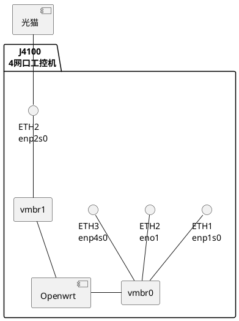

## "network topology"

### 

```plantuml
@startuml

[光猫] as onu

package "J4100 \n 4网口工控机" {
    interface "ETH1\nenp1s0" as j4100Eth1
    interface "ETH2\nenp2s0" as j4100Eth2
    interface "ETH2\neno1" as j4100Eth3
    interface "ETH3\nenp4s0" as j4100Eth4

    agent vmbr0
    j4100Eth1 -down- vmbr0
    j4100Eth3 -down- vmbr0
    j4100Eth4 -down- vmbr0

    agent vmbr1
    j4100Eth2 -down- vmbr1
    
    [Openwrt] as router
    router - vmbr0
    vmbr1 -down- router
}

onu -down- j4100Eth2
@enduml
```